# Introducción al transporte TCP/IP y aplicaciones

Este capítulo cubre los siguientes temas del examen:
- Fundamentos de la red
- Comparar TCP con UDP
- Servicios IP
- Explicar el papel de DHCP y DNS en la red.

El examen CCNA se centra principalmente en funciones en las capas inferiores de TCP/IP, que definen
cómo las redes IP pueden enviar paquetes IP de un host a otro mediante LAN y WAN. Este capítulo explica los conceptos básicos de algunos temas que reciben menos atención en los exámenes: TCP/IP.
capa de transporte y la capa de aplicación TCP/IP. Las funciones de estas capas superiores desempeñan un papel importante.
papel importante en redes TCP/IP reales. Además, muchos de los temas de seguridad de las Partes I y II de este resumen, y algunos de los temas de servicios IP de la Parte III, requieren que usted conozca los conceptos básicos de cómo funcionan las capas de transporte y aplicación de TCP/IP. Este capítulo sirve como eso introducción.
Este capítulo comienza examinando las funciones de dos protocolos de capa de transporte:
Protocolo de control de transmisión (TCP) y Protocolo de datagramas de usuario (UDP). el segundo mayor.
La sección del capítulo examina la capa de aplicación TCP/IP, incluyendo alguna discusión sobre
cómo funciona la resolución de nombres del Sistema de nombres de dominio (DNS).

## Protocolos TCP/IP de capa 4: TCP y UDP

La capa de transporte OSI (Capa 4) define varias funciones, las más importantes de las cuales son la recuperación de errores y el control de flujo. Asimismo, los protocolos de la capa de transporte TCP/IP también implementan estos mismos tipos de características. Tenga en cuenta que tanto el modelo OSI como el modelo TCP/IP llaman a esta capa capa de transporte. Pero como es habitual, cuando se hace referencia al modelo TCP/IP, el nombre y el número de la capa se basan en OSI, por lo que cualquier protocolo de la capa de transporte TCP/IP se considera protocolo de Capa 4.

La diferencia clave entre TCP y UDP es que TCP proporciona una amplia variedad de servicios a las aplicaciones, mientras que UDP no. Por ejemplo, los enrutadores descartan paquetes por muchas razones, incluidos errores de bits, congestión y casos en los que no se conocen rutas correctas. Como ya leyó, la mayoría de los protocolos de enlace de datos detectan errores (un proceso llamado detección de errores) pero luego descartan las tramas que tienen errores. TCP proporciona retransmisión (recuperación de errores) y ayuda a evitar la congestión (control de flujo), mientras que UDP no. Como resultado, muchos protocolos de aplicación optan por utilizar TCP.

Sin embargo, no permita que la falta de servicios de UDP le haga pensar que UDP es peor que TCP. Al proporcionar menos servicios, UDP necesita menos bytes en su encabezado en comparación con TCP, lo que genera menos bytes de sobrecarga en la red. El software UDP no ralentiza la transferencia de datos en los casos en que TCP puede ralentizarse intencionadamente. Además, algunas aplicaciones, en particular hoy en día Voz sobre IP (VoIP) y vídeo sobre IP, no necesitan recuperación de errores, por lo que utilizan UDP. Por lo tanto, UDP también ocupa un lugar importante en las redes TCP/IP actuales.

La Tabla 1-2 enumera las características principales admitidas por TCP/UDP. Tenga en cuenta que UDP solo admite el primer elemento enumerado en la tabla, mientras que TCP admite todos los elementos de la tabla.

| Funcion                                                 | Descripcion                                                                                                                                                                                           |
| ------------------------------------------------------- | ----------------------------------------------------------------------------------------------------------------------------------------------------------------------------------------------------- |
| Multiplexación mediante puertos                         | Función que permite a los hosts receptores elegir la aplicación correcta a la que se destinan los datos, en función del número de puerto                                                              |
| Recuperación de errores (confiabilidad)                 | Proceso de numeración y acuse de recibo de datos con campos de encabezado de secuencia y confirmación                                                                                                 |
| Control de caudal mediante ventanas                     | Proceso que utiliza tamaños de ventana para proteger el espacio de búfer y los dispositivos de enrutamiento para que no se sobrecarguen con el tráfico                                                |
| Establecimiento y terminación de la conexión            | Proceso utilizado para inicializar los números de puerto y la secuencia y Campos de confirmación                                                                                                      |
| Transferencia de datos ordenada y segmentación de datos | Flujo continuo de bytes de un proceso de capa superior que se "segmenta" para su transmisión y se entrega a los procesos de capa superior en el dispositivo receptor, con los bytes en el mismo orden |

## Protocolo de control de transmisión

Normalmente, cada aplicación TCP/IP elige utilizar TCP o UDP en función de los requisitos de la aplicación. Por ejemplo, TCP proporciona recuperación de errores, pero para ello, consume más ancho de banda y utiliza más ciclos de procesamiento. UDP no realiza la recuperación de errores, pero ocupa menos ancho de banda y utiliza menos ciclos de procesamiento. Independientemente de cuál de estos dos protocolos de capa de transporte TCP/IP elija usar la aplicación, debe comprender los conceptos básicos de cómo funciona cada uno de estos protocolos de capa de transporte.

TCP, tal como se define en la solicitud de comentarios (RFC) 793, realiza las funciones enumeradas en la tabla 1-2 a través de mecanismos en los equipos de punto final. TCP se basa en IP para la entrega de los datos de extremo a extremo, incluidos los problemas de enrutamiento. En otras palabras, TCP realiza solo una parte de las funciones necesarias para entregar los datos entre aplicaciones. Además, el papel que desempeña está dirigido a proporcionar servicios para las aplicaciones que se encuentran en los equipos de punto final. Independientemente de si dos computadoras están en la misma Ethernet o están separadas por todo Internet, TCP realiza sus funciones de la misma manera.

La figura 1-1 muestra los campos en el encabezado TCP. Aunque no es necesario memorizar los nombres de los campos ni sus ubicaciones, el resto de esta sección hace referencia a varios de los campos, por lo que todo el encabezado se incluye aquí como referencia.

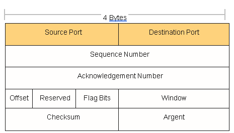
### Multiplexación mediante números de puerto TCP

TCP y UDP utilizan un concepto llamado _multiplexación_. Por lo tanto, esta sección comienza con una explicación de la multiplexación con TCP y UDP. A continuación, se exploran las características únicas de TCP.
La multiplexación por TCP y UDP implica el proceso de cómo piensa una computadora cuando recibe datos. Es posible que el equipo esté ejecutando muchas aplicaciones, como un explorador web, un paquete de correo electrónico o una aplicación VoIP de Internet (por ejemplo, Skype). La multiplexación TCP y UDP indica al ordenador receptor a qué aplicación debe dar los datos recibidos.

Algunos ejemplos ayudarán a que la necesidad de la multiplexación sea obvia. La red de ejemplo consta de dos equipos, etiquetados como Hannah y George. Hannah usa una aplicación que escribió para enviar anuncios que aparecen en la pantalla de George. La aplicación envía un nuevo anuncio a George cada 10 segundos. Hannah usa una segunda aplicación, una aplicación de transferencia bancaria, para enviarle algo de dinero a George. Finalmente, Hannah usa un navegador web para acceder al servidor web que se ejecuta en la PC de George. La aplicación publicitaria y la aplicación de transferencia bancaria son imaginarias, solo por este ejemplo. La aplicación web funciona como lo haría en la vida real.

En la figura 1-2 se muestra la red de ejemplo, con George ejecutando tres aplicaciones:

- Una aplicación de publicidad basada en UDP
- Una aplicación de transferencia bancaria basada en TCP
- Una aplicación de servidor web TCP

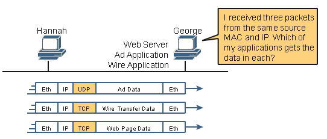

George necesita saber a qué aplicación dar los datos, pero _los tres paquetes provienen de la misma dirección Ethernet e IP_. Podría pensar que George podría ver si el paquete contiene un encabezado UDP o TCP, pero como se ve en la figura, dos aplicaciones (transferencia bancaria y web) utilizan TCP.

TCP y UDP resuelven este problema mediante el uso de un campo de número de puerto en el encabezado TCP o UDP, respectivamente. Cada uno de los segmentos TCP y UDP de Hannah utiliza un número de puerto de _destino diferente_  para que George sepa a qué aplicación dar los datos. Figura 1-3 s cómo un ejemplo.

La multiplexación se basa en un concepto llamado _socket_. Un socket consta de tres cosas:

- Una dirección IP
- Un protocolo de transporte
- Un número de puerto

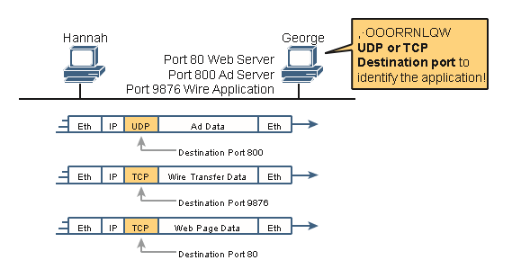

Por lo tanto, para una aplicación de servidor web en George, el socket sería (10.1.1.2, TCP, puerto 80) porque, de forma predeterminada, los servidores web utilizan el conocido puerto 80. Cuando el navegador web de Hannah se conecta al servidor web, Hannah también usa un socket, posiblemente uno como este: (10.1.1.1, TCP, 49160). ¿Por qué 49160? Bueno, Hannah solo necesita un número de puerto que sea único en Hannah, por lo que Hannah ve ese puerto 49160.

La Autoridad de Números Asignados de Internet (IANA), la misma organización que administra la asignación de direcciones IP en todo el mundo, subdivide los rangos de números de puerto en tres rangos principales. Los dos primeros rangos reservan números que la IANA puede asignar a protocolos de aplicación específicos a través de un proceso de solicitud y revisión, y la tercera categoría reserva puertos que se asignarán dinámicamente según se use para los clientes, como en el ejemplo del puerto 49160 en el párrafo anterior. Los nombres y rangos de los números de puerto (como se detalla en RFC 6335) son

- **Puertos conocidos (del sistema):** Números del 0 al 1023, asignados por la IANA, con un proceso de revisión más estricto para asignar nuevos puertos que los puertos de usuario.
- **Puertos de usuario (registrados):** Números del 1024 al 49151, asignados por la IANA con un proceso menos estricto para asignar nuevos puertos en comparación con los puertos conocidos.
- **Puertos efímeros (dinámicos, privados):** números del 49152 al 65535, no asignados y destinados a ser asignados dinámicamente y utilizados temporalmente para una aplicación cliente mientras la aplicación se está ejecutando.

En la figura 1-4 se muestra un ejemplo que utiliza tres puertos efímeros en el dispositivo de usuario de la izquierda, con el servidor de la derecha utilizando dos puertos conocidos y un puerto de usuario. Las computadoras utilizan tres aplicaciones al mismo tiempo; Por lo tanto, hay tres conexiones de enchufe abiertas. Dado que un socket en un solo equipo debe ser único, una conexión entre dos sockets debe identificar una conexión única entre dos equipos. Esta singularidad significa que puede usar varias aplicaciones al mismo tiempo, hablando con aplicaciones que se ejecutan en el mismo equipo o en equipos diferentes. La multiplexación, basada en sockets, garantiza que los datos se entreguen a las aplicaciones correctas.

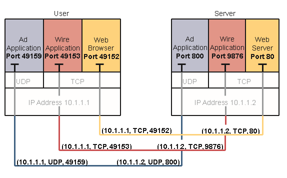

Los números de puerto son una parte vital del concepto de socket. Los servidores utilizan puertos conocidos (o puertos de usuario), mientras que los clientes utilizan puertos dinámicos. Las aplicaciones que proporcionan un servicio, como FTP, Telnet y servidores web, abren un socket mediante un puerto conocido y escuchan las solicitudes de conexión. Dado que estas solicitudes de conexión de los clientes deben incluir los números de puerto de origen y destino, los números de puerto utilizados por los servidores deben conocerse de antemano. Por lo tanto, cada servicio utiliza un número de puerto conocido específico o un número de puerto de usuario. Tanto los puertos conocidos como los de usuario se enumeran en [www.iana.org/assignments/service](http://www.iana.org/assignments/service-names-port-numbers/service-names-port-numbers.txt)[nombres-números-puertos/service-names-port-numbers.txt.](http://www.iana.org/assignments/service-names-port-numbers/service-names-port-numbers.txt)

En los equipos cliente, donde se originan las solicitudes, se puede asignar cualquier número de puerto no utilizado localmente. El resultado es que cada cliente del mismo host utiliza un número de puerto diferente, pero un servidor utiliza el mismo número de puerto para todas las conexiones. Por ejemplo, 100 exploradores web en el mismo equipo host podrían conectarse a un servidor web, pero el servidor web con 100 clientes conectados a él tendría solo un socket y, por lo tanto, solo un número de puerto (puerto 80, en este caso). El servidor puede saber qué paquetes se envían desde cuál de los 100 clientes observando el puerto de origen de los segmentos TCP recibidos. El servidor puede enviar datos al cliente web correcto (navegador) enviando datos al mismo número de puerto que figura como puerto de destino. La combinación de sockets de origen y destino permite a todos los hosts participantes distinguir entre el origen y el destino de los datos. Aunque en el ejemplo se explica el concepto utilizando 100 conexiones TCP, el mismo concepto de numeración de puertos se aplica a las sesiones UDP de la misma manera.
## Aplicaciones TCP/IP populares

A lo largo de su preparación para el examen CCNA, se encontrará con una variedad de aplicaciones TCP/IP. Al menos debe conocer algunas de las aplicaciones que se pueden utilizar para ayudar a administrar y controlar una red.

La aplicación World Wide Web (WWW) existe a través de navegadores web que acceden al contenido disponible en los servidores web. Aunque a menudo se piensa en ella como una aplicación de usuario final, en realidad puede utilizar WWW para gestionar un router o un conmutador. Habilita una función de servidor web en el enrutador o conmutador y utiliza un navegador para acceder al enrutador o conmutador.

El Sistema de Nombres de Dominio (DNS) permite a los usuarios usar nombres para referirse a las computadoras, y el DNS se utiliza para encontrar las direcciones IP correspondientes. DNS también utiliza un modelo cliente/servidor, en el que los servidores DNS están controlados por el personal de red y las funciones de cliente DNS forman parte de la mayoría de los dispositivos que utilizan TCP/IP en la actualidad. El cliente simplemente pide al servidor DNS que proporcione la dirección IP que corresponde a un nombre determinado.

El protocolo simple de administración de red (SNMP) es un protocolo de capa de aplicación que se utiliza específicamente para la administración de dispositivos de red. Por ejemplo, Cisco suministra una gran variedad de productos de administración de redes, muchos de ellos en la familia de productos de software de administración de redes Cisco Prime. Se pueden utilizar para consultar, compilar, almacenar y mostrar información sobre el funcionamiento de una red. Para consultar los dispositivos de red, el software Cisco Prime utiliza principalmente protocolos SNMP.

Tradicionalmente, para mover archivos hacia y desde un router o switch, Cisco utilizaba el protocolo trivial de transferencia de archivos (TFTP). TFTP define un protocolo para la transferencia básica de archivos, de ahí la palabra _trivial_. Alternativamente, los enrutadores y conmutadores pueden usar el Protocolo de transferencia de archivos (FTP), que es un protocolo mucho más funcional, para transferir archivos. Ambos funcionan bien para mover archivos dentro y fuera de los dispositivos Cisco. FTP permite muchas más funciones, lo que lo convierte en una buena opción para la población de usuarios finales en general. Las aplicaciones cliente y servidor TFTP son muy simples, lo que las convierte en buenas herramientas como partes integradas de los dispositivos de red.

Algunas de estas aplicaciones usan TCP y otras usan UDP. Por ejemplo, el Protocolo simple de transferencia de correo (SMTP) y el Protocolo de oficina de correos versión 3 (POP3), ambos utilizados para transferir correo, requieren una entrega garantizada, por lo que utilizan TCP.

Independientemente del protocolo de capa de transporte que se utilice, las aplicaciones utilizan un número de puerto conocido para que los clientes sepan a qué puerto intentar conectarse. La Tabla 1-3 enumera varias aplicaciones populares y sus números de puerto conocidos.

|                 |              |                 |
| --------------- | ------------ | --------------- |
| **Port Number** | **Protocol** | **Application** |
| 20              | TCP          | FTP data        |
| 21              | TCP          | FTP control     |
| 22              | TCP          | SSH             |
| 23              | TCP          | Telnet          |
| 25              | TCP          | SMTP            |
| 53              | UDP, TCP1    | DNS             |
| 67              | UDP          | DHCP Server     |
| 68              | UDP          | DHCP Client     |
| 69              | UDP          | TFTP            |
| 80              | TCP          | HTTP (WWW)      |
| 110             | TCP          | POP3            |
| **Port Number** | **Protocol** | **Application** |
| 161             | UDP          | SNMP            |
| 443             | TCP          | SSL             |
| 514             | UDP          | Syslog          |
### Connection Establishment and Termination

TCP  connection establishment occurs before any of the other TCP features can begin their work. Connection establishment refers to the process of initializing Sequence and Acknowledgment fields and agreeing on the port numbers used. Figure 1-5 shows an example of connection establishment flow.

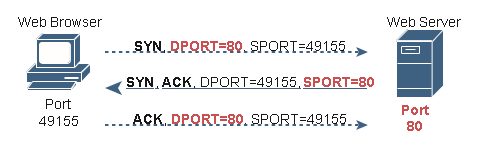

Este flujo de establecimiento de conexión de tres vías (también denominado protocolo de enlace de tres vías) debe completarse antes de que pueda comenzar la transferencia de datos. La conexión existe entre los dos sockets, aunque el encabezado TCP no tiene un solo campo de socket. De las tres partes de un socket, las direcciones IP están implícitas en función de las direcciones IP de origen y destino en el encabezado IP. TCP está implícito porque se está utilizando un encabezado TCP, según lo especificado por el valor del campo de protocolo en el encabezado IP. Por lo tanto, las únicas partes del socket que deben codificarse en el encabezado TCP son los números de puerto.

Establecimiento de la conexión de señales TCP utilizando 2 bits dentro de los campos de bandera del encabezado TCP. Llamados los indicadores SYN y ACK, estos bits tienen un significado particularmente interesante. SYN significa "sincronizar los números de secuencia", que es un componente necesario en la inicialización de TCP.

La Figura 1-6 muestra la terminación de la conexión TCP. Esta secuencia de terminación de cuatro vías es sencilla y utiliza un indicador adicional, llamado  _bit FIN_. (FIN es la abreviatura de "terminado", como puede adivinar). Una nota interesante: antes de que el dispositivo de la derecha envíe el tercer segmento TCP de la secuencia, notifica a la aplicación que la conexión se está cayendo. A continuación, espera una confirmación de la aplicación antes de enviar el tercer segmento de la figura. En caso de que la aplicación tarde un poco en responder, el PC de la derecha envía el segundo flujo de la figura, reconociendo que el otro PC quiere desconectar la conexión. De lo contrario, el equipo de la izquierda podría volver a enviar el primer segmento repetidamente.

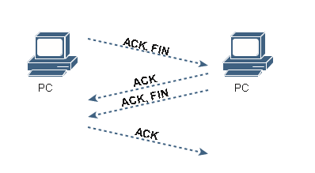

TCP establece y termina las conexiones entre los puntos finales, mientras que UDP no lo hace. Muchos protocolos operan bajo estos mismos conceptos, por lo que los términos _orientado  a la conexión_ y _sin conexión_ se utilizan para referirse a la idea general de cada uno. Más formalmente, estos términos pueden definirse de la siguiente manera:

- **Protocolo orientado a la conexión:** Un protocolo que requiere un intercambio de mensajes antes de que comience la transferencia de datos, o que tiene una correlación preestablecida requerida entre dos puntos finales.
- **Protocolo sin conexión:** Protocolo que no requiere un intercambio de mensajes y que no requiere una correlación preestablecida entre dos extremos.

### Recuperación de errores y confiabilidad

TCP proporciona una transferencia de datos confiable, que también se denomina _confiabilidad_ o _recuperación de errores_, según el documento que lea. Para lograr la confiabilidad, TCP numera los bytes de datos mediante los campos Secuencia y Confirmación en el encabezado TCP. TCP logra confiabilidad en ambas direcciones, utilizando el campo Número de secuencia de una dirección combinado con el campo Acuse de recibo en la dirección opuesta.

La Figura 1-7 muestra un ejemplo de cómo los campos TCP Sequence y Acknowledgegment permiten que la PC envíe 3000 bytes de datos al servidor, y el servidor acusa recibo de los datos. Los segmentos TCP de la figura se producen en orden, de arriba a abajo. En aras de la simplicidad, todos los mensajes tienen 1000 bytes de datos en la parte de datos del segmento TCP. El primer número de secuencia es un buen número redondo (1000), de nuevo en aras de la simplicidad. La parte superior de la figura muestra tres segmentos, siendo cada número de secuencia 1000 más que el anterior, identificando el primero de los 1000 bytes del mensaje. (Es decir, en este ejemplo, el primer segmento contiene los bytes 1000-1999; el segundo contiene los bytes 2000-2999; y el tercero contiene los bytes 3000-3999).

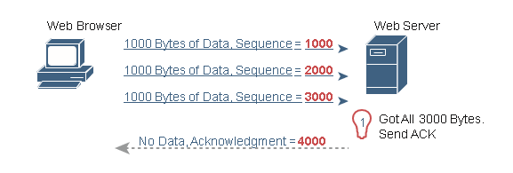

El cuarto segmento TCP de la figura, el único que fluye de vuelta desde el servidor al explorador web, confirma la recepción de los tres segmentos. ¿Cómo? El valor de confirmación de 4000 significa "Recibí todos los datos con números de secuencia hasta uno menos que 4000, por lo que estoy listo para recibir su byte 4000 a continuación". (Tenga en cuenta que esta convención de acusar recibo enumerando el siguiente byte esperado, en lugar del número del último byte recibido, se llama  _Acuse de recibo hacia adelante_).

Sin embargo, este primer ejemplo no se recupera de ningún error; Simplemente muestra los conceptos básicos de cómo el host remitente utiliza el campo Número de secuencia para identificar los datos, y el host receptor utiliza confirmaciones de reenvío para reconocer los datos. La discusión más interesante gira en torno a cómo usar estas mismas herramientas para realizar la recuperación de errores. TCP utiliza los campos Secuencia y Confirmación para que el host receptor pueda notar la pérdida de datos, pedir al host remitente que vuelva a enviar y, a continuación, confirmar que llegaron los datos reenviados.

Existen muchas variaciones en cuanto a la forma en que TCP realiza la recuperación de errores. La figura 1-8 muestra solo un ejemplo de este tipo, con detalles similares en comparación con la figura anterior. El navegador web vuelve a enviar tres segmentos TCP, de nuevo de 1000 bytes cada uno, de nuevo con números de secuencia fáciles de recordar. Sin embargo, en este ejemplo, el segundo segmento TCP no puede cruzar la red.

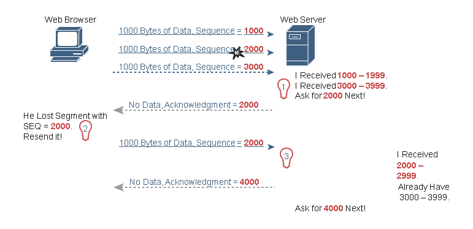

La figura señala tres conjuntos de ideas detrás de cómo piensan los dos anfitriones. En primer lugar, a la derecha, el servidor se da cuenta de que no ha recibido todos los datos. Los dos segmentos TCP recibidos contienen bytes numerados 1000-1999 y 3000-3999. Claramente, el servidor no recibió los bytes numerados en el medio. A continuación, el servidor decide reconocer todos los datos hasta los datos perdidos, es decir, devolver un segmento con el campo Confirmación igual a 2000.

La recepción de un acuse de recibo que no reconoce todos los datos enviados hasta el momento indica al host remitente que vuelva a enviar los datos. El PC de la izquierda puede esperar unos momentos para asegurarse de que no llegan otros acuses de recibo (usando un temporizador llamado temporizador de retransmisión), pero pronto decidirá que el servidor significa "Realmente necesito 2000 a continuación, reenvíelo". El PC de la izquierda lo hace, como se muestra en el quinto de los seis segmentos TCP de la figura.

Por último, tenga en cuenta que el servidor puede reconocer no solo los datos reenviados, sino también cualquier dato anterior que se haya recibido correctamente. En este caso, el servidor recibió el segundo segmento TCP reenviado (los datos con números de secuencia 2000-2999), pero el servidor ya había recibido el tercer segmento TCP (los datos numerados 3000-3999). El siguiente campo de confirmación del servidor reconoce los datos de ambos segmentos, con un campo de confirmación de 4000.
### Control de flujo mediante ventanas

TCP implementa el control de flujo mediante un concepto de ventana que se aplica a la cantidad de datos que pueden estar pendientes y a la espera de confirmación en un momento dado. El concepto de ventana permite que el host receptor le diga al remitente cuántos datos puede recibir en este momento, lo que le da al host receptor una forma de hacer que el host emisor se ralentice o acelere. El receptor puede deslizar el tamaño de la ventana hacia arriba y hacia abajo, lo que se denomina _ventana deslizante_ o _ventana dinámica_, para cambiar la cantidad de datos que el host emisor puede enviar.

El mecanismo de la ventana corredera tiene mucho más sentido con un ejemplo. El ejemplo, que se muestra en la figura 1-9, utiliza las mismas reglas básicas que los ejemplos de las figuras anteriores. En este caso, ninguno de los segmentos TCP tiene errores y la discusión comienza un segmento TCP antes que en las dos figuras anteriores.

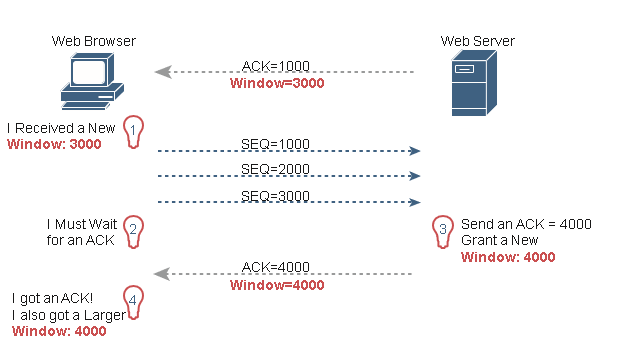

Comience con el primer segmento, enviado por el servidor a la PC. El campo Acknowledgegment debería resultarle familiar a estas alturas: le dice a la PC que el servidor espera un segmento con el número de secuencia 1000 a continuación. El nuevo campo, el campo de ventana, se establece en 3000. Debido a que el segmento fluye a la PC, este valor indica a la PC que la PC no puede enviar más de 3000 bytes a través de esta conexión antes de recibir una confirmación. Entonces, como se muestra a la izquierda, la PC se da cuenta de que solo puede enviar 3000 bytes y deja de enviar, esperando un acuse de recibo, después de enviar tres segmentos TCP de 1000 bytes.

Continuando con el ejemplo, el servidor no solo acusa recibo de los datos (sin ninguna pérdida), sino que el servidor decide deslizar el tamaño de la ventana un poco más alto. Observe que el segundo mensaje fluye de derecha a izquierda en la figura, esta vez con una ventana de 4000. Una vez que el equipo recibe este segmento TCP, el equipo se da cuenta de que puede enviar otros 4000 bytes (una ventana ligeramente más grande que el valor anterior).

Tenga en cuenta que, si bien las últimas figuras muestran ejemplos con el fin de explicar cómo funcionan los mecanismos, los ejemplos pueden darle la impresión de que TCP hace que los hosts se sienten allí y esperen mucho los reconocimientos. TCP no quiere que el host emisor tenga que esperar para enviar datos. Por ejemplo, si se recibe un acuse de recibo antes de que se agote la ventana, comienza una nueva ventana y el remitente continúa enviando datos hasta que se agote la ventana actual. A menudo, en una red que tiene pocos problemas, pocos segmentos perdidos y poca congestión, las ventanas TCP permanecen relativamente grandes y los hosts rara vez esperan para enviar.
### Protocolo de datagramas de usuario

UDP proporciona un servicio para que las aplicaciones intercambien mensajes. A diferencia de TCP, UDP no tiene conexión y no proporciona confiabilidad, ni ventanas, ni reordenamiento de los datos recibidos, ni segmentación de grandes fragmentos de datos en el tamaño adecuado para la transmisión. Sin embargo, UDP proporciona algunas funciones de TCP, como la transferencia de datos y la multiplexación mediante números de puerto, y lo hace con menos bytes de sobrecarga y menos procesamiento requerido que TCP.

La transferencia de datos UDP difiere de la transferencia de datos TCP en que no se realiza ningún reordenamiento ni recuperación. Las aplicaciones que usan UDP son tolerantes con los datos perdidos o tienen algún mecanismo de aplicación para recuperar los datos perdidos. Por ejemplo, VoIP utiliza UDP porque si se pierde un paquete de voz, en el momento en que se pueda notar la pérdida y retransmitir el paquete, se habrá producido demasiado retraso y la voz será ininteligible. Además, las solicitudes DNS utilizan UDP porque el usuario volverá a intentar una operación si se produce un error en la resolución DNS. Como otro ejemplo, el sistema de archivos de red (NFS), una aplicación de sistema de archivos remoto, realiza la recuperación con código de capa de aplicación, por lo que las características UDP son aceptables para NFS.

La Figura 1-10 muestra el formato de encabezado UDP. Lo más importante es tener en cuenta que el encabezado incluye campos de puerto de origen y destino, con el mismo propósito que TCP. Sin embargo, el UDP tiene solo 8 bytes, en comparación con el encabezado TCP de 20 bytes que se muestra en la Figura 1-1. UDP necesita un encabezado más corto que TCP simplemente porque UDP tiene menos trabajo que hacer.

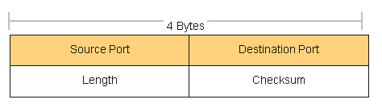

### Aplicaciones TCP/IP

El objetivo de construir una red empresarial, o conectar una pequeña red doméstica o de oficina a Internet, es utilizar aplicaciones como la navegación web, los mensajes de texto, el correo electrónico, las descargas de archivos, la voz y el vídeo. En esta sección se examina una aplicación concreta: la navegación web mediante el protocolo de transferencia de hipertexto (HTTP).

La World Wide Web (WWW) consta de todos los servidores web conectados a Internet del mundo, además de todos los hosts conectados a Internet con navegadores web. _Los servidores web, que consisten en software de servidor web que se ejecuta en una computadora, almacenan información (en forma de  _páginas web_) que puede ser útil para diferentes personas. Un  _navegador web_, que es un software instalado en la computadora de un usuario final, proporciona los medios para conectarse a un servidor web y mostrar las páginas web almacenadas en el servidor web.

Para que este proceso funcione, deben producirse varias funciones específicas de la capa de aplicación. El usuario debe identificar de alguna manera el servidor, la página web específica y el protocolo utilizado para obtener los datos del servidor. El cliente debe encontrar la dirección IP del servidor, basándose en el nombre del servidor, normalmente mediante DNS. El cliente debe solicitar la página web, que en realidad consta de varios archivos separados, y el servidor debe enviar los archivos al navegador web. Por último, en el caso de las aplicaciones de comercio electrónico, la transferencia de datos, en particular los datos financieros sensibles, debe ser segura. En las secciones siguientes se aborda cada una de estas funciones.

### Identificadores uniformes de recursos

Para que un navegador muestre una página web, el navegador debe identificar el servidor que tiene la página web, además de otra información que identifique la página web en particular. La mayoría de los servidores web tienen muchas páginas web. Por ejemplo, si usa un navegador web para navegar [por www.cisco.com](http://www.cisco.com/) y hace clic en esa página web, verá otra página web. Haga clic de nuevo y verá otra página web. En cada caso, la acción de clic identifica la dirección IP del servidor, así como la página web específica, con los detalles en su mayoría ocultos para usted. (Estos elementos en los que se puede hacer clic en una página web, que a su vez le llevan a otra página web, se denominan  _enlaces_.)

El usuario del navegador puede identificar una página web cuando hace clic en algo en una página web o cuando introduce un identificador uniforme de recursos (URI) en el área de direcciones del navegador. Ambas opciones (hacer clic en un vínculo y escribir un URI) hacen referencia a un URI, ya que cuando se hace clic en un vínculo de una página web, ese vínculo en realidad hace referencia a un URI.

En el habla común, muchas personas usan los términos _dirección web_ o términos similares relacionados _Localizador Universal de Recursos_ (o Localizador Uniforme de Recursos [URL]) en lugar de URI, pero URI es de hecho el término formal correcto. De hecho, la URL se había utilizado con más frecuencia que URI durante más de unos pocos años. Sin embargo, el IETF (el grupo que define TCP/IP), junto con el consorcio W3C [(W3.org,](http://W3.org/) un consorcio que desarrolla estándares web) ha hecho un esfuerzo concertado para estandarizar el uso de URI como término general. Véase RFC 7595 para algunos comentarios a tal efecto.

Desde una perspectiva práctica, los URI utilizados para conectarse a un servidor web incluyen tres componentes clave, como se indica en la Figura 1-11. En la figura se muestran los nombres formales de los campos de URI. Más importante para esta discusión, tenga en cuenta que el texto antes de :// identifica el protocolo utilizado para conectarse al servidor, el texto entre // y / identifica el servidor por su nombre, y el texto después de / identifica la página web.

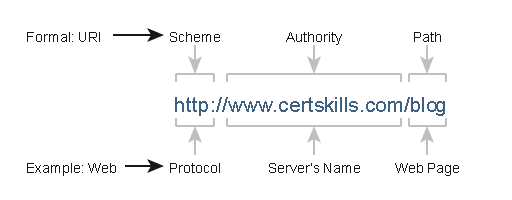

**Encontrar el servidor web mediante DNS**

Un host puede usar DNS para descubrir la dirección IP que corresponde a un nombre de host en particular.

Los URI suelen mostrar el nombre del servidor, un nombre que se puede usar para aprender dinámicamente la dirección IP utilizada por ese mismo servidor. El navegador web no puede enviar un paquete IP a un nombre de destino, pero puede enviar un paquete a una dirección IP de destino. Por lo tanto, antes de que el navegador pueda enviar un paquete al servidor web, el navegador normalmente necesita resolver el nombre dentro del URI en la dirección IP correspondiente de ese nombre.

Para reunir varios conceptos, en la figura 1-12 se muestra el proceso DNS iniciado por un explorador web, así como otra información relacionada. Desde una perspectiva básica, el usuario ingresa el URI (en este caso, [http://www.cisco.com/go/learningnetwork),](http://www.cisco.com/go/learningnetwork) resuelve el nombre del [www.cisco.com](http://www.cisco.com/) en la dirección IP correcta y comienza a enviar paquetes al servidor web.

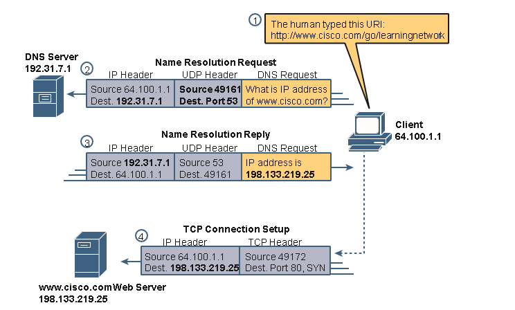

Los pasos que se muestran en la figura son los siguientes:

1.      El usuario introduce el URI, [http://www.cisco.com/go/learningnetwork,](http://www.cisco.com/go/learningnetwork) en el área de direcciones del navegador.
2.      El cliente envía una solicitud DNS al servidor DNS. Normalmente, el cliente aprende la dirección IP del servidor DNS a través de DHCP. Tenga en cuenta que la solicitud DNS utiliza un encabezado UDP, con un puerto de destino del puerto conocido DNS de 53. (Consulte la Tabla 1-3, anteriormente en este capítulo, para obtener una lista de puertos populares y conocidos).
3.      El servidor DNS envía una respuesta, enumerando la dirección IP 198.133.219.25 como la dirección IP de www.cisco.com. Tenga en cuenta también que la respuesta muestra una dirección IP de destino de 64.100.1.1, la dirección IP del cliente. También muestra un encabezado UDP, con el puerto de origen 53; el puerto de origen es 53 porque los datos son originados, o enviados, por el servidor DNS.
4.      El cliente comienza el proceso de establecer una nueva conexión TCP con el servidor web. Tenga en cuenta que la dirección IP de destino es la dirección IP recién aprendida del servidor web. El paquete incluye un encabezado TCP, ya que HTTP utiliza TCP. Tenga en cuenta también que el puerto TCP de destino es 80, el puerto conocido para HTTP. Finalmente, se muestra el bit SYN, como recordatorio de que el proceso de establecimiento de la conexión TCP comienza con un segmento TCP con el bit SYN activado (binario 1).

El ejemplo de la Figura 1-12 muestra lo que sucede cuando el host cliente no conoce la dirección IP asociada con el nombre de host, pero la empresa sí conoce la dirección. Sin embargo, los hosts pueden almacenar en caché los resultados de las solicitudes DNS para que, durante un tiempo, el cliente no tenga que pedir al DNS que resuelva el nombre. Además, el servidor DNS puede almacenar en caché los resultados de solicitudes DNS anteriores; por ejemplo, el servidor DNS de la empresa de la figura 1-12 normalmente no habría configurado información sobre los nombres de host en dominios fuera de esa empresa, por lo que ese ejemplo se basaba en que el DNS hubiera almacenado en caché la dirección asociada con el nombre de host [www.cisco.com.](http://www.cisco.com/)

Cuando el DNS local no conoce la dirección asociada a un nombre de host, debe pedir ayuda. En la figura 1-13 se muestra un ejemplo con el mismo cliente que en la figura 1-12. En este caso, el DNS de la empresa actúa como un servidor DNS recursivo, enviando mensajes DNS repetidos en un esfuerzo por identificar el servidor DNS autoritativo.

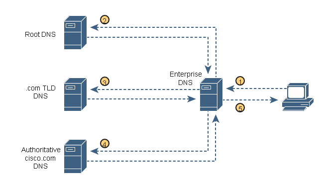

Los pasos que se muestran en la figura son los siguientes:

1.      El cliente envía una solicitud DNS para [www.cisco.com](http://www.cisco.com/) al servidor DNS que conoce, que es el servidor DNS de la empresa.
2.      El servidor DNS empresarial (recursivo) aún no conoce la respuesta, pero no rechaza la solicitud DNS del cliente. En su lugar, sigue un proceso repetitivo (recursivo) (que se muestra en los pasos 2, 3 y 4), comenzando con la solicitud DNS enviada a un servidor DNS raíz. La raíz tampoco proporciona la dirección, pero proporciona la dirección IP de otro servidor DNS, uno responsable del dominio .com de nivel superior.
3.      El DNS empresarial recursivo envía la siguiente solicitud DNS al servidor DNS aprendido en el paso anterior, esta vez el servidor DNS de TLD para el dominio .com. Este DNS tampoco conoce la dirección, pero conoce el servidor DNS que debe ser el servidor DNS autorizado para el cisco.com de dominio [,](http://cisco.com/) por lo que proporciona la dirección de ese servidor DNS.
4.      El DNS de la empresa envía otra solicitud DNS al servidor DNS cuya dirección se aprendió en el paso anterior, solicitando de nuevo la resolución del nombre [www.cisco.com.](http://www.cisco.com/) Este servidor DNS, el servidor autorizado para [cisco.com,](http://cisco.com/) proporciona la dirección.
5.      El servidor DNS de la empresa devuelve una respuesta DNS al cliente, proporcionando la dirección IP solicitada en el paso 1 .

**Transferencia de archivos con HTTP**

Una vez que un cliente web (navegador) ha creado una conexión TCP a un servidor web, el cliente puede comenzar a solicitar la página web del servidor. La mayoría de las veces, el protocolo utilizado para transferir la página web es HTTP. El protocolo de capa de aplicación HTTP, definido en RFC 7230, define cómo se pueden transferir archivos entre dos equipos. HTTP se creó específicamente con el propósito de transferir archivos entre servidores web y clientes web.

HTTP define varios comandos y respuestas, siendo la más utilizada la solicitud HTTP GET . Para obtener un archivo de un servidor web, el cliente envía una solicitud HTTP GET al servidor, enumerando el nombre del archivo. Si el servidor decide enviar el archivo, el servidor envía una respuesta HTTP GET, con un código de retorno de 200 (que significa OK), junto con el contenido del archivo.

Las páginas web suelen constar de varios archivos, denominados  _objetos_. La mayoría de las páginas web contienen texto, así como varias imágenes gráficas, anuncios animados y, posiblemente, voz o video. Cada uno de estos componentes se almacena como un objeto (archivo) diferente en el servidor web. Para obtenerlos todos, el navegador web obtiene el primer archivo. Este archivo puede incluir (y normalmente lo hace) referencias a otros URI, por lo que el navegador también solicita los otros objetos. La Figura 1-14 muestra la idea general, con el navegador obteniendo el primer archivo y luego otros dos.

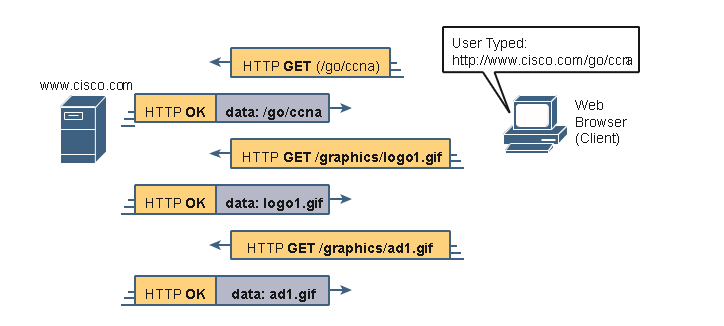

En este caso, después de que el navegador web obtiene el primer archivo, el que se llama "/go/ccna" en el URI, el navegador lee e interpreta ese archivo. Además de contener partes de la página web, el archivo hace referencia a otros dos archivos, por lo que el navegador emite dos solicitudes HTTP GET adicionales. Tenga en cuenta que, aunque no se muestra en la figura, todos estos comandos fluyen a través de una (o posiblemente más) conexión TCP entre el cliente y el servidor. Esto significa que TCP proporcionaría recuperación de errores, asegurando que los datos se entregaron.

**Cómo identifica el host receptor la aplicación receptora correcta**

Este capítulo se cierra con una discusión del proceso por el cual un host, al recibir cualquier mensaje a través de cualquier red, puede decidir cuál de sus muchos programas de aplicación debe procesar los datos recibidos.

Como ejemplo, considere el host A que se muestra en el lado izquierdo de la Figura 1-15. El host tiene abiertas tres ventanas diferentes del navegador web, cada una de las cuales utiliza un puerto TCP único. El host A también tiene un cliente de correo electrónico y una ventana de chat abierta, los cuales usan TCP. Tanto las aplicaciones de correo electrónico como las de chat utilizan un número de puerto TCP único en el host A, como se muestra en la figura.

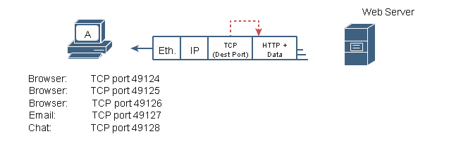

En este capítulo se han mostrado varios ejemplos de cómo los protocolos de la capa de transporte utilizan el campo de número de puerto de destino en el encabezado TCP o UDP para identificar la aplicación receptora. Por ejemplo, si el valor del puerto TCP de destino en la figura 1-15 es 49124, el host A sabrá que los datos están destinados a la primera de las tres ventanas del explorador web.

Antes de que un host receptor pueda examinar el encabezado TCP o UDP y encontrar el campo de puerto de destino, primero debe procesar los encabezados externos del mensaje. Si el mensaje entrante es una trama Ethernet que encapsula un paquete IPv4, los encabezados se parecen a los detalles de la Figura 1-16.

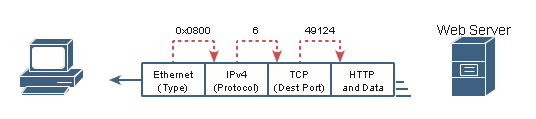

El host receptor debe examinar varios campos, uno por encabezado, para identificar el siguiente encabezado o campo del mensaje recibido. Por ejemplo, el host A utiliza una NIC Ethernet para conectarse a la red, por lo que el mensaje recibido es una trama Ethernet. El campo Tipo de Ethernet identifica el tipo de encabezado que sigue al encabezado de Ethernet, en este caso, con un valor de hexadecimal 0800, un encabezado IPv4.

El encabezado IPv4 tiene un campo similar llamado campo Protocolo IP. El campo Protocolo IPv4 tiene una lista estándar de valores que identifican el siguiente encabezado, con el decimal 6 utilizado para TCP y el decimal 17 utilizado para UDP. En este caso, el valor de 6 identifica el encabezado TCP que sigue al encabezado IPv4. Una vez que el host receptor se da cuenta de que existe un encabezado TCP, puede procesar el campo de puerto de destino para determinar qué proceso de aplicación local debe recibir el.