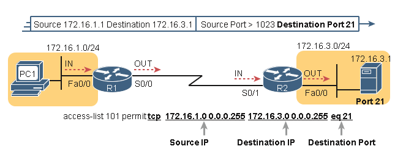
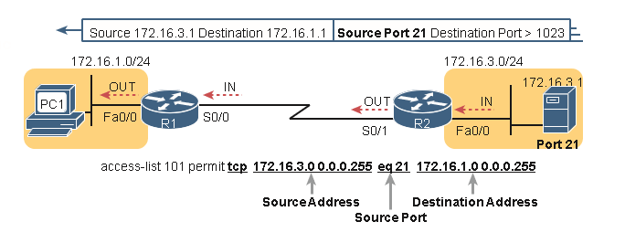

# Listas avanzadas de control de acceso IPv4

**En este capítulo se tratan los siguientes temas del examen:**

**Fundamentos de seguridad 5.0**

- Configurar y verificar las listas de control de acceso

Las ACL IPv4 son ACL estándar o extendidas, con ACL estándar que coinciden solo con la dirección IP de origen y que coinciden con una variedad de campos de encabezado de paquete. Al mismo tiempo, las ACL IP están numeradas o nombradas. La figura 3-1 muestra las categorías y las características principales de cada una de ellas tal como se presentaron en el capítulo anterior.

Este capítulo analiza las otras tres categorías de ACL más allá de las ACL IP numeradas estándar y termina con algunas funciones misceláneas para proteger los routers y switches de Cisco.
### Listas de control de acceso IP numeradas ampliadas

Las listas de acceso IP extendidas tienen muchas similitudes en comparación con las ACL IP numeradas estándar discutidas en el capítulo anterior. Al igual que las ACL IP estándar, se habilitan listas de acceso extendidas en las interfaces para los paquetes que entran o salen de la interfaz. IOS busca en la lista secuencialmente. Las ACL extendidas también utilizan la lógica de primera coincidencia, ya que el router detiene la búsqueda a través de la lista tan pronto como se coincide con la primera instrucción, realizando la acción definida en la primera instrucción coincidente. Todas estas características también se aplican a las listas de acceso numeradas estándar (y a las ACL con nombre).

Las ACL extendidas difieren de las ACL estándar principalmente debido a la mayor variedad de campos de encabezado de paquete que se pueden usar para hacer coincidir un paquete. Una ACE extendida (instrucción ACL) puede examinar varias partes de los encabezados de paquete, lo que requiere que todos los parámetros coincidan correctamente para que coincidan con esa ACE. Esa poderosa lógica de coincidencia hace que las listas de acceso extendidas sean más útiles y más complejas que las ACL IP estándar.
### Coincidencia del protocolo, la IP de origen y la IP de destino

Al igual que las ACL de IP numeradas estándar, las ACL de IP numeradas extendidas también utilizan el  `comando global access-list`  . La sintaxis es idéntica, al menos hasta la  palabra clave `permit` o `deny`. En ese momento, el comando enumera los parámetros coincidentes, y estos difieren, por supuesto. En particular, el comando extended ACL `access-list` requiere tres parámetros coincidentes: el tipo de protocolo IP, la dirección IP de origen y la dirección IP de destino.

El campo Protocolo del encabezado IP identifica el encabezado que sigue al encabezado IP. La Figura 3-2 muestra la ubicación del campo Protocolo IP, el concepto del mismo apunta al tipo de encabezado que sigue, junto con algunos detalles del encabezado IP como referencia.

IOS requiere que configure los parámetros para las tres partes resaltadas de la Figura 3-2. Para el tipo de protocolo, simplemente use una palabra clave, como **tcp**, **udp** o **icmp**, que coincida con los paquetes IP que tienen un encabezado TCP, UDP o ICMP, respectivamente, después del encabezado IP. O puede usar la palabra clave **ip**, que significa "todos los paquetes IPv4". También debe configurar algunos valores para los campos de dirección IP de origen y destino que siguen; estos campos utilizan la misma sintaxis y las mismas opciones para hacer coincidir las direcciones IP que se describen en el Capítulo 2, "Listas básicas de control de acceso IPv4". La figura 3-3 muestra la sintaxis.

En la tabla 3-2 se enumeran varios ejemplos de comandos `access-list` que utilizan solo los parámetros coincidentes necesarios. Siéntase libre de cubrir el lado derecho y usar la tabla para un ejercicio, o simplemente revise las explicaciones para tener una idea de la lógica en algunos comandos de ejemplo:

| **access-list Statement**                              | **What It Matches**                                                                                                 |
| ------------------------------------------------------ | ------------------------------------------------------------------------------------------------------------------- |
| **access-list 101 deny tcp any any**                   | Any IP packet that has a TCP header                                                                                 |
| **access-list 101 deny udp any any**                   | Any IP packet that has a UDP header                                                                                 |
| **access-list 101 deny icmp any any**                  | Any IP packet that has an ICMP header                                                                               |
| **access-list 101 deny ip host 1.1.1.1 host 2.2.2.2**  | All IP packets from host 1.1.1.1 going to host 2.2.2.2, regardless of the header after the IP header                |
| **access-list 101 deny udp 1.1.1.0** **0.0.0.255 any** | All IP packets that have a UDP header following the IP header, from subnet 1.1.1.0/24, and going to any destination |

La última entrada de la Tabla 3-2 ayuda a hacer un punto importante sobre cómo IOS procesa las ACL extendidas:

En un comando `access-list` de ACL extendido, todos los parámetros coincidentes deben coincidir con el paquete para que el paquete coincida con el comando.

Por ejemplo, en el último ejemplo de la Tabla 3-2, el comando comprueba si hay UDP, un origen

Dirección IP de la subred 1.1.1.0/24 y cualquier dirección IP de destino. Si se examinara un paquete con la dirección IP de origen 1.1.1.1, coincidiría con la comprobación de la dirección IP de origen, pero si tuviera un encabezado TCP en lugar de UDP, no coincidiría con este comando `access-list`. Todos los parámetros deben coincidir.
### Coincidencia de números de puerto TCP y UDP

Las ACL extendidas también pueden examinar partes de los encabezados TCP y UDP, en particular los campos de número de puerto de origen y destino. Los números de puerto identifican la aplicación que envía o recibe los datos.

Los puertos más útiles para comprobar son los puertos conocidos utilizados por los servidores. Por ejemplo, los servidores web utilizan el conocido puerto 80 de forma predeterminada. La Figura 3-4 muestra la ubicación de los números de puerto en el encabezado TCP, después del encabezado IP.

Cuando un comando de ACL extendido incluye la  palabra clave **tcp** o **udp**, ese comando puede hacer referencia opcionalmente al puerto de origen y/o destino. Para realizar estas comparaciones, la sintaxis utiliza palabras clave para igual, no igual, menor que, mayor que y para un rango de números de puerto. Además, el comando puede usar los números de puerto decimales literales o palabras clave más convenientes para algunos puertos de aplicación conocidos. La Figura 3-5 muestra las posiciones de los campos de puerto de origen y destino en el comando `access-list` y estas palabras clave de número de puerto.

Por ejemplo, considere la red simple que se muestra en la Figura 3-6. El servidor FTP se encuentra a la derecha, con el cliente a la izquierda. La figura muestra la sintaxis de una ACL que coincide con lo siguiente:

- Paquetes que incluyen un encabezado TCP
- Paquetes enviados desde la subred del cliente
- Paquetes enviados a la subred del servidor
- Paquetes con puerto de destino TCP 21 (puerto de control del servidor FTP)

Para apreciar completamente la coincidencia del puerto de destino con los parámetros `eq 21`, considere los paquetes que se mueven de izquierda a derecha, de PC1 al servidor. Suponiendo que el servidor utiliza el conocido puerto 21 (puerto de control FTP), el encabezado TCP del paquete tiene un valor de puerto de destino de 21. La sintaxis de ACL incluye los parámetros `eq 21` después de la dirección IP de destino. La posición después de los parámetros de la dirección de destino es importante: esa posición identifica el hecho de que los parámetros `eq 21` deben compararse con el puerto de destino del paquete. Como resultado, la instrucción ACL que se muestra en la Figura 3-6 coincidiría con este paquete y el puerto de destino de 21 si se utiliza en cualquiera de las cuatro ubicaciones implicadas en las cuatro líneas con flechas discontinuas de la figura.

Por el contrario, la Figura 3-7 muestra el flujo inverso, con un paquete enviado por el servidor hacia PC1. En este caso, el encabezado TCP del paquete tiene un puerto de origen de 21, por lo que la ACL debe verificar el valor del puerto de origen de 21 y la ACL debe ubicarse en diferentes interfaces. En este caso, los parámetros `eq 21` siguen el campo de dirección de origen, pero vienen antes del campo de dirección de destino.

Al examinar las ACL que coinciden con los números de puerto, primero considere la ubicación y la dirección en la que se aplicará la ACL. Esa dirección determina si el paquete se envía al servidor o desde el servidor. En ese momento, puede decidir si necesita verificar el puerto de origen o de destino en el paquete. Como referencia, la Tabla 3-3 enumera muchos de los números de puerto populares y sus protocolos y aplicaciones de capa de transporte. Tenga en cuenta que la sintaxis de los comandos 'access-list' acepta tanto los números de puerto como una versión abreviada del nombre de la aplicación.

| **Port Number(s)** | **Protocol** | **Application**    | **access-list Command Keyword** |
| ------------------ | ------------ | ------------------ | ------------------------------- |
| 20                 | TCP          | FTP data           | **ftp-data**                    |
| 21                 | TCP          | FTP control        | **ftp**                         |
| 22                 | TCP          | SSH                | **—**                           |
| 23                 | TCP          | Telnet             | **telnet**                      |
| 25                 | TCP          | SMTP               | **smtp**                        |
| 53                 | UDP, TCP     | DNS                | **domain**                      |
| 67                 | UDP          | DHCP Server        | **bootps**                      |
| 68                 | UDP          | DHCP Client        | **bootpc**                      |
| 69                 | UDP          | TFTP               | **tftp**                        |
| 80                 | TCP          | HTTP (WWW)         | **www**                         |
| 110                | TCP          | POP3               | **pop3**                        |
| 161                | UDP          | SNMP               | **snmp**                        |
| 443                | TCP          | SSL                | **—**                           |
| 514                | UDP          | Syslog             | **—**                           |
| 16,384–32,767      | UDP          | RTP (voice, video) | **—**                           |
En la tabla 3-4 se enumeran varios ejemplos de comandos de 'lista de acceso' que coinciden en función de los números de puerto. Cubra el lado derecho de la tabla e intente caracterizar los paquetes que coinciden con cada comando. A continuación, compruebe el lado derecho de la tabla para ver si está de acuerdo con la evaluación.

| **access-list Statement**                                          | **What It Matches**                                                                                                                                                                  |
| ------------------------------------------------------------------ | ------------------------------------------------------------------------------------------------------------------------------------------------------------------------------------ |
| **access-list 101 deny tcp any gt 49151 host 10.1.1.1 eq 23**      | Packets with a TCP header, any source IP address, with a source port greater than (gt) 49151, a destination IP address of exactly 10.1.1.1, and a destination port equal to (eq) 23. |
| **access-list 101 deny tcp any host 10.1.1.1 eq 23**               | The same as the preceding example, but any source port matches, because that parameter is omitted in this case.                                                                      |
| **access-list 101 deny tcp any host 10.1.1.1 eq telnet**           | The same as the preceding example. The **telnet** keyword is used instead of port 23.                                                                                                |
| **access-list 101 deny udp 1.0.0.0** **0.255.255.255 lt 1023 any** | A packet with a source in network 1.0.0.0/8, using UDP with a source port less than (lt) 1023, with any destination  IP address .                                                    |
### Configuración de ACL IP extendida

Debido a que las ACL extendidas pueden coincidir con tantos campos diferentes en los distintos encabezados de un paquete IP, la sintaxis del comando no se puede resumir fácilmente en un solo comando genérico. Sin embargo, los dos comandos de la Tabla 3-5 resumen las opciones de sintaxis que se tratan en este resumen.

