# Traducción de Direcciones de Red

Este capítulo cubre los siguientes temas del examen:
- Servicios IP
	- Configurar y verificar la NAT de origen interna utilizando estática y grupos

Este capítulo examina una parte muy popular e importante de las redes empresariales y de pequeñas oficinas/oficinas domésticas (SOHO): la traducción de direcciones de red o NAT. NAT ayudó a resolver un gran problema con IPv4: el espacio de direcciones IPv4 se habría consumido por completo a mediados de la década de 1990. Una vez consumido, Internet no pudo seguir creciendo, lo que habría frenado significativamente el desarrollo de Internet.
### Perspectivas sobre la escalabilidad de las direcciones IPv4
El diseño original de Internet requería que cada organización solicitara y recibiera uno o más números de red IPv4 con clase registrados. Las personas que administraron el programa se aseguraron de que ninguna de las redes IP fuera reutilizada. Mientras cada organización utilice sólo direcciones IP dentro de sus propios números de red registrados, las direcciones IP nunca se duplicarán y el enrutamiento IP podría funcionar bien.

Conectarse a Internet utilizando solo un número de red registrado, o varios números de red registrados, funcionó bien durante un tiempo. Desde principios hasta mediados de la década de 1990, se hizo evidente que Internet estaba creciendo tan rápido que todos los números de red IP estarían asignados a mediados de la década de 1990. Surgió la preocupación de que las redes disponibles quedarían completamente asignadas y algunas organizaciones no podrían conectarse a Internet.

La principal solución a largo plazo al problema de escalabilidad de las direcciones IPv4 fue aumentar el tamaño de la dirección IP. Este hecho fue la razón más convincente para la llegada de IP versión 6 (IPv6). (La versión 5 se definió mucho antes pero nunca se implementó, por lo que el siguiente intento se etiquetó como versión 6). IPv6 usa una dirección de 128 bits, en lugar de la dirección de 32 bits en IPv4. Con el mismo proceso o uno mejorado de asignación de rangos de direcciones únicos a cada organización conectada a Internet, IPv6 puede soportar fácilmente a todas las organizaciones e individuos del planeta, con un número de direcciones IPv6 que en teoría supera las 10^38.

Se sugirieron muchas soluciones a corto plazo para abordar el problema, pero tres estándares trabajaron juntos para resolver el problema. Dos de los estándares trabajan en estrecha colaboración: traducción de direcciones de red (NAT) y direccionamiento privado. Estas características juntas permiten que muchas organizaciones utilicen internamente los mismos números de red IPv4 no registrados y aún así comunicarse bien con Internet. El tercer estándar, el enrutamiento entre dominios sin clases (CIDR), permite a los ISP reducir el desperdicio de direcciones IPv4 asignando a una empresa un subconjunto de un número de red en lugar de toda la red. CIDR también puede permitir a los proveedores de servicios de Internet (ISP) resumir rutas de modo que varias redes de Clase A, B o C coincidan con una única ruta, lo que ayuda a reducir el tamaño de las tablas de enrutamiento de Internet.
### CIDR
CIDR es una convención de asignación de direcciones global que define cómo la Autoridad de Números Asignados de Internet (IANA), sus agencias miembros y los ISP deben asignar el espacio de direcciones IPv4 globalmente único a organizaciones individuales.

CIDR, definido en RFC 4632, tiene dos objetivos principales. Primero, CIDR define una forma de asignar direcciones IP públicas, en todo el mundo, para permitir la agregación o el resumen de rutas. Estos resúmenes de rutas reducen en gran medida el tamaño de las tablas de enrutamiento en los enrutadores de Internet.

La Figura 10-1 muestra un caso típico de agregación de rutas CIDR y cómo se podría utilizar CIDR para reemplazar más de 65 000 rutas con una sola ruta. Primero, imagine que el ISP 1 posee las redes Clase C 198.0.0.0 a 198.255.255.0, no por accidente, sino mediante un diseño intencionado y reflexivo para hacer posible este ejemplo de agregación de rutas. En otras palabras, la IANA asignó todas las direcciones que comienzan con 198 a uno de los cinco Registros Regionales de Internet (RIR), y ese RIR asignó todo este rango a un gran ISP en esa parte del mundo.

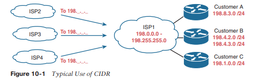

La asignación de todas las direcciones que comienzan con 198 a un ISP permite que otros ISP utilicen una ruta (una ruta para 198.0.0.0/8) para hacer coincidir todas esas direcciones, reenviando paquetes para esas direcciones al ISP1. La Figura 10-1 muestra los ISP de la izquierda, cada uno con una ruta a 198.0.0.0/8; en otras palabras, una ruta a todos los hosts cuya dirección IP comienza con 198. Esta ruta resumida coincidirá con los paquetes enviados a todas las direcciones en el 65.536 redes IP Clase C que comienzan con 198.

La segunda característica importante de CIDR permite a los RIR y a los ISP reducir el desperdicio asignando un subconjunto de una red con clase a un solo cliente. Por ejemplo, imagine que el cliente A del ISP1 necesita solo 10 direcciones IP y que el cliente C necesita 25 direcciones IP. ISP1 hace algo como esto:
- Asignar al cliente un bloque CIDR 198.8.3.16/28, con 14 direcciones asignables (198.8.3.17 a 198.8.3.30).
- Asignar el bloque CIDR del cliente B 198.8.3.32/27, con 30 direcciones asignables (198.8.3.33 a 198.8.3.62).

Estos bloques CIDR actúan de manera muy parecida a una red IP pública; en particular, le dan a cada empresa un conjunto consecutivo de direcciones IPv4 públicas para usar. El proceso de asignación de direcciones públicas también tiene mucho menos desperdicio que antes. De hecho, la mayoría de las asignaciones de direcciones públicas durante los últimos 20 años han sido un bloque CIDR en lugar de una red completa de clase A, B o C.
### Direccionamiento privado
Es posible que algunas computadoras nunca estén conectadas a Internet. Las direcciones IP de estas computadoras podrían ser duplicados de direcciones IP registradas en Internet. Al diseñar la convención de direccionamiento IP para dicha red, una organización podría elegir y utilizar cualquier número de red que quisiera y todo estaría bien. Por ejemplo, puedes comprar algunos enrutadores, conectarlos en tu oficina y configurar direcciones IP en la red 1.0.0.0, y funcionaría. Las direcciones IP que utiliza pueden ser duplicados de direcciones IP reales en Internet, pero si todo lo que quiere hacer es aprender en el laboratorio de su oficina, todo estará bien.

Al crear una red privada que no tendrá conectividad a Internet, puede utilizar números de red IP llamados Internet privados, como se define en RFC 1918, "Asignación de direcciones para Internet privados". Este RFC define un conjunto de redes que nunca se asignarán a ninguna organización como un número de red registrado. En lugar de utilizar los números de red registrados de otra persona, puede utilizar números en un rango que nadie más utiliza en la Internet pública. La Tabla 10-2 muestra el espacio de direcciones privado definido por RFC 1918.


| **Range of IP Addresses**      | **Network(s)**              | **Class of Networks** | **Number of Networks** |
| ------------------------------ | --------------------------- | --------------------- | ---------------------- |
| 10.0.0.0 to 10.255.255.255     | 10.0.0.0                    | A                     | 1                      |
| 172.16.0.0 to 172.31.255.255   | 172.16.0.0 – 172.31.0.0     | B                     | 16                     |
| 192.168.0.0 to 192.168.255.255 | 192.168.0.0 – 192.168.255.0 | C                     | 256                    |

En otras palabras, cualquier organización puede utilizar estos números de red. Sin embargo, ninguna organización puede anunciar estas redes utilizando un protocolo de enrutamiento en Internet.

La Tabla 10-3 resume estas características importantes que han ayudado a extender la vida útil de IPv4 por décadas.

| **Feature**             | **RFC(s)** | **Main Benefits**                                                                                                                                                                          |
| ----------------------- | ---------- | ------------------------------------------------------------------------------------------------------------------------------------------------------------------------------------------ |
| CIDR*                   | 4632       | Assign more-specific public IPv4 address blocks to companies than Class A, B, and C networks.<br><br>Aggregate routes to public IPv4 addresses based on worldwide address allocation plan. |
| NAT*                    | 3022       | Enable approximately 65,000 TCP/UDP sessions to be supported by a single public IPv4 address.                                                                                              |
| Private<br><br>Networks | 1918       | Enable the use of NAT for enterprise Internet connections, with private addresses used inside the enterprise.                                                                              |

*CIDR y NAT pueden ser más conocidos por sus RFC originales (1518, 1519 para CIDR; 1631 para NAT).
### Conceptos de traducción de direcciones de red

NAT, definida en RFC 3022, permite que un host que no tiene una dirección IP válida, registrada y única a nivel mundial se comunique con otros hosts a través de Internet. Es posible que los anfitriones estén utilizando direcciones privadas o direcciones asignadas a otra organización. En cualquier caso, NAT permite que estas direcciones que no están preparadas para Internet sigan utilizándose y aún permite la comunicación con hosts a través de Internet.

NAT logra su objetivo utilizando una dirección IP registrada válida para representar la dirección privada para el resto de Internet. La función NAT cambia las direcciones IP privadas a direcciones IP registradas públicamente dentro de cada paquete IP, como se muestra en la Figura 10-2.

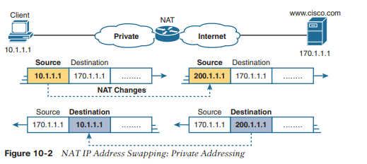

Observe que el enrutador, al realizar NAT, cambia la dirección IP de origen del paquete cuando el paquete sale de la organización privada. El enrutador que realiza NAT también cambia la dirección de destino en cada paquete que se reenvía a la red privada. (La red 200.1.1.0 es una red registrada en la Figura 10-2). La función NAT, configurada en el enrutador con la etiqueta NAT, realiza la traducción.
### NAT estática
La NAT estática funciona igual que el ejemplo que se muestra en la Figura 10-2, pero con las direcciones IP asignadas estáticamente entre sí. Para ayudarle a comprender las implicaciones de la NAT estática y explicar varios términos clave, la Figura 10-3 muestra un ejemplo similar con más información.

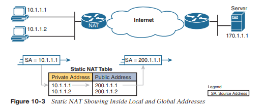

Primero, los conceptos: el ISP de la empresa le ha asignado la red registrada 200.1.1.0.

Por lo tanto, el enrutador NAT debe hacer que las direcciones IP privadas parezcan estar en la red 200.1.1.0. Para hacerlo, el enrutador NAT cambia las direcciones IP de origen en los paquetes de izquierda a derecha en la figura.

En este ejemplo, el enrutador NAT cambia la dirección de origen (SA en la figura) de 10.1.1.1 a 200.1.1.1. Con NAT estática, el enrutador NAT simplemente configura una asignación uno a uno entre la dirección privada y la dirección registrada que se utiliza en su nombre. El enrutador NAT ha configurado estáticamente una asignación entre la dirección privada 10.1.1.1 y la dirección pública registrada 200.1.1.1.

Para admitir un segundo host IP con NAT estática se requiere una segunda asignación estática uno a uno utilizando una segunda dirección IP en el rango de direcciones públicas. Por ejemplo, para admitir 10.1.1.2, el enrutador asigna estáticamente 10.1.1.2 a 200.1.1.2. Debido a que la empresa tiene una única red Clase C registrada, puede admitir como máximo 254 direcciones IP privadas con NAT, con los dos números reservados habituales (el número de red y la dirección de transmisión de red).

La terminología utilizada con NAT, particularmente con la configuración, puede resultar un poco confusa. Observe en la Figura 10-3 que la tabla NAT enumera las direcciones IP privadas como "privadas" y las direcciones públicas registradas de la red 200.1.1.0 como "públicas". Cisco utiliza el término local para las direcciones IP privadas en este ejemplo y global para las direcciones IP públicas.

 Usando la terminología NAT, la red empresarial que utiliza direcciones privadas y, por lo tanto, necesita NAT, es la parte "interna" de la red. El lado de Internet de la función NAT es la parte "exterior" de la red. Un host que necesita NAT (como 10.1.1.1 en el ejemplo) tiene la dirección IP que utiliza dentro de la red y necesita una dirección IP para representarlo en la red exterior. Entonces, debido a que el host esencialmente necesita dos direcciones diferentes para representarlo, se necesitan dos términos. Cisco llama a la dirección IP privada utilizada en la red interna dirección local interna y a la dirección utilizada para representar el host ante el resto de Internet, dirección global interna. La Figura 10-4 repite el mismo ejemplo, y se muestra parte de la terminología.

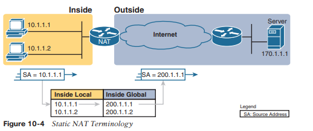

La NAT de origen cambia solo la dirección IP de los hosts internos. Por lo tanto, la tabla NAT actual que se muestra en la Figura 10-4 muestra las direcciones registradas internas locales y globales internas correspondientes. El término inside local se refiere a la dirección utilizada para el host dentro de la empresa, la dirección utilizada localmente versus globalmente, lo que significa en la empresa en lugar de Internet global. Por el contrario, el término inside global todavía se refiere a una dirección utilizada para el host dentro de la empresa, pero es la dirección global utilizada mientras el paquete fluye a través de Internet.

Tenga en cuenta que la función NAT denominada NAT de destino, que no se trata aqui, utiliza términos similares fuera de lo local y fuera de lo global. Sin embargo, con NAT de origen, se utiliza uno de los términos, fuera de global. Este término se refiere al host que reside fuera de la empresa. Debido a que la NAT de origen no cambia esa dirección, el término fuera de global se aplica en todo momento.

La Tabla 10-4 resume estos cuatro términos similares y se refiere a las direcciones IPv4 utilizadas como ejemplos en las últimas tres figuras como ejemplos.


| **Term**       | **Values in Figures** | **Meaning**                                                                                                                                                                                                                                                                                                                                                                                                     |
| -------------- | --------------------- | --------------------------------------------------------------------------------------------------------------------------------------------------------------------------------------------------------------------------------------------------------------------------------------------------------------------------------------------------------------------------------------------------------------- |
| Inside local   | 10.1.1.1              | **Inside:** R efers to the permanent location of the host, from the enterprise’s perspective: it is inside the enterprise.<br><br>**Local:** Means not global; that is, local. It is the address used for that host while the packet flows in the local enterprise rather than the global Internet.<br><br>**Alternative:** Think of it as inside private, because this address is typically a private address. |
| Inside global  | 200.1.1.1             | **Inside:** Refers to the permanent location of the host, from the enterprise’s perspective.<br><br>**Global:** Means global as in the global Internet. It is the address used for that host while the packet flows in the Internet.<br><br>**Alternative:** Think of it as inside public, because the address is typically a public IPv4 address.                                                              |
| Outside global | 170.1.1.1             | With s ource NAT, the one address used by the host that resides outside the enterprise, which NAT does not change, so there is no need for a contrasting term.<br><br>**Alternative:** Think of it as outside public, because the address is typically a public IPv4 address.                                                                                                                                   |
| Outside local  | —                     | This term is not used with source NAT. With destination NAT, the address would represent a host that resides outside the enterprise, but the address used to represent that host as packets pass through the local e nterprise.                                                                                                                                                                                 |

### NAT dinámica
La NAT dinámica tiene algunas similitudes y diferencias en comparación con la NAT estática. Al igual que la NAT estática, el enrutador NAT crea una asignación uno a uno entre una dirección local interna y una dirección global interna, y cambia las direcciones IP en los paquetes a medida que salen y entran a la red interna. Sin embargo, la asignación de una dirección local interna a una dirección global interna ocurre dinámicamente.

La NAT dinámica configura un grupo de posibles direcciones globales internas y define criterios coincidentes para determinar qué direcciones IP locales internas deben traducirse con NAT. Por ejemplo, en la Figura 10-5, se ha establecido un grupo de cinco direcciones IP globales internas: 200.1.1.1 a 200.1.1.5. NAT también se ha configurado para traducir cualquier dirección local interna que comience con 10.1.1.

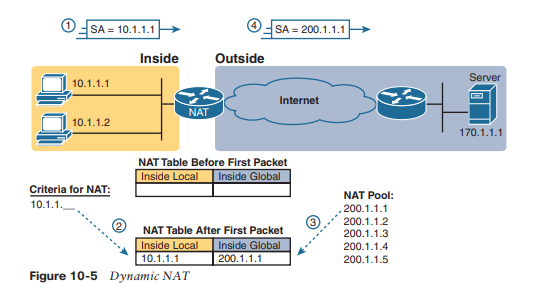

Los números 1, 2, 3 y 4 en la figura se refieren a la siguiente secuencia de eventos:
1. El host 10.1.1.1 envía su primer paquete al servidor en 170.1.1.1.
2. A medida que el paquete ingresa al enrutador NAT, el enrutador aplica cierta lógica de coincidencia para decidir si se debe aplicar NAT al paquete. Debido a que la lógica se ha configurado para que coincida con las direcciones IP de origen que comienzan con 10.1.1, el enrutador agrega una entrada en la tabla NAT para 10.1.1.1 como una dirección local interna.
3. El enrutador NAT necesita asignar una dirección IP del conjunto de direcciones globales internas válidas. Elige el primero disponible (200.1.1.1, en este caso) y lo agrega a la tabla NAT para completar la entrada.
4. El enrutador NAT traduce la dirección IP de origen y reenvía el paquete.

La entrada dinámica permanece en la tabla mientras el tráfico fluya ocasionalmente. Puede configurar un valor de tiempo de espera que defina cuánto tiempo debe esperar el enrutador, sin haber traducido ningún paquete con esa dirección, antes de eliminar la entrada dinámica. También puede borrar manualmente las entradas dinámicas de la tabla usando el comando `clear ip nat Translation`.

NAT se puede configurar con más direcciones IP en la lista de direcciones locales internas que en el grupo de direcciones globales internas. El enrutador asigna direcciones del grupo hasta que todas estén asignadas. Si llega un nuevo paquete desde otro host interno y necesita una entrada NAT, pero todas las direcciones IP agrupadas están en uso, el enrutador simplemente descarta el paquete.

El usuario debe intentarlo nuevamente hasta que se agote el tiempo de espera de una entrada NAT, momento en el cual la función NAT funciona para el siguiente host que envía un paquete. Esencialmente, el conjunto global interno de direcciones debe ser tan grande como el número máximo de hosts simultáneos que necesitan usar Internet al mismo tiempo, a menos que use PAT, como se explica en la siguiente sección.
### Sobrecarga de NAT con traducción de direcciones de puertos
Algunas redes necesitan que la mayoría, si no todos, los hosts IP lleguen a Internet. Si esa red utiliza direcciones IP privadas, el enrutador NAT necesita un conjunto muy grande de direcciones IP registradas. Con NAT estática, para cada host IP privado que necesita acceso a Internet, necesita una dirección IP registrada públicamente, frustrando por completo el objetivo de reducir la cantidad de direcciones IPv4 públicas necesarias para esa organización. La NAT dinámica reduce el problema hasta cierto punto, porque cada host de una red rara vez necesita comunicarse con Internet al mismo tiempo. Sin embargo, si un gran porcentaje de los hosts IP de una red necesitarán acceso a Internet durante el horario laboral normal de esa empresa, NAT aún requiere una gran cantidad de direcciones IP registradas, lo que nuevamente no logra reducir el consumo de direcciones IPv4.

La función de sobrecarga NAT, también llamada traducción de direcciones de puerto (PAT), resuelve este problema.
La sobrecarga permite que NAT escale para admitir muchos clientes con solo unas pocas direcciones IP públicas.

La clave para comprender cómo funciona la sobrecarga es recordar cómo los hosts usan los puertos TCP y el Protocolo de datagramas de usuario (UDP). Para ver por qué, primero considere la idea de tres conexiones TCP separadas a un servidor web, desde tres hosts diferentes, como se muestra en la Figura 10-6.

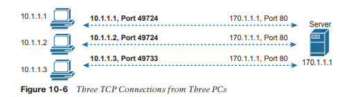

A continuación, compare esas tres conexiones TCP en la Figura 10-6 con tres conexiones TCP similares, ahora con las tres conexiones TCP de un cliente, como se muestra en la Figura 10-7. El servidor se da cuenta de una diferencia porque ve la dirección IP y el número de puerto TCP utilizados por los clientes en ambas figuras. Sin embargo, al servidor realmente no le importa si las conexiones TCP provienen de diferentes hosts o del mismo host; el servidor simplemente envía y recibe datos a través de cada conexión.

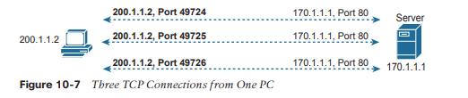

NAT aprovecha el hecho de que, desde la perspectiva de la capa de transporte, al servidor no le importa si tiene una conexión cada uno con tres hosts diferentes o tres conexiones con una única dirección IP de host. La sobrecarga NAT (PAT) traduce no solo la dirección, sino también el número de puerto cuando es necesario, haciendo que lo que parecen muchos flujos TCP o UDP de diferentes hosts parezcan la misma cantidad de flujos de un host. La figura 10-8 describe la lógica.

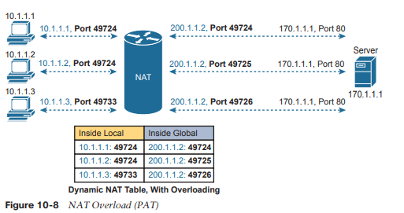

Cuando PAT crea la asignación dinámica, selecciona no solo una dirección IP global interna sino también un número de puerto único para usar con esa dirección. El enrutador NAT mantiene una entrada en la tabla NAT para cada combinación única de dirección IP local interna y puerto, con traducción a la dirección global interna y un número de puerto único asociado con la dirección global interna. Y debido a que el campo de número de puerto tiene 16 bits, la sobrecarga NAT puede usar más de 65 000 números de puerto, lo que le permite escalar bien sin necesidad de muchas direcciones IP registradas; en muchos casos, solo necesita una dirección IP global interna.

De los tres tipos de NAT tratados hasta ahora en este capítulo, PAT es, con diferencia, la opción más popular. Tanto la NAT estática como la NAT dinámica requieren una asignación uno a uno desde la dirección local interna a la dirección global interna. PAT reduce significativamente la cantidad de direcciones IP registradas requeridas en comparación con estas otras alternativas de NAT.
### Configuración de NAT y solución de problemas
 Las siguientes secciones describen cómo configurar las tres variaciones más comunes de NAT: NAT estática, NAT dinámica y PAT, junto con los comandos `show` y `debug` utilizados para solucionar problemas de NAT.
### Configuración NAT estática
La configuración de NAT estática requiere solo unos pocos pasos de configuración. Se debe configurar cada asignación estática entre una dirección local (privada) y una dirección global (pública). Además, debido a que NAT puede usarse en un subconjunto de interfaces, se debe indicar al enrutador en qué interfaces debe usar NAT. Esos mismos subcomandos de interfaz le dicen a NAT si la interfaz está dentro o fuera. Los pasos específicos son los siguientes:

**Paso 1**. Utilice el comando `ip nat inside` en el modo de configuración de interfaz para configurar las interfaces de la lista de verificación para que estén en la parte interna del diseño NAT.
**Paso 2**. Utilice el comando `ip nat outside` en el modo de configuración de interfaz para configurar las interfaces para que estén en la parte exterior del diseño NAT.
**Paso 3**. Utilice el comando `ip nat inside source static inside-local inside-global` en el modo de configuración global para configurar las asignaciones estáticas.

La Figura 10-9 muestra la red familiar utilizada en la descripción de NAT estática anteriormente en este capítulo, que también se utiliza para los primeros ejemplos de configuración. En la Figura 10-9, puede ver que Certskills obtuvo la red Clase C 200.1.1.0 como número de red registrado. Toda esa red, con máscara 255.255.255.0, está configurada en el enlace serie entre Certskills e Internet. Con un enlace serie punto a punto, sólo se consumen dos de las 254 direcciones IP válidas en esa red, quedando 252 direcciones.

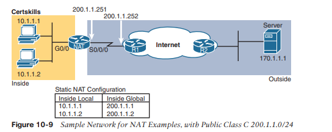

Al planificar una configuración NAT, debe encontrar algunas direcciones IP para usar como direcciones IP globales internas. Debido a que estas direcciones deben ser parte de algún rango de direcciones IP registradas, es común usar direcciones adicionales en la subred que conecta la empresa a Internet; por ejemplo, las 252 direcciones IP adicionales en la red 200.1.1.0 en este caso. El enrutador también se puede configurar con una interfaz de bucle invertido y se le puede asignar una dirección IP que forme parte de un rango global único de direcciones IP registradas.

El ejemplo 10-1 enumera la configuración de NAT, utilizando 200.1.1.1 y 200.1.1.2 para las dos asignaciones de NAT estáticas.

```
NAT# show running-config
! 
! Lines omitted for brevity 
!
interface GigabitEthernet0/0  
ip address 10.1.1.3 255.255.255.0  
ip nat inside 
!
interface Serial0/0/0  
ip address 200.1.1.251 255.255.255.0  
ip nat outside 
!
ip nat inside source static 10.1.1.2 200.1.1.2 
ip nat inside source static 10.1.1.1 200.1.1.1
NAT#  show ip nat translations
Pro Inside global         Inside local        Outside local       Outside global
---   200.1.1.1             10.1.1.1                ---                ---
---   200.1.1.2             10.1.1.2                ---                ---

NAT#  show ip nat statistics
Total active translations: 2 (2 static, 0 dynamic; 0 extended) 
Outside interfaces:
  Serial0/0/0 
Inside interfaces:
  GigabitEthernet0/0
Hits: 100 Misses: 0
Expired translations: 0 
Dynamic mappings:
```

Las asignaciones estáticas se crean utilizando el comando `ip nat inside source ststic`. La palabra clave interna significa que NAT traduce direcciones para hosts en la parte interna de la red. La palabra clave fuente significa que NAT traduce la dirección IP de origen de los paquetes que llegan a sus interfaces internas. La palabra clave estática significa que los parámetros definen una entrada estática, que nunca debe eliminarse de la tabla NAT debido al tiempo de espera. Debido a que el diseño requiere dos hosts (10.1.1.1 y 10.1.1.2) para tener acceso a Internet, se necesitan dos comandos `ip nat inside`.

Después de crear las entradas NAT estáticas, el enrutador necesita saber qué interfaces están "adentro" y cuáles están "afuera". Los subcomandos de interfaz `ip nat inside` y `ip nat outside` identifican cada interfaz de forma adecuada.

Un par de comandos show enumeran la información más importante sobre NAT. El comando `show ip nat Translations` enumera las dos entradas NAT estáticas creadas en la configuración. El comando `show ip nat stats` enumera estadísticas, enumerando elementos como el número de entradas de la tabla de traducción actualmente activas. Las estadísticas también incluyen el número de visitas, que aumenta con cada paquete para el cual NAT debe traducir direcciones.
### Configuración NAT dinámica
Como se puede imaginar, la configuración de NAT dinámica difiere en algunos aspectos de la NAT estática, pero también tiene algunas similitudes. La NAT dinámica aún requiere que cada interfaz se identifique como una interfaz interna o externa y, por supuesto, ya no se requiere el mapeo estático. La NAT dinámica utiliza una lista de control de acceso (ACL) para identificar qué direcciones IP locales (privadas) internas necesitan traducirse y define un grupo de direcciones IP públicas registradas para asignar. Los pasos específicos son los siguientes:

**Paso 1**. Utilice el comando `ip nat inside` en el modo de configuración de interfaz para configurar
Las interfaces de lista de verificación deben estar en la parte interna del diseño NAT (al igual que con NAT estática).
**Paso 2**. Utilice el comando `ip nat outside` en el modo de configuración de interfaz para configurar las interfaces para que estén en la parte exterior del diseño NAT (al igual que con NAT estática).
**Paso 3**. Configure una ACL que coincida con los paquetes que ingresan a las interfaces internas para las cuales se debe realizar NAT.
**Paso 4**. Utilice el comando `ip nat pool name first-address last-address netmask subnet-mask` en el modo de configuración global para configurar el grupo de direcciones IP públicas registradas.
**Paso 5**. Utilice el comando `ip nat inside source list acl-number pool pool-name` en el modo de configuración global para habilitar la NAT dinámica. Tenga en cuenta que el comando hace referencia a la ACL (paso 3) y al grupo (paso 4) según los pasos anteriores.

El siguiente ejemplo muestra una configuración NAT dinámica de muestra utilizando la misma topología de red que el ejemplo anterior (consulte la Figura 10-9). En este caso, las mismas dos direcciones locales internas (10.1.1.1 y 10.1.1.2) necesitan traducción. Sin embargo, a diferencia del ejemplo anterior de NAT estática, la configuración del Ejemplo 10-2 coloca las direcciones IP públicas (200.1.1.1 y 200.1.1.2) en un grupo de direcciones globales internas asignables dinámicamente.

```
NAT# show running-config 
! 
! Lines omitted for brevity 
! 
interface GigabitEthernet0/0  
ip address 10.1.1.3 255.255.255.0  
ip nat inside 
! 
interface Serial0/0/0  
ip address 200.1.1.251 255.255.255.0  
ip nat outside 
! 
ip nat pool fred 200.1.1.1 200.1.1.2 netmask 255.255.255.252 
ip nat inside source list 1 pool fred 
!
access-list 1 permit 10.1.1.2 
access-list 1 permit 10.1.1.1
```

La NAT dinámica configura el grupo de direcciones públicas (globales) con el comando `ip nat pool` que enumera el primer y el último número en un rango inclusivo de direcciones globales internas. Por ejemplo, si el grupo necesitaba 10 direcciones, el comando podría haber enumerado 200.1.1.1 y 200.1.1.10, lo que significa que NAT puede usar 200.1.1.1 a 200.1.1.10.

La NAT dinámica también realiza una verificación en el comando `ip nat pool` con el parámetro de máscara de red requerido. Si el rango de direcciones no estuviera en la misma subred, asumiendo que la máscara de red configurada se usó en las direcciones en el rango configurado, entonces IOS rechazará el comando `ip nat pool`. Por ejemplo, tal como está configurado con el extremo inferior de 200.1.1.1, el extremo superior de 200.1.1.2 y una máscara de 255.255.255.252, IOS usaría las siguientes comprobaciones para garantizar que ambos cálculos coloquen 200.1.1.1 y 200.1.1.2 en la misma subred:
- 200.1.1.1 con máscara 255.255.255.252 implica subred 200.1.1.0, dirección de transmisión 200.1.1.3.
- 200.1.1.2 con máscara 255.255.255.252 implica subred 200.1.1.0, dirección de transmisión 200.1.1.3.

Si, en cambio, el comando hubiera mostrado valores finales bajos y altos de 200.1.1.1 y 200.1.1.6, nuevamente con la máscara 255.255.255.252, IOS rechazaría el comando. IOS haría los cálculos detallados en la siguiente lista y se daría cuenta de que los números estaban en diferentes subredes:
- 200.1.1.1 con máscara 255.255.255.252 implica subred 200.1.1.0, dirección de transmisión 200.1.1.3.
- 200.1.1.6 con máscara 255.255.255.252 implica subred 200.1.1.4, dirección de transmisión 200.1.1.7.

Otra gran diferencia entre la configuración NAT dinámica y NAT estática en el Ejemplo 10-1 tiene que ver con dos opciones en el comando `ip nat inside source`. La versión NAT dinámica de este comando hace referencia al nombre del grupo NAT que desea utilizar para direcciones globales internas (en este caso, fred. También se refiere a una ACL de IP, que define la lógica de coincidencia para las direcciones IP locales internas. Entonces, la lógica para el comando `ip nat inside source list 1 pool fred` en este ejemplo es la siguiente:
Cree entradas de la tabla NAT que se mapeen entre hosts que coincidan con ACL 1, para paquetes que ingresan a cualquier interfaz interna, asignando una dirección global interna del grupo llamado fred.
### Verificación NAT dinámica
Los ejemplos 10-3 y 10-4 muestran la evidencia de que la NAT dinámica comienza sin entradas en la tabla NAT, pero el enrutador reacciona después de que el tráfico del usuario controla correctamente la función NAT. El ejemplo 10-3 muestra el resultado de los comandos `show ip nat Translations` y `show ip nat stats` antes de que cualquier usuario genere tráfico que haga que NAT realice algún trabajo. El comando `show ip nat Translations`, que enumera las entradas de la tabla NAT, muestra una línea en blanco; el comando `show ip nat stats`, que muestra cuántas veces NAT ha creado una entrada de la tabla NAT, muestra 0 traducciones activas.

```
! The next command lists one empty line because no entries have been dynamically 
! created yet.

NAT# show ip nat translations

NAT# show ip nat statistics 
Total active translations: 0 (0 static, 0 dynamic; 0 extended) 
Peak translations: 8, occurred 00:02:44 ago 
Outside interfaces:
  Serial0/0/0 
Inside interfaces:
  GigabitEthernet0/0
Hits: 0 Misses: 0 
CEF Translated packets: 0, CEF Punted packets: 0
Expired translations: 0 
Dynamic mappings:
-- Inside Source 
[id 1] access-list 1 pool fred refcount 0  
pool fred: netmask 255.255.255.252     
   start 200.1.1.1 end 200.1.1.2     
   type generic, total addresses 2, allocated 0 (0%), misses 0

Total doors: 0
Appl doors: 0
Normal doors: 0
Queued Packets: 0
```

El comando `show ip nat stats` al final del ejemplo enumera información de solución de problemas particularmente interesante con dos contadores diferentes etiquetados "fallos", como se destaca en el ejemplo. La primera aparición de este contador cuenta la cantidad de veces que llega un paquete nuevo que necesita una entrada NAT y no la encuentra. En ese punto, la NAT dinámica reacciona y crea una entrada. El segundo contador de errores hacia el final de la salida del comando enumera el número de errores en el grupo. Este contador se incrementa solo cuando la NAT dinámica intenta asignar una nueva entrada de la tabla NAT y no encuentra direcciones disponibles, por lo que el paquete no se puede traducir, lo que probablemente provoque que el usuario final no acceda a la aplicación.

A continuación, el Ejemplo 10-4 actualiza la salida de ambos comandos después de que el usuario del host en 10.1.1.1 hace telnet al host 170.1.1.1.

```
NAT# show ip nat translations
Pro Inside global       Inside local        Outside local        Outside global
--- 200.1.1.1            10.1.1.1             ---                     ---

NAT# show ip nat statistics 
Total active translations: 1 (0 static, 1 dynamic; 0 extended) 
Peak translations: 11, occurred 00:04:32 ago
Outside interfaces:
  Serial0/0/0 
Inside interfaces:
  GigabitEthernet0/0
Hits: 69 Misses: 1
Expired translations: 0 
Dynamic mappings: 
-- Inside Source 
access-list 1 pool fred refcount 1 
[eml fred: netmask 255.255.255.252     
start 200.1.1.1 end 200.1.1.2     
type generic, total addresses 2, allocated 1 (50%), misses 0
```

El ejemplo comienza con el host 10.1.1.1 haciendo telnet a 170.1.1.1 (no se muestra), con el enrutador NAT creando una entrada NAT. La tabla NAT muestra una única entrada, asignando 10.1.1.1 a 200.1.1.1. Además, la primera línea del resultado del comando `show ip nat stats` muestra un contador para 1 traducción activa, como se muestra en la tabla NAT en la parte superior del ejemplo.

Tómese un momento adicional para considerar la línea resaltada, donde el comando `show ip nat stats` enumera 1 error y 69 aciertos. El primer contador de errores, ahora en 1, significa que llegó un paquete que necesitaba NAT, pero no había ninguna entrada en la tabla NAT. NAT reaccionó y agregó una entrada de la tabla NAT, por lo que el contador de visitas de 69 significa que los siguientes 69 paquetes utilizaron la entrada de la tabla NAT recién agregada. El segundo contador de errores, todavía en 0, no aumentó porque el grupo NAT tenía suficientes direcciones IP globales disponibles dentro para usarlas para asignar la nueva entrada de la tabla NAT. También tenga en cuenta que la última línea enumera estadísticas sobre la cantidad de miembros del grupo asignados (1) y el porcentaje del grupo actualmente en uso (50%).

Las entradas de la tabla NAT dinámica vencen después de un período de inactividad, lo que vuelve a colocar aquellas dentro de las direcciones globales en el grupo para uso futuro. El ejemplo 10-5 muestra una secuencia en la que dos hosts diferentes utilizan la dirección global interna 200.1.1.1. El host 10.1.1.1 utiliza la dirección global interna 200.1.1.1 al comienzo del ejemplo. Luego, en lugar de simplemente esperar a que expire el tiempo de espera de la entrada NAT, el ejemplo borra la entrada de la tabla NAT con el comando `clear ip nat Translation` . En ese momento, el usuario en 10.1.1.2 hace telnet a 170.1.1.1 y aparece la nueva entrada de la tabla NAT, utilizando la misma dirección global interna 200.1.1.1.

```
! Host 10.1.1.1 currently uses inside global 200.1.1.1
NAT# show ip nat translations
Pro Inside global      Inside local         Outside local        Outside global
--- 200.1.1.1           10.1.1.1              ---                   ---

NAT# clear ip nat translation *

! 
! telnet from 10.1.1.2 to 170.1.1.1 happened next; not shown 
! 
! Now host 10.1.1.2 uses inside global 200.1.1.1

NAT# show ip nat translations
Pro Inside global      Inside local         Outside local        Outside global
--- 200.1.1.1            10.1.1.2             ---                   ---

! 
! Telnet from 10.1.1.1 to 170.1.1.1 happened next; not shown 
!
NAT# debug ip nat
IP NAT debugging is on

Oct 20 19:23:03.263: NAT*: s=10.1.1.1->200.1.1.2, d=170.1.1.1 [348]
Oct 20 19:23:03.267: NAT*: s=170.1.1.1, d=200.1.1.2->10.1.1.1 [348]
Oct 20 19:23:03.464: NAT*: s=10.1.1.1->200.1.1.2, d=170.1.1.1 [349]
Oct 20 19:23:03.568: NAT*: s=170.1.1.1, d=200.1.1.2->10.1.1.1 [349]
```

Finalmente, al final del Ejemplo 10-5, verá que el host 10.1.1.1 ha hecho telnet a otro host en Internet, además del resultado del comando `debug ip nat`. Este comando de depuración hace que el enrutador emita un mensaje cada vez que la dirección de un paquete se traduce para NAT. Los resultados de salida se generan ingresando algunas líneas desde la conexión Telnet de 10.1.1.1 a 170.1.1.1. El resultado de depuración le indica que el host 10.1.1.1 ahora usa la dirección global interna 200.1.1.2 para esta nueva conexión.
### Configuración de sobrecarga NAT (PAT)
Las configuraciones de NAT estática y dinámica son importantes, pero la configuración de sobrecarga de NAT (PAT) en esta sección es más importante. Esta es la característica que guarda las direcciones IPv4 públicas y prolonga la vida útil de IPv4.

La sobrecarga de NAT, como se mencionó anteriormente, permite que NAT admita muchas direcciones IP locales internas con solo una o unas pocas direcciones IP globales internas. Básicamente, al traducir la dirección IP privada y el número de puerto a una única dirección global interna, pero con un número de puerto único, NAT puede admitir muchos (más de 65 000) hosts privados con una sola dirección pública global.

Existen dos variaciones de configuración PAT en IOS. Si PAT utiliza un grupo de direcciones globales internas, la configuración se ve exactamente como NAT dinámica, excepto que el comando global ip nat inside source list tiene una palabra clave de sobrecarga agregada al final. Si PAT solo necesita usar una dirección IP global interna, el enrutador puede usar una de sus direcciones IP de interfaz. Debido a que NAT puede soportar más de 65.000 flujos simultáneos con una única dirección global interna, una única dirección IP pública puede soportar las necesidades NAT de toda una organización.

La siguiente declaración detalla la diferencia de configuración entre la sobrecarga de NAT y la NAT 1:1 cuando se utiliza un grupo de NAT:
Utilice los mismos pasos para configurar NAT dinámica, como se describe en la sección anterior, pero incluya la palabra clave de sobrecarga al final del comando global ip nat inside source list.

La siguiente lista de verificación detalla la configuración cuando se utiliza una dirección IP de interfaz como única dirección IP global interna:
**Paso 1**. Al igual que con NAT dinámica y estática, configure el subcomando `ip nat inside` para identificar las interfaces internas.
**Paso 2**. Al igual que con la NAT dinámica y estática, configure el subcomando `ip nat outside` para identificar las interfaces externas.
**Paso 3**. Al igual que con la NAT dinámica, configure una ACL que coincida con los paquetes que ingresan a las interfaces internas.
**Paso 4**. Configure el comando de configuración global `ip nat inside source list acl-number interface type/number overload`, haciendo referencia a la ACL creada en el paso 3 y a la interfaz cuya dirección IP se utilizará para las traducciones.

El ejemplo 10-2 demostró una configuración NAT dinámica. Para convertirlo a una configuración PAT, en su lugar usaría el comando `ip nat inside source list 1 pool fred overload`, simplemente agregando la palabra clave overload.

El siguiente ejemplo muestra la configuración PAT utilizando una dirección IP de interfaz única. La Figura 10-10 muestra la misma red familiar, con algunos cambios. En este caso, el ISP le ha proporcionado a Certskills un subconjunto de red 200.1.1.0: subred CIDR 200.1.1.248/30. En otras palabras, esta subred tiene dos direcciones utilizables: 200.1.1.249 y 200.1.1.250. Estas direcciones se utilizan en ambos extremos del enlace serie entre Certskills y su ISP. La función NAT en el enrutador Certskills traduce todas las direcciones NAT a su dirección IP serie, 200.1.1.249.

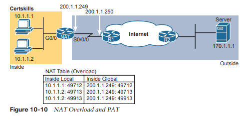

En el Ejemplo 10-6, que muestra la configuración de sobrecarga de NAT, NAT se traduce utilizando únicamente la dirección global interna 200.1.1.249, por lo que no se requiere el grupo de NAT. En el ejemplo, el host 10.1.1.2 crea dos conexiones Telnet y el host 10.1.1.1 crea una conexión Telnet, lo que genera tres entradas NAT dinámicas, cada una de las cuales utiliza la dirección global interna 200.1.1.249, pero cada una con un número de puerto único.

```
NAT# show running-config
! 
! Lines Omitted for Brevity 
! 
interface GigabitEthernet0/0  
   ip address 10.1.1.3 255.255.255.0  
   ip nat inside 
! 
interface Serial0/0/0  
   ip address 200.1.1.249 255.255.255.252  
   ip nat outside 
!

ip nat inside source list 1 interface Serial0/0/0 overload 
!
access-list 1 permit 10.1.1.2 access-list 1 permit 10.1.1.1 !

NAT#  show ip nat translations
Pro  Inside global      Inside local       Outside local    Outside global 
tcp  200.1.1.249:49712  10.1.1.1:49712     170.1.1.1:23     170.1.1.1:23 
tcp  200.1.1.249:49713  10.1.1.2:49713     170.1.1.1:23     170.1.1.1:23 
tcp  200.1.1.249:49913  10.1.1.2:49913     170.1.1.1:23     170.1.1.1:23

NAT#  show ip nat statistics
Total active translations: 3 (0 static, 3 dynamic; 3 extended) 
Peak translations: 12, occurred 00:01:11 ago 
Outside interfaces:
  Serial0/0/0 
Inside interfaces:
  GigabitEthernet0/0
Hits: 103 Misses: 3
Expired translations: 0 Dynamic mappings: 
-- Inside Source 
access-list 1 interface Serial0/0/0 refcount 3
```

El comando  `ip nat inside source list 1 interface serial 0/0/0 overload` tiene varios parámetros, pero si comprende la configuración dinámica de NAT, los nuevos parámetros no deberían ser demasiado difíciles de comprender. El parámetro lista 1 significa lo mismo que para NAT dinámica: las direcciones IP locales internas que coinciden con ACL 1 tienen sus direcciones traducidas. El parámetro de interfaz serial 0/0/0 significa que la única dirección IP global interna disponible es la dirección IP de la interfaz serial 0/0/0 del enrutador NAT. Finalmente, el parámetro de sobrecarga significa que la sobrecarga está habilitada. Sin este parámetro, el enrutador no realiza sobrecarga, solo NAT dinámica.

Como puede ver en el resultado del comando `show ip nat Translations`, se han agregado tres traducciones a la tabla NAT. Antes de este comando, el host 10.1.1.1 crea una conexión Telnet a 170.1.1.1 y el host 10.1.1.2 crea dos conexiones Telnet. El enrutador crea una entrada en la tabla NAT para cada combinación única de dirección IP local interna y puerto.
### Solución de problemas de NAT
La mayoría de los problemas de solución de problemas de NAT se relacionan con la configuración correcta. La NAT de origen tiene varias opciones de configuración (estática, dinámica, PAT) con varios comandos de configuración para cada una. Debe trabajar duro para desarrollar habilidades con la configuración para que pueda reconocer rápidamente los errores de configuración. La siguiente lista de verificación de solución de problemas resume los problemas de NAT de origen más comunes, la mayoría de los cuales se relacionan con una configuración incorrecta.
- Invertido dentro y fuera: asegúrese de que la configuración incluya los subcomandos de interfaz ip nat inside e ip nat outside y que los comandos no estén invertidos (el comando ip nat inside en interfaces exteriores, y viceversa). Con NAT de origen, solo la interfaz interna hace que IOS agregue nuevas traducciones, por lo que designar las interfaces internas correctas es particularmente importante.
- NAT estática: verifique el comando estático ip nat inside source para asegurarse de que enumere la dirección local interna primero y la dirección IP global interna en segundo lugar.
- NAT dinámica (ACL): asegúrese de que la ACL configurada para coincidir con los paquetes enviados por los hosts internos coincida con los paquetes de ese host antes de que se produzca cualquier traducción NAT. Por ejemplo, si una dirección local interna de 10.1.1.1 debe traducirse a 200.1.1.1, asegúrese de que la ACL coincida con la dirección de origen 10.1.1.1, no 200.1.1.1.
- NAT dinámica (grupo): para NAT dinámica sin PAT, asegúrese de que el grupo tenga suficientes direcciones IP. Cuando no se utiliza PAT, cada host interno consume una dirección IP del grupo. Un valor grande o creciente en el segundo contador de errores en la salida del comando show ip nat stats puede indicar este problema. Además, compare el grupo configurado con la lista de direcciones en la tabla de traducción NAT (muestre las traducciones de ip nat). Finalmente, si el grupo es pequeño, el problema puede ser que la configuración pretendía usar PAT y le falta la palabra clave de sobrecarga (consulte el siguiente elemento).
- PAT: Es fácil olvidar agregar la opción de sobrecarga al final del comando ip nat inside source list. La configuración PAT es idéntica a una configuración NAT dinámica válida excepto que PAT requiere la palabra clave de sobrecarga. Sin él, la NAT dinámica funciona, pero el conjunto de direcciones normalmente se consume muy rápidamente. El enrutador NAT no traducirá ni reenviará el tráfico de los hosts si no hay una dirección IP de grupo disponible para su tráfico, por lo que algunos hosts experimentan una interrupción.
- ACL: como se menciona en el Capítulo 3, “Listas de control de acceso IPv4 avanzadas”, siempre puede agregar una verificación de las ACL que causan un problema. Quizás NAT se haya configurado correctamente, pero existe una ACL en una de las interfaces que descarta los paquetes. Tenga en cuenta que en este caso el orden de las operaciones dentro del enrutador es importante. Para los paquetes que ingresan a una interfaz, IOS procesa las ACL antes que NAT. Para los paquetes que salen de una interfaz, IOS procesa cualquier ACL saliente después de traducir las direcciones con NAT.
- Tráfico de usuarios requerido: NAT reacciona al tráfico de usuarios. Si configura NAT en un laboratorio, NAT no actúa para crear traducciones (mostrar traducciones ip nat) hasta que parte del tráfico de usuario ingresa al enrutador NAT en una interfaz interna, lo que activa que NAT realice una traducción. La configuración de NAT puede ser perfecta, pero si no se produce ningún tráfico entrante que coincida con la configuración de NAT, NAT no hace nada.
- Enrutamiento IPv4: el enrutamiento IPv4 podría evitar que lleguen paquetes a ambos lados del enrutador NAT. Tenga en cuenta que el enrutamiento debe funcionar para las direcciones IP de destino utilizadas en los paquetes.

Con NAT de origen, el usuario se sienta frente a algún dispositivo de usuario, como una PC. Intenta conectarse a algún servidor utilizando el nombre DNS de ese servidor. Después de la resolución DNS, el cliente (el host interno) envía un paquete IP con una dirección de destino del servidor. Por ejemplo, como se muestra en la Figura 10-11, la PC1 envía un paquete IP con la dirección IP de destino 170.1.1.1, algún servidor en Internet. PC1 es un host interno, el servidor es un host externo y 170.1.1.1 es la dirección global externa. (Tenga en cuenta que estas direcciones coinciden con el ejemplo anterior, que hace referencia a la Figura 10-10).

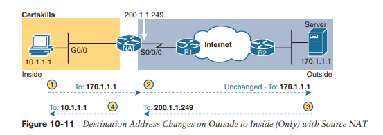

Tenga en cuenta que con la NAT de origen en lo que debería ser un diseño familiar, la dirección IP de destino del paquete no cambia durante todo el viaje. Por lo tanto, la solución de problemas del enrutamiento IPv4 hacia la red exterior se basará en la misma dirección IP en todo momento.
Ahora observe los pasos 3 y 4 en la figura, que le recuerda que el paquete de retorno fluirá primero al NAT dentro de la dirección global (200.1.1.249 en este caso) como se muestra en el paso 3. Luego, NAT convierte la dirección de destino a 10.1. 1.1 en este caso. Entonces, para solucionar problemas de paquetes que fluyen de derecha a izquierda en este caso, debe solucionar el problema en función de dos direcciones IP de destino diferentes.
### Comandos de referencia

| **Command**                                                                                                                                            | **Description**                                                                                                                                                         |
| ------------------------------------------------------------------------------------------------------------------------------------------------------ | ----------------------------------------------------------------------------------------------------------------------------------------------------------------------- |
| **ip nat** {**inside** \| **outside**}                                                                                                                 | Interface subcommand to enable NAT and identify whether the interface is in the inside or outside of the network                                                        |
| **i p nat inside source** {**list** {_access-list-number_ \| _access-list-name_}} {**interface** _type number_ \| **pool** _pool-name_} [**overload**] | Global command that enables NAT globally, referencing the ACL that defines which source addresses to NAT, and the interface or pool from which to find global addresses |
| **ip nat pool** _name start-ip end-ip_ {**netmask** _netmask_ \| **prefix-length** _prefix-length_}                                                    | Global command to define a pool of NAT addresses                                                                                                                        |
| **i p nat inside source** _inside-local inside-global_                                                                                                 | Global command that lists the inside and outside address (or, an outside interface whose IP address should be used) to be paired and added to the NAT translation table |
| **s how ip nat statistics**                                                                                                                            | Lists counters for packets and NAT table entries, as well as basic configuration information                                                                            |
| **s how ip nat translations** [**verbose**]                                                                                                            | Displays the NAT table                                                                                                                                                  |
| **c lear ip nat translation** {***** \| **[inside** _global-ip local-ip_] [**outside** _local-ip global-ip_]}                                          | Clears all or some of the dynamic entries in the NAT table, depending on which parameters are used                                                                      |
| **clear ip nat translation** _protocol_ **inside** _global-ip global-port local-ip local-port_ [**outside** _local-ip global-ip_]                      | Clears some of the dynamic entries in the NAT table, depending on which parameters are used                                                                             |
| **debug ip nat**                                                                                                                                       | Issues a log message describing each packet whose<br><br>IP address is translated with NAT                                                                              |