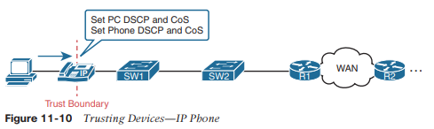
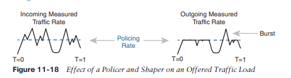

# Calidad de Servicios (QoS)

Este capítulo cubre los siguientes temas del examen:

- Servicios IP
	  - Explicar el comportamiento de reenvío por salto (PHB) para QoS, como clasificación, marcado, colas, congestión, vigilancia y configuración.

La calidad de servicio (QoS) se refiere a las herramientas que los dispositivos de red pueden utilizar para gestionar varias características relacionadas de lo que sucede con un paquete mientras fluye a través de una red. En concreto, estas herramientas gestionan el ancho de banda puesto a disposición de ese tipo de paquete, el retraso que experimenta el paquete, el jitter (variación del retraso) entre paquetes sucesivos en el mismo flujo y el porcentaje de pérdida de paquetes de cada clase. Estas herramientas equilibran las compensaciones de qué tipos de tráfico reciben recursos de red y cuándo, dando más preferencia a algún tráfico y menos preferencia a otros.

Las herramientas de QoS definen acciones que un dispositivo puede aplicar a un mensaje desde el momento en que ingresa al dispositivo hasta que sale del mismo. QoS define estas acciones como _comportamientos por salto_ (PHB), que es un término formal para referirse a acciones distintas de almacenar y reenviar un mensaje. Estas acciones pueden retrasar el mensaje, descartarlo o incluso cambiar los campos del encabezado. El dispositivo puede elegir diferentes PHB para diferentes tipos de mensajes, mejorando el comportamiento de QoS para algunos mensajes y empeorando el comportamiento de QoS para otros.

Este capítulo analiza las herramientas de QoS enumeradas en el tema único del examen de QoS: "Explicar el comportamiento de reenvío por salto (PHB) para QoS, como clasificación, marcado, colas, congestión, vigilancia y modelado". Cada tema enfatiza los problemas que resuelve cada herramienta y cómo cada herramienta administra el ancho de banda, el retraso, la fluctuación y la pérdida.
### Introducción a la calidad del servicio
Los enrutadores suelen ubicarse en el borde de la WAN, con interfaces WAN y LAN. Esas interfaces LAN normalmente funcionan a velocidades mucho más rápidas, mientras que las interfaces WAN funcionan a velocidades más lentas. Mientras esa interfaz WAN más lenta está ocupada enviando los paquetes que esperan en el enrutador, cientos o incluso miles de paquetes IP más podrían llegar a las interfaces LAN, y todos deben reenviarse desde esa misma interfaz WAN. ¿Qué debe hacer el enrutador? ¿Enviarlos todos, en el mismo orden en que llegaron? ¿Priorizar los paquetes, enviar unos antes que otros, prefiriendo un tipo de tráfico sobre otro? ¿Descartar algunos de los paquetes cuando la cantidad de paquetes que esperan salir del enrutador es demasiado grande?

Ese primer párrafo describió algunas de las muchas preguntas clásicas sobre la calidad de servicio (QoS) en las redes. QoS se refiere a las herramientas que utilizan los dispositivos de red para aplicar un tratamiento diferente a los paquetes en la red a medida que pasan a través del dispositivo. Por ejemplo, el enrutador de borde WAN pondría en cola los paquetes esperando que la interfaz WAN esté disponible. El enrutador también podría utilizar un algoritmo de programación de colas para determinar qué paquetes deben enviarse a continuación, utilizando un orden distinto al de llegada, dando a algunos paquetes un mejor servicio y a otros peor.
### QoS: gestión del ancho de banda, retraso, fluctuación y pérdida
Cisco ofrece una amplia gama de herramientas de QoS tanto en enrutadores como en conmutadores. Todas estas herramientas le brindan los medios para administrar cuatro características del tráfico de red:

- Banda ancha
- Demora
- Nerviosismo
- Pérdida

**_Ancho de banda_** se refiere a la velocidad de un enlace, en bits por segundo (bps). Pero si bien pensamos en el ancho de banda como velocidad, también ayuda pensar en el ancho de banda como la capacidad del enlace, en términos de cuántos bits se pueden enviar a través del enlace por segundo. Las herramientas de QoS del dispositivo de red determinan qué paquete se envía a través del enlace a continuación, de modo que el dispositivo de red tiene el control de qué mensajes obtienen acceso al ancho de banda a continuación y qué cantidad de ese ancho de banda (capacidad) obtiene cada tipo de tráfico con el tiempo.

Por ejemplo, considere el típico enrutador de borde WAN que tiene cientos de paquetes esperando para salir del enlace WAN. Un ingeniero podría configurar una herramienta de cola para reservar el 10 por ciento del ancho de banda para el tráfico de voz, el 50 por ciento para aplicaciones de datos de misión crítica y dejar el resto del ancho de banda para todos los demás tipos de tráfico. La herramienta de cola podría luego usar esa configuración para elegir qué paquetes enviar a continuación.

**_Delay_** puede describirse como retraso de ida o de ida y vuelta. El _retraso unidireccional_ se refiere al tiempo entre el envío de un paquete y la llegada de ese mismo paquete al host de destino. El _retraso de ida y vuelta_ cuenta el retraso unidireccional más el tiempo que tarda el receptor del primer paquete en devolver un paquete; en otras palabras, el tiempo que lleva enviar un paquete entre dos hosts y recibir otro. Muchas acciones individuales diferentes impactan en el retraso; En este capítulo se analizarán algunos de ellos, incluidas las colas y el retraso en la configuración.

**_Jitter_** se refiere a la variación en el retraso unidireccional entre paquetes consecutivos enviados por la misma aplicación. Por ejemplo, imagine que una aplicación envía unos cientos de paquetes a un host en particular. El retraso unidireccional del primer paquete es de 300 milisegundos (300 ms o 0,3 segundos). El retraso unidireccional del siguiente paquete es de 300 ms; también lo es el del tercero; etcétera. En ese caso, no hay inquietud. Sin embargo, si en cambio el primer paquete tiene un retraso unidireccional de 300 ms, el siguiente tiene un retraso unidireccional de 310 ms y el siguiente tiene 325 ms, entonces hay alguna variación en el retraso; 10 ms entre los paquetes 1 y 2, y otros 15 ms entre los paquetes 2 y 3. Esa diferencia se llama jitter.

Por último, **_loss_** se refiere al número de mensajes perdidos, normalmente como porcentaje de los paquetes enviados. La comparación es simple: si el remitente de alguna aplicación envía 100 paquetes y solo 98 llegan al destino, ese flujo de aplicación en particular experimentó una pérdida del 2 por ciento. La pérdida puede ser causada por muchos factores, pero a menudo la gente piensa que la pérdida es algo causado por un cableado defectuoso o servicios WAN deficientes. Ésa es una causa. Sin embargo, se producen más pérdidas debido al funcionamiento normal de los dispositivos de red, en el que las colas de los dispositivos se llenan demasiado, por lo que el dispositivo no tiene dónde colocar los paquetes nuevos y los descarta. Varias herramientas de QoS gestionan los sistemas de colas para ayudar a controlar y evitar pérdidas.
### Tipos de tráfico
Con QoS, un ingeniero de redes se propone preferir un tipo de tráfico sobre otro en cuanto a ancho de banda, retraso, fluctuación y pérdida. A veces, esa elección se relaciona con el negocio específico. Por ejemplo, si todas las aplicaciones de misión crítica se encuentran en servidores en tres subredes conocidas, entonces el plan QoS podría configurarse para hacer coincidir los paquetes que van hacia/desde esa subred y darle a ese tráfico un mejor tratamiento en comparación con otro tráfico. Sin embargo, en otros casos, la elección de cómo aplicar las herramientas de QoS se relaciona con la naturaleza de los diferentes tipos de aplicaciones. Algunas aplicaciones tienen diferentes necesidades de QoS que otras. El siguiente tema compara las diferencias básicas en las necesidades de QoS según el tipo de tráfico.
### Aplicaciones de datos
Primero, considere una aplicación web básica, con un usuario en una PC o tableta. El usuario escribe un URI para solicitar una página web. Esa solicitud puede requerir que un solo paquete vaya al servidor web, pero puede resultar en que cientos o miles de paquetes regresen al cliente web, como se muestra en la Figura 11-1.


Entonces, ¿cuál es el impacto del ancho de banda, el retraso, la fluctuación y la pérdida en una aplicación interactiva basada en web? Primero, los paquetes requieren una cierta cantidad de capacidad de ancho de banda. En cuanto al retraso, cada uno de esos paquetes del servidor al cliente sufre un cierto retraso unidireccional, con cierta fluctuación también. De los 500 paquetes que se muestran en la Figura 11-1, si algunos se pierden (errores de transmisión, descartados por dispositivos u otras razones), entonces la lógica TCP del servidor se retransmitirá, pero es posible que partes de la página web no se muestren de inmediato.

Mientras que las herramientas de QoS se centran en gestionar el ancho de banda, el retraso, la fluctuación y la pérdida, el usuario se preocupa principalmente por la calidad de la experiencia general. Por ejemplo, con una aplicación web, ¿cuánto tiempo después de hacer clic ves algo útil en tu navegador web? Entonces, como usuario, te preocupas por la _Calidad de la experiencia_ (QoE), que es un término que se refiere a la percepción que tienen los usuarios sobre el uso que hacen de la aplicación en la red. Las herramientas de QoS impactan directamente el ancho de banda, el retraso, la fluctuación y la pérdida, lo que luego debería tener algún efecto positivo general para influir en la QoE de los usuarios. Y puede utilizar herramientas de QoS para crear una mejor QoE para el tráfico más importante; por ejemplo, puede brindar a ciertas aplicaciones críticas para el negocio un mejor tratamiento de QoS, lo que mejora la QoE para los usuarios de esas aplicaciones.

Por el contrario, una aplicación de datos no interactiva (históricamente llamada tráfico por lotes), por ejemplo, copia de seguridad de datos o transferencias de archivos, tiene requisitos de QoS diferentes a los de las aplicaciones de datos interactivas. Las aplicaciones por lotes suelen enviar más datos que las aplicaciones interactivas, pero como nadie está sentado esperando ver algo en la pantalla, el retraso y la fluctuación no importan mucho. Mucho más importante para estas aplicaciones es satisfacer la necesidad de completar la tarea más grande (transferir archivos) dentro de un período de tiempo mayor. Se pueden utilizar herramientas de QoS para proporcionar suficiente ancho de banda para satisfacer las necesidades de capacidad de estas aplicaciones y gestionar las pérdidas para reducir la cantidad de retransmisiones.
### Aplicaciones de voz y vídeo
Las aplicaciones de voz y vídeo tienen cada una un desglose similar de flujos interactivos y no interactivos. Para exponer los puntos principales sobre voz y video, esta sección analiza más profundamente el tráfico de voz.

Pasemos ahora a la voz, específicamente Voz sobre IP (VoIP). VoIP define los medios para tomar el sonido emitido en un teléfono y enviarlo dentro de paquetes IP a través de una red IP, reproduciendo el sonido en el otro teléfono. La figura 11-2 muestra la idea general. Los pasos en la figura incluyen

**paso 1**. El usuario del teléfono realiza una llamada telefónica y comienza a hablar.
**paso 2**. Un chip llamado _codec_ procesa (digitaliza) el sonido para crear un código binario (160 bytes con el códec G.711, por ejemplo) durante un período de tiempo determinado (generalmente 20 ms).
**paso 3**. El teléfono coloca los datos en un paquete IP.
**etapa 4**. El teléfono envía el paquete al teléfono IP de destino.


Si analiza un poco los cálculos, esta única llamada, con el códec G.711, requiere aproximadamente 80 Kbps de ancho de banda (ignorando el encabezado del enlace de datos y la sobrecarga del final). Contando los encabezados y la carga útil de VoIP como se muestra en la figura, cada uno de los paquetes IP tiene 200 bytes. Cada uno contiene 20 ms de voz digitalizada, por lo que el teléfono envía 50 paquetes por segundo. Estos 50 paquetes de 200 bytes equivalen cada uno a 10.000 bytes por segundo, u 80.000 bits por segundo, lo que equivale a 80 Kbps. Otros códecs de voz requieren incluso menos ancho de banda, siendo el G.729 comúnmente usado alrededor de 24 Kbps (nuevamente ignorando la sobrecarga del enlace de datos).

Al principio, puede parecer que las llamadas VoIP requieren poco en cuanto a QoS. En cuanto al ancho de banda, una sola llamada o flujo de voz requiere solo un poco de ancho de banda en comparación con muchas aplicaciones de datos. Sin embargo, la voz interactiva requiere un nivel de calidad mucho mejor en cuanto a retrasos, fluctuaciones y pérdidas.

Por ejemplo, piense en hacer una llamada telefónica con un gran retraso unidireccional. Terminas de hablar y haces una pausa para que la otra persona responda. Y no lo hace, así que vuelves a hablar y escuchas la voz de la otra persona superpuesta a la tuya. El problema: demasiada demora. O considere llamadas en las que el sonido se interrumpe. ¿El problema? Podría haber sido pérdida de paquetes o podría haber sido inquietud.

Puede lograr tráfico de voz de buena calidad a través de una red IP, pero debe implementar QoS para hacerlo. Las herramientas de QoS se proponen brindar a diferentes tipos de tráfico el comportamiento de QoS que necesitan. La _Guía de diseño de red de referencia de soluciones QoS empresariales_ de Cisco, que cita otras fuentes además de confiar en la larga experiencia de Cisco en la implementación de QoS, sugiere las siguientes pautas para voz interactiva:

- **Delay (one-way):** 150 ms or less
- **Jitter:** 30 ms or less
- **Loss:** 1% or less

En comparación, la voz interactiva requiere más atención que las aplicaciones de datos interactivas para las funciones de QoS. Las aplicaciones de datos generalmente toleran más retrasos, fluctuaciones y pérdidas que la voz (y el vídeo). Una sola llamada de voz generalmente requiere menos ancho de banda que una aplicación de datos típica, pero ese requisito de ancho de banda es constante. Las aplicaciones de datos tienden a tener ráfagas, con ráfagas de datos como reacción cuando el usuario hace algo con la aplicación.

El vídeo tiene un conjunto mucho más variado de requisitos de QoS. En general, piense en el vídeo como en la voz, pero con un requisito de ancho de banda mucho mayor que la voz (por flujo) y requisitos similares de bajo retraso, fluctuación y pérdida. En cuanto al ancho de banda, el vídeo puede utilizar una variedad de códecs que afectan la cantidad de datos enviados, pero muchas otras características técnicas afectan la cantidad de ancho de banda requerido para un único flujo de video. (Por ejemplo, un evento deportivo con mucho movimiento en la pantalla requiere más ancho de banda que un presentador de noticias que lee las noticias frente a un fondo sólido con poco movimiento). Esta vez citando _End-to-End QoS Network Design_, segunda edición ( Cisco Press, 2013), algunos requisitos para el vídeo incluyen

- **Bandwidth:** 384 Kbps to 20+ Mbps
- **Delay (one-way):** 200–400 ms
- **Jitter:** 30–50 ms
- **Loss:** 0.1%–1%
### QoS como se menciona en este libro
Las herramientas de QoS cambian las características de QoS de ciertos flujos en la red. El resto del capítulo se centra en las herramientas específicas mencionadas en el único tema del examen CCNA 200-301 sobre QoS, presentado en las siguientes secciones principales:

- **“Clasification and Marking”** trata sobre el marcado de paquetes y la definición de límites de confianza.
- **“Queuing”** describe la programación de paquetes para dar prioridad a un tipo de paquete sobre otro.
- **“Shaping and Policing”** explica estas dos herramientas juntas porque a menudo se utilizan en extremos opuestos de un vínculo.
- **"Congestion avoidance"** aborda cómo gestionar la pérdida de paquetes que se produce cuando los dispositivos de red están demasiado ocupados.
### QoS en conmutadores y enrutadores
Antes de pasar a varias secciones del capítulo sobre herramientas de QoS específicas, permítanme señalar los términos _paquete_ y _marco_ tal como se utilizan en este capítulo.

Las herramientas de QoS analizadas en este capítulo se pueden utilizar tanto en conmutadores como en enrutadores. Existen algunas diferencias en las características y diferencias en la implementación, debido a las diferencias de arquitectura interna entre enrutadores y conmutadores. Sin embargo, en lo que se analiza aquí en profundidad, las descripciones se aplican por igual tanto a los conmutadores LAN como a los enrutadores IP.

Este capítulo utiliza la palabra  _paquete_ de forma general, para referirse a cualquier mensaje procesado por un dispositivo de red, sólo por conveniencia. Normalmente, el término _paquete_ se refiere al encabezado IP y a los encabezados y datos encapsulados, pero sin el encabezado y el final del enlace de datos. El término _frame_ se refiere al encabezado/avance del enlace de datos con sus encabezados y datos encapsulados. Para este capítulo, esas diferencias no son importantes para la discusión, pero al mismo tiempo, la discusión a menudo muestra un mensaje que a veces es literalmente un paquete (sin el encabezado/avance del enlace de datos) y a veces una trama.

A lo largo del capítulo, el texto utiliza _paquete_ para todos los mensajes, porque el hecho de si el mensaje tiene o no un encabezado/avance de enlace de datos en ese punto es irrelevante para la discusión básica de las características.

Además, tenga en cuenta que todos los ejemplos del capítulo se refieren a enrutadores, solo para ser coherentes.
### Clasificación y marcado
La primera herramienta de QoS analizada en este capítulo, clasificación y marcado, o simplemente marcado, se refiere a un tipo de herramienta de QoS que clasifica paquetes según el contenido de su encabezado y luego marca el mensaje cambiando algunos bits en campos de encabezado específicos. Esta sección analiza primero el papel de la clasificación en todas las herramientas de QoS y luego examina la función de marcado.
### Conceptos básicos de clasificación
Las herramientas de QoS se encuentran en la ruta que toman los paquetes cuando se reenvían a través de un enrutador o conmutador, de manera muy similar al posicionamiento de las ACL. Al igual que las ACL, las herramientas de QoS están habilitadas en una interfaz. También al igual que las ACL, las herramientas de QoS están habilitadas para una dirección: paquetes que ingresan a la interfaz (antes de la decisión de reenvío) o para mensajes que salen de la interfaz (después de la decisión de reenvío).

El término _clasificación_ se refiere al proceso de hacer coincidir los campos de un mensaje para elegir realizar alguna acción de QoS. Entonces, comparando nuevamente las herramientas de QoS con las ACL, las ACL realizan clasificación y filtrado; es decir, las ACL coinciden (clasifican) los encabezados de los paquetes. Las ACL pueden tener el propósito (acción) de elegir qué paquetes descartar. Las herramientas de QoS realizan clasificación (coincidencia de campos de encabezado) para decidir contra qué paquetes tomar ciertas acciones de QoS. Esas acciones incluyen los otros tipos de herramientas de QoS analizadas en este capítulo, como colas, modelado, vigilancia, etc.

Por ejemplo, considere el procesamiento interno realizado por un enrutador como se muestra en la Figura 11-3. En este caso, se ha habilitado una herramienta de cola de salida en una interfaz. Los enrutadores utilizan herramientas de cola para colocar algunos paquetes en una cola de salida, otros paquetes en otra, y así sucesivamente, cuando la interfaz de salida está ocupada. Luego, cuando la interfaz saliente esté disponible para enviar otro mensaje, el algoritmo del programador de la herramienta de colas puede elegir el siguiente mensaje de cualquiera de las colas, priorizando el tráfico según las reglas configuradas por el ingeniero de red.


La figura muestra las partes internas de un enrutador y lo que le sucede al paquete durante parte de ese procesamiento interno, moviéndose de izquierda a derecha dentro del enrutador, de la siguiente manera:

**paso 1**. El enrutador toma una decisión de reenvío (enrutamiento).
**paso 2**. La herramienta de cola de salida utiliza lógica de clasificación para determinar qué paquetes van a qué cola de salida.
**paso 3**. El enrutador mantiene los paquetes en la cola de salida esperando que la interfaz de salida esté disponible para enviar el siguiente mensaje.
**etapa 4**. La lógica de programación de la herramienta de cola elige el siguiente paquete, priorizando efectivamente un paquete sobre otro.

Si bien el ejemplo muestra una herramienta de cola, tenga en cuenta que la herramienta de cola requiere la capacidad de clasificar mensajes comparándolos con la configuración, de manera muy similar a las ACL.
### Conceptos básicos de coincidencia (clasificación)
Ahora pensemos en la clasificación desde una perspectiva de toda la empresa, lo que nos ayuda a apreciar la necesidad de marcar. Cada herramienta de QoS puede examinar varios encabezados para realizar comparaciones y clasificar paquetes. Sin embargo, puede aplicar herramientas de QoS en casi todos los dispositivos de la red, a veces tanto en la entrada como en la salida en la mayoría de las interfaces. El uso de coincidencias complejas de muchos campos de encabezado en cada dispositivo y en la mayoría de las interfaces requiere mucha configuración. El trabajo para hacer coincidir paquetes puede incluso degradar el rendimiento de algunos dispositivos. Entonces, si bien se puede hacer que todos los dispositivos utilicen una coincidencia de paquetes compleja, hacerlo es una mala estrategia.

Una mejor estrategia, recomendada tanto por Cisco como por los RFC, sugiere realizar coincidencias complejas en las primeras etapas de la vida de un paquete y luego marcarlo. _Marcar_ significa que la herramienta QoS cambia uno o más campos del encabezado y establece un valor en el encabezado. Se han diseñado varios campos de encabezado con el fin de marcar los paquetes para el procesamiento de QoS. Entonces, los dispositivos que procesan el paquete más adelante en su vida pueden utilizar una lógica de clasificación mucho más simple.

La Figura 11-4 muestra un ejemplo, con una PC a la izquierda enviando un paquete IP a algún host en el lado derecho de la figura (no se muestra). El Switch SW1, el primer dispositivo de red que reenvía el paquete, realiza algunas comparaciones complejas y marca el campo Punto de código de servicios diferenciados (DSCP) del paquete, un campo de 6 bits en el encabezado IP destinado al marcado de QoS. Los siguientes tres dispositivos que procesan este mensaje (SW2, R1 y R2) utilizan una comparación más simple para clasificar el paquete comparando el valor DSCP del paquete, colocando los paquetes con un valor DSCP en la clase 1 y los paquetes con otro valor DSCP en la clase 2. .


### Clasificación en enrutadores con ACL y NBAR
Ahora que conoce los conceptos básicos de lo que hacen la clasificación y el marcado juntos, esta sección profundiza un poco más la discusión con una mirada más cercana a la clasificación en los enrutadores, seguida de una mirada más detallada a la función de marcado.

En primer lugar, la clasificación de QoS se parece mucho a lo que hacen las ACL, y así debería ser. De hecho, muchas herramientas de QoS admiten la capacidad de simplemente hacer referencia a una ACL de IP, con este tipo de lógica:

Para cualquier paquete que coincida con la ACL con una acción de permiso, considere que ese paquete coincide con la QoS, así como una acción de QoS particular.

Como recordatorio, la Figura 11-5 muestra el encabezado IP y TCP. Todos estos campos pueden coincidir para la clasificación de QoS.


Ahora piense por un momento en el plan de QoS de la empresa. Ese plan debe enumerar detalles tales como qué tipos de tráfico deben clasificarse como de la misma clase a efectos de hacer colas, dar forma y cualquier otra herramienta de QoS. Ese plan debe detallar los campos del encabezado que pueden coincidir. Por ejemplo, si todos los teléfonos IP se encuentran en subredes dentro del rango de direcciones 10.3.0.0/16, entonces el plan QoS debería indicarlo. Luego, el ingeniero de red podría configurar una ACL extendida para hacer coincidir todos los paquetes hacia/desde direcciones IP dentro de 10.3.0.0/16 y aplicar acciones de QoS apropiadas a ese tráfico de voz.

Sin embargo, no todas las clasificaciones se pueden realizar fácilmente haciendo coincidir con una ACL. En casos más difíciles, se puede utilizar el reconocimiento de aplicaciones basado en red (NBAR) de Cisco. NBAR se encuentra básicamente en su segunda versión principal, llamada NBAR2, o NBAR de próxima generación. En resumen, NBAR2 compara paquetes para clasificarlos de una gran variedad de formas que son muy útiles para QoS.

NBAR2 va mucho más allá de lo que una ACL puede examinar en un mensaje. Muchas aplicaciones no se pueden identificar basándose únicamente en un puerto conocido. NBAR resuelve esos problemas.

Cisco también organiza lo que NBAR puede igualar de manera que sea fácil separar el tráfico en diferentes clases. Por ejemplo, la aplicación Cisco WebEx proporciona conferencias de audio y vídeo en la web. En un plan QoS, es posible que desee clasificar WebEx de manera diferente al resto del tráfico de video y clasificarlo de manera diferente a las llamadas de voz entre teléfonos IP. Es decir, puede clasificar el tráfico de WebEx y asignarle una marca DSCP única. NBAR proporciona una sencilla capacidad de comparación integrada para WebEx, además de más de 1000 subcategorías diferentes de aplicaciones.

Sólo para aclarar el punto con NBAR, el Ejemplo 11-1 enumera cuatro líneas de resultados de ayuda para uno de los muchos comandos de configuración de NBAR. Elegí una variedad de artículos que podrían ser más memorables. Con el uso de las palabras clave de la izquierda en el comando de configuración correcto, puede hacer coincidir lo siguiente: video de entretenimiento de Amazon, video de los productos de cámaras de videovigilancia de Cisco, voz de los teléfonos IP de Cisco y video del canal de deportes ESPN. (NBAR se refiere a esta idea de definir las características de diferentes aplicaciones como _firmas de aplicaciones_).

```
R1#(config)# class-map matchingexample
R1(config-cmap)# match protocol attribute category voice-and-video ?
! output heavily edited for length   
amazon-instant-video         VOD service by Amazon   
cisco-ip-camera              Cisco video surveillance camera   
cisco-phone                  Cisco IP Phones and PC-based Unified Communicators
espn-video                   ESPN related websites and mobile applications video  
facetime                     Facetime video calling software Output snipped.
```

Para concluir la discusión sobre NBAR para la clasificación, compare las dos primeras entradas resaltadas en el resultado. Sin NBAR, sería difícil clasificar un video de entretenimiento de Amazon versus el video de una cámara de seguridad, pero esas dos entradas resaltadas muestran con qué facilidad se ha clasificado ese tráfico de manera diferente. El tercer elemento resaltado muestra cómo hacer coincidir el tráfico de los teléfonos IP de Cisco (y equivalentes basados ​​en PC), lo que nuevamente facilita la comparación de paquetes de un tipo particular.
### Marcado IP DSCP y Ethernet CoS
El plan de QoS para una empresa se centra en la creación de clases de tráfico que deberían recibir ciertos tipos de tratamiento de QoS. Ese plan indicaría cómo clasificar los paquetes en cada clasificación y los valores que deben marcarse en los paquetes, básicamente etiquetando cada paquete con un número para asociarlo con esa clase. Por ejemplo, ese plan podría establecer lo siguiente:
- Clasificar todo el tráfico de carga útil de voz que se utiliza con fines comerciales como IP DSCP EF y CoS 5.
- Clasificar todas las videoconferencias y otros vídeos interactivos con fines comerciales como IP DSCP AF41 y CoS 4.
- Clasificar todo el tráfico de aplicaciones de datos críticos para el negocio como IP DSCP AF21 y CoS 2.

El siguiente tema analiza más de cerca los campos específicos que se pueden marcar, definiendo los campos de marcado DSCP y CoS.
### Marcando el encabezado IP
Marcar un campo de QoS en el encabezado de IP funciona bien con QoS porque el encabezado de IP existe durante todo el viaje desde el host de origen hasta el host de destino. Cuando un host envía datos, envía una trama de enlace de datos que encapsula un paquete IP. Cada enrutador que reenvía el paquete IP descarta el antiguo encabezado del enlace de datos y agrega un nuevo encabezado. Debido a que los enrutadores no descartan ni reinsertan encabezados IP, los campos de marcado en el encabezado IP permanecen con los datos desde el primer lugar en el que se marcan hasta que llegan al host de destino.

IPv4 define un byte de tipo de servicio (ToS) en el encabezado de IPv4, como se muestra en la Figura 11-6. El RFC original definió un campo de precedencia IP (IPP) de 3 bits para el marcado de QoS. Ese campo nos dio ocho valores separados (binario 000, 001, 010, etc., hasta 111) que, cuando se convierten a decimales, son decimales del 0 al 7.


Si bien fue una gran idea, IPP nos dio solo ocho valores diferentes para marcar, por lo que los RFC posteriores redefinieron el byte ToS con el campo DSCP. DSCP aumentó el número de bits de marcado a 6 bits, lo que permite marcar 64 valores únicos. Los RFC de DiffServ, que se convirtieron en RFC a fines de la década de 1990, se han aceptado como el método más común para usar al realizar QoS, y el uso del campo DSCP para marcar se ha vuelto bastante común.

IPv6 también tiene un campo similar para marcar. El campo de 6 bits también se conoce con el nombre DSCP, y el byte del encabezado IPv6 se denomina byte IPv6 _Traffic Class_. De lo contrario, piense que IPv4 e IPv6 son equivalentes en términos de marcado.

Se puede hacer referencia a los campos IPP y DSCP por sus valores decimales, así como por algunos nombres de texto convenientes. La sección posterior titulada “Valores de marcado sugeridos por DiffServ” detalla algunos de los nombres.
### Marcado del encabezado Ethernet 802.1Q
Otro campo de marcado útil existe en el encabezado 802.1Q, en un campo definido originalmente por el estándar IEEE 802.1p. Este campo se encuentra en el tercer byte del encabezado 802.1Q de 4 bytes, como un campo de 3 bits, y proporciona ocho valores posibles para marcar (consulte la Figura 11-7). Tiene dos nombres diferentes: _Clase de servicio_, o CoS, y _Punto de código de prioridad_, o PCP.


La figura utiliza dos tonos de gris ligeramente diferentes (impresos) para los campos de encabezado y cola de Ethernet frente al encabezado 802.1Q, como recordatorio: el encabezado 802.1Q no está incluido en todas las tramas de Ethernet. El encabezado 802.1Q solo existe cuando se utiliza el enlace troncal 802.1Q en un enlace. Como resultado, las herramientas de QoS pueden hacer uso del campo CoS solo para funciones de QoS habilitadas en interfaces que usan enlaces troncales, como se muestra en la Figura 11-8.


Por ejemplo, si la PC de la izquierda enviara datos a un servidor en algún lugar fuera de la figura de la derecha, el campo DSCP existiría para todo ese viaje. Sin embargo, el campo CoS existiría únicamente en las dos troncales y sería útil principalmente en las cuatro interfaces marcadas con las líneas de flecha.
### Otros campos de marcado
También existen otros campos de marcado en otros encabezados. La Tabla 11-2 enumera esos campos como referencia.

| **Field Name** | **Header(s)** | **Length (bits)** | **Where Used**    |
| -------------- | ------------- | ----------------- | ----------------- |
| DSCP           | IPv4, IPv6    | 6                 | End-to-end packet |
| IPP            | IPv4, IPv6    | 3                 | End-to-end packet |
| CoS            | 802.1Q        | 3                 | Over VLAN trunk   |
| TID            | 802.11        | 3                 | Over Wi-Fi        |
| EXP            | MPLS Label    | 3                 | Over MPLS WAN     |
### Definición de límites de confianza
El dispositivo del usuario final puede marcar el campo DSCP e incluso el campo CoS si se utiliza enlace troncal en el enlace. ¿Confiaría usted, como ingeniero de redes, en esas configuraciones y dejaría que sus dispositivos de red confiaran y reaccionaran a esas marcas para sus diversas acciones de QoS?

La mayoría de nosotros no lo haríamos, porque cualquier cosa que controle el usuario final podría usarse de manera inapropiada en ocasiones. Por ejemplo, un usuario de PC podría saber lo suficiente sobre DiffServ y DSCP para saber que la mayor parte del tráfico de voz está marcado con un DSCP llamado Expedited Forwarding (EF), que tiene un valor decimal de 46. El tráfico de voz recibe un excelente tratamiento de QoS, por lo que los usuarios de PC podrían marcan todo su tráfico como DSCP 46, con la esperanza de obtener un excelente tratamiento de QoS.

Las personas que crean un plan de QoS para una empresa deben elegir dónde colocar el límite de confianza para la red. El _límite de confianza_ se refiere al punto en la ruta de un paquete que fluye a través de la red en el que los dispositivos de red pueden confiar en las marcas de QoS actuales. Ese límite normalmente se encuentra en un dispositivo bajo el control del personal de TI.

Por ejemplo, se podría establecer un límite de confianza típico en el medio del primer conmutador de entrada de la red, como se muestra en la Figura 11-9. No se puede confiar en las marcas del mensaje enviado por la PC. Sin embargo, debido a que SW1 realizó la clasificación y el marcado cuando los paquetes ingresaron al conmutador, se puede confiar en las marcas en ese punto.


Curiosamente, cuando la capa de acceso incluye un teléfono IP, el teléfono suele ser el límite de confianza, en lugar del conmutador de la capa de acceso. Los teléfonos IP pueden configurar los campos CoS y DSCP de los mensajes creados por el teléfono, así como aquellos reenviados desde la PC a través del teléfono. Los valores de marcado específicos en realidad se configuran en el interruptor de acceso adjunto. La Figura 11-10 muestra el límite de confianza típico en este caso, con una notación de cuál suele ser la lógica de marcado del teléfono: marcar todo el tráfico de la PC con un DSCP y/o CoS particular, y el tráfico del teléfono con diferentes valores.


### Valores de marcado sugeridos por DiffServ
Todo en este capítulo sigue la arquitectura DiffServ tal como se define originalmente en RFC 2475, además de muchas otras RFC de DiffServ. En particular, DiffServ va más allá de la teoría en varias áreas, incluyendo sugerencias sobre los valores DSCP específicos que se deben utilizar al marcar paquetes IP. Al sugerir marcas específicas para tipos específicos de tráfico, DiffServ esperaba crear un uso consistente de los valores DSCP en todas las redes. Al hacerlo, los proveedores de productos podrían proporcionar buenas configuraciones predeterminadas para sus funciones de QoS, la QoS podría funcionar mejor entre una empresa y un proveedor de servicios, y se podrían obtener muchos otros beneficios.

Los dos temas siguientes describen tres conjuntos de valores DSCP tal como se utilizan en DiffServ.
### Reenvío acelerado (Expedited forwarding - EF)
DiffServ define el valor DSCP _Reenvío acelerado_ (EF), un valor único, como se sugiere para su uso en paquetes que necesitan baja latencia (retraso), baja fluctuación y baja pérdida. El RFC de reenvío acelerado (RFC 3246) define el valor DSCP específico (46 decimal) y un nombre de texto equivalente (reenvío acelerado). Los comandos de configuración de QoS permiten el uso del valor decimal o el nombre de texto, pero un propósito de tener un acrónimo de texto para usar es hacer que el valor sea más memorable, por lo que muchas configuraciones de QoS se refieren a los nombres de texto.

La mayoría de las veces, los planes de QoS utilizan EF para marcar paquetes de carga útil de voz. En las llamadas de voz, algunos paquetes transportan una carga útil de voz y otros paquetes transportan mensajes de señalización de llamadas. Los mensajes de señalización de llamadas configuran (crean) la llamada de voz entre dos dispositivos y no requieren baja demora, fluctuación ni pérdida. Los paquetes de carga útil de voz transportan voz digitalizada, como se muestra en la Figura 11-2, y estos paquetes necesitan una mejor QoS. De forma predeterminada, los teléfonos IP de Cisco marcan la carga útil de voz con EF y marcan los paquetes de señalización de voz enviados por el teléfono con otro valor llamado CS3.
### Reenvío asegurado (AF)
El DiffServ RFC (2597) de Assured Forwarding (AF) define un conjunto de 12 valores DSCP destinados a usarse conjuntamente entre sí. Primero, define el concepto de cuatro colas separadas en un sistema de colas. Además, define tres niveles de prioridad de caída dentro de cada cola para su uso con herramientas para evitar la congestión. Con cuatro colas y tres clases de prioridad de descarte por cola, necesita 12 marcas DSCP diferentes, una para cada combinación de cola y prioridad de descarte. 

Assured Forwarding define los nombres de texto AF DSCP específicos y los valores decimales equivalentes como se enumeran en la Figura 11-11. Los nombres de texto siguen un formato de AFXY, donde X se refiere a la cola (1 a 4) y Y se refiere a la prioridad de eliminación (1 a 3).


Por ejemplo, si marcó paquetes con los 12 valores, aquellos con AF11, AF12 y AF13 irían todos a una cola; aquellos con AF21, AF22 y AF23 pasarían a otra cola; etcétera. Dentro de la cola con todo el tráfico AF2y, trataría a AF21, AF22 y AF23 de manera diferente con respecto a las acciones de abandono (evitación de congestión), donde AF21 obtendría el tratamiento preferido y AF23 el peor tratamiento.
### Class Selector (CS)
Originalmente, el byte ToS se definió con un campo de prioridad IP (IPP) de 3 bits. Cuando DiffServ redefinió el byte ToS, tenía sentido crear ocho valores DSCP para compatibilidad con los valores IPP. Los valores DSCP del selector de clase (CS) son esas configuraciones.

La Figura 11-12 muestra la idea principal junto con los ocho valores CS, tanto en nombre como en valor decimal. Básicamente, los valores DSCP tienen los mismos primeros 3 bits que el campo IPP y ceros binarios para los últimos 3 bits, como se muestra en el lado izquierdo de la figura. CSx representa los nombres de texto, donde x es el valor de IPP coincidente (0 a 7).


Esta sección sobre clasificación y marcado ha proporcionado una base sólida para comprender las herramientas exploradas en las siguientes tres secciones principales de este capítulo: colas, configuración/vigilancia y prevención de congestiones.
### Directrices para los valores de marcado DSCP
Incluso con esta introducción a los distintos valores de marcado DSCP, se podría imaginar que una empresa necesita seguir una convención sobre cómo utilizar las marcas. Con tantos valores diferentes, tener diferentes usos de diferentes valores DSCP por diferentes dispositivos en la misma empresa haría que la implementación de QoS fuera, en el mejor de los casos, bastante difícil.

Entre sus muchos esfuerzos para estandarizar la QoS, Cisco ayudó a desarrollar RFC 4954, un RFC que define varias convenciones sobre cómo utilizar el campo DSCP. El RFC proporciona planes alternativos con diferentes niveles de detalle. Cada plan define un tipo de tráfico y el valor DSCP a utilizar al marcar datos. Sin profundizar en ningún plan en particular, todos los planes especifican alguna variación sobre cómo todos los dispositivos deben marcar los datos de la siguiente manera:

- DSCP EF: Voice payload
- AF4x: Interactive video (for example, videoconferencing)
- AF3x: Streaming video
- AF2x: High priority (low latency) data
- CS0: Standard data

Cisco no solo trabajó para desarrollar los estándares RFC sino que también los utiliza. Cisco utiliza convenciones de marcado predeterminadas basadas en los datos de marcado en RFC 4594, con algunas pequeñas excepciones. Si desea leer más sobre estos planes de marcado de QoS, consulte un par de fuentes. Primero, busque las guías de diseño de QoS de Cisco en [Cisco.com.](http://Cisco.com/). Consulte también RFC 4594.
### Queuing
Todos los dispositivos de red utilizan colas. Los dispositivos de red reciben mensajes, toman una decisión de reenvío y luego envían el mensaje, pero a veces la interfaz saliente está ocupada. Por lo tanto, el dispositivo mantiene el mensaje saliente en una cola, esperando a que la interfaz de salida esté disponible, algo bastante sencillo.

El término _cola_ se refiere al conjunto de herramientas de QoS para administrar las colas que contienen paquetes mientras esperan su turno para salir de una interfaz (y en otros casos en los que un enrutador contiene paquetes en espera de algún recurso). Pero hacer cola se refiere a más de una idea, por lo que hay que mirar dentro de los dispositivos para pensar en cómo funcionan. Por ejemplo, considere la Figura 11-13, que muestra las partes internas de un enrutador. El enrutador, por supuesto, toma una decisión de reenvío y debe estar listo para poner en cola los paquetes para su transmisión una vez que la interfaz de salida esté disponible. Al mismo tiempo, el enrutador también puede realizar una variedad de otras acciones: entrada de ACL, entrada de NAT (en la interfaz interna), salida de ACL después de tomar la decisión de reenvío, etc.


La figura muestra _colas de salida_ en las que el dispositivo retiene mensajes hasta que la interfaz de salida esté disponible. El sistema de colas puede utilizar una única cola de salida, con un programador de primero en entrar, primero en salir (FIFO). (En otras palabras, es como pedir el almuerzo en una tienda de sándwiches que tiene una única línea de pedido).

A continuación, piense un poco más en profundidad sobre el sistema de colas. La mayoría de los dispositivos de red pueden tener un sistema de colas con múltiples colas. Para utilizar varias colas, el sistema de colas necesita una función clasificadora para elegir qué paquetes se colocan en qué cola. (El clasificador puede reaccionar a valores previamente marcados o hacer una coincidencia más extensa). El sistema de colas también necesita un programador para decidir qué mensaje tomar a continuación cuando la interfaz esté disponible, como se muestra en la Figura 11-14.


De todos estos componentes del sistema de colas, el programador puede ser la parte más interesante porque puede realizar priorización. _Priorización_ se refiere al concepto de dar prioridad a una cola sobre otra de alguna manera.
### Round-Robin Scheduling (Prioritization)
Un algoritmo de programación utilizado por los enrutadores y conmutadores de Cisco utiliza lógica de operación por turnos. En su forma más básica, el round robin recorre las colas en orden, turnándose con cada cola. En cada ciclo, el programador toma un mensaje o toma una cantidad de bytes de cada cola tomando suficientes mensajes para totalizar esa cantidad de bytes. Tome algunos mensajes de la cola 1, continúe y tome algunos de la cola 2, luego tome algunos de la cola 3, y así sucesivamente, comenzando de nuevo en la cola 1 después de terminar un recorrido completo por las colas.

La programación por turnos también incluye el concepto de _ponderación_ (generalmente llamado _por turnos ponderado_). Básicamente, el programador toma una cantidad diferente de paquetes (o bytes) de cada cola, dando más preferencia a una cola que a otra.

Por ejemplo, los enrutadores utilizan una herramienta popular llamada _Cola justa ponderada basada en clases_ (CBWFQ) para garantizar una cantidad mínima de ancho de banda para cada clase. Es decir, cada clase recibe al menos la cantidad de ancho de banda configurada durante momentos de congestión, pero tal vez más. Internamente, CBWFQ utiliza un algoritmo de programación por turnos ponderado, al tiempo que permite que el ingeniero de red defina las ponderaciones como un porcentaje del ancho de banda del enlace. La Figura 11-15 muestra un ejemplo en el que a las tres colas del sistema se les ha asignado el 20, 30 y 50 por ciento del ancho de banda a cada una, respectivamente.


Con el sistema de colas que se muestra en la figura, si el enlace saliente está congestionado, el programador garantiza el porcentaje de ancho de banda que se muestra en la figura para cada cola. Es decir, la cola 1 obtiene el 20 por ciento del enlace incluso durante las horas punta.

### Low Latency Queuing
Anteriormente en este capítulo, la sección titulada “Aplicaciones de voz y video” analizó las razones por las cuales la voz y el video, particularmente la voz y el video interactivos como llamadas telefónicas y videoconferencias, necesitan baja latencia (bajo retardo), baja fluctuación y baja pérdida. Desafortunadamente, un programador por turnos no proporciona retrasos, fluctuaciones o pérdidas lo suficientemente bajos. La solución: agregar colas de baja latencia (LLQ) al programador.

Primero, para una revisión rápida, la Tabla 11-3 enumera los requisitos de QoS para una llamada de voz. Los números provienen de la _Guía de diseño de red de referencia de soluciones Enterprise QoS_, a la que se hace referencia anteriormente en este capítulo. La cantidad de ancho de banda requerido por llamada varía según el códec utilizado por la llamada. Sin embargo, los requisitos de demora, fluctuación y pérdida siguen siendo los mismos para todas las llamadas de voz. (El vídeo interactivo tiene requisitos similares en cuanto a retraso, fluctuación y pérdida).

| **Bandwidth/call** | **One-way Delay (max)** | **Jitter (max)** | **Loss (max)** |
| ------------------ | ----------------------- | ---------------- | -------------- |
| 30–320 Kbps        | 150 ms                  | 30 ms            | <1%            |

Un sistema de colas por turnos añade demasiado retraso a estos paquetes de voz y vídeo. Para ver por qué, imagine que llega un paquete de voz y se enruta para enviarlo a alguna interfaz con el sistema de cola que se muestra en la Figura 11-16. Sin embargo, el siguiente paquete de voz llega justo cuando el programador por turnos pasa a dar servicio a la cola denominada "datos 1". Aunque a la cola de voz se le ha asignado el 50 por ciento del ancho de banda del enlace, el programador no envía ese mensaje de voz hasta que envía algunos mensajes de las otras tres colas, lo que agrega retraso y fluctuación.


La solución, LLQ, le dice al programador que trate una o más colas como _colas prioritarias_ especiales. El planificador LLQ siempre toma el siguiente mensaje de una de estas colas de prioridad especial. Problema resuelto: muy poca demora para los paquetes en esa cola, lo que también genera muy poca inquietud. Además, la cola nunca tiene tiempo de llenarse, por lo que no hay caídas debido a que la cola se llena. La Figura 11-17 muestra la adición de la lógica LLQ para la cola de voz.


El uso de LLQ, o una cola de prioridad, proporciona el bajo retraso, fluctuación y pérdida necesarios para el tráfico en esa cola. Sin embargo, piense en esas otras colas. ¿Ves el problema? ¿Qué sucede si la velocidad de la interfaz es de X bits por segundo, pero entran más de X bits por segundo en la cola de voz? El programador nunca atiende a las otras colas (lo que se denomina _inanición de colas_).

Como puede imaginar, existe una solución: limitar la cantidad de tráfico colocado en la cola de prioridad mediante una función llamada vigilancia. La siguiente sección habla más detalladamente sobre los policías, pero por ahora, considérelo como un límite en el ancho de banda utilizado por la cola de prioridad. Por ejemplo, podría reservar el 20 por ciento del ancho de banda del enlace para la cola de voz y convertirla en una cola prioritaria. Sin embargo, en este caso, en lugar de que el 20 por ciento sea el ancho de banda mínimo, es el máximo para esa cola. Si más del 20 por ciento del valor de los bits del enlace aparece en esa cola, el enrutador descartará el exceso.

Limitar la cantidad de ancho de banda en la cola de prioridad protege las otras colas, pero causa otro problema más. La voz y el video necesitan bajas pérdidas y con LLQ, colocamos la voz y el video en una cola de prioridad que descartará el exceso de mensajes más allá del límite de ancho de banda. ¿La solución? Encuentre una manera de limitar la cantidad de voz y video que la red envía a través de este enlace, para que la policía nunca descarte nada del tráfico. Existen herramientas de QoS para ayudarle a hacer precisamente eso, llamadas herramientas de control de admisión de llamadas (CAC). Sin embargo, las herramientas CAC no recibieron ninguna mención en los temas del examen, por lo que este capítulo deja esas herramientas con una breve mención.
### Una estrategia de priorización de datos, voz y vídeo
Esta sección sobre las colas presenta varias ideas conectadas, por lo que antes de abandonar la discusión sobre las colas, piense en esta estrategia sobre cómo la mayoría de las empresas abordan las colas en sus planes de QoS:

**1.** Utilice un método de cola por turnos como CBWFQ para clases de datos y para voz y video no interactivos.
**2.** Si se enfrenta a un ancho de banda muy pequeño en comparación con la cantidad típica de tráfico, brinde a las clases de datos que admiten aplicaciones críticas para el negocio un ancho de banda mucho más garantizado que el que se brinda a clases de datos menos importantes.
**3.**  Utilice una cola de prioridad con programación LLQ para voz y video interactivos, para lograr bajos retrasos, fluctuaciones y pérdidas.
**4.**  Coloque la voz en una cola separada del video para que la función de vigilancia se aplique por separado a cada uno.
**5.**  Defina suficiente ancho de banda para cada cola de prioridad para que la policía integrada no descarte ningún mensaje de las colas de prioridad.
**6.**  Utilice herramientas de control de admisión de llamadas (CAC) para evitar agregar demasiada voz o video a la red, lo que activaría la función de policía.

### Conformación y vigilancia
Esta sección presenta dos herramientas de QoS relacionadas: modelado y vigilancia. Estas herramientas tienen un uso más especializado y no se encuentran en tantas ubicaciones en una empresa típica. Estas herramientas se utilizan con mayor frecuencia en el borde de la WAN en un diseño de red empresarial.

Tanto la vigilancia como la configuración monitorean la velocidad de bits de los mensajes combinados que fluyen a través de un dispositivo. Una vez habilitado, el policía o modelador anota cada paquete que pasa y mide la cantidad de bits por segundo a lo largo del tiempo. Ambos intentan mantener la velocidad de bits en la velocidad configurada o por debajo de ella, pero mediante dos acciones diferentes: los policías descartan los paquetes y los formadores mantienen los paquetes en colas para retrasarlos.

Los modeladores y policías monitorean la tasa de tráfico (los bits por segundo que se mueven a través del modelador o policía) versus una tasa de modelado o tasa de vigilancia configurada, respectivamente. La pregunta básica que ambos hacen se enumera a continuación, con las acciones basadas en las respuestas:

**1.** ¿El siguiente paquete hace que la tasa medida supere la tasa de configuración o la tasa de control configurada?
**2.**  En caso negativo:
  **a.**   Deje que el paquete siga moviéndose por la ruta normal y no le haga nada más.
**3.**  En caso afirmativo:
  **a.** Si está dando forma, retrase el mensaje poniéndolo en cola.
  **b.**  Si realiza vigilancia, descarte el mensaje o márquelo de manera diferente.

Esta sección primero explica la vigilancia, que descarta o vuelve a marcar los mensajes que exceden la tasa de vigilancia, seguida del modelado, que ralentiza los mensajes que exceden la tasa de modelado.
### Vigilancia
Concéntrese en la tasa de tráfico versus la tasa de vigilancia configurada por un momento y la acción policial de descartar mensajes. Esos conceptos están en el centro de lo que hace la función policial.

El tráfico llega a los dispositivos de red a un ritmo variable, con valles y picos. Es decir, si grafica la velocidad de bits de los bits colectivos que entran o salen de cualquier interfaz, el gráfico se parecería al del lado izquierdo de la Figura 11-18. El policía mediría esa tasa y haría una medición similar. Todavía en el lado izquierdo de la figura, la línea discontinua horizontal representa la tasa de vigilancia, que es la tasa configurada para el policía. Por lo tanto, la policía tiene cierto conocimiento de la velocidad de bits medida a lo largo del tiempo, que se puede comparar con la velocidad configurada.



El lado derecho de la figura muestra un gráfico de lo que sucede con el tráfico cuando un policía descarta cualquier mensaje que, de otro modo, habría elevado la tasa por encima de la tasa de vigilancia configurada. De hecho, el policía corta la parte superior del gráfico al ritmo policial.

El gráfico de la derecha también muestra un ejemplo de un policía que permite una ráfaga de tráfico. Los policías permiten una irrupción más allá del ritmo policial durante un breve período, después de un período de baja actividad. Entonces, ese pico que excede la tasa de vigilancia en el gráfico del lado derecho tiene en cuenta la naturaleza de las aplicaciones de datos en ráfagas.
### Dónde utilizar la vigilancia
Ahora que comprende los conceptos básicos de la vigilancia policial, tómese un momento para reflexionar. Los policías monitorean los mensajes, miden una tasa y descartan algunos mensajes. ¿Cómo ayuda eso a una red con respecto a la QoS? A primera vista, parece perjudicar a la red, descartando mensajes, muchos de los cuales tendrán que reenviarse la capa de transporte o de aplicación. ¿Cómo mejora eso el ancho de banda, el retraso, la fluctuación o la pérdida?

La vigilancia sólo tiene sentido en ciertos casos y, como herramienta general, se puede utilizar mejor en el borde entre dos redes. Por ejemplo, considere una conexión WAN Ethernet metropolitana punto a punto típica entre dos enrutadores empresariales, R1 y R2. Por lo general, los ingenieros de redes empresariales solo ven the WAN as a cloud, with Ethernet interfaces on the routers, as shown at the top of Figure 11-19.


Ahora piense en el contrato para esta conexión MetroE, como se muestra en la parte inferior de

Figura 11-19. En este caso, esta conexión utiliza Gigabit Ethernet para los enlaces de acceso y una _tasa de información comprometida_ (CIR) de 200 Mbps. Es decir, el SP que proporciona el servicio WAN acepta permitir que la empresa envíe 200 Mbps de tráfico en cada dirección. Sin embargo, recuerde que los enrutadores empresariales transmiten los datos a la velocidad del enlace de acceso, o 1 Gbps en este caso.

Piense como el SP por un momento y piense en admitir decenas de miles de enlaces Gigabit Ethernet en su servicio WAN, todos con CIR de 200 Mbps. ¿Qué pasaría si se permitiera que todos esos clientes enviaran datos que, con el tiempo, promediaran cerca de 1000 Mbps (1 Gbps)? Es decir, si todos los clientes siguieran enviando datos mucho más allá de su CIR contratado, esa cantidad de tráfico podría causar congestión en el servicio WAN. Además, esos clientes podrían optar por pagar un CIR más bajo, sabiendo que el SP enviaría los datos de todos modos. Y los clientes que se portaron bien y no enviaron más datos que su CIR podrían sufrir la congestión tanto como los clientes que enviaron demasiados datos.

La Figura 11-19 también señala la solución al problema: el SP puede controlar los paquetes entrantes, estableciendo la tasa de control para que coincida con el CIR que el cliente elige para ese enlace. Al hacerlo, el SP protege a todos los clientes de los efectos negativos de los clientes que envían demasiado tráfico. Los clientes reciben lo que pagaron. Y el SP puede proporcionar informes de las tasas de tráfico reales, de modo que la empresa sepa cuándo comprar un CIR más rápido para cada enlace.

Las autoridades pueden descartar el exceso de tráfico, pero también pueden volver a marcar los paquetes. Piense nuevamente en lo que hace un SP con una policía de ingreso, como se muestra en la Figura 11-19: descartan los mensajes de sus clientes. Por lo tanto, es posible que el SP desee llegar a un acuerdo que funcione mejor para sus clientes y al mismo tiempo proteja la red del SP. El SP podría marcar los mensajes con un nuevo valor de marcado, con esta estrategia:

**1.** Volver a marcar los paquetes que exceden la tasa de vigilancia, pero dejarlos ingresar a la red del SP.
**2.** Si otros dispositivos de red SP experimentan congestión cuando procesan el paquete, la marca diferente significa que el dispositivo puede descartar el paquete. Sin embargo…
**3.**  …si ningún otro dispositivo de la red SP experimenta congestión al reenviar ese paquete remarcado, pasará por la red SP de todos modos.

Con esta estrategia, el SP puede tratar a sus clientes un poco mejor al descartar menos tráfico y, al mismo tiempo, proteger la red del SP en momentos de estrés.

Resumiendo las características clave de la actuación policial:
- Mide la tasa de tráfico a lo largo del tiempo para compararla con la tasa de vigilancia configurada.
- Permite una ráfaga de datos después de un período de inactividad.
- Está habilitado en una interfaz, en cualquier dirección, pero normalmente en el ingreso.
- Puede descartar mensajes sobrantes, pero también puede volver a marcar el mensaje para que sea candidato a un descarte más agresivo más adelante en su recorrido.
### Formación
Tiene un enlace de 1 Gbps desde un enrutador a un SP, pero un CIR de 200 Mbps para el tráfico a otro sitio, como se ve en la Figura 11-19. El SP le ha dicho que siempre descarta el tráfico entrante que excede el CIR. ¿La solución? Utilice un modelador para reducir la velocidad del tráfico, en este caso a una velocidad de modelado de 200 Mbps.

Ese escenario (dar forma antes de enviar datos a un SP que está vigilando) es uno de los usos típicos de un modelador. Los modeladores también pueden ser útiles en otros casos, pero en términos generales, los modeladores tienen sentido cuando un dispositivo puede enviar a una determinada velocidad, pero hay un beneficio al reducir la velocidad. El modelador ralentiza los mensajes poniéndolos en cola. Luego, el modelador atiende las colas de modelado, pero no en función de cuándo está disponible la interfaz física. En cambio, el modelador programa mensajes de las colas de modelado según la tasa de modelado, como se muestra en la Figura 11-20. Siguiendo el flujo de izquierda a derecha en la figura, para un enrutador, el paquete se enruta hacia una interfaz; el modelador pone en cola los paquetes de modo que la velocidad de envío a través del modelador no exceda la velocidad de modelado; y luego la cola de salida funciona normalmente, si es necesario.


Tenga en cuenta que, en algunos casos, la función de cola de salida tiene poco que hacer. Por ejemplo, en el ejemplo anterior mostrado en la Figura 11-19, el SP controla los mensajes entrantes a 200 Mbps. Si el enrutador (R1, por ejemplo) configurara todo el tráfico que sale hacia el SP también a 200 Mbps, con esa interfaz de 1 Gbps, la cola de salida rara vez se congestionaría.

Debido a que los modeladores crean colas donde esperan los mensajes, debe aplicar una herramienta de colas a esas colas. Es perfectamente normal aplicar las funciones de turnos por turnos y colas de prioridad de CBWFQ y LLQ, respectivamente, a las colas de conformación, como se indica en la figura.
### Establecer un buen intervalo de tiempo de modelado para voz y vídeo
Una vez más, una herramienta de QoS ha intentado resolver un problema de QoS pero introduce otro. El desafortunado efecto secundario de un modelador es que ralentiza los paquetes, lo que genera más retraso y probablemente más inquietud. El retraso se produce en parte debido a que el mensaje simplemente espera en una cola, pero en parte debido a los mecanismos utilizados por un modelador. Afortunadamente, puedes (y debes) configurar un ajuste del modelador que cambie el funcionamiento interno del modelador, lo que luego reduce el retraso y la fluctuación causados ​​en el tráfico de voz y vídeo.

El _intervalo de tiempo_ de un modelador se refiere a su lógica interna y a cómo un modelador promedia, a lo largo del tiempo, el envío a una velocidad particular. Básicamente, un modelador envía lo más rápido que puede y luego espera; envía y espera; envía y espera. Por ejemplo, el ejemplo de vigilancia y configuración de esta sección sugiere la configuración a 200 Mbps en un enrutador que tiene una interfaz de salida de 1000 Mbps (1 Gbps). En ese caso, el modelador haría que la interfaz enviara datos el 20 por ciento del tiempo y permaneciera en silencio el 80 por ciento del tiempo.

La Figura 11-21 muestra un gráfico del concepto de intervalo de tiempo de conformación, suponiendo un intervalo de tiempo de 1 segundo. Para un promedio de 200 millones de bits por segundo, el modelador permitiría que 200 millones de bits salieran de sus colas de modelado y salieran de la interfaz cada segundo. Debido a que la interfaz transmite bits a 1 Gbps, se necesitan sólo 0,2 segundos, o 200 ms, para enviar los 200 millones de bits. Luego, el modelador debe esperar el resto del intervalo de tiempo, otros 800 ms, antes de comenzar el siguiente intervalo de tiempo.


### Velocidad de línea
Ahora piense en un paquete de voz o vídeo que necesita muy poca demora y fluctuación y, desafortunadamente, llega justo cuando el modelador termina de enviar datos durante un intervalo de tiempo. Incluso si ese paquete de voz o video está en una cola de modelado prioritario, el paquete esperará 800 ms antes de que el modelador programe el siguiente paquete, demasiado tiempo en comparación con el objetivo de retraso unidireccional de 150 ms para voz.

La solución a este problema: configurar un intervalo de tiempo corto. Por ejemplo, considere los siguientes intervalos de tiempo (abreviado Tc) y sus efectos, para este mismo ejemplo (enlace de 1 Gbps, que se configura en 200 Mbps), pero con intervalos de tiempo cada vez más cortos:

**Tc = 1 segundo (1000 ms):** Envío a 1 Gbps durante 200 ms, reposo durante 800 ms

**Tc = 0,1 segundo (100 ms):** Envío a 1 Gbps durante 20 ms, reposo durante 80 ms **Tc = 0,01 segundo (10 ms):** Envío a 1 Gbps durante 2 ms, reposo durante 8 ms

Al dar forma, utilice un intervalo de tiempo corto. Por recomendación, utilice un intervalo de tiempo de 10 ms para admitir voz y video. Con esa configuración, un paquete de voz o video no debe esperar más de 10 ms mientras espera el siguiente intervalo de tiempo de configuración, momento en el cual la programación de la cola de prioridad debe tomar todos los mensajes de voz y video a continuación.

Resumiendo las características clave de los moldeadores:
- Los modeladores miden la tasa de tráfico a lo largo del tiempo para compararla con la tasa de modelado configurada.
- Los moldeadores permiten estallar después de un período de inactividad.
- Los modeladores están habilitados en una interfaz para la salida (paquetes salientes).
- Los formadores ralentizan los paquetes poniéndolos en cola y, con el tiempo, liberándolos de la cola al ritmo de formación.
- Los modeladores utilizan herramientas de colas para crear y programar las colas de modelado, lo cual es muy importante por las mismas razones discutidas para las colas de salida.
### Evitar la congestión
La función QoS denominada prevención de congestión intenta reducir la pérdida general de paquetes descartando de forma preventiva algunos paquetes utilizados en las conexiones TCP. Para ver cómo funciona, primero debe observar cómo funciona TCP con respecto a las ventanas y luego observar cómo funcionan las funciones para evitar la congestión.
### Conceptos básicos de ventanas TCP
TCP utiliza un mecanismo de control de flujo llamado _ventana_. Cada receptor TCP otorga una ventana al remitente. La ventana, que es un número, define la cantidad de bytes que el remitente puede enviar a través de la conexión TCP antes de recibir un reconocimiento TCP para al menos algunos de esos bytes. Más exactamente, el tamaño de la ventana es el número de bytes no reconocidos que el remitente puede enviar antes de que simplemente deba detenerse y esperar.

El mecanismo de ventana TCP le da al receptor control sobre la velocidad de envío de datos del remitente. Cada nuevo segmento enviado por el receptor al remitente otorga una nueva ventana, que puede ser más pequeña o más grande que la ventana anterior. Al subir y bajar la ventana, el receptor puede hacer que el remitente espere más o menos.

Por elección propia, cuando todo está bien, el receptor sigue aumentando la ventana concedida, duplicándola cada vez que reconoce datos. Con el tiempo, la ventana crece hasta el punto de que el remitente nunca tiene que dejar de enviar: el remitente sigue recibiendo confirmaciones TCP antes de enviar todos los datos en la ventana anterior. Cada nueva confirmación (como se enumera en un segmento TCP y en un encabezado TCP) otorga una nueva ventana al remitente.

También por elección, cuando un receptor TCP detecta la pérdida de un segmento TCP, reduce la ventana con el siguiente tamaño de ventana enumerado en el siguiente segmento TCP que el receptor envía de vuelta al remitente. Por cada segmento TCP perdido, la ventana puede reducirse a la mitad, y las pérdidas de múltiples segmentos hacen que la ventana se reduzca a la mitad varias veces, lo que ralentiza significativamente la velocidad del remitente.

Ahora piense por un momento en las colas de enrutadores. Sin una herramienta para evitar la congestión, un evento llamado _caída de cola_ provoca la mayor cantidad de caídas en una red. La figura 11-22 muestra la idea, mostrando el mismo sistema de colas, pero en tres condiciones separadas: poca congestión, congestión media y mucha congestión. A la izquierda, con poca congestión, las colas de salida en una interfaz aún no se han llenado. En el medio, las colas comenzaron a llenarse, y una de ellas estaba totalmente llena. Cualquier paquete nuevo que llegue a esa cola en este momento se descartará porque no hay espacio al final de la cola (caída de cola).


Cuanto peor sea la congestión en las colas, más probable será que se produzca una caída de cola, como se muestra en el caso más congestionado en el lado derecho de la figura. Cuanto mayor sea la congestión, mayor será el impacto negativo en el tráfico, tanto en términos de pérdida como de retraso creciente en las conexiones TCP.
### Herramientas para evitar la congestión
Las herramientas para evitar la congestión intentan evitar la congestión, principalmente mediante el uso de los propios mecanismos de ventanas de TCP. Estas herramientas descartan algunos segmentos TCP antes de que se llenen las colas, con la esperanza de que suficientes conexiones TCP se ralenticen, reduzcan la congestión y eviten un problema mucho peor: los efectos de la caída de muchos más paquetes debido a la caída de la cola. La estrategia es simple: descartar algunos ahora con la esperanza de que el dispositivo descarte muchos menos en el largo plazo.

Las herramientas para evitar la congestión monitorean la profundidad promedio de la cola a lo largo del tiempo, lo que desencadena acciones más severas cuanto más profunda sea la cola, como se muestra en la Figura 11-23. La altura del cuadro representa la profundidad de la cola o la cantidad de paquetes en la cola. Cuando la profundidad de la cola es baja, por debajo de los valores de umbral mínimos, la herramienta para evitar la congestión no hace nada. Cuando la profundidad de la cola está entre los umbrales mínimo y máximo, la herramienta para evitar la congestión descarta un porcentaje de los paquetes, generalmente un porcentaje pequeño, como 5, 10 o 20 por ciento. Si la profundidad de la cola supera el umbral máximo, la herramienta descarta todos los paquetes, en una acción denominada _descarga completa_.

Por supuesto, como todas las herramientas de QoS mencionadas en este capítulo, las herramientas para evitar la congestión pueden clasificar mensajes para tratar algunos paquetes mejor que otros. En la misma cola, los paquetes con una marca podrían descartarse de manera más agresiva, y aquellos con mejores marcas DSCP podrían descartarse de manera menos agresiva.

