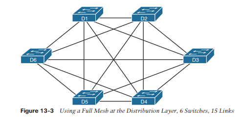
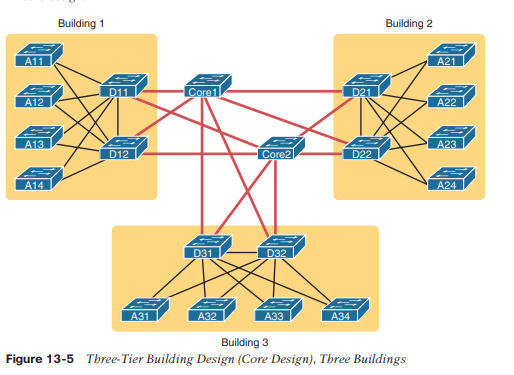

# Arquitectura LAN

Este capítulo cubre los siguientes temas del examen:

- Fundamentos de la red
  - Describir las características de las arquitecturas de topología de red.
	  - 2 niveles
	  - 3 niveles
  - Pequeña oficina/oficina en casa (SOHO)
	  - Comparar interfaz física y tipos de cableado.
	  - Conceptos de PoE

A estas alturas ya ha aprendido mucho sobre Ethernet y conmutadores Ethernet. Ha aprendido cómo funcionan los enlaces individuales, con cableado y configuraciones dúplex, así como marcos. Usted sabe cómo funcionan las direcciones y cómo los conmutadores reenvían tramas en función de esas direcciones. Ha visto cómo los conmutadores se ocupan de la redundancia, utilizando STP/RSTP y recopilando enlaces en EtherChannels. Y aquí, en el Volumen 2, ha aprendido acerca de una variedad de funciones de seguridad disponibles para conmutadores, incluidas la inspección dinámica de ARP, la inspección de DHCP y la inspección de ARP.

Lo que las discusiones anteriores sobre características individuales no hacen en gran medida es discutir la arquitectura y el diseño. Ahora ya sabe cómo funcionan los conmutadores, pero ¿por qué conectaría conmutadores en una topología y no en otra? Si pudiera conectar conmutadores en dos topologías diferentes, ¿por qué preferiría uno sobre el otro? Este capítulo examina algunas de estas preguntas de diseño, específicamente las áreas temáticas mencionadas en los temas del examen CCNA 200-301. (Tenga en cuenta que el examen CCNA 200-301 no incluye una visión integral de los problemas de diseño de LAN, pero uno de los exámenes CCNP Enterprise actuales sí lo incluye).

Este capítulo cubre tres temas específicos que tienen consideraciones relacionadas con el diseño. La primera sección analiza la topología de una LAN Ethernet cableada y los términos de diseño _dos niveles_ y _tres niveles_, que describen cuántas capas de conmutador existen entre los puntos finales y los dispositivos que salen del campus a algún otro sitio. A continuación, la segunda sección examina las LAN para pequeñas oficinas/oficinas domésticas (SOHO) y en qué se diferencian de las LAN empresariales. La sección final presenta los conceptos detrás de Power over Ethernet (PoE), junto con las razones por las cuales las actividades de diseño de LAN deben considerar PoE.
### Análisis de topologías LAN del campus
El término _campus LAN_ se refiere a la LAN creada para soportar los dispositivos en un edificio o en varios edificios algo cercanos entre sí. Por ejemplo, una empresa podría alquilar espacio para oficinas en varios edificios del mismo parque de oficinas. Luego, los ingenieros de redes pueden construir una LAN de campus que incluya conmutadores en cada edificio, además de enlaces Ethernet entre los conmutadores de los edificios, para crear una LAN de campus más grande.

Al planificar y diseñar una LAN de campus, los ingenieros deben considerar los tipos de Ethernet disponibles y las longitudes de cableado admitidas por cada tipo. Los ingenieros también deben elegir las velocidades requeridas para cada segmento de Ethernet. Además, es necesario reflexionar sobre la idea de que algunos conmutadores deberían usarse para conectarse directamente a los dispositivos del usuario final, mientras que otros conmutadores podrían necesitar simplemente conectarse a una gran cantidad de estos conmutadores del usuario final. Finalmente, la mayoría de los proyectos requieren que el ingeniero considere el tipo de equipo que ya está instalado y si un aumento en la velocidad en algunos segmentos vale el costo de comprar equipo nuevo.

Esta primera de las tres secciones principales del capítulo analiza la topología del diseño de una LAN de campus. Los diseñadores de redes no se limitan a conectar dispositivos a cualquier puerto y conectar conmutadores entre sí de forma arbitraria, como se haría con algunos dispositivos en la misma mesa en un laboratorio. En cambio, existen mejores formas de diseñar la topología de una LAN de campus, y esta sección presenta algunos de los puntos y términos clave.
### Diseño de campus de dos niveles (núcleo colapsado)
Para examinar todos los requisitos de una LAN de campus y luego tener una conversación razonable al respecto con sus pares, la mayoría de los diseños de LAN orientados a Cisco utilizan alguna terminología común para referirse al diseño. Para los propósitos de este libro, usted debe conocer algunas de las terminologías claves de diseño de LAN en campus.
### El diseño del campus de dos niveles
La Figura 13-1 muestra un diseño típico de una LAN de campus grande, con la terminología incluida en la figura. Esta LAN tiene alrededor de 1000 PC conectadas a conmutadores que admiten alrededor de 25 puertos cada uno. Las explicaciones de la terminología siguen a la figura.

Cisco utiliza tres términos para describir la función de cada conmutador en el diseño de un campus: _acceso_, _distribución_ y _núcleo_. Las funciones difieren según si el conmutador reenvía el tráfico desde los dispositivos del usuario y el resto de la LAN (acceso), o si el conmutador reenvía el tráfico entre otros conmutadores de la LAN (distribución y núcleo).

Los _interruptores de acceso_  se conectan directamente a los usuarios finales, proporcionando acceso del dispositivo del usuario a la LAN. Los conmutadores de acceso normalmente envían tráfico hacia y desde los dispositivos del usuario final a los que están conectados y se ubican en el borde de la LAN.

Los _conmutadores de distribución_  proporcionan una ruta a través de la cual los conmutadores de acceso pueden reenviar tráfico entre sí. Por diseño, cada uno de los conmutadores de acceso se conecta a al menos un conmutador de distribución, normalmente a dos conmutadores de distribución para redundancia. Los conmutadores de distribución brindan el servicio de reenviar tráfico a otras partes de la LAN. Tenga en cuenta que la mayoría de los diseños utilizan al menos dos enlaces ascendentes a dos conmutadores de distribución diferentes (como se muestra en la Figura 13-1) para lograr redundancia.

La figura muestra un diseño de dos niveles, siendo los niveles el nivel (o capa) de acceso y el nivel (o capa) de distribución. Un diseño de dos niveles resuelve dos necesidades de diseño principales:
- Proporciona un lugar para conectar los dispositivos del usuario final (la capa de acceso, con conmutadores de acceso)
- Conecta los conmutadores con una cantidad razonable de cables y puertos de conmutador conectando los 40 conmutadores de acceso a dos conmutadores de distribución.
### Terminología de topología vista dentro de un diseño de dos niveles
El mundo de las redes utiliza varios términos comunes sobre la topología y el diseño de LAN y WAN, incluidos los siguientes:

**Estrella:** Un diseño en el que un dispositivo central se conecta a varios otros, de modo que si dibujas los enlaces en todas direcciones, el diseño parecería una estrella con luz brillando en todas direcciones.

**Malla completa:**  Para cualquier conjunto de nodos de red, un diseño que conecta un vínculo entre cada par de nodos.

**Malla parcial:**  Para cualquier conjunto de nodos de red, un diseño que conecta un vínculo entre algunos pares de nodos, pero no todos. En otras palabras, una malla que no es una malla completa.

**Híbrido:** un diseño que combina conceptos de diseño de topología en un diseño más grande (normalmente más complejo).

Armado con esas definiciones formales, tenga en cuenta que el diseño de dos niveles es de hecho un diseño híbrido que utiliza tanto una topología en estrella en la capa de acceso como una malla parcial en la capa de distribución. Para ver por qué, considere la Figura 13-2. Vuelve a dibujar un conmutador de capa de acceso típico, pero en lugar de colocar todas las PC debajo del conmutador, las distribuye alrededor del conmutador. Luego, a la derecha, una versión similar del mismo dibujo muestra por qué podría usarse el término estrella: la topología se parece un poco al dibujo de una estrella hecho por un niño.

La capa de distribución crea una malla parcial. Si ve los conmutadores de acceso y distribución como nodos en un diseño, algunos nodos tienen un vínculo entre ellos y otros no. Simplemente consulte la Figura 13-1 y observe que, por diseño, ninguno de los conmutadores de la capa de acceso se conecta entre sí.

Finalmente, un diseño podría utilizar una malla completa. Sin embargo, por una variedad de razones que van más allá del alcance de la discusión de diseño aquí, el diseño de un campus generalmente no necesita utilizar la cantidad de enlaces y puertos requeridos por un diseño de malla completa. Sin embargo, solo para aclarar el punto, primero considere cuántos enlaces y puertos de conmutador se necesitarían para un único enlace entre nodos en una malla completa, con seis nodos, como se muestra en la Figura 13-3.

### Diseño de campus de tres niveles (núcleo)
El diseño de dos niveles de la Figura 13-1, con una malla parcial de enlaces en la capa de distribución, resulta ser el diseño de LAN de campus más común. También recibe dos nombres comunes: diseño de dos niveles (por razones obvias) y núcleo colapsado (por razones menos obvias). El término _núcleo colapsado_ se refiere al hecho de que el diseño de dos niveles no tiene un tercer nivel, el nivel central. El siguiente tema examina un diseño de tres niveles que tiene un núcleo, para ponerlo en perspectiva.

Imagine que su campus tiene sólo dos o tres edificios. Cada edificio tiene un diseño de dos niveles dentro del edificio, con un par de interruptores de distribución en cada edificio e interruptores de acceso distribuidos por el edificio según sea necesario. ¿Cómo conectarías las LAN en cada edificio? Bueno, con sólo unos pocos edificios, tiene sentido simplemente cablear los interruptores de distribución entre sí, como se muestra en la Figura 13-4.

El diseño de la Figura 13-4 funciona bien y muchas empresas lo utilizan. A veces el centro de la red utiliza una malla completa, a veces una malla parcial, dependiendo de la disponibilidad de cables entre los edificios.

Sin embargo, un diseño con un tercer nivel (un nivel central) ahorra en puertos de switch y cables en diseños más grandes. Y tenga en cuenta que con los enlaces entre edificios, los cables van al exterior, suelen ser más costosos de instalar y casi siempre son cableados de fibra con puertos de conmutador más caros, por lo que conservar la cantidad de cables utilizados entre edificios puede ayudar a reducir los costos.

Un diseño de núcleo de tres niveles, como era de esperar en este punto, agrega algunos conmutadores más (conmutadores centrales), que proporcionan una función: conectar los conmutadores de distribución. La Figura 13-5 muestra la migración del núcleo colapsado de la Figura 13-4 (es decir, un diseño sin núcleo) a un diseño de núcleo de tres niveles.

Al utilizar un diseño central, con una malla parcial de enlaces en el núcleo, aún se proporciona conectividad a todas las partes de la LAN y a los enrutadores que envían paquetes a través de la WAN, solo que con menos enlaces entre edificios.

La siguiente lista resume los términos que describen las funciones de los conmutadores de campus:
- **Acceso:** Proporciona un punto de conexión (acceso) para los dispositivos del usuario final. No reenvía tramas entre otros dos conmutadores de acceso en circunstancias normales.
- **Distribución:**  Proporciona un punto de agregación para conmutadores de acceso, proporcionando conectividad al resto de dispositivos en la LAN, reenviando tramas entre conmutadores, pero sin conectarse directamente a los dispositivos del usuario final.
- **Núcleo:** Agrega conmutadores de distribución en LAN de campus muy grandes, lo que proporciona tasas de reenvío muy altas para el mayor volumen de tráfico debido al tamaño de la red.
### Terminología de diseño de topología
Para cerrar la discusión sobre la topología de LAN empresarial, el siguiente tema aplica algunos de los términos genéricos de topología a un diseño típico de dos niveles.

Considere la figura 13-6, que muestra algunos de los términos. Primero, a la izquierda, los dibujos suelen mostrar interruptores de acceso con una serie de cables paralelos entre sí. Sin embargo, las combinaciones de un conmutador de acceso y sus enlaces de acceso a menudo se denominan _topología en estrella_   . ¿Por qué? Mire el interruptor de acceso rediseñado en el centro de la figura, con los cables irradiando desde el centro. No parece una estrella real, pero se parece un poco al dibujo de una estrella hecho por un niño, de ahí el término _topología estelar_.

El lado derecho de la figura repite un diseño típico de dos niveles, centrándose en la malla de enlaces entre los conmutadores de acceso y distribución. Cualquier grupo de nodos que se conectan con más enlaces que una topología en estrella normalmente se denomina _malla_. En este caso, la malla es una _malla parcial_, porque no todos los nodos tienen un vínculo directo entre sí. Un diseño que conecte todos los nodos con un enlace sería una  _malla completa_.

Las redes reales hacen uso de estas ideas de topología, pero a menudo una red combina las ideas. Por ejemplo, el lado derecho de la Figura 13-6 combina la topología en estrella de la capa de acceso con la malla parcial de la capa de distribución. Quizás escuches estos diseños que combinan conceptos llamados _diseño híbrido_.
### Oficina pequeña/oficina en casa
Ahora que sabe más sobre las opciones de diseño y los términos para una LAN empresarial, la siguiente sección examina un tipo particular de LAN más pequeña: la LAN para pequeñas oficinas/oficinas en el hogar (SOHO). SOHO se refiere a diseños e implementaciones que tienen un volumen tan pequeño de requisitos (pocos puertos de switch, pocos AP, pocos enrutadores y enlaces WAN) que el diseño difiere significativamente. El término en sí hace referencia a los dos casos más habituales: un usuario que trabaja desde casa o una pequeña oficina con un número reducido de trabajadores y dispositivos. El próximo tema breve señala algunos de los aspectos más destacados que diferencian una red SOHO de una red empresarial.

En primer lugar, a modo de recordatorio, el IEEE define tanto las LAN Ethernet como las LAN inalámbricas (WLAN). En caso de que aún no fuera obvio, todos los estándares de Ethernet utilizan cables; es decir, Ethernet define las LAN cableadas. El grupo de trabajo IEEE 802.11 define las LAN inalámbricas, también llamadas Wi-Fi según un término registrado de Wi-Fi Alliance [(www.wi-fi.org)](http://www.wi-fi.org/), un consorcio que ayuda a fomentar el desarrollo de LAN inalámbrica en el mercado.

La mayoría de ustedes ha usado Wi-Fi y es posible que lo use a diario. Es posible que algunos de ustedes lo hayan configurado en casa, con una configuración básica como se muestra en la Figura 13-7. En casa, probablemente utilizabas un único dispositivo de consumo llamado  _enrutador inalámbrico_. Un lado del dispositivo se conecta a Internet, mientras que el otro lado se conecta a los dispositivos del hogar. En el hogar, los dispositivos se pueden conectar mediante Wi-Fi o mediante un cable Ethernet.

Si bien la figura muestra el hardware como un ícono de enrutador único, internamente, ese enrutador inalámbrico actúa como dispositivos separados que encontraría en un campus empresarial:

- Un conmutador Ethernet, para las conexiones Ethernet por cable.
- Un punto de acceso inalámbrico (AP), para comunicarse con los dispositivos inalámbricos y reenviar las tramas hacia/desde la red cableada
- Un enrutador, para enrutar paquetes IP hacia/desde las interfaces LAN y WAN (Internet)
- Un firewall, que a menudo por defecto permite que sólo los clientes se conecten a servidores en Internet, pero no al revés.

La figura 13-8 repite la figura anterior, desglosando los componentes internos como si fueran dispositivos físicos separados, solo para dejar claro que un único enrutador inalámbrico de consumo actúa como varios dispositivos diferentes.
### SOHO

 
En una LAN inalámbrica SOHO, el AP inalámbrico actúa de forma autónoma, en lugar de con un WLC, y realiza todo el trabajo necesario para crear y controlar la WLAN. Es decir, el AP autónomo se comunica con los distintos dispositivos inalámbricos mediante protocolos 802.11 y ondas de radio. Utiliza protocolos Ethernet en el lado cableado. Convierte las diferencias en los formatos de encabezado entre tramas 802.11 y 802.3 antes de reenviarlas hacia/desde Ethernet 802.3 y tramas inalámbricas 802.11. Pero no encapsula tramas en CAPWAP, porque el AP no enviará las tramas a un WLC.

Para la conexión a Internet, el dispositivo enrutador (combo) se conecta con cualquier tecnología de acceso a Internet disponible, incluida Internet por cable, DSL, conexión inalámbrica 4G/5G o fibra Ethernet. Tenga en cuenta que el Capítulo 14, “Arquitectura WAN”, presenta esas tecnologías.
### Alimentación a través de Ethernet (PoE)
Simplemente camine por cualquier edificio y verá enchufes eléctricos por todas partes. Al terminar el interior de un edificio, los electricistas tienden cables eléctricos e instalan enchufes eléctricos en todos y cada uno de los lugares que puedan necesitar energía. También colocan cables de alimentación para que dispositivos como dispositivos de iluminación también puedan conectarse a la corriente. Y cuando los ingenieros de redes pensaron en la energía eléctrica, pensaron en términos de asegurarse de que los electricistas hubieran llevado suficiente energía a los armarios de cableado y otras ubicaciones para alimentar los dispositivos de red.

Power over Ethernet (PoE) cambia esa forma de pensar, de modo que la responsabilidad de proporcionar energía eléctrica a algunos dispositivos puede recaer en el equipo de ingeniería de redes. Algunas clases de tipos de dispositivos se han creado para poder recibir alimentación a través del cable Ethernet, en lugar de utilizar un cable de alimentación independiente. Para que eso funcione, el conmutador LAN conectado al cable debe suministrar esa energía a través del cable. Al utilizar PoE, las empresas pueden obtener varias ventajas, incluida la reducción de costos al requerir menos tendidos de cable y mejores capacidades de administración de energía en comparación con el uso de un tendido de cable de alimentación eléctrica y una toma de corriente tradicionales. Esta sección final del capítulo examina PoE.
### PoE Basics
La familia de estándares que suministran energía recibe el nombre general de _Power over Ethernet_ (PoE). Con PoE, algún dispositivo, normalmente un conmutador LAN, actúa como fuente de alimentación.

Equipo (PSE): es decir, el dispositivo que suministra alimentación de CC a través del cable Ethernet UTP (como se muestra en la Figura 13-9). Un dispositivo que tiene la capacidad de recibir alimentación a través del cable Ethernet, en lugar de algún otro conector de alimentación del dispositivo, se denomina dispositivo alimentado (PD).

PoE tiene una gran ventaja para dispositivos instalados en ubicaciones que a menudo no tienen un cable de alimentación o una salida de alimentación preinstalados. Por ejemplo, el diseño inalámbrico coloca los puntos de acceso en una amplia gama a lo largo del techo de un piso (o piso) de un edificio. Además, las cámaras de vídeo IP pueden colocarse en las esquinas del techo, en el interior o en varios lugares exteriores. En lugar de instalar nuevos cables de alimentación y de red para soportar cada dispositivo, un solo tendido de cable Ethernet puede suministrar energía al dispositivo y al mismo tiempo permitir comunicaciones Ethernet normales a través del mismo cable y los mismos pares de cables.

PoE también ayuda de maneras prácticas menos obvias porque suministra energía CC a través del cable Ethernet, por lo que el dispositivo no necesita un convertidor CA/CC. Por ejemplo, dispositivos como computadoras portátiles y teléfonos IP utilizan un cable de alimentación que incluye un bloque de alimentación (un convertidor de CA a CC) que convierte la energía de CA de la toma de corriente en la energía de CC que necesita el dispositivo. PoE suministra corriente CC a través del cable Ethernet. Entonces, para un teléfono IP, por ejemplo, no más cables de alimentación ni bloques de alimentación que abarrotan el escritorio o ocupan una toma de corriente.
### Operación PoE
PoE debe tener un medio para evitar dañar los dispositivos al final del circuito. Todos los dispositivos eléctricos pueden resultar dañados al recibir demasiada corriente en el dispositivo, razón por la cual los electricistas instalan disyuntores y utilizamos protectores contra sobretensiones. Aplicar energía a través de un cable Ethernet podría tener el mismo efecto, dañando el dispositivo en el otro extremo, si el dispositivo no es compatible con PoE. Por lo tanto, PoE debe tener (y tiene) procesos implementados para determinar si se necesita PoE y cuánta energía, antes de aplicar cualquier nivel de energía potencialmente dañino al circuito.

PoE, estandarizado por IEEE, amplía los mismos mecanismos de negociación automática de IEEE. De hecho, los mecanismos deben funcionar antes de que el PD se haya iniciado, porque el PD necesita energía antes de poder iniciarse e inicializarse. Al utilizar estos mensajes de negociación automática IEEE y observar los niveles de señal de retorno, PoE puede determinar si el dispositivo en el extremo del cable requiere energía (es decir, es un PD) y cuánta energía suministrar. Esta lista detalla los pasos principales:

| **Step 1.** | Do not supply power on a PoE-capable port unless negotiation identifies that the device needs power.                                                                                            |
| ----------- | ----------------------------------------------------------------------------------------------------------------------------------------------------------------------------------------------- |
| **Step 2.** | Use Ethernet autonegotiation techniques, sending low power signals and monitoring the return signal, to determine the PoE power class, which determines how much power to supply to the device. |
| **Step 3.** | If the device is identified as a PD, supply the power per the power class, which allows the device to boot.                                                                                     |
| **Step 4.** | Monitor for changes to the power class, both with autonegotiation and listening for CDP and LLDP messages from the PD.                                                                          |
| **Step 5.** | If a new power class is identified, adjust the power level per that class.                                                                                                                      |

Como resultado de los procesos de negociación, los PD indican cuántos vatios de potencia les gustaría recibir del PSE. Dependiendo del estándar PoE específico, el PSE suministrará la energía, ya sea a través de dos o cuatro pares, como se indica en la Tabla 13-2.

| **Name**           | **Standard** | **Watts at PSE** | **Powered Wire Pairs** |
| ------------------ | ------------ | ---------------- | ---------------------- |
| Cisco Inline Power | Cisco        | 7                | 2                      |
| PoE                | 802.3af      | 15               | 2                      |
| PoE+               | 802.3at      | 30               | 2                      |
| UPoE               | 802.3bt      | 60               | 4                      |
| UpoE+              | 802.3bt      | 100              | 4                      |

Cisco ha estado desarrollando productos para utilizar alguna forma de PoE desde aproximadamente el año 2000. Cisco a menudo ha desarrollado capacidades de energía preestándar, como su característica Cisco Inline Power (ILP) original. Con el tiempo, el IEEE ha producido estándares similares a las funciones de potencia de Cisco, y Cisco admite la versión estándar una vez completada. Sin embargo, en su mayor parte, la literatura de Cisco hace referencia a los nombres más comunes en la primera columna de la tabla.
### Diseño PoE y LAN
La mayoría de las funciones del conmutador LAN analizadas en este libro (y en la _CCNA 200-301 Official Cert Guide, Volumen 1_) existen como funciones de software. Una vez que conozca una función del software, en algunos casos todo lo que tiene que hacer es configurar la función y comenzar a usarla. (En algunos casos, es posible que primero deba investigar y obtener la licencia de la función). De todos modos, agregar la función requiere poca o ninguna planificación previa.

PoE requiere cierto esfuerzo de planificación e ingeniería al diseñar una LAN, tanto al planificar la planta de cables (tanto Ethernet como eléctrica) como al planificar el nuevo hardware de red. La planificación teniendo en cuenta PoE prepara la red para suministrar energía a los dispositivos de red, en lugar de reaccionar y perder oportunidades para ahorrar dinero y tiempo.

La siguiente lista incluye algunos de los puntos clave a considerar al planificar un diseño de LAN que incluya PoE:
- **Dispositivos con alimentación:** Determine los tipos de dispositivos y modelos específicos, junto con sus requisitos de energía.
- **Requisitos de energía:** Planifique la cantidad de diferentes tipos de PD que se conectarán a cada armario de cableado para generar un presupuesto de energía. Luego, ese presupuesto de energía se puede procesar para determinar la cantidad de energía PoE que estará disponible a través de cada conmutador.
- **Puertos del conmutador:** Algunos conmutadores admiten estándares PoE en todos los puertos, algunos en ningún puerto y otros en un subconjunto de puertos. Investigue los distintos modelos de conmutadores para comprar suficientes puertos con capacidad PoE para los conmutadores planificados para cada armario de cableado.
- **Fuentes de alimentación del conmutador:** Sin PoE, al comprar un conmutador, usted elige una fuente de alimentación que proporcione suficiente energía para alimentar el conmutador. Con PoE, el conmutador actúa como distribuidor de energía eléctrica, por lo que la fuente de alimentación del conmutador debe entregar muchos más vatios de los que necesita para hacer funcionar el conmutador. Deberá crear un presupuesto de energía por conmutador, según la cantidad de PD conectados, y comprar fuentes de alimentación que cumplan con esos requisitos.
- **Estándares PoE versus reales:** Considere la cantidad de puertos de conmutador PoE necesarios, los estándares que admiten, los estándares admitidos por los PD y cuánta energía consumen. Por ejemplo, un puerto PD y un puerto de conmutador pueden admitir PoE+, que admite hasta 30 vatios suministrados por el PSE. Sin embargo, ese dispositivo encendido puede necesitar como máximo 9 vatios para funcionar, por lo que su presupuesto de energía debe reservar menos energía que el máximo para esos dispositivos.