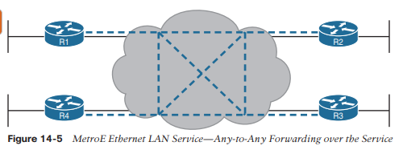

# Arquitectura WAN

Este capítulo cubre los siguientes temas del examen:
- Fundamentos de la red
	  - Describir las características de la arquitectura de topología de red.
		  - WAN
- Fundamentos de seguridad
	  - Describir el acceso remoto y las VPN de sitio a sitio.

Los temas del examen CCNA 200-301 incluyen solo breves menciones de temas WAN. Debido a esa escasa atención a las WAN, la _CCNA 200-301 Official Cert Guide, Volumen 1_, introdujo suficientes detalles sobre dos tipos de enlaces WAN (enlaces WAN Ethernet punto a punto serie y punto a punto) para que usted pueda entender Enrutamiento IP, que es un enfoque importante en CCNA.

Este capítulo centra ahora nuestra atención en los temas de WAN para profundizar en tres ramas de la tecnología WAN. Como es habitual en el análisis de los servicios WAN que se hace en este libro, el servicio se ve principalmente desde la perspectiva de la empresa, como cliente de algún proveedor de servicios WAN (SP). Eso significa que la discusión se centra en lo que la empresa recibe del servicio, en lugar de cómo el proveedor del servicio implementa el servicio dentro de su red. (Tenga en cuenta que la ruta de certificación de Proveedor de servicios de Cisco explora los detalles de cómo un SP implementa su red).

Este capítulo comienza con una discusión sobre Metro Ethernet, una tecnología que define cómo utilizar enlaces Ethernet entre el sitio de un cliente y el SP. Luego, la segunda sección examina las VPN MPLS, a pesar de que históricamente las VPN MPLS fueron anteriores a Metro Ethernet. Este capítulo presenta Metro Ethernet primero porque las muchas similitudes entre el uso de Ethernet en la LAN y el uso de Ethernet en la WAN hacen que este tema sea más fácil de aprender.

El capítulo cierra con una tercera sección sobre cómo utilizar Internet como un servicio WAN privado mediante el uso de tecnología de red privada virtual (VPN). Internet no proporciona inherentemente un servicio privado en el sentido de que cualquier atacante que obtenga una copia de sus paquetes a medida que pasan por Internet pueda leer el contenido. Los servidores VPN protegen los datos enviados a través de Internet, creando efectivamente un servicio WAN privado a través de la Internet pública.
### Metro Ethernet
Metro Ethernet (MetroE) incluye una variedad de servicios WAN con algunas características comunes. Cada servicio MetroE utiliza enlaces físicos Ethernet para conectar el dispositivo del cliente al dispositivo del proveedor de servicios. En segundo lugar, el servicio es un servicio de Capa 2 en el sentido de que el proveedor de WAN reenvía tramas Ethernet de un dispositivo del cliente a otro.

Para comenzar la conversación con una vista básica, Metro Ethernet actúa como si el servicio WAN fuera creado por un conmutador Ethernet, como se muestra en la Figura 14-1. La figura muestra cuatro sitios de la misma empresa, cada uno con un enrutador. Cada enrutador está conectado al servicio WAN con un enlace Ethernet de algún tipo; esos enlaces Ethernet normalmente utilizan uno de los estándares de fibra Ethernet debido a las distancias involucradas. Desde la perspectiva del cliente (es decir, desde la perspectiva de la empresa que es cliente del WAN SP), el servicio WAN actúa como un conmutador LAN en el sentido de que reenvía tramas Ethernet.

Aunque el concepto principal hace que un servicio Metro Ethernet actúe como un gran conmutador LAN, existen muchas opciones y usted debe comprender los conceptos básicos de cada una. Además, muchos clientes se conectan a un servicio Metro Ethernet con enrutadores o conmutadores de Capa 3, lo que genera algunos problemas de Capa 3 con el direccionamiento IP y los protocolos de enrutamiento. Esta sección cierra con una discusión de los problemas de la Capa 3.
### Diseño físico y topología de Metro Ethernet
Desde una perspectiva empresarial, para utilizar un servicio Metro Ethernet, cada sitio debe conectarse al servicio con (al menos) un enlace Ethernet. No es necesario conectar cada enrutador empresarial entre sí directamente con un enlace físico. Por ejemplo, en la Figura 14-1 de la sección anterior, cada uno de los cuatro enrutadores empresariales se conecta al servicio MetroE del SP con un enlace Ethernet físico, en lugar de conectarse directamente a los otros enrutadores empresariales.

Desde la perspectiva del SP, el SP necesita construir una red para crear el servicio Metro Ethernet. Para mantener los costos bajos, el SP coloca un dispositivo (generalmente un conmutador Ethernet) físicamente cerca de tantos sitios de clientes como sea posible, en una instalación del SP llamada _punto de presencia_ (PoP). Esos conmutadores SP deben estar lo suficientemente cerca de muchas ubicaciones de clientes para que algún estándar Ethernet admita la distancia desde el PoP del SP hasta cada sitio de cliente. La figura 14-2 recopila algunos de estos términos e ideas.

Analizando los detalles de la figura, el enlace físico entre el cliente y el SP se denomina _enlace de acceso_ o, cuando se utiliza Ethernet específicamente, _enlace de acceso Ethernet_. Todo lo que sucede en ese enlace cae dentro de la definición de _interfaz de red de usuario_, o UNI. Desglosando el término UNI, la palabra _red_ se refiere a la red del SP, mientras que el cliente del SP (la empresa) se conoce como el _usuario_ de la red.

Centrándonos en el centro de la Figura 14-2, la red del SP permanece oculta en gran medida. El SP promete entregar tramas Ethernet a través de la WAN. Para ello, los enlaces de acceso se conectan a un conmutador Ethernet. Como puede imaginar, el conmutador buscará etiquetas VLAN en los campos de dirección MAC del encabezado Ethernet y en los encabezados troncales 802.1Q, pero los detalles dentro de la red permanecen ocultos.

La UNI hace referencia a una variedad de estándares, incluido el hecho de que se puede utilizar cualquier estándar Ethernet IEEE para el enlace de acceso. La Tabla 14-2 enumera algunos de los estándares que podría esperar que se utilicen como enlaces de acceso Ethernet, dado que admiten distancias más largas que los estándares que utilizan cableado UTP.

| **Name**      | **Speed** | **Distance** |
| ------------- | --------- | ------------ |
| 100BASE-LX10  | 100 Mbps  | 10 Km        |
| 1000BASE-LX   | 1 Gbps    | 5 Km         |
| 1000BASE-LX10 | 1 Gbps    | 10 Km        |
| 1000BASE-ZX   | 1 Gbps    | 100 Km       |
| 10GBASE-LR    | 10 Gbps   | 10 Km        |
| 10GBASE-ER    | 10 Gbps   | 40 Km        |

### Servicios y topologías de WAN Ethernet
Más allá de agregar una conexión Ethernet física desde cada sitio al servicio WAN Metro Ethernet del SP, la empresa debe elegir entre varias variaciones posibles de los servicios MetroE. Esas variaciones utilizan diferentes topologías que satisfacen las diferentes necesidades de los clientes.

MEF [(www.mef.net)](http://www.mef.net/) define los estándares para Metro Ethernet, incluidas las especificaciones para diferentes tipos de servicios MetroE. La Tabla 14-3 enumera tres tipos de servicios descritos en este capítulo y sus topologías. Las siguientes páginas después de la tabla profundizan en cada uno de ellos.

| **MEF Service Name**    | **MEF Short Name** | **Topology Terms**                               | **Description**                                                                                                    |
| ----------------------- | ------------------ | ------------------------------------------------ | ------------------------------------------------------------------------------------------------------------------ |
| Ethernet Line Service   | E-Line             | Point-to-point                                   | Two customer premise equipment (CPE) devices can exchange Ethernet frames, similar in concept to a leased line.    |
| Ethernet LAN Service | E-LAN              | Full mesh                                        | This service acts like a LAN, in that all devices can send frames to all other devices.                            |
| Ethernet Tree Service   | E-Tree             | Hub and spoke; partial mesh; point-to-multipoint | A central site can communicate to a defined set of remote sites, but the remote sites cannot communicate directly. |
### Servicio de línea Ethernet (punto a punto)
El servicio de línea Ethernet, o E-Line, es el más simple de los servicios de Metro Ethernet. El cliente conecta dos sitios con enlaces de acceso. Luego, el servicio MetroE permite que los dos dispositivos del cliente se envíen tramas Ethernet entre sí. La Figura 14-3 muestra un ejemplo, con enrutadores como dispositivos CPE.

Como ocurre con todos los servicios de MetroE, la promesa del servicio es entregar tramas Ethernet a través del servicio, como si los dos enrutadores de los clientes tuvieran un cable cruzado bastante largo conectado entre ellos. De hecho, el servicio E-Line es el mismo servicio WAN Ethernet que ya ha visto en muchos ejemplos a lo largo de este libro. Por ejemplo, en este caso:

- Los enrutadores utilizarían interfaces Ethernet físicas.
- Los enrutadores configurarían direcciones IP en la misma subred entre sí.
- Sus protocolos de enrutamiento se convertirían en vecinos e intercambiarían rutas.

Las especificaciones de MetroE definen el concepto de _Conexión virtual Ethernet_, o EVC, para definir qué dispositivos de usuario (cliente) pueden comunicarse con cuáles. Por definición, un servicio E-Line (como se muestra en la Figura 14-4) crea un EVC punto a punto, lo que significa que el servicio permite que dos puntos finales se comuniquen.

Puede ser que una empresa quiera implementar una red exactamente como se muestra en la Figura 14-3, con dos sitios y dos enrutadores, con conectividad WAN MetroE utilizando un servicio E-Line. Existen otras variaciones, incluso otras variaciones que utilizan una E-Line.

Por ejemplo, piense en una topología WAN empresarial común con un sitio central y 100 sitios remotos. Como se muestra hasta ahora, con un servicio E-Line, el enrutador del sitio central necesitaría 100 interfaces Ethernet físicas para conectarse a esos 100 sitios remotos. Eso podría resultar caro. Como alternativa, la empresa podría utilizar el diseño que se muestra parcialmente en la Figura 14-4 (solo se muestran tres sitios remotos). En este caso:

- El enrutador del sitio central utiliza un único enlace de acceso de 10 Gbps.
- El sitio central se conecta a 100 E-Lines (solo se muestran tres).
- Todas las E-Lines envían y reciben tramas a través del mismo enlace de acceso.

Tenga en cuenta que este capítulo no aborda los detalles de configuración de los servicios WAN.

Sin embargo, diseños como el de la Figura 14-4, con múltiples servicios E-Line en un único enlace de acceso, utilizan enlaces troncales 802.1Q, con una ID de VLAN diferente para cada servicio E-Line. Como resultado, la configuración del enrutador puede utilizar una configuración de enrutador típica con enlaces troncales y subinterfaces.

Antes de pasar al siguiente servicio de MetroE, tenga en cuenta que el cliente podría utilizar conmutadores en lugar de enrutadores para conectarse a la WAN. Históricamente, los ingenieros empresariales colocan los enrutadores en el borde de una WAN, en parte porque ese dispositivo se conectaba tanto a la WAN como a la LAN, y la LAN y la WAN utilizaban diferentes tipos de interfaces físicas y diferentes protocolos de enlace de datos. Como resultado de cómo funciona el enrutamiento, los enrutadores sirvieron como el dispositivo perfecto para ubicarse en el borde entre LAN y WAN (llamado borde WAN). Con MetroE, tanto la LAN como la WAN son Ethernet, por lo que un conmutador Ethernet se convierte en una opción.
### Ethernet LAN Service (Full Mesh)
Imagine que una empresa necesita conectar varios sitios a una WAN y el objetivo es permitir que cada sitio envíe tramas directamente a todos los demás sitios. Podrías hacer eso con E-Lines, pero posiblemente necesitarías muchas E-Lines. Por ejemplo, para conectar tres sitios con E-Lines para que cada sitio pueda enviarse tramas directamente entre sí, solo necesita tres E-Lines. Pero con cuatro, cinco y seis sitios, necesitaría 6, 10 y 15 E-Lines, respectivamente. Obtenga hasta 20 sitios para los cuales todos puedan enviarse marcos directamente entre sí, y necesitaría 190 E-Lines. (La fórmula es N(N – 1) / 2.)

Las personas que crearon MetroE anticiparon la necesidad de diseños que permitieran una malla completa, es decir, que cada par de nodos del servicio se enviaran tramas entre sí directamente. De hecho, permitir que todos los dispositivos envíen directamente a todos los demás dispositivos se parece mucho a una LAN Ethernet, por lo que el servicio MetroE se llama _servicio LAN Ethernet_ o E-LAN.

Un servicio E-LAN ​​permite que todos los dispositivos conectados a ese servicio envíen tramas Ethernet directamente a todos los demás dispositivos, como si el servicio Ethernet WAN fuera un gran conmutador Ethernet. La Figura 14-5 muestra una representación de un único E-LAN ​​EVC. En este caso, un EVC se conecta a cuatro sitios de clientes, creando una E-LAN. Los enrutadores R1, R2, R3 y R4 pueden enviarse tramas directamente entre sí. También estarían todos en la misma subred de Capa 3 en la WAN.

Un servicio E-LAN ​​conecta los sitios en una red completa. El término _full mesh_ se refiere a un diseño que, para un conjunto de dispositivos, crea una ruta de comunicación directa para cada par. Por el contrario, una malla parcial se refiere a un diseño en el que sólo algunos de los pares pueden comunicarse directamente. El servicio Ethernet Tree (E-Tree), como se analiza en el siguiente tema, crea un diseño de malla parcial.

### Ethernet Tree Service (Hub and Spoke)
El servicio de árbol Ethernet (E-Tree) crea una topología WAN en la que el dispositivo del sitio central puede enviar tramas Ethernet directamente a cada sitio remoto (hoja), pero los sitios remotos (hoja) solo pueden enviar al sitio central. La Figura 14-6 muestra la topología, nuevamente con un solo EVC. En este caso, el enrutador R1 es el sitio raíz y puede realizar envíos a los tres sitios remotos. Los enrutadores R2, R3 y R4 solo pueden enviar a R1.

Con un E-Tree, el sitio central sirve como raíz de un árbol y cada sitio remoto como una de las hojas. La topología recibe muchos nombres: malla parcial, centro y radio y punto a multipunto. Independientemente del término que utilice, un servicio E-Tree crea un servicio que funciona bien para diseños con un sitio central además de muchos sitios remotos.
### Diseño de capa 3 con Metro Etherner
Ahora que conoce los conceptos básicos de los servicios E-Line (punto a punto), E-LAN ​​​​(malla completa) y E-Tree (punto a multipunto, concentrador y radio), el siguiente tema revisa algunas capas. 3 detalles de diseño al utilizar los servicios E-Line y E-Tree. Es decir, si la empresa utiliza enrutadores o conmutadores de capa 3 como dispositivos de borde WAN, ¿cómo debería planificar el ingeniero las direcciones IP y las subredes? ¿Cuál es el impacto en los protocolos de enrutamiento? Esta sección responde a esas preguntas.

Tenga en cuenta que esta sección utiliza enrutadores como dispositivos empresariales, pero los conceptos también se aplican a los conmutadores de Capa 3.
### Diseño de capa 3 con servicio E-Line
Cada E-Line utiliza una topología punto a punto. Como resultado, los dos enrutadores en los extremos de una E-Line deben estar en la misma subred. De manera similar, cuando una empresa utiliza varias E-Lines, cada una debe estar en una subred diferente. Como ejemplo, considere la Figura 14-7, que muestra dos E-Lines, las cuales se conectan al enrutador R1 a la izquierda.

Centrándose en las E-Lines e ignorando los enlaces de acceso en su mayor parte, piense en cada E-Line como una subred. Cada enrutador necesita una dirección IP en cada subred y las subredes deben ser únicas. Todas las direcciones provienen del espacio de direcciones IP de la empresa. La Figura 14-8 muestra un ejemplo de las direcciones, subredes y tres rutas aprendidas por OSPF en la tabla de enrutamiento de R3.

Examine la tabla de enrutamiento IP en la parte inferior derecha de la figura, centrándose primero en la ruta a la subred 10.1.1.0/24, que es la subred LAN del enrutador R1. La ruta de R3 apunta a una dirección IP del enrutador de siguiente salto que es la dirección IP de R1 en la WAN Ethernet, específicamente la dirección al otro lado de la E-Line que conecta R1 y R3. Esta ruta no debería ser una sorpresa: para que R3 envíe paquetes a una subred conectada a R1, R3 envía los paquetes a R1. Además, utiliza una subinterfaz (G0/1.13), lo que significa que el diseño utiliza troncalización 802.1Q en el enlace.

A continuación, observe la ruta de R3 para la subred 10.1.2.0/24, que respalda el hecho de que R3 no puede enviar paquetes directamente a R2 con el diseño de WAN actual. R3 no tiene una E-Line que le permita enviar tramas directamente a R2. R3 tampoco se convertirá en vecino del protocolo de enrutamiento de R2. Entonces, R3 aprenderá su ruta para la subred 10.1.2.0/24 desde R1, con la dirección 10.1.13.1 de R1 como la dirección del siguiente salto. Como resultado, al reenviar paquetes, R3 reenviará paquetes a R1, quien luego los reenviará a través de la otra línea electrónica a R2.
### Diseño de capa 3 con servicio E-LAN
Si conectara cuatro enrutadores a un conmutador LAN, todos en la misma VLAN, ¿qué esperaría de las direcciones IP en esos enrutadores? Y si los cuatro enrutadores usaran el mismo protocolo de enrutamiento, ¿cuáles se convertirían en vecinos? Normalmente, con cuatro enrutadores conectados al mismo conmutador, en la misma VLAN y utilizando el mismo protocolo de enrutamiento, normalmente los cuatro enrutadores tendrían direcciones IP en la misma subred y todos se convertirían en vecinos.

En un servicio E-LAN, se utiliza el mismo diseño de direccionamiento IP, con los mismos tipos de relaciones de protocolo de enrutamiento entre vecinos. La Figura 14-9 muestra un ejemplo que incluye subredes y direcciones, además de una ruta como ejemplo. Tenga en cuenta que los cuatro enrutadores conectados al servicio E-LAN ​​en el centro tienen direcciones en la subred 10.1.99.0/24.

Mire la tabla de enrutamiento de R3 en la figura, la ruta desde R3 a la subred LAN de R2 (10.1.2.0/24). En este caso, la dirección del siguiente salto de R3 es la dirección WAN en R2 (10.1.99.2) y R3 enviará paquetes (encapsulados en tramas Ethernet) directamente a R2. Tenga en cuenta también que las otras dos rutas en la tabla de enrutamiento enumeran las direcciones del siguiente salto de R1 (10.1.99.1) y R4 (10.1.99.4).
### Conmutación de etiquetas multiprotocolo (MPLS)
Gracias a su preparación CCNA hasta ahora, ya comprende mucho sobre el enrutamiento de Capa 3, como lo representa el paquete que fluye de izquierda a derecha en la Figura 14-10. Cada enrutador toma una decisión de reenvío por separado para reenviar el paquete, como se muestra en los pasos 1, 2 y 3 de la figura. Cada enrutador hace una comparación entre la dirección IP de destino del paquete y la tabla de enrutamiento IP de ese enrutador; la entrada correspondiente de la tabla de enrutamiento IP le indica al enrutador dónde reenviar el paquete a continuación. Para conocer esas rutas, los enrutadores suelen ejecutar algún protocolo de enrutamiento.

MPLS crea un servicio WAN que enruta paquetes IP entre los sitios de los clientes. La empresa implementa enrutadores y conmutadores como de costumbre. Luego, el SP crea su propia red IP, que abarca una gran área geográfica. Luego, el cliente puede conectarse a la red MPLS, con un enlace desde cada sitio, y el SP enruta los paquetes IP de un sitio del cliente al otro. Por ejemplo, en la Figura 14-10, los cuatro enrutadores del medio podrían representar la red MPLS del SP, y los enrutadores numerados en los bordes serían enrutadores propiedad de una empresa.

Sin embargo, un SP no puede simplemente construir una gran red IP y conectar a todos sus clientes a esa misma red IP debido a algunos problemas que surgen al brindar soporte a varios clientes al mismo tiempo. Por ejemplo, muchos clientes utilizarán la misma red IP privada (por ejemplo, la red 10.0.0.0), por lo que la red IP del SP aprenderá una gran cantidad de rutas hacia subredes superpuestas.

Para superar este y otros problemas, el SP construye su red IP para utilizar también la conmutación de etiquetas multiprotocolo (MPLS), en particular MPLS VPN. Las VPN MPLS permiten al SP construir una gran red MPLS, que también crea una WAN privada basada en IP para cada uno de sus clientes. Con las VPN MPLS, el SP puede separar las rutas aprendidas de un cliente de las rutas aprendidas para el siguiente cliente; en consecuencia, el SP puede brindar soporte a cada cliente y al mismo tiempo evitar que los paquetes se filtren de un cliente al siguiente.

Para darle una idea de por qué MPLS no es solo una red IP con enrutadores, internamente, los dispositivos en una red MPLS usan conmutación de etiquetas, de ahí el nombre MPLS. Los enrutadores en el borde de la red MPLS agregan y eliminan un encabezado MPLS a los paquetes cuando entran y salen de la red MPLS. Los dispositivos dentro de la red MPLS utilizan el campo de etiqueta dentro de ese encabezado MPLS al reenviar datos a través de la red MPLS. Las opciones de etiquetas a usar, junto con otra lógica relacionada, permiten que MPLS VPN cree VPN separadas para mantener separado el tráfico de diferentes clientes.

Como es habitual, el análisis de los servicios WAN en este libro ignora la mayor cantidad posible de la red del SP. Por ejemplo, no es necesario saber cómo funcionan las etiquetas MPLS. Sin embargo, debido a que las VPN MPLS crean un servicio de Capa 3, el cliente debe ser más consciente de lo que hace el SP que con otros servidores WAN, por lo que necesita conocer algunos datos sobre cómo una red MPLS aborda algunas funciones de Capa 3. En particular, la red VPN MPLS del SP

- Utilizará un protocolo de enrutamiento para construir relaciones vecinas de protocolo de enrutamiento con los enrutadores de los clientes.
- Aprenderá las subredes/rutas de los clientes con esos protocolos de enrutamiento.
- Anunciará las rutas de un cliente con un protocolo de enrutamiento para que todos los enrutadores que el cliente conecte a la VPN MPLS puedan aprender todas las rutas anunciadas a través de la red VPN MPLS.
- Tomará decisiones sobre el reenvío de VPN MPLS, incluidas las etiquetas MPLS que se agregarán y eliminarán, según el espacio de direcciones IP del cliente y las rutas IP del cliente.

Además, las VPN MPLS crean una red privada manteniendo separados los datos de los clientes, pero no cifrándolos. Algunos servicios VPN cifran los datos, esperando que los atacantes puedan recibir copias de los paquetes. Con MPLS, aunque los paquetes de dos clientes pueden pasar a través de los mismos dispositivos y enlaces dentro de la red MPLS, la lógica MPLS puede mantener los paquetes separados para cada cliente.

Esta segunda de las dos secciones principales del capítulo analiza los conceptos básicos de MPLS, específicamente las VPN MPLS. Esta sección analiza primero el diseño, la topología y la terminología relacionados con la construcción de las partes de una red MPLS orientadas al cliente. Luego analiza el impacto y los problemas creados por el hecho de que la red MPLS proporciona un servicio de Capa 3.
### Diseño físico y topología de MPLS VPN
MetroE proporciona un servicio de Capa 2 reenviando tramas Ethernet de Capa 2. Para ello, el SP suele utilizar conmutadores Ethernet en el borde de su red. Esos conmutadores están configurados para hacer más de lo que usted aprende sobre los conmutadores LAN Ethernet para CCNA, pero el trabajo más fundamental de un conmutador LAN es reenviar una trama Ethernet, por lo que tiene sentido que MetroE use un conmutador Ethernet en el borde del MetroE del SP. red.

MPLS proporciona un servicio de Capa 3 en el sentido de que promete reenviar paquetes de Capa 3 (IPv4 e IPv6). Para admitir ese servicio, los SP de MPLS suelen utilizar enrutadores en el borde de las redes MPLS porque los enrutadores proporcionan la función de reenviar paquetes de Capa 3.

Como es habitual, cada tecnología WAN tiene su propio conjunto de términos y acrónimos, por lo que la Figura 14-11 muestra dos términos MPLS importantes en contexto: borde del cliente (CE) y borde del proveedor (PE). Debido a que MPLS requiere mucha discusión sobre los dispositivos en el borde de la red del cliente y del SP, MPLS utiliza términos específicos para cada uno. El dispositivo de borde del cliente suele ser un enrutador y se encuentra en el sitio de un cliente, es decir, en un sitio de la empresa que compra el servicio MPLS. Los dispositivos _proveedor edge_ se encuentran en el borde de la red del SP, en el otro extremo del enlace de acceso.

A continuación, para apreciar lo que hace MPLS, piense en cómo los enrutadores utilizan sus diferentes tipos de interfaces físicas y diferentes tipos de protocolos de enlace de datos. Al enrutar un paquete, los enrutadores descartan el encabezado y el final del enlace de datos de una trama de enlace de datos entrante y luego construyen un nuevo encabezado/final del enlace de datos. Esa acción permite que el paquete entrante llegue dentro de una trama de un protocolo de enlace de datos y omita una interfaz con otro protocolo de enlace de datos.

Con MPLS, el hecho de que los dispositivos sean enrutadores, descartando y agregando nuevos encabezados de enlace de datos, significa que las redes MPLS admiten una variedad de enlaces de acceso. El hecho de que MPLS actúe como un servicio de Capa 3, descartando los encabezados de enlace de datos entrantes, significa que, en teoría, cualquier protocolo de enlace de datos podría usarse en enlaces de acceso MPLS. En realidad, MPLS admite muchos tipos de enlaces de acceso, como se muestra en la Figura 14-12.

La variedad de enlaces de acceso disponibles para redes MPLS hace que MPLS sea una excelente opción para construir grandes redes empresariales. Para los sitios que están cerca de los servicios de MetroE, especialmente para los sitios que necesitan al menos 10 Mbps de ancho de banda, usar MetroE como enlace de acceso tiene mucho sentido. Luego, para los sitios que son más remotos, es posible que el operador no ofrezca servicios MetroE a esa área, pero muchos operadores pueden instalar un enlace en serie a sitios remotos. O bien, también se pueden utilizar tecnologías comunes de acceso a Internet, como servicios de cable e inalámbricos 4G/5G, para acceder a una red MPLS.
### MPLS y Calidad de Servicio
MPLS se distingue de otros servicios WAN como el primer servicio WAN para el cual el SP proporcionó características efectivas de Calidad de Servicio (QoS). Debería poder tener una idea general de los beneficios de QoS de MPLS con el siguiente ejemplo básico.

Las redes IP pueden reenviar, y a menudo lo hacen, tráfico de voz en paquetes IP, lo que se denomina Voz sobre IP (VoIP). Si un servicio WAN no proporciona QoS, eso significa que el servicio WAN no trata un paquete de manera diferente a cualquier otro paquete. Con QoS, la red del SP puede tratar los paquetes de manera diferente, dando a algunos paquetes (como VoIP) un mejor tratamiento. Para que una llamada de voz suene bien, cada paquete de voz debe tener una pérdida baja (es decir, se descartan pocos paquetes); bajo retraso unidireccional a través de la red; y baja variación en el retardo (llamada jitter). Sin QoS, una llamada de voz a través de una red IP no sonará bien.

Con una WAN con capacidad QoS, el cliente puede marcar paquetes VoIP para que la red MPLS pueda reconocerlos y tratarlos mejor, lo que resulta en una mejor calidad de las llamadas de voz. Pero para que funcione correctamente, el cliente y el proveedor de MPLS deben cooperar.

Por ejemplo, para los paquetes VoIP que viajan de izquierda a derecha en la Figura 14-13, el enrutador CE1 podría configurarse con herramientas de marcado de QoS. Las herramientas de marcado podrían reconocer paquetes VoIP y colocar un valor específico en el encabezado IP de los paquetes VoIP (un valor llamado DSCP EF, según la figura). Luego, el proveedor de WAN MPLS configuraría sus herramientas de QoS para reaccionar ante los paquetes que tengan esa marca y, por lo general, enviaría ese paquete lo antes posible. El resultado: bajo retraso, baja fluctuación, baja pérdida y una mejor calidad de llamada.

Resumiendo las ideas hasta ahora, MPLS admite una variedad de enlaces de acceso. Una empresa seleccionaría el tipo y la velocidad del enlace de acceso para cada sitio en función de la capacidad (ancho de banda) requerida para cada sitio. Más allá de esa conectividad básica, la empresa querrá trabajar con el SP para definir otras características del servicio. El cliente y el SP deberán analizar los detalles de algunas opciones de diseño de Capa 3. Es probable que el cliente también desee solicitar servicios QoS al proveedor MPLS y definir esos detalles.
### Capa 3 con MPLS VPN
Debido a que MetroE proporciona un servicio de Capa 2, el SP no necesita comprender nada sobre el diseño de Capa 3 del cliente. El SP no sabe nada sobre el plan de direccionamiento IP del cliente y no necesita participar con protocolos de enrutamiento.

Las VPN MPLS adoptan el enfoque completamente opuesto. Como servicio de Capa 3, MPLS debe conocer la dirección IP del cliente. El SP incluso utilizará protocolos de enrutamiento y anunciará las rutas de los clientes a través de la WAN. Esta sección analiza más de cerca lo que eso significa.

Primero, tenga en cuenta los objetivos principales. El cliente paga una buena cantidad de dinero por un servicio WAN para entregar datos entre sitios, con ciertos niveles de disponibilidad y calidad (por ejemplo, bajos retrasos, fluctuaciones y pérdidas para VoIP). Pero para soportar esa función básica de permitir la entrega de paquetes desde cada sitio WAN al otro, los enrutadores CE necesitan intercambiar rutas con los enrutadores PE en la red MPLS. Además, todos los enrutadores CE necesitan aprender rutas de los otros enrutadores CE, un proceso que depende de los enrutadores PE.

Primero, los enrutadores CE y el enrutador PE en los extremos del mismo enlace de acceso deben intercambiar rutas, como se muestra en la Figura 14-14. La figura muestra las relaciones de vecinos del protocolo de enrutamiento CE-PE (como líneas con círculos en los extremos). En este caso, el cliente optó por utilizar OSPF. Sin embargo, MPLS permite muchos protocolos de enrutamiento familiares en el borde de la red MPLS: RIPv2, EIGRP, OSPF e incluso eBGP.

### Routers
Además, todos los enrutadores CE deben aprender rutas de los otros enrutadores CE. Sin embargo, un enrutador CE no forma relaciones de vecino de protocolo de enrutamiento directamente con los otros enrutadores CE, como se indica en la Figura 14-14. Resumiendo lo que sucede y lo que no sucede:

- Un enrutador CE se convierte en vecino del enrutador PE en el otro extremo del enlace de acceso.
- Un enrutador CE no se convierte en vecino de otros enrutadores CE.
- La red MPLS anuncia las rutas del cliente entre los distintos enrutadores PE para que los enrutadores CE puedan conocer todas las rutas del cliente a través de su relación de vecino del protocolo de enrutamiento PE-CE.

Para anunciar las rutas de los clientes entre los enrutadores PE, los enrutadores PE utilizan otro protocolo de enrutamiento junto con un proceso llamado _redistribución de rutas_. La redistribución de rutas ocurre dentro de un enrutador, tomando rutas de un proceso de protocolo de enrutamiento e inyectándolas en otro. MPLS realiza redistribución de rutas en los enrutadores PE entre el protocolo de enrutamiento utilizado por el cliente y una variación de BGP llamada BGP multiprotocolo (MPBGP). (La redistribución es necesaria cuando el protocolo de enrutamiento PE-CE no es BGP). La figura 14-15 muestra la idea.

Como comentario breve sobre MPBGP, las VPN MPLS utilizan MPBGP (a diferencia de otros protocolos de enrutamiento) porque MPBGP puede anunciar rutas de múltiples clientes manteniendo las rutas lógicamente separadas. Por ejemplo, continuando con el ejemplo de la Figura 14-15, el enrutador PE1 podría ubicarse en un PoP pero conectarse a docenas de clientes diferentes. Asimismo, el enrutador PE3 podría conectarse a muchos de esos mismos clientes. MPBGP puede anunciar rutas para todos esos clientes y marcar qué rutas provienen de qué clientes para que solo se anuncien las rutas correctas en cada enrutador CE para diferentes clientes.

Al final del proceso, para todas las empresas individuales, todos los enrutadores pueden aprender rutas a todas las subredes accesibles a través de la WAN MPLS VPN. Las rutas WAN en los enrutadores CE se refieren al enrutador PE vecino como el _enrutador de siguiente salto_. Cada enrutador CE se convierte en un vecino de protocolo de enrutamiento del enrutador PE del SP en el otro extremo del enlace de acceso. Además, MPLS proporciona la flexibilidad de utilizar cualquier tipo de enlace de acceso físico que tenga sentido para la ubicación de cada sitio, sin dejar de conectarse a la misma red MPLS.
### VPN de Internet
Para construir Internet, los proveedores de servicios de Internet (ISP) necesitan enlaces con otros ISP, así como enlaces con los clientes de los ISP. El núcleo de Internet conecta a los ISP entre sí mediante una variedad de tecnologías de alta velocidad. Además, los enlaces de acceso a Internet conectan un ISP con cada cliente, nuevamente con una amplia variedad de tecnologías. La combinación de redes de ISP y redes de clientes que se conectan a los ISP crean la Internet mundial.

Para estos enlaces de acceso de clientes, las tecnologías deben ser económicas para que un consumidor típico pueda permitirse pagar por el servicio. Pero las empresas pueden utilizar muchas de estas mismas tecnologías para conectarse a Internet. Algunas tecnologías WAN funcionan particularmente bien como tecnologías de acceso a Internet. Por ejemplo, varios utilizan la misma línea telefónica instalada en la mayoría de los hogares por la compañía telefónica para que los ISP no tengan que instalar cableado adicional. Algunos utilizan el cableado de TV, mientras que otros utilizan la conexión inalámbrica.

Si bien los consumidores normalmente se conectan a Internet para llegar a destinos en Internet, las empresas también pueden utilizar Internet como un servicio WAN. Primero, la empresa puede conectar cada sitio comercial a Internet. Luego, utilizando la tecnología de red privada virtual (VPN), la empresa puede crear una VPN de Internet. Una VPN de Internet puede mantener la privacidad del paquete de la empresa mediante cifrado y otros medios, incluso mientras se envían los datos a través de Internet.
### Acceso a Internet
Se puede utilizar tecnología WAN privada para acceder a la red de un ISP, incluidas las tecnologías Ethernet WAN y MPLS analizadas anteriormente en este capítulo. La Figura 14-16 muestra algunas de ellas, solo como un recordatorio visual de estas opciones.

Además de los servicios tradicionales que se muestran en la figura, las empresas también pueden utilizar tecnologías de acceso a Internet más utilizadas por los consumidores, incluidas DSL, cable, 4G/5G y fibra Ethernet. El capítulo incluye esta información sobre las tecnologías de acceso a Internet para proporcionar información general útil antes de abordar los temas de VPN de Internet.

### Digital Subscriber Line
En el espacio de acceso a Internet para consumidores, se produjo un gran avance en la velocidad con la introducción de la línea de abonado digital (DSL). Representó un gran avance tecnológico en términos de velocidad bruta en comparación con algunas tecnologías más antiguas, como los módems analógicos. Estas velocidades más rápidas disponibles a través de DSL también cambiaron la forma en que las personas podían usar Internet porque muchas de las aplicaciones comunes de hoy serían inutilizables con las tecnologías de acceso a Internet anteriores (módems analógicos y Red Digital de Servicios Integrados, o RDSI).

Las compañías telefónicas (telcos) influyeron mucho en la creación del DSL. Como tecnología, DSL brindó a las empresas de telecomunicaciones una forma de ofrecer velocidades de acceso a Internet mucho más rápidas. Como oportunidad de negocio, DSL brindó a las empresas de telecomunicaciones una forma de ofrecer un valioso servicio de Internet de alta velocidad a muchos de sus clientes telefónicos existentes, a través de la misma línea telefónica física ya instalada, lo que creó una excelente manera para que las empresas de telecomunicaciones ganaran dinero.

La Figura 14-17 muestra algunos de los detalles de cómo funciona DSL en una línea telefónica residencial. El teléfono puede hacer lo que siempre ha hecho: conectarse a una toma telefónica y enviar señales analógicas. Para los datos, se conecta un módem DSL a una toma telefónica adicional. El módem DSL envía y recibe datos, como señales digitales, en frecuencias más altas, a través del mismo bucle local, incluso al mismo tiempo que una llamada telefónica. (Tenga en cuenta que la instalación física a menudo utiliza filtros de frecuencia que no se muestran en la figura ni se analizan aquí).

Debido a que DSL envía señales analógicas (voz) y digitales (datos) en la misma línea, la empresa de telecomunicaciones tiene que dividir de alguna manera esas señales en el lado de telecomunicaciones de la conexión. Para hacerlo, el bucle local debe estar conectado a un _multiplexor de acceso DSL_ (DSLAM) ubicado en la oficina central de telecomunicaciones (CO) cercana. El DSLAM divide los datos digitales al enrutador en la parte inferior derecha en la Figura 14-17, que completa la conexión a Internet. El DSLAM también divide las señales de voz analógicas en el interruptor de voz en la esquina superior derecha.

### Cable Internet
DSL utiliza el enlace local (línea telefónica) de la empresa de telecomunicaciones local. En cambio, Internet por cable utiliza el cableado de lo que se ha convertido en el principal competidor de la empresa de telecomunicaciones en la mayoría de los mercados: la compañía de cable.

Internet por cable crea un servicio de acceso a Internet que, visto de forma general y no específica, tiene muchas similitudes con DSL. Al igual que DSL, Internet por cable aprovecha al máximo el cableado existente y utiliza el cable de televisión por cable (CATV) existente para enviar datos. Al igual que DSL, Internet por cable utiliza velocidades asimétricas, enviando datos más rápido en sentido descendente que ascendente, lo que funciona bien para la mayoría de las ubicaciones de los consumidores. Y Internet por cable todavía permite el servicio normal por cable (TV por cable), al mismo tiempo que funciona el servicio de acceso a Internet.

Internet por cable también utiliza la misma idea general para el cableado doméstico que DSL, simplemente utilizando cableado CATV en lugar de cableado telefónico. El lado izquierdo de la Figura 14-18 muestra un televisor conectado al cableado CATV, tal como se conectaría normalmente. En otra salida de cable, un módem por cable se conecta al mismo cable. El servicio de Internet fluye en una frecuencia, como otro canal de televisión más, reservado únicamente para el servicio de Internet.

De forma similar a DSL, en el lado de la conexión de la empresa de CATV (en el lado derecho de la figura), la empresa de CATV debe dividir el tráfico de datos y de vídeo. Los datos fluyen hacia la parte inferior derecha, a través de un enrutador, hacia Internet. El vídeo proviene de antenas de vídeo para su distribución a los televisores de los hogares.
### Wireless WAN (3G, 4G, LTE, 5G)
Muchos de los que leéis este libro tenéis un teléfono móvil con acceso a Internet. Es decir, puedes consultar tu correo electrónico, navegar por la Web, descargar aplicaciones y ver vídeos. Muchos de nosotros hoy en día dependemos de nuestros teléfonos móviles y del acceso a Internet integrado en esos teléfonos para la mayoría de nuestros tweets y similares. Esta sección aborda los grandes conceptos detrás de la tecnología de acceso a Internet que conecta esos teléfonos móviles.

Los teléfonos móviles utilizan ondas de radio para comunicarse a través de una torre de telefonía móvil cercana. El teléfono tiene una pequeña antena de radio y el proveedor tiene una antena mucho más grande ubicada en la cima de una torre en algún lugar a millas de usted y su teléfono. Los teléfonos, tabletas, computadoras portátiles e incluso enrutadores (con las tarjetas de interfaz correctas) pueden comunicarse a través de Internet utilizando esta tecnología, como se representa en la Figura 14-19.

Las torres de radio de telefonía móvil también cuentan con cableado y equipos, incluidos enrutadores. El proveedor de telefonía móvil construye su propia red IP, de forma muy parecida a como un ISP construye una red IP. Los paquetes IP del cliente pasan a través del enrutador IP en la torre hacia la red IP del proveedor de telefonía móvil y luego a Internet.

El mercado de teléfonos móviles y de acceso inalámbrico a Internet para otros dispositivos es amplio y competitivo. Como resultado, los proveedores de telefonía móvil gastan mucho dinero en publicidad de sus servicios, con muchos nombres para un servicio u otro. Francamente, puede resultar difícil saber qué significa toda la jerga del marketing, pero algunos términos tienden a utilizarse en toda la industria:

**Internet inalámbrico:** Este término general se refiere a los servicios de Internet desde un teléfono móvil o desde cualquier dispositivo que utilice la misma tecnología.

**3G/4G:** Abreviatura de tercera y cuarta generación, estos términos se refieren a los principales cambios a lo largo del tiempo en las redes inalámbricas de las compañías de telefonía móvil.

**LTE:** Long-Term Evolution es una tecnología más nueva y más rápida que se considera parte de la tecnología de cuarta generación (4G).

**5G:** Esta es la quinta generación importante de tecnología de telefonía inalámbrica.

La conclusión de toda esta jerga es la siguiente: cuando escuchas hablar de servicios de Internet inalámbricos con una torre de telefonía móvil en la imagen, ya sea un teléfono, una tableta o una PC, probablemente sea una conexión a Internet inalámbrica 3G, 4G o LTE. , con servicios más nuevos que ofrecerán capacidades 5G para 2020 y más allá.

Las empresas pueden utilizar esta misma tecnología inalámbrica para conectarse a Internet. Por ejemplo, un ingeniero de redes puede instalar una tarjeta inalámbrica 4G en un enrutador. Los ISP se asocian con operadores inalámbricos para crear contratos de servicios inalámbricos y de Internet.
### Acceso a Internet de fibra (Ethernet)
Las tecnologías de acceso a Internet centradas en el consumidor que se analizan en esta sección utilizan un par de medios físicos diferentes. DSL utiliza el cableado de cobre instalado entre la empresa de telecomunicaciones CO y el hogar. El cable utiliza cableado CATV de cobre instalado desde la compañía de cable hasta el hogar. Y, por supuesto, las tecnologías WAN inalámbricas no utilizan cables para acceder a Internet.

El cableado utilizado por DSL y por cable de Internet utiliza cables de cobre, pero, al comparar diferentes tipos de medios físicos, el cableado de fibra óptica generalmente admite velocidades más rápidas para distancias más largas. Es decir, simplemente comparando las tecnologías de capa física en toda la gama de redes, el cableado de fibra óptica admite enlaces más largos, y esos enlaces a menudo funcionan a velocidades equivalentes o más rápidas.

Algunos ISP ahora ofrecen acceso a Internet que se conoce con el nombre de _fibra Internet_, o simplemente _fibra_. Para que eso funcione, alguna empresa local que posee los derechos para instalar cableado subterráneo en un área local (a menudo una compañía telefónica) instala nuevo cableado de fibra óptica. Una vez que la planta de cable está instalada (un proceso que a menudo lleva años y requiere un gran presupuesto), el ISP de fibra conecta a los clientes a Internet mediante el cableado de fibra óptica. A menudo, la fibra utiliza protocolos Ethernet a través de la fibra. El resultado final: Internet de alta velocidad en el hogar, a menudo utilizando tecnología Ethernet.
### Fundamentos de VPN de Internet
Las WAN privadas tienen algunas características de seguridad maravillosas. En particular, los clientes que envían datos a través de la WAN tienen buenas razones para creer que ningún atacante vio los datos en tránsito o incluso los modificó para causar algún daño. El proveedor de servicios WAN privado promete enviar los datos de un cliente a otros sitios propiedad de ese cliente, pero no a sitios propiedad de otros clientes, y viceversa.

Las VPN intentan proporcionar las mismas funciones seguras que una WAN privada mientras envían datos a través de una red abierta a otras partes (como Internet). En comparación con una WAN privada, Internet no proporciona un entorno seguro que proteja la privacidad de los datos de una empresa. Las VPN de Internet pueden proporcionar funciones de seguridad importantes, como las siguientes:

- **Confidencialidad (privacidad):** Impedir que cualquier persona en el medio de Internet (hombre en el medio) pueda leer los datos
- **Autenticación:** verificar que el remitente del paquete VPN sea un dispositivo legítimo y no un dispositivo utilizado por un atacante.
- **Integridad de los datos:** Verificar que el paquete no haya cambiado mientras el paquete transitaba por Internet.
- **Anti-reproducción:** Impide que un intermediario copie y luego reproduzca los paquetes enviados por un usuario legítimo, con el fin de parecer un usuario legítimo.

Para lograr estos objetivos, dos dispositivos cerca del borde de Internet crean una VPN, a veces denominada _túnel VPN_. Estos dispositivos añaden encabezados al paquete original, y estos encabezados incluyen campos que permiten a los dispositivos VPN asegurar el tráfico. Los dispositivos VPN también cifran el paquete IP original, lo que significa que el contenido del paquete original es indescifrable para cualquiera que vea una copia del paquete mientras atraviesa Internet.

La Figura 14-20 muestra la idea general de lo que normalmente ocurre con un túnel VPN. La figura muestra una VPN creada entre el enrutador de una sucursal y un firewall de Cisco. En este caso, la VPN se llama _VPN de sitio a sitio_ porque conecta dos sitios de una empresa.

La figura muestra los siguientes pasos, que explican el flujo general:

**1.** El host PC1 (10.2.2.2) a la derecha envía un paquete al servidor web (10.1.1.1), tal como lo haría sin una VPN.
**2.** El enrutador cifra el paquete, agrega algunos encabezados VPN, agrega otro encabezado IP (con direcciones IP públicas) y reenvía el paquete.
**3.** Un atacante en Internet copia el paquete (lo que se denomina ataque de intermediario). Sin embargo, el atacante no puede cambiar el paquete sin que se dé cuenta y no puede leer el contenido del paquete original.
**4.** Firewall FW1 recibe el paquete, confirma la autenticidad del remitente, confirma que el paquete no ha sido modificado y luego descifra el paquete original.
**5.** El servidor S1 recibe el paquete sin cifrar.

Los beneficios de utilizar una VPN basada en Internet, como se muestra en la Figura 14-20, son muchos. El costo de una conexión de acceso a Internet de alta velocidad, como se explicó en las últimas páginas, suele ser mucho menor que el de muchas opciones de WAN privadas. Internet aparentemente está en todas partes, lo que hace que este tipo de solución esté disponible en todo el mundo. Y al utilizar tecnología y protocolos VPN, las comunicaciones son seguras.
### Site-to-Site VPNs with IPsec
Una VPN de sitio a sitio proporciona servicios VPN para los dispositivos en dos sitios con un único túnel VPN. Por ejemplo, si cada sitio tiene docenas de dispositivos que necesitan comunicarse entre sitios, los distintos dispositivos no tienen que actuar para crear la VPN. En cambio, los ingenieros de red configuran dispositivos como enrutadores y firewalls (como se muestra en la Figura 14-20) para crear un túnel VPN. Los puntos finales del túnel crean el túnel y lo dejan funcionando todo el tiempo, de modo que cuando cualquier dispositivo en cualquiera de los sitios decida enviar datos, la VPN esté disponible. Todos los dispositivos en cada sitio pueden comunicarse usando la VPN, recibiendo todos los beneficios de la VPN, sin necesidad de que cada dispositivo cree una VPN por sí mismo.

IPsec define un conjunto popular de reglas para crear VPN seguras. IPsec es una arquitectura o marco para servicios de seguridad para redes IP. El nombre en sí no es un acrónimo, sino más bien un nombre derivado del título del RFC que lo define (RFC 4301, “Arquitectura de seguridad para el Protocolo de Internet”), más generalmente llamado Seguridad IP o IPsec.

IPsec define cómo dos dispositivos, que se conectan a Internet, pueden lograr los objetivos principales de una VPN que se enumeran al principio de esta sección: confidencialidad, autenticación, integridad de datos y antirreproducción. IPsec no define solo una forma de implementar una VPN, sino que permite varias opciones de protocolo diferentes para cada característica de VPN. Una de las fortalezas de IPsec es que su papel como arquitectura permite agregarlo y cambiarlo con el tiempo a medida que se realizan mejoras en las funciones de seguridad individuales.

La idea del cifrado IPsec puede parecer intimidante, pero si ignoras las matemáticas (y afortunadamente puedes hacerlo), el cifrado IPsec no es demasiado difícil de entender. El cifrado IPsec utiliza un par de algoritmos de cifrado, que son esencialmente fórmulas matemáticas, para cumplir con un par de requisitos. Primero, las dos fórmulas matemáticas son un conjunto coincidente:

- Uno para ocultar (cifrar) los datos.
- Otro para recrear (descifrar) los datos originales basándose en los datos cifrados

Además de esas funciones algo obvias, las dos fórmulas matemáticas se eligieron de modo que si un atacante interceptara el texto cifrado pero no tuviera la contraseña secreta (llamada _clave de cifrado_), descifrar ese paquete sería difícil. Además, las fórmulas también se eligen de modo que si un atacante descifrara un paquete, esa información no le daría ninguna ventaja para descifrar los otros paquetes.

El proceso para cifrar datos para una VPN IPsec funciona generalmente como se muestra en la Figura 14-21. Tenga en cuenta que la _clave de cifrado_ también se conoce como _clave de sesión_, _clave compartida_ o _clave de sesión compartida_.

Los cuatro pasos resaltados en la figura son los siguientes:

**1.** El dispositivo VPN emisor (como el enrutador de la oficina remota en la Figura 14-21) introduce el paquete original y la clave de sesión en la fórmula de cifrado, calculando los datos cifrados.
**2.** El dispositivo de envío encapsula los datos cifrados en un paquete, que incluye el nuevo encabezado IP y el encabezado VPN.
**3.** El dispositivo emisor envía este nuevo paquete al dispositivo VPN de destino (FW1 en la Figura 14-21).
**4.** El dispositivo VPN receptor ejecuta la fórmula de descifrado correspondiente, utilizando los datos cifrados y la clave de sesión (el mismo valor de clave que se usó en el dispositivo VPN emisor) para descifrar los datos.

Mientras que la Figura 14-21 muestra el proceso de cifrado básico, la Figura 14-22 muestra una visión más amplia de las VPN IPsec en una empresa. En primer lugar, los dispositivos utilizan alguna tecnología VPN relacionada, como Generic Routing Encapsulation (GRE) para crear el concepto de un túnel (un enlace virtual entre los enrutadores), y en la figura se muestran tres de estos túneles. Sin IPsec, cada túnel GRE podría usarse para reenviar tráfico no cifrado a través de Internet. IPsec agrega funciones de seguridad a los datos que fluyen por el túnel. (Tenga en cuenta que la figura muestra IPsec y GRE, pero IPsec también se combina con otras tecnologías VPN).

### VPN de acceso remoto con TLS
Existe una VPN de sitio a sitio para admitir múltiples dispositivos en cada sitio y, por lo general, la crean dispositivos respaldados por el personal de TI. Por el contrario, los dispositivos individuales pueden iniciar dinámicamente sus propias conexiones VPN en los casos en que no exista una VPN permanente de sitio a sitio. Por ejemplo, un usuario puede entrar a una cafetería y conectarse a la red Wi-Fi gratuita, pero esa cafetería no tiene una VPN de sitio a sitio para la red empresarial del usuario. En cambio, el dispositivo del usuario crea una conexión VPN segura de acceso remoto a la red empresarial antes de enviar datos a los hosts de la empresa.

Si bien los túneles IPsec y GRE (u otros) funcionan bien para las VPN de sitio a sitio, las VPN de acceso remoto suelen utilizar el protocolo Transport Layer Security (TLS) para crear una sesión VPN segura.

TLS tiene muchos usos hoy en día, pero lo más común es que TLS proporcione las funciones de seguridad de HTTP Secure (HTTPS). Los navegadores web actuales admiten HTTPS (con TLS) como una forma de crear dinámicamente una conexión segura desde el navegador web a un servidor web, lo que respalda el acceso seguro en línea a las transacciones financieras. Para hacerlo, el navegador crea una conexión TCP al puerto conocido 443 (predeterminado) del servidor y luego inicializa una sesión TLS. TLS cifra los datos enviados entre el navegador y el servidor y autentica al usuario. Luego, los mensajes HTTP fluyen a través de la conexión VPN TLS.

Las funciones TLS integradas de un navegador web crean una sesión de navegación web segura, pero cada sesión protege solo los datos enviados en esa sesión. Esta misma tecnología TLS se puede utilizar para crear una VPN de cliente que proteja todos los paquetes desde el dispositivo a un sitio mediante un _cliente VPN de Cisco_. Cisco AnyConnect Secure Mobility Client (o AnyConnect Client para abreviar) es un software que se instala en la PC de un usuario y utiliza TLS para crear un extremo de un túnel de acceso remoto VPN. Como resultado, todos los paquetes enviados al otro extremo del túnel están cifrados, no sólo los enviados a través de una única conexión HTTP en un navegador web.

La Figura 14-23 compara la opción para crear una sesión VPN de acceso remoto desde una computadora a un sitio versus una única sesión HTTPS. La figura muestra un túnel VPN para PC que utiliza AnyConnect Client para crear una VPN de cliente. El cliente AnyConnect crea un túnel TLS hacia el firewall que se ha instalado para esperar que los clientes VPN se conecten a él. El túnel cifra todo el tráfico para que la PC A pueda utilizar cualquier aplicación disponible en la red empresarial de la derecha.

Tenga en cuenta que, si bien la figura muestra un firewall utilizado en el sitio principal de la empresa, también se pueden utilizar muchos tipos de dispositivos en el lado del servidor de una conexión TLS.

La parte inferior de la Figura 14-23 muestra una VPN cliente que admite una aplicación web para una única pestaña del navegador web. La experiencia es muy parecida a cuando te conectas a cualquier otro sitio web seguro hoy en día: la sesión utiliza TLS, por lo que todo el tráfico enviado hacia y desde esa pestaña del navegador web está cifrado con TLS. Tenga en cuenta que la PC B no utiliza AnyConnect Client; el usuario simplemente abre un navegador web para navegar hasta el servidor S2.
### Comparaciones de VPN
Los temas del examen CCNA 200-301 mencionan los términos _VPN de sitio a sitio_ y _VPN de acceso remoto_. Para cerrar la sección, la Tabla 14-4 enumera varios puntos de comparación clave entre las dos tecnologías para facilitar la revisión y comparación.

|                                                | **Remote Access** | **Site-to-Site** |
| ---------------------------------------------- | ----------------- | ---------------- |
| **Typical security protocol**                  | TLS               | IPsec            |
| **Devices supported by one VPN (one or many)** | One               | Many             |
| **Typical use: on-demand or permanent**        | On-demand         | Permanent        |