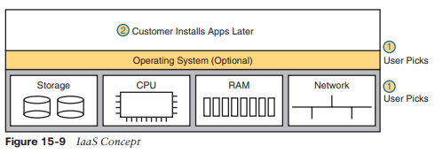

# Arquitectura de la nube

Este capítulo cubre los siguientes temas del examen:

- Fundamentos de la red
  - Explicar el papel y la función de los componentes de la red.
  - Servidores
  - Describir las características de las arquitecturas de topología de red.
  - Local y en la nube
  - Explicar los fundamentos de la virtualización (máquinas virtuales)

La computación en la nube es un enfoque para ofrecer servicios de TI a los clientes. Sin embargo, la computación en la nube no es un producto, ni un conjunto de productos, ni un protocolo, ni una sola cosa. Entonces, si bien hoy en día existen descripciones y definiciones aceptadas de computación en la nube, se necesita un amplio conocimiento de TI más allá de las redes para saber si un servicio de TI en particular es o no digno de ser llamado servicio de computación en la nube.

La computación en la nube, o nube, es un enfoque sobre cómo ofrecer servicios a los clientes. Para que un servicio de TI sea considerado computación en la nube, debe tener estas características: Puede solicitarse bajo demanda; puede escalar dinámicamente (es decir, es elástico); utiliza un conjunto de recursos; tiene una variedad de opciones de acceso a la red; y se puede medir y facturar al usuario en función de la cantidad utilizada. La computación en la nube se basa en centros de datos que pueden automatizarse. Por ejemplo, para atender solicitudes, un sistema de computación en la nube creará instancias de servidores virtuales (máquinas virtuales (VM)) y configurará los ajustes en cada VM para proporcionar el servicio solicitado.

Este capítulo le brinda una idea general de los servicios en la nube y la arquitectura de red. Para ello, este capítulo comienza con una discusión sobre los conceptos básicos de la virtualización de servidores. Luego, la siguiente sección analiza las grandes ideas de la computación en la nube, y la sección final analiza el impacto de las nubes públicas en los flujos de paquetes en las redes empresariales.
### Virtualización de servidores
Cuando piensas en un servidor, ¿qué te viene a la mente? ¿Es una computadora de escritorio con una CPU rápida? ¿Una computadora de escritorio con mucha RAM? ¿Es hardware que no se colocaría en posición vertical en el suelo pero que podría atornillarse fácilmente a un bastidor en un centro de datos? Cuando piensas en un servidor, ¿ni siquiera piensas en el hardware, sino en el sistema operativo (SO) del servidor, que se ejecuta en algún lugar como una máquina virtual (VM)?

Todas esas respuestas son precisas desde una perspectiva u otra, pero en la mayoría de las demás discusiones dentro del alcance de la certificación CCNA, ignoramos esos detalles. Desde la perspectiva de la mayoría de las discusiones de CCNA, un servidor es un lugar para ejecutar aplicaciones, al que los usuarios se conectan a esas aplicaciones a través de la red. Luego, el libro representa el servidor con un ícono que parece una computadora de escritorio (que es el ícono estándar de Cisco para un servidor). El siguiente tema analiza algunas perspectivas diferentes sobre lo que significa ser un servidor y nos prepara para luego hablar sobre la computación en la nube.
### Hardware del servidor Cisco
Piense por un momento en el factor de forma de los servidores, es decir, la forma y el tamaño del servidor físico. Si tuvieras que construir tu propio servidor, ¿cómo sería? ¿Qué tan grande, qué ancho, qué alto, etc.? Incluso si nunca ha visto un dispositivo caracterizado como servidor, considere estos datos clave:

**Sin KVM:** Para la mayoría de los servidores, no hay ningún usuario permanente sentado cerca del servidor; Todos los usuarios y administradores se conectan al servidor a través de la red. Como resultado, no hay necesidad de un teclado, una pantalla de vídeo o un mouse permanentes (denominados colectivamente KVM).

**Racks de servidores en un centro de datos:** En los primeros años de los servidores, un servidor era cualquier computadora con una CPU relativamente rápida, grandes cantidades de RAM, etc. Hoy en día, las empresas colocan muchos servidores en una sola sala (un centro de datos) y uno de los objetivos es no desperdiciar espacio. Por lo tanto, fabricar servidores con un factor de forma que quepa en un bastidor estándar permite un uso más eficiente del espacio disponible, especialmente cuando no se espera que haya gente sentada frente a cada servidor.

Como ejemplo, la Figura 15-1 muestra una fotografía del hardware del servidor de Cisco. Si bien se podría pensar en Cisco como una empresa de redes, alrededor de 2010, Cisco expandió su línea de productos al mercado de servidores, con la línea de productos Cisco Unified Computing System (UCS). La foto muestra un producto de la serie UCS B (serie Blade) que utiliza un chasis montable en bastidor, con ranuras para servidores blade. El producto que se muestra en la figura se puede montar en un bastidor (observe los orificios en los lados) con ocho servidores blade (cuatro en cada lado) montados horizontalmente. También dispone de cuatro fuentes de alimentación en la parte inferior del chasis.

Independientemente del factor de forma, el hardware de servidor actual proporciona cierta capacidad de chips de CPU, RAM, almacenamiento y tarjetas de interfaz de red (NIC). Pero también hay que pensar de manera diferente sobre el sistema operativo que se ejecuta en el servidor debido a una herramienta llamada _virtualización del servidor_.
### Conceptos básicos de virtualización de servidores
Piense en un servidor (el hardware) como una computadora. Puede ser uno de los blades de la Figura 15-1, una computadora potente que puedes comprar en la tienda de informática local... lo que sea. Tradicionalmente, cuando piensas en un servidor, ese servidor ejecuta un sistema operativo. En el interior, el hardware incluye una CPU, algo de RAM, algún tipo de almacenamiento permanente (como unidades de disco) y una o más NIC. Y ese sistema operativo puede usar todo el hardware dentro del servidor y luego ejecutar una o más aplicaciones. La figura 15-2 muestra esas ideas principales.

Con el modelo de servidor físico que se muestra en la Figura 15-2, cada servidor físico ejecuta un sistema operativo y ese sistema operativo utiliza todo el hardware de ese servidor. Esto era cierto para los servidores en los días previos a la virtualización de servidores.

Hoy en día, la mayoría de las empresas crean un centro de datos virtualizado. Eso significa que la empresa compra hardware de servidor, lo instala en bastidores y luego trata toda la CPU, RAM, etc. como capacidad en el centro de datos. Luego, cada instancia del sistema operativo se desacopla del hardware y, por lo tanto, es virtual (a diferencia de lo físico). Cada pieza de hardware que antes habríamos considerado un servidor ejecuta varias instancias de un sistema operativo al mismo tiempo, y cada instancia de sistema operativo virtual se denomina _máquina virtual_ o VM.

Un único host físico (servidor) suele tener más potencia de procesamiento de la necesaria para un sistema operativo. Pensando en los procesadores por un momento, las CPU de servidor modernas tienen múltiples núcleos (procesadores) en un solo chip de CPU. Cada núcleo también puede ejecutar varios subprocesos con una función llamada _multithreading_. Entonces, cuando lees sobre un procesador Intel en particular con 8 núcleos y subprocesos múltiples (generalmente dos subprocesos por núcleo), ese chip de CPU puede ejecutar 16 programas diferentes simultáneamente. Luego, el hipervisor (que se presentará en breve) puede tratar cada subproceso disponible como una CPU virtual (vCPU) y asignar a cada máquina virtual una cantidad de vCPU, de las cuales 16 están disponibles en este ejemplo.

Una máquina virtual (es decir, una instancia de sistema operativo que está desacoplada del hardware del servidor) aún debe ejecutarse en el hardware. Cada VM tiene una configuración en cuanto a la cantidad mínima de vCPU que necesita, RAM mínima, etc. Luego, el sistema de virtualización inicia cada VM en algún servidor físico para que exista suficiente capacidad de hardware del servidor físico para admitir todas las VM que se ejecutan en ese host. Entonces, en cualquier momento dado, cada VM se ejecuta en un servidor físico, utilizando un subconjunto de CPU, RAM, almacenamiento y NIC en ese servidor. La Figura 15-3 muestra un gráfico de ese concepto, con cuatro máquinas virtuales independientes ejecutándose en un servidor físico.

Para que la virtualización de servidores funcione, cada servidor físico (llamado _host_ en el mundo de la virtualización de servidores) utiliza un _hipervisor_. El hipervisor administra y asigna el hardware del host (CPU, RAM, etc.) a cada VM según la configuración de la VM. Cada VM se ejecuta como si se ejecutara en un servidor físico autónomo, con una cantidad específica de CPU y NIC virtuales y una cantidad determinada de RAM y almacenamiento. Por ejemplo, si una máquina virtual está configurada para usar cuatro CPU, con 8 GB de RAM, el hipervisor asigna las partes específicas de la CPU y la RAM que la máquina virtual realmente usa.
### Conexión en red con conmutadores virtuales en un host virtualizado
Las herramientas de virtualización de servidores brindan una amplia variedad de opciones sobre cómo conectar máquinas virtuales a las redes.

Primero, ¿qué incluye un servidor físico para funciones de red? Normalmente tiene una o más NIC, tal vez tan lentas como 1 Gbps, a menudo 10 Gbps en la actualidad, y tal vez tan rápidas como 40 Gbps.

A continuación, piense en las máquinas virtuales. Normalmente, un sistema operativo tiene una NIC, tal vez más. Para que el sistema operativo funcione normalmente, cada VM tiene (al menos) una NIC, pero para una VM, es una NIC virtual. (Por ejemplo, en los sistemas de virtualización de VMware, la NIC virtual de la VM se llama vNIC).

Finalmente, el servidor debe combinar las ideas de las NIC físicas con las vNIC utilizadas por el

VM en algún tipo de red. La mayoría de las veces, cada servidor utiliza algún tipo de interfaz interna.

Concepto de conmutador Ethernet, a menudo llamado conmutador virtual o vSwitch. La Figura 15-4 muestra un ejemplo con cuatro máquinas virtuales, cada una con una vNIC. El servidor físico tiene dos NIC físicas. Las vNIC y las NIC físicas se conectan internamente a un conmutador virtual.

Curiosamente, el vSwitch puede ser suministrado por el proveedor del hipervisor o por Cisco. Por ejemplo, Cisco ofrece el conmutador virtual Nexus 1000VE (que reemplaza al antiguo y popular conmutador virtual Nexus 1000V). El Nexus 1000VE ejecuta el sistema operativo NX-OS que se encuentra en algunas líneas de productos de conmutadores para centros de datos Cisco Nexus. Además, Cisco ofrece Cisco ACI Virtual Edge, otro conmutador virtual, que sigue las redes Cisco ACI como se detalla en el Capítulo 16, "Introducción a las redes basadas en controladores".

El vSwitch que se muestra en la Figura 15-4 utiliza las mismas funciones de red; de hecho, una gran motivación para utilizar un vSwitch de Cisco es utilizar las mismas funciones de red, con la misma configuración, que en el resto de la red. En particular:

- **Puertos conectados a VM:** El vSwitch puede configurar un puerto para que la VM esté en su propia VLAN, o compartir la misma VLAN con otras VM, o incluso usar VLAN troncal hacia la propia VM.
- **Puertos conectados a NIC físicas:** El vSwitch utiliza las NIC físicas en el hardware del servidor para que el conmutador esté adyacente al conmutador LAN físico externo. El vSwitch puede (y probablemente lo haga) utilizar enlace troncal VLAN.
- **Configuración automatizada:** La configuración se puede realizar fácilmente desde el mismo software de virtualización que controla las VM. Esa capacidad de programación permite que el software de virtualización mueva máquinas virtuales entre hosts (servidores) y reprograme los vSwitches para que la máquina virtual tenga las mismas capacidades de red sin importar dónde se esté ejecutando.
### La red del centro de datos físico
Para unir estas ideas, consideremos a continuación lo que sucede con la red física en un centro de datos virtualizado. Cada host (es decir, el host físico) necesita una conexión física a la red. Mirando nuevamente la Figura 15-4, ese host, con dos NIC físicas, necesita conectar esas dos NIC físicas a un conmutador LAN en el centro de datos.

La Figura 15-5 muestra el cableado tradicional para una LAN de centro de datos. Cada rectángulo más alto representa un bastidor dentro de un centro de datos, donde los cuadrados pequeños representan puertos NIC y las líneas representan cables.

A menudo, cada host está cableado a dos conmutadores diferentes en la parte superior del rack (llamados conmutadores Top of Rack (ToR)) para proporcionar rutas redundantes hacia la LAN. Cada conmutador ToR actúa como un conmutador de capa de acceso desde una perspectiva de diseño. Luego, cada conmutador ToR se cablea a un conmutador de extremo de fila (EoR), que actúa como conmutador de distribución y también se conecta al resto de la red.

El diseño de la Figura 15-5 utiliza un plan de cableado de centro de datos tradicional. Algunas tecnologías de centros de datos requieren diferentes topologías, en particular, Cisco Application Centric Infrastructure (ACI). ACI coloca el servidor y el hardware del conmutador en bastidores, pero cablea los conmutadores con una topología diferente, una topología necesaria para el funcionamiento adecuado de la estructura de ACI.
### Flujo de trabajo con un centro de datos virtualizado
Hasta ahora, la primera parte de este capítulo ha descrito información básica importante para las próximas discusiones sobre la computación en la nube. La virtualización de servidores ha supuesto una gran mejora para las operaciones de muchos centros de datos, pero la virtualización por sí sola no crea un entorno de computación en la nube. Continuando con la discusión de estas tecnologías fundamentales antes de hablar de la computación en la nube, considere este ejemplo de un flujo de trabajo a través de un centro de datos virtualizado (no basado en la nube).

Algunos miembros del personal de TI, llámelos ingenieros o administradores de servidores o virtualización, solicitan e instalan nuevos hosts (servidores). Recopilan requisitos, planifican la capacidad requerida, compran hardware, lo solicitan e instalan el hardware. Desempeñan el papel de administradores e ingenieros de servidores desde hace mucho tiempo, pero ahora también trabajan con las herramientas de virtualización.

Para las partes del esfuerzo de virtualización, los ingenieros de virtualización también instalan y personalizan las herramientas de virtualización. Más allá del hipervisor en cada host, muchas otras herramientas útiles ayudan a administrar y controlar un centro de datos virtualizado. Por ejemplo, una herramienta podría brindarles a los ingenieros una vista del centro de datos como un todo, con todas las máquinas virtuales ejecutándose allí, con la idea de que un centro de datos tiene mucha capacidad para ejecutar máquinas virtuales. Con el tiempo, los ingenieros de servidores/virtualización agregan nuevos servidores físicos al centro de datos y configuran los sistemas de virtualización para utilizar los nuevos servidores físicos y asegurarse de que todo funcione.

Hasta ahora, en este escenario, el trabajo ha sido de preparación para brindar servicios a algún cliente interno: un miembro del equipo de desarrollo, el personal de operaciones, etc. Ahora, un cliente solicita un "servidor". En verdad, el cliente quiere una VM (o muchas), con ciertos requisitos: una cantidad específica de vCPU, una cantidad específica de RAM, etc. El cliente realiza una solicitud al ingeniero de virtualización/servidor para configurar las máquinas virtuales, como se muestra en la Figura 15-6.

La figura enfatiza lo que sucede después de que el cliente realiza una solicitud, que fluye más o menos así:

| **Step 1.** | The customer of the IT group, such as a developer or a member of the operations staff, wants some service, like a set of new VMs.                                                                                                                                |
| ----------- | ---------------------------------------------------------------------------------------------------------------------------------------------------------------------------------------------------------------------------------------------------------------- |
| **Step 2.** | The virtualization/server engineer reacts to the request from the customer. The server/virtualization engineer clicks away at the user interface, or if the number of VMs is large, she often runs a program called a script to more efficiently create the VMs. |
| **Step 3.** | Regardless of whether the virtualization engineer clicked or used scripts, the virtualization software could then create a number of new VMs and start those on some hosts inside the data center.                                                               |

El proceso que se muestra en la Figura 15-6 funciona muy bien. Sin embargo, ese enfoque para brindar servicios rompe algunos de los criterios básicos de un servicio en la nube. Por ejemplo, la computación en la nube requiere autoservicio. Para que el flujo de trabajo se considere un servicio en la nube, el proceso del paso 2 no debe requerir que un humano atienda esa solicitud, sino que la solicitud debe completarse automáticamente. ¿Quiere algunas máquinas virtuales nuevas en un mundo de nube? Haga clic en una interfaz de usuario para solicitar algunas máquinas virtuales nuevas, vaya a tomar una taza de café y sus máquinas virtuales se configurarán e iniciarán, según sus especificaciones, en minutos.

Resumiendo algunos de los puntos clave sobre un centro de datos virtualizado realizados hasta el momento, que permiten la computación en la nube:
- El sistema operativo está desacoplado del hardware en el que se ejecuta, de modo que el sistema operativo, como máquina virtual, puede ejecutarse en cualquier servidor de un centro de datos que tenga suficientes recursos para ejecutar la máquina virtual.
- El software de virtualización puede iniciar y mover automáticamente la VM entre servidores en el centro de datos.
- Las redes del centro de datos incluyen conmutadores virtuales y NIC virtuales dentro de cada host (servidor).
- La red del centro de datos se puede programar mediante el software de virtualización, lo que permite configurar, iniciar, mover según sea necesario y detener nuevas máquinas virtuales, con los detalles de la red configurados automáticamente.
### Servicios de computación en la nube
La computación en la nube es un enfoque para ofrecer servicios de TI. La computación en la nube utiliza productos como los de virtualización, pero también utiliza productos creados específicamente para habilitar las funciones de la nube. Sin embargo, la computación en la nube no es sólo un conjunto de productos a implementar; más bien, es una forma de ofrecer servicios de TI. Por lo tanto, comprender qué es (y qué no es) la computación en la nube requiere un poco de trabajo; El siguiente tema presenta los conceptos básicos.

De las discusiones recién terminadas sobre virtualización, ya conoce una característica de un servicio en la nube: debe permitir el autoaprovisionamiento por parte del consumidor del servicio. Es decir, el consumidor o cliente del servicio debe poder solicitar el servicio y recibirlo sin la demora de esperar a que un humano tenga tiempo para trabajar en ello, considerar la solicitud, hacer el trabajo, etc.

Para tener una idea más amplia de lo que significa que un servicio sea un servicio en la nube, examine esta lista de cinco criterios para un servicio de computación en la nube. La lista se deriva de la definición de computación en la nube presentada por el Instituto Nacional de Estándares y Tecnología de EE. UU. (NIST):

**Autoservicio bajo demanda:** El consumidor de TI elige cuándo comenzar y dejar de usar el servicio, sin ninguna interacción directa con el proveedor del servicio.

**Acceso amplio a la red:** El servicio debe estar disponible desde muchos tipos de dispositivos y a través de muchos tipos de redes (incluido Internet).

**Agrupación de recursos:** el proveedor crea un grupo de recursos (en lugar de dedicar servidores específicos para que los utilicen solo determinados consumidores) y asigna dinámicamente recursos de ese grupo para cada nueva solicitud de un consumidor.

**Rápida elasticidad:** Para el consumidor, el conjunto de recursos parece ilimitado (es decir, se expande rápidamente, por eso se llama _elástico_) y las solicitudes de nuevos servicios se satisfacen rápidamente.

**Servicio medido:** El proveedor puede medir el uso e informar ese uso al consumidor, tanto por transparencia como por facturación.

Tenga en cuenta esta lista de cinco criterios mientras trabaja en el resto del capítulo. Partes posteriores del capítulo harán referencia a la lista.

Para desarrollar más esta definición, las próximas páginas analizan dos ramas del universo de la nube (la nube privada y la nube pública), también con el objetivo de explicar con más detalle algunos de los puntos de la definición del NIST.
### Nube privada (local)
Vuelva al ejemplo del flujo de trabajo en la Figura 15-6 con un centro de datos virtualizado. Ahora piense en los cinco criterios del NIST para la computación en la nube. Si desglosas la lista en comparación con el ejemplo de la Figura 15-6, parece que el flujo de trabajo puede cumplir al menos algunos de estos cinco criterios de nube del NIST, y así es. En particular, como se describe hasta ahora en este capítulo, un centro de datos virtualizado agrupa recursos para que puedan asignarse dinámicamente. Se podría argumentar que un centro de datos virtualizado es elástico, en el sentido de que el conjunto de recursos se expande. Sin embargo, es posible que el proceso no sea rápido porque el flujo de trabajo requiere controles, equilibrios y tiempo humanos antes de proporcionar nuevos servicios.

La nube privada crea un servicio, dentro de una empresa, para clientes internos, que cumple con los cinco criterios de la lista NIST. Para crear una nube privada, una empresa suele ampliar sus herramientas de TI (como herramientas de virtualización), cambiar los procesos de flujo de trabajo internos, agregar herramientas adicionales, etc.

Como algunos ejemplos, considere lo que sucede cuando un desarrollador de aplicaciones en una empresa necesita máquinas virtuales para utilizarlas al desarrollar una aplicación. Con la nube privada, el desarrollador puede solicitar esas máquinas virtuales y esas máquinas virtuales se inician automáticamente y están disponibles en cuestión de minutos, siendo la mayor parte del retraso el momento de iniciar las máquinas virtuales. Si el desarrollador quiere muchas más máquinas virtuales, puede asumir que la nube privada tendrá suficiente capacidad y que las nuevas solicitudes seguirán atendiéndose rápidamente. Y todas las partes deben saber que el grupo de TI puede medir el uso de los servicios para la facturación interna.

Concéntrese por un momento en el aspecto de autoservicio de la nube. Para que esto suceda, muchos servicios de computación en la nube utilizan un _catálogo de servicios en la nube_. Ese catálogo existe para el usuario como una aplicación web que enumera todo lo que se puede solicitar a través de la infraestructura en la nube de la empresa. Antes de usar una nube privada, los desarrolladores y operadores que necesitaban nuevos servicios (como nuevas máquinas virtuales) enviaban una solicitud de cambio pidiendo al equipo de virtualización que agregara máquinas virtuales (consulte la Figura 15-6). Con la nube privada, los consumidores (internos) de servicios de TI (desarrolladores, operadores y similares) pueden hacer clic para elegir del catálogo de servicios de nube. Y si la solicitud es para un nuevo conjunto de máquinas virtuales, las máquinas virtuales aparecen y están listas para su uso en minutos, sin interacción humana para ese paso, como se ve en el paso 2 de la Figura 15-7.

Para que este proceso funcione, el equipo de la nube debe agregar algunas herramientas y procesos a su centro de datos virtualizado. Por ejemplo, instala software para crear el catálogo de servicios en la nube, tanto con una interfaz de usuario como con un código que interactúa con las API de los sistemas de virtualización. Ese software de catálogo de servicios puede reaccionar a las solicitudes de los consumidores, utilizando API en el software de virtualización, para agregar, mover y crear máquinas virtuales, por ejemplo. Además, el equipo de la nube, compuesto por ingenieros de servidores, virtualización, redes y almacenamiento, se concentra en crear el grupo de recursos, probar y agregar nuevos servicios al catálogo, manejar excepciones y observar los informes (según el requisito de servicio medido) para saber cuándo agregar capacidad para mantener el grupo de recursos listo para manejar todas las solicitudes.

En particular, con el modelo de nube, el equipo de la nube ya no pierde tiempo manejando solicitudes individuales para agregar 10 VM aquí, 50 allá, con solicitudes de cambio de diferentes grupos.

En resumen, con la nube privada, cambia sus métodos y herramientas para ofrecer algunos de los mismos servicios. La nube privada es "privada" en el sentido de que una empresa posee las herramientas que crean la nube y emplea a las personas que utilizan los servicios. Incluso dentro de una empresa, el uso de un enfoque de computación en la nube puede mejorar la velocidad operativa de implementación de servicios de TI.
### Nube pública
En una nube privada, el proveedor de la nube y el consumidor de la nube forman parte de la misma empresa. Con la nube pública ocurre lo contrario: un proveedor de nube pública ofrece servicios y los vende a consumidores de otras empresas. De hecho, si piensa en los proveedores de servicios de Internet y los proveedores de servicios WAN que venden servicios de Internet y WAN a muchas empresas, la misma idea general funciona aquí con los proveedores de nube pública que venden sus servicios a muchas empresas.

El flujo de trabajo en la nube pública ocurre de manera similar a la nube privada cuando comienza desde el punto en que un consumidor solicita algún servicio (como una nueva máquina virtual). Como se muestra a la derecha de la Figura 15-8, en el paso 1, el consumidor solicita el nuevo servicio desde la página web del catálogo de servicios. En el paso 2, las herramientas de virtualización reaccionan a la solicitud para crear el servicio. Una vez iniciados, los servicios están disponibles, pero ejecutándose en un centro de datos que reside en algún otro lugar del mundo, y ciertamente no en el centro de datos de la empresa (paso 3).

Por supuesto, el consumidor está en una red diferente a la del proveedor de la nube con computación en la nube, lo que plantea la cuestión de cómo conectarse a un proveedor de la nube. Los proveedores de la nube admiten múltiples opciones de red. Cada uno de ellos se conecta a Internet para que las aplicaciones y los usuarios dentro de la red del consumidor puedan comunicarse con las aplicaciones que el consumidor ejecuta en la red del proveedor de la nube. Sin embargo, uno de los cinco criterios del NIST para la computación en la nube es el acceso amplio a la red, por lo que los proveedores de la nube también ofrecen diferentes opciones de red, incluidas conexiones de red privada virtual (VPN) y red privada de área amplia (WAN) entre los consumidores y la nube.
### La nube y el modelo “como servicio”
Entonces, ¿qué se obtiene con la computación en la nube? Hasta ahora, este capítulo sólo ha mostrado una VM como servicio. Con la computación en la nube, existe una variedad de servicios, y tres se destacan como los más comunes que se ven en el mercado hoy en día.

Primero, unas breves palabras sobre la terminología próxima. El mundo de la computación en la nube funciona según un modelo de servicios. En lugar de comprar (consumir) hardware, comprar o licenciar software, instalarlo usted mismo, etc., el consumidor recibe algún servicio del proveedor. Pero esa idea, recibir un servicio, es más abstracta que la idea de comprar un servidor e instalar un paquete de software en particular. Entonces, con la computación en la nube, en lugar de mantener la discusión tan genérica, la industria utiliza una variedad de términos que terminan en "como servicio". Y cada término "-aaS" tiene un significado diferente.

El siguiente tema explica los tres servicios en la nube más comunes: infraestructura como servicio, software como servicio y plataforma como servicio.
### Infraestructura como un servicio
La infraestructura como servicio (IaaS) puede ser el servicio de computación en la nube más fácil de entender para la mayoría de las personas. Para tener una perspectiva, piense en cualquier momento en el que haya comprado una computadora. Pensó en el sistema operativo que ejecutaría (el último sistema operativo de Microsoft, Linux o macOS si compra una Mac). Comparaste los precios según la CPU y su velocidad, la cantidad de RAM que tenía la computadora, el tamaño de la unidad de disco, etc.

IaaS ofrece una idea similar, pero el consumidor recibe el uso de una VM. Usted especifica la cantidad de rendimiento/capacidad de hardware que se asignará a la VM (cantidad de CPU virtuales, cantidad de RAM, etc.), como se muestra en la Figura 15-9. Incluso puedes elegir un sistema operativo para usar. Una vez seleccionado, el proveedor de la nube inicia la VM, que inicia el sistema operativo elegido.

The provider also gives the consumer details about the VM so the consumer can connect to the OS’s user interface, install more software, and customize settings. For example, imagine that the consumer wants to run a particular application on the server. If that customer wanted to use Microsoft Exchange as an email server, she would then need to connect to the VM and install Exchange.

Figure 15-10 shows a web page from Amazon Web Services (AWS), a public cloud provider, from which you could create a VM as part of its IaaS service. The screenshot shows that the user selected a small VM called “micro.” If you look closely at the text, you may be able to read the heading and numbers to see that this particular VM has one vCPU and 1 GB of RAM.

### Software como servicio
Con el software como servicio (SaaS), el consumidor recibe un servicio con un software que funciona. El proveedor de la nube puede utilizar máquinas virtuales, posiblemente muchas máquinas virtuales, para crear el servicio, pero están ocultas para el consumidor. El proveedor de la nube otorga licencia, instala y brinda soporte a cualquier software necesario. Luego, el proveedor de la nube monitorea el rendimiento de la aplicación. Sin embargo, el consumidor elige usar la aplicación, se registra en el servicio y comienza a usar la aplicación; no se requiere ningún trabajo de instalación adicional. La Figura 15-11 muestra estos conceptos principales.

Muchos de ustedes probablemente hayan utilizado o al menos hayan oído hablar de muchas ofertas públicas de SaaS. Los servicios de almacenamiento de archivos como Apple iCloud, Google Drive, Dropbox y Box son ofertas de SaaS. La mayoría de las ofertas de correo electrónico en línea pueden considerarse servicios SaaS en la actualidad. Como otro ejemplo, Microsoft ofrece su software de servidor de correo electrónico Exchange como un servicio, por lo que puede tener servicios de correo electrónico privados pero ofrecidos como un servicio, junto con todas las demás características incluidas con Exchange, sin tener que licenciar, instalar y mantener el software Exchange. en algunas máquinas virtuales.
### (Desarrollo) Plataforma como servicio
Platform as a Service (PaaS) es una plataforma de desarrollo, prediseñada como servicio. Un servicio PaaS es como IaaS en algunos aspectos. Ambos proporcionan al consumidor una o más máquinas virtuales, con una cantidad configurable de CPU, RAM y otros recursos.

La diferencia clave entre PaaS e IaaS es que PaaS incluye muchas más herramientas de software además del sistema operativo básico. Esas herramientas son útiles para un desarrollador de software durante el proceso de desarrollo de software. Una vez que se completa el proceso de desarrollo y la aplicación se implementa en producción, esas herramientas no son necesarias en los servidores que ejecutan la aplicación. Entonces, las herramientas de desarrollo son específicas del trabajo realizado durante el desarrollo.

Una oferta de PaaS incluye un conjunto de herramientas de desarrollo y cada oferta de PaaS tiene una combinación diferente de herramientas. Las máquinas virtuales PaaS suelen incluir un entorno de desarrollo integrado (IDE), que es un conjunto de herramientas relacionadas que permiten al desarrollador escribir y probar código fácilmente. Las máquinas virtuales PaaS incluyen herramientas de integración continua que permiten al desarrollador actualizar el código y probarlo e integrarlo automáticamente en un proyecto de software más grande. Los ejemplos incluyen la oferta PaaS App Engine de Google [(https://cloud.google.com/appengine)](https://cloud.google.com/appengine), el entorno de desarrollo integrado E clipse (consulte [www.eclipse.org )](http://www.eclipse.org/) y la herramienta de automatización e integración continua J enkins (consulte [https://jenkins.io)](https://jenkins.io/).

Las razones principales para elegir un servicio PaaS sobre otro, o para elegir una solución PaaS en lugar de IaaS, es la combinación de herramientas de desarrollo. Si no tiene experiencia como desarrollador, puede resultar difícil saber si un servicio PaaS podría ser mejor. Aún puede tomar algunas decisiones sobre el tamaño de las máquinas virtuales PaaS, similar a las herramientas IaaS al configurar algunos servicios PaaS, como se muestra en la Figura 15-12, pero las herramientas de desarrollador incluidas son la clave para un servicio PaaS.

### Rutas de tráfico WAN para llegar a los servicios en la nube
Esta última sección importante del capítulo se centra en las opciones de WAN para la nube pública y los pros y los contras de cada una. Esta sección ignora la nube privada en su mayor parte, porque el uso de una nube privada (que es interna de una empresa) tiene un impacto mucho menor en una WAN empresarial en comparación con la nube pública. Con la nube pública, los servicios de nube existen al otro lado de alguna conexión WAN en comparación con el consumidor de los servicios, por lo que los ingenieros de redes deben pensar en cómo construir mejor una WAN cuando utilizan servicios de nube pública.
### Conexiones WAN empresariales a la nube pública
Usar Internet para comunicarse entre la empresa y un proveedor de nube pública es fácil y conveniente. Sin embargo, también tiene algunos aspectos negativos. Esta primera sección describe los conceptos básicos y señala los problemas, lo que luego conduce a algunas de las razones por las que se puede preferir el uso de otras conexiones WAN.
### Acceso a servicios de nube pública mediante Internet
Imagine una empresa que opera su red sin nube. Todas las aplicaciones que utiliza para ejecutar su negocio se ejecutan en servidores en un centro de datos dentro de la empresa. Las instancias del sistema operativo donde se ejecutan esas aplicaciones pueden alojarse directamente en servidores físicos o en máquinas virtuales en un centro de datos virtualizado, pero todos los servidores existen en algún lugar dentro de la empresa.

Ahora imagine que el personal de TI comienza a trasladar algunas de esas aplicaciones a un servicio de nube pública. ¿Cómo acceden los usuarios de la aplicación (dentro de la empresa) a la interfaz de usuario de la aplicación (que se ejecuta en el centro de datos del proveedor de la nube pública)? Internet, por supuesto. Tanto la empresa como el proveedor de la nube se conectan a Internet, por lo que utilizar Internet es la opción fácil y conveniente.

Ahora considere un flujo de trabajo común para mover una aplicación interna para que ahora se ejecute en la nube pública, con el fin de resaltar un par de puntos importantes. Primero, la Figura 15-13 muestra el ejemplo. El personal de la empresa puede acceder al catálogo de servicios del proveedor de la nube a través de Internet, como se muestra en el paso 1. Después de elegir los servicios deseados (por ejemplo, algunas máquinas virtuales para un servicio IaaS), el proveedor de la nube (paso 2) crea una instancia de las máquinas virtuales. Luego, como no se muestra como un paso en la figura, las máquinas virtuales se personalizan para ejecutar ahora la aplicación que antes se ejecutaba dentro del centro de datos de la empresa.

En este punto, la nueva aplicación se ejecuta en la nube y esos servicios requerirán ancho de banda de red. En particular, el paso 3 muestra a los usuarios comunicándose con las aplicaciones, tal como sucedería con cualquier otra aplicación. Además, la mayoría de las aplicaciones envían muchos más datos que solo los datos entre la aplicación y el usuario final. Por ejemplo, puede mover una aplicación a la nube pública, pero puede mantener los servicios de autenticación en un servidor interno porque son utilizados por una gran cantidad de aplicaciones, algunas internas y otras alojadas en la nube pública. Entonces, en el paso 4, también debe realizarse cualquier comunicación de aplicaciones entre las máquinas virtuales alojadas en la nube hacia/desde las máquinas virtuales alojadas dentro de la empresa.
### Pros y contras de conectarse a la nube pública con Internet
Usar Internet para conectarse desde la empresa a la nube pública tiene varias ventajas. La ventaja más obvia es que todas las empresas y proveedores de la nube ya tienen conexiones a Internet, por lo que comenzar a utilizar los servicios de la nube pública es fácil. El uso de Internet funciona particularmente bien con servicios SaaS y una fuerza laboral distribuida. Por ejemplo, tal vez su división de ventas utilice una aplicación de contacto con el cliente SaaS. A menudo, los vendedores no permanecen dentro de la red empresarial la mayor parte del día laboral. Probablemente se conecten a Internet y utilicen una VPN para conectarse a la empresa. Para las aplicaciones alojadas en la nube pública, con esta base de usuarios, tiene mucho sentido utilizar Internet.

Si bien este fue solo un ejemplo, la siguiente lista resume algunas buenas razones para usar Internet como conexión WAN a un servicio de nube pública:

**Agilidad:** Una empresa puede comenzar a utilizar la nube pública sin tener que esperar para solicitar una conexión WAN privada al proveedor de la nube porque los proveedores de la nube admiten la conectividad a Internet.

**Migración:** Una empresa puede cambiar su carga de trabajo de un proveedor de nube a otro más fácilmente porque todos los proveedores de nube se conectan a Internet.

**Usuarios distribuidos:** Los usuarios de la empresa están distribuidos y se conectan a Internet con sus dispositivos (como en el ejemplo de la aplicación SaaS de ventas).

Usar Internet como conectividad WAN a una nube pública es a la vez una bendición y una maldición en algunos sentidos. El uso de Internet puede ayudarle a comenzar con la nube pública y a comenzar a trabajar rápidamente, pero también significa que no tiene que hacer ninguna planificación antes de implementar un servicio de nube pública. Con un poco de planificación, un ingeniero de redes puede ver algunos de los aspectos negativos del uso de Internet (los mismos aspectos negativos cuando se utiliza Internet para otros fines), lo que podría hacer que desee utilizar conexiones WAN alternativas. Los aspectos negativos del uso de Internet para el acceso a la nube pública son

**Seguridad:** Internet es menos segura que las conexiones WAN privadas en el sentido de que un "hombre en el medio" puede intentar leer el contenido de los datos que pasan hacia/desde la nube pública.

**Capacidad:** Mover una aplicación interna a la nube pública aumenta el tráfico de red, por lo que se debe considerar si los enlaces de Internet de la empresa pueden manejar la carga adicional.

**Calidad de servicio (QoS):** Internet no proporciona QoS, mientras que las WAN privadas sí pueden. El uso de Internet puede resultar en una experiencia de usuario peor que la deseada debido a un mayor retraso (latencia), fluctuación y pérdida de paquetes.

**Sin WAN SLA:** Los ISP normalmente no proporcionan un acuerdo de nivel de servicio (SLA) para el rendimiento y la disponibilidad de WAN para todos los destinos de una red. Es mucho más probable que los proveedores de servicios WAN ofrezcan SLA de rendimiento y disponibilidad.

Esta lista de preocupaciones no significa que una empresa no pueda utilizar Internet para acceder a sus servicios de nube pública. Significa que se deben considerar los pros y los contras de cada opción de WAN.
### Acceso privado a WAN y VPN de Internet a la nube pública
La definición del NIST para la computación en la nube enumera el acceso amplio a la red como uno de los cinco criterios principales. En el caso de la nube pública, eso a menudo significa admitir una variedad de conexiones WAN, incluidas las tecnologías WAN empresariales más comunes. Básicamente, una empresa puede conectarse a un proveedor de nube pública con las tecnologías WAN que se analizan en este libro. Para facilitar la discusión, la Figura 15-14 lo divide en dos categorías amplias.

Para crear un túnel VPN entre la empresa y el proveedor de la nube, puede utilizar las mismas funciones de VPN analizadas anteriormente en el Capítulo 14, “Arquitectura WAN”. El proveedor de la nube puede ofrecer un servicio VPN (es decir, el lado de la nube del túnel VPN lo implementa el proveedor de la nube) y la empresa configura el servicio VPN correspondiente en uno de sus propios enrutadores. O la empresa puede utilizar su propio enrutador dentro de la red del proveedor de la nube (un enrutador virtual que se ejecuta como una máquina virtual) y configurar servicios VPN en ese enrutador. De hecho, Cisco fabrica el _Cloud Services Router_ (CSR) para hacer exactamente eso: ser un enrutador, pero un enrutador que se ejecuta como una máquina virtual en un servicio en la nube, controlado por el consumidor de la nube, para realizar varias funciones que realizan los enrutadores, incluyendo terminar las VPN. (Además, al ejecutar un enrutador virtual como máquina virtual y administrar la configuración internamente, la empresa podría ahorrar parte del costo de utilizar un servicio similar ofrecido por el proveedor de la nube).

Para realizar una conexión VPN o WAN Ethernet de conmutación de etiquetas multiprotocolo (MPLS) privada, la empresa debe trabajar con el proveedor de la nube y el proveedor de WAN. Debido a que los proveedores de la nube se conectan con muchos clientes con conexiones WAN privadas, a menudo publican instrucciones establecidas a seguir. En la forma más básica, con MPLS, la empresa y el proveedor de la nube se conectan al mismo proveedor de MPLS, y el proveedor de MPLS conecta la empresa y los sitios de la nube. El mismo proceso básico ocurre con los servicios WAN Ethernet, con una o más conexiones virtuales Ethernet (EVC) creadas entre la WAN pública y la empresa.

Las conexiones WAN privadas también requieren cierta planificación física. Cada uno de los proveedores de nube pública más grandes tiene una serie de grandes centros de datos repartidos por todo el planeta y con puntos de conexión prediseñados en los principales servicios WAN para ayudar a la creación de conexiones WAN privadas para los clientes. Luego, una empresa podría consultar la documentación del proveedor de la nube y trabajar con ese proveedor para elegir el mejor lugar para instalar la conexión WAN privada. (Esas empresas de nube pública más grandes incluyen Amazon Web Services, Google Compute Cloud, Microsoft Azure y Rackspace, si desea consultar sus sitios web para obtener información sobre sus ubicaciones).
### Pros y contras de conectarse a la nube con WAN privadas
Las WAN privadas superan algunos de los problemas del uso de Internet sin VPN, por lo que, para solucionar esos problemas, considere algunas de las diferentes opciones de WAN.

En primer lugar, considerando la cuestión de la seguridad, todas las opciones privadas, incluida la adición de una VPN a la conexión a Internet existente, mejoran significativamente la seguridad. Una VPN de Internet cifraría los datos para mantenerlos privados. Las conexiones WAN privadas con MPLS y Ethernet tradicionalmente se han considerado seguras sin cifrado, pero a veces las empresas también cifran los datos enviados a través de conexiones WAN privadas para hacer la red más segura.

Con respecto a la QoS, el uso de una solución VPN de Internet aún no proporciona QoS porque Internet no proporciona QoS. Los servicios WAN como MPLS VPN y Ethernet WAN pueden hacerlo. Como se analizó en el Capítulo 11, “Calidad de servicio (QoS)”, los proveedores de WAN observarán las marcas de QoS de las tramas/paquetes enviados por el cliente y aplicarán herramientas de QoS al tráfico a medida que pasa a través de la red del proveedor de servicios.

Finalmente, en cuanto a la cuestión de la capacidad, existe la preocupación de planificar la capacidad de la red sin importar qué tipo de WAN se utilice. Cualquier plan para migrar una aplicación desde un centro de datos interno para alojarla como un proveedor de nube pública requiere una reflexión y una planificación adicionales.

Como es de esperar, existen varios aspectos negativos del uso de una WAN privada. La instalación de nuevas conexiones WAN privadas lleva tiempo, lo que retrasa el inicio de una empresa en la computación en la nube. Las WAN privadas suelen costar más que utilizar Internet. Si utiliza una conexión WAN a un proveedor de nube (en lugar de usar Internet), migrar a un nuevo proveedor de nube puede requerir otra ronda de instalación de WAN privada, lo que nuevamente retrasa los proyectos de trabajo. Usar Internet (con o sin VPN) haría que la migración fuera mucho más fácil, pero como se muestra en la siguiente sección, también existe una solución de compromiso sólida.
### Intercambios entre nubes
La computación en nube pública también introduce un nivel completamente nuevo de competencia porque un consumidor de nube puede trasladar su carga de trabajo de un proveedor de nube a otro. Mover la carga de trabajo requiere cierto esfuerzo, por una variedad de razones que van más allá del alcance de este libro. (Basta decir que la mayoría de los proveedores de la nube difieren en los detalles de cómo implementan los servicios). Pero las empresas pueden migrar, y de hecho lo hacen, su carga de trabajo de un proveedor de la nube a otro, eligiendo una nueva empresa por una variedad de razones, incluida la búsqueda de una empresa menos costosa. costoso proveedor de nube.

Ahora concéntrate nuevamente en las conexiones de red. El principal inconveniente de utilizar una WAN privada para la nube es que añade otra barrera a la migración a un nuevo proveedor de nube pública. Una solución añade una migración más sencilla al uso de una WAN privada a través de un servicio en la nube llamado intercambio entre nubes (o simplemente entre nubes).

De manera genérica, el término _intercloud exchange_ ha pasado a conocerse como una empresa que crea una red privada como servicio. En primer lugar, un intercambio entre nubes se conecta a varios proveedores de nube en un lado. Por otro lado, la internube conecta a los consumidores de la nube. La figura 15-15 muestra la idea.

Una vez conectado, el consumidor de la nube se puede configurar para comunicarse con un proveedor de nube pública hoy, con sitios de proveedores de nube específicos. Más adelante, si el consumidor desea migrar para utilizar otro proveedor de nube, mantiene los mismos enlaces WAN privados al intercambio entre nubes y solicita al proveedor que lo reconfigure para configurar nuevas conexiones WAN privadas al nuevo proveedor de nube.

En cuanto a los pros y los contras, con un intercambio entre nubes se obtienen los mismos beneficios que cuando se conecta con una conexión WAN privada a una nube pública, pero con la ventaja adicional de una migración más sencilla a un nuevo proveedor de nube. La principal desventaja es que el uso de un intercambio entre nubes introduce a otra empresa en la mezcla.
### Resumen de los pros y los contras de las opciones de WAN en la nube pública
La Tabla 15-2 resume algunas de estas ventajas y desventajas clave de las opciones de WAN pública para la computación en la nube, para estudio y referencia.

|                                   | **Internet** | **Internet VPN** | **MPLS VPN** | **Ethernet WAN** | **Intercloud Exchange** |
| --------------------------------- | ------------ | ---------------- | ------------ | ---------------- | ----------------------- |
| Makes data private                | No           | Yes              | Yes          | Yes              | Yes                     |
| Supports QoS                      | No           | No               | Yes          | Yes              | Yes                     |
| Requires capacity planning        | Yes          | Yes              | Yes          | Yes              | Yes                     |
| Eases migration to a new provider | Yes          | Yes              | No           | No               | Yes                     |
| Speeds initial installation       | Yes          | Yes              | No           | No               | No                      |
### Un escenario: sucursales y la nube pública
Hasta ahora, en esta sección importante sobre el diseño de WAN con nube pública, la empresa se ha mostrado como una sola entidad, pero la mayoría de las WAN empresariales tienen muchos sitios. Esos sitios empresariales distribuidos afectan algunas partes del diseño de WAN para la nube pública. La siguiente discusión sobre los problemas de diseño de WAN con la nube pública se desarrolla a través de un escenario que muestra una empresa con un sitio central y una sucursal típicos.

El ejemplo utilizado en esta sección es común: el paso de los servidores de correo electrónico internos, respaldados directamente por el personal de TI, al correo electrónico entregado como una oferta SaaS. Céntrese en el impacto de los sitios remotos de la empresa, como las sucursales.
### Migración de flujos de tráfico al migrar a SaaS de correo electrónico
En primer lugar, piense en el flujo de tráfico dentro de una empresa antes de SaaS, cuando la empresa compra servidores, otorga licencias de software de servidor de correo electrónico, instala el hardware y el software en un centro de datos interno, etc. La empresa puede tener cientos o miles de sitios remotos, como la sucursal que se muestra en la Figura 15-16. Para consultar el correo electrónico, un empleado de la sucursal envía paquetes de ida y vuelta al servidor de correo electrónico del sitio central, como se muestra.

Luego, la empresa analiza los diferentes costos del correo electrónico en este modelo antiguo versus el nuevo modelo SaaS. Por ejemplo, Microsoft Exchange es un paquete de software muy popular para crear servidores de correo electrónico empresariales. Microsoft, un actor importante en el espacio de la nube pública con su servicio Microsoft Azure, ofrece Exchange como servicio SaaS. (Durante la redacción de este libro, este servicio en particular se podía encontrar como parte de Office 365 o como “Exchange Online”). Por lo tanto, la empresa considera las opciones y elige migrar una oferta SaaS de correo electrónico.

Una vez migrados, los servidores de correo electrónico se ejecutan en la nube, pero como un servicio SaaS. El personal de TI de la empresa, que son los clientes del servicio SaaS, no tiene que administrar los servidores. Volviendo a algunas grandes ideas, con un servicio SaaS, el consumidor no se preocupa por instalar máquinas virtuales, dimensionarlas, instalar Exchange o algún otro software de servidor de correo electrónico, etc. En este caso, el consumidor recibe el servicio de correo electrónico. La empresa tiene que realizar algunos trabajos de migración para mover el correo electrónico, los contactos, etc. existentes, pero una vez completado, todos los usuarios ahora se comunican con servidores de correo electrónico que se ejecutan en la nube como un servicio SaaS.

Ahora piense en el usuario de la sucursal empresarial y en los flujos de tráfico que se muestran en la Figura 15-17, cuando un usuario de la sucursal envía o recibe un correo electrónico. Por ejemplo, piense en un correo electrónico con un archivo adjunto grande, sólo para que el impacto sea más dramático. Si el diseño empresarial conecta sucursales únicamente con los sitios centrales, este es el efecto neto en el tráfico WAN:
- No se produce ninguna reducción en el tráfico WAN privado porque todo el tráfico de correo electrónico de la sucursal fluye hacia/desde el sitio central.
- El cien por ciento del tráfico de correo electrónico (incluso los correos electrónicos internos) que fluye hacia/desde las sucursales ahora también fluye a través de la conexión a Internet, consumiendo el ancho de banda de los enlaces de Internet de la empresa.

Sólo para aclarar el punto, imaginemos a dos usuarios en la misma sucursal. Pueden verse al otro lado de la habitación. Uno quiere compartir un archivo con el otro, pero la forma más conveniente que conocen para compartir un archivo es enviarlo por correo electrónico como un archivo adjunto. Entonces uno de ellos envía un correo electrónico al otro, adjuntando el archivo de 20 MB al correo electrónico. Antes de usar SaaS, con un servidor de correo electrónico en el sitio central, ese correo electrónico y archivo fluirían a través de la WAN privada, al servidor de correo electrónico y luego de regreso al cliente de correo electrónico del segundo usuario. Con este nuevo diseño, ese correo electrónico con el archivo adjunto de 20 MB fluiría a través de la WAN privada, luego a través de Internet al servidor de correo electrónico y luego regresaría a través de Internet y a través de la WAN privada cuando el segundo usuario descargue su correo electrónico.
### Sucursales con Internet y WAN privada
Para las empresas que colocan sus conexiones a Internet principalmente en los sitios centrales, este modelo de nube pública puede causar problemas como el que se acaba de describir. Una forma de afrontar este desafío particular es planificar la capacidad adecuada para los enlaces de Internet; otra es planificar la capacidad para algunas conexiones WAN privadas a la nube pública. También existe otra opción: rediseñar la WAN empresarial en pequeña medida y considerar colocar conexiones directas a Internet en las sucursales. Entonces, todo el tráfico de Internet, incluido el tráfico de correo electrónico al nuevo servicio SaaS, podría enviarse directamente y no consumir el ancho de banda de la WAN privada ni el ancho de banda del enlace de Internet del sitio central, como se muestra en la Figura 15-18.

El diseño de la Figura 15-18 tiene varias ventajas. El tráfico fluye mucho más directamente. No desperdicia el ancho de banda WAN para el sitio central. Y las conexiones a Internet de banda ancha son relativamente económicas hoy en día en comparación con las conexiones WAN privadas.

Sin embargo, cuando se agregan por primera vez las conexiones a Internet por sucursal, los nuevos enlaces a Internet crean problemas de seguridad. Una de las razones por las que una empresa podría utilizar sólo unos pocos enlaces de Internet, ubicados en un sitio central, es centrar los esfuerzos de seguridad en esos enlaces. El uso de una conexión a Internet en cada sucursal cambia ese enfoque. Pero muchas empresas no sólo utilizan Internet en cada sitio, sino que también dependen de él como su única conexión WAN, como se muestra con las VPN de Internet en el Capítulo 14.