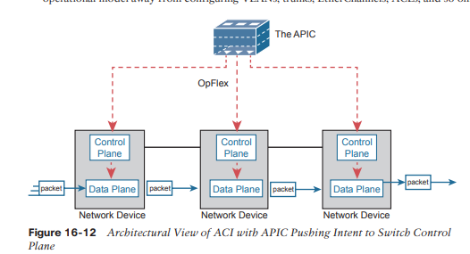
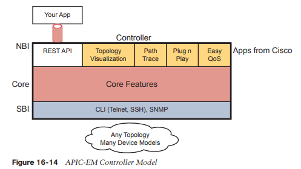

# Introducción a las redes basadas en controladores

Este capítulo cubre los siguientes temas del examen:

- Fundamentos de la red
	  - Explicar el papel y la función de los componentes de la red.
		  - Puntos finales
		  - Servidores
  - Describir las características de las arquitecturas de topología de red.
	  - Lomo-hoja
- Automatización y Programabilidad
	  - Explicar cómo la automatización afecta la gestión de la red.
		  - Compare las redes tradicionales con las redes basadas en controladores
		  - Describir arquitecturas definidas por software y basadas en controladores (superposición, base y estructura)
  - Separación del plano de control y plano de datos.
	  - API en dirección norte y sur

La certificación CCNA se centra en el modelo tradicional de operación y control de redes, un modelo que existe desde hace décadas. Usted comprende los protocolos que utilizan los dispositivos, junto con los comandos que pueden personalizar el funcionamiento de esos protocolos. Luego planifica e implementa la configuración distribuida en los dispositivos, dispositivo por dispositivo, para implementar la red.

La década de 2010 vio la introducción de un nuevo modelo operativo de red: redes definidas por software (SDN). SDN hace uso de un controlador que centraliza algunas funciones de la red. El controlador también crea muchas capacidades nuevas para operar redes de manera diferente; en particular, los controladores permiten que los programas configuren y operen redes automáticamente a través de interfaces de programación de aplicaciones (API) de energía.

Con las redes tradicionales, el ingeniero de redes configuraba los diversos dispositivos y cambios que requerían un largo período de tiempo para planificar e implementar los cambios. Con redes basadas en controladores y SDN, los ingenieros y operadores de redes pueden implementar cambios más rápidamente, con mayor coherencia y, a menudo, con mejores prácticas operativas.

Este capítulo presenta los conceptos de programabilidad de red y SDN. Tenga en cuenta que el área temática es amplia y este capítulo proporciona suficientes detalles para que comprenda los conceptos básicos y esté preparado para los otros tres capítulos de esta parte.

La primera sección principal de este capítulo presenta los conceptos básicos de datos y planos de control, junto con los controladores y la arquitectura relacionada. Luego, la segunda sección muestra ejemplos separados de productos de programabilidad de red utilizando controladores, todos los cuales utilizan diferentes métodos para implementar funciones de red. La última sección adopta un enfoque un poco más específico del examen para estos temas, comparando los beneficios de las redes tradicionales con los beneficios de las redes basadas en controladores.
### SDN y redes basadas en controladores
Los dispositivos de red reenvían datos en forma de mensajes, normalmente tramas de enlace de datos como las tramas de Ethernet. Ha aprendido cómo los conmutadores y enrutadores realizan ese reenvío durante toda la preparación para el examen CCNA.

La programabilidad de redes y las redes definidas por software (SDN) toman esas ideas, analizan las piezas, encuentran formas de mejorarlas para las necesidades actuales y vuelven a ensamblar esas ideas en una nueva forma de hacer que las redes funcionen. Al final de esa reorganización, los dispositivos en la red aún reenvían mensajes, pero el cómo y el por qué han cambiado.

Esta primera sección importante explica los conceptos más centrales de SDN y programabilidad de red. Comienza desglosando algunos de los componentes de lo que existe en los dispositivos de red tradicionales. Luego, esta sección explica cómo algún software de controlador centralizado, llamado controlador, crea una arquitectura para facilitar el control programático de una red.
### Los planos de datos, control y gestión
Deténgase y piense en lo que hacen los dispositivos de red. ¿Qué hace un enrutador? ¿Qué hace un interruptor?

Deberían venir a la mente muchas ideas. Por ejemplo, los enrutadores y conmutadores se conectan físicamente entre sí mediante cables y de forma inalámbrica para crear redes. Reenvían mensajes: los conmutadores reenvían tramas Ethernet y los enrutadores reenvían paquetes. Utilizan muchos protocolos diferentes para aprender información útil, como protocolos de enrutamiento para aprender rutas de capa de red.

Todo lo que hacen los dispositivos de red se puede clasificar en un plano particular. Esta sección toma esos datos familiares sobre cómo funcionan los dispositivos de red y describe los tres planos más utilizados para describir cómo funciona la programabilidad de la red: el plano de datos, el plano de control y el plano de administración.
### El plano de datos
El término _plano de datos_ se refiere a las tareas que realiza un dispositivo de red para reenviar un mensaje. En otras palabras, cualquier cosa que tenga que ver con recibir datos, procesarlos y reenviar esos mismos datos (ya sea que llame a los datos una trama, un paquete o, más genéricamente, un mensaje) es parte del plano de datos.

Por ejemplo, piense en cómo los enrutadores reenvían paquetes IP, como se muestra en la Figura 16-1. Si se concentra en la lógica de la Capa 3 por un momento, el host envía el paquete (paso 1) a su enrutador predeterminado, R1. R1 procesa algo el paquete recibido, toma una decisión de reenvío (enrutamiento) y reenvía el paquete (paso 2). Los enrutadores R3 y R4 también reciben, procesan y reenvían el paquete (pasos 3 y 4).


Ahora amplíe su pensamiento por un momento e intente pensar en todo lo que podría hacer un enrutador o conmutador al recibir, procesar y reenviar un mensaje. Por supuesto, la decisión de reenviar es parte de la lógica; de hecho, el plano de datos a menudo se denomina _plano de reenvío_. Pero piense más allá de hacer coincidir la dirección de destino con una tabla. Para tener una perspectiva, la siguiente lista detalla algunas de las acciones más comunes que realiza un dispositivo de red que encaja en el plano de datos:
- Desencapsular y reencapsular un paquete en una trama de enlace de datos (enrutadores, conmutadores de capa 3)
- Agregar o eliminar un encabezado de enlace troncal 802.1Q (enrutadores y conmutadores)
- Hacer coincidir la dirección de control de acceso al medio (MAC) de destino de una trama Ethernet con la tabla de direcciones MAC (conmutadores de capa 2)
- Hacer coincidir la dirección IP de destino de un paquete IP con la tabla de enrutamiento IP (enrutadores, conmutadores de capa 3)
- Cifrar los datos y agregar un nuevo encabezado IP (para procesamiento de red privada virtual [VPN])
- Cambiar la dirección IP de origen o destino (para el procesamiento de traducción de direcciones de red [NAT])
- Descartar un mensaje debido a un filtro (listas de control de acceso [ACL], seguridad de puertos)

Todos los elementos de la lista forman el plano de datos, porque el plano de datos incluye todas las acciones realizadas por mensaje.
### El plano de control
A continuación, tómate un momento para reflexionar sobre los tipos de información que el plano de datos necesita conocer de antemano para que pueda funcionar correctamente. Por ejemplo, los enrutadores necesitan rutas IP en una tabla de enrutamiento antes de que el plano de datos pueda reenviar paquetes. Los conmutadores de capa 2 necesitan entradas en una tabla de direcciones MAC antes de poder reenviar tramas Ethernet al mejor puerto para llegar al destino. Los conmutadores deben utilizar el protocolo Spanning Tree (STP) para limitar qué interfaces se pueden utilizar para el reenvío, de modo que el plano de datos funcione bien y no haga bucles de tramas para siempre.

Desde una perspectiva, la información suministrada al plano de datos controla lo que hace el plano de datos. Por ejemplo, un enrutador necesita una ruta que coincida con la dirección de destino de un paquete para saber cómo enrutar (reenviar) el paquete. Cuando el plano de datos de un enrutador intenta hacer coincidir la tabla de enrutamiento y no encuentra ninguna ruta coincidente, el enrutador descarta el paquete. ¿Y qué controla el contenido de la tabla de enrutamiento? Varios procesos del plano de control.

El término _plano de control_ se refiere a cualquier acción que controle el plano de datos. La mayoría de estas acciones tienen que ver con la creación de las tablas utilizadas por el plano de datos, tablas como la tabla de enrutamiento IP, una tabla del Protocolo de resolución de direcciones IP (ARP), una tabla de direcciones MAC del conmutador, etc. Al agregar, eliminar y cambiar entradas en las tablas utilizadas por el plano de datos, los procesos del plano de control controlan lo que hace el plano de datos. Ya conoce muchos protocolos del plano de control; por ejemplo, todos los protocolos de enrutamiento IP.

Las redes tradicionales utilizan tanto un plano de datos distribuido como un plano de control distribuido. En otras palabras, cada dispositivo tiene un plano de datos y un plano de control, y la red distribuye esas funciones en cada dispositivo individual, como se muestra en el ejemplo de la Figura 16-2.


En la figura, Abrir primero la ruta más corta (OSPF), el protocolo del plano de control, se ejecuta en cada enrutador (es decir, se distribuye entre todos los enrutadores). Luego, OSPF en cada enrutador agrega, elimina y cambia la tabla de enrutamiento IP en cada enrutador. Una vez completada con rutas útiles, la tabla de enrutamiento IP del plano de datos en cada enrutador puede reenviar paquetes entrantes, como se muestra de izquierda a derecha en la parte inferior de la figura. La siguiente lista incluye muchos de los protocolos del plano de control más comunes:
- Protocolos de enrutamiento (OSPF, Protocolo de enrutamiento de puerta de enlace interior mejorado [EIGRP], Protocolo de información de enrutamiento [RIP], Protocolo de puerta de enlace fronteriza [BGP])
- IPv4 ARP
- Protocolo de descubrimiento de vecinos (NDP) IPv6
- Cambiar aprendizaje MAC
- TPS

Sin los protocolos y actividades del plano de control, el plano de datos de los dispositivos de red tradicionales no funcionaría bien. Los enrutadores serían prácticamente inútiles sin rutas aprendidas mediante un protocolo de enrutamiento. Sin aprender las entradas de la tabla MAC, un conmutador aún podría reenviar unidifusión inundándolas, pero hacerlo para todas las tramas crearía mucha más carga en la red de área local (LAN) en comparación con las operaciones normales del conmutador. Por lo tanto, el plano de datos debe depender del plano de control para proporcionar información útil.
### El plano de gestión
El plano de control realiza tareas generales que impactan directamente el comportamiento del plano de datos. El _plano de gestión_ también realiza trabajos generales, pero ese trabajo no afecta directamente al plano de datos. En cambio, el plano de gestión incluye protocolos que permiten a los ingenieros de redes gestionar los dispositivos.

Telnet y Secure Shell (SSH) son dos de los protocolos del plano de gestión más obvios. Para enfatizar la diferencia con los protocolos del plano de control, piense en dos enrutadores: uno configurado para permitir Telnet y SSH en el enrutador y otro que no. Ambos podrían seguir ejecutando un protocolo de enrutamiento y enrutando paquetes, ya sea que admitan Telnet y SSH o no.

La Figura 16-3 amplía el ejemplo mostrado en la Figura 16-2 mostrando ahora el plano de gestión, con varios protocolos del plano de gestión.


### Partes internas del plano de datos del conmutador Cisco
Para comprender mejor SDN y la programabilidad de la red, es útil pensar en los aspectos internos de los conmutadores. El próximo tema hace precisamente eso.

Desde los primeros días de los dispositivos llamados conmutadores LAN, los conmutadores tenían que utilizar hardware especializado para reenviar fotogramas, debido a la gran cantidad de fotogramas por segundo (fps) necesarios. Para tener una idea del volumen de tramas que un conmutador debe poder reenviar, considere el tamaño mínimo de trama de una trama Ethernet, la cantidad de puertos en un conmutador y las velocidades de los puertos; Incluso los conmutadores de gama baja deben poder reenviar millones de fotogramas por segundo. Por ejemplo, si un fabricante de conmutadores quisiera determinar qué tan rápido debe ser su plano de datos en un nuevo conmutador de capa de acceso con 24 puertos, podría resolver este problema matemático:
- El conmutador tiene 24 puertos.
- Cada puerto funciona a 1 Gbps.
- Para este análisis, suponga que las tramas tienen una longitud de 125 bytes (para facilitar las matemáticas, porque cada trama tiene una longitud de 1000 bits).
- Con una trama de 1.000 bits de longitud y una velocidad de 1.000.000.000 bits/segundo, un puerto puede enviar 1.000.000 de tramas por segundo (fps).
- Utilice full duplex en todos los puertos, de modo que el conmutador pueda recibir en los 24 puertos al mismo tiempo.
- Resultado: Cada puerto recibiría 1.000.000 fps, para un total de 24 millones de fps, por lo que el plano de datos del conmutador tendría que estar listo para procesar 24 millones de fps.

Aunque 24 millones de fps puede parecer mucho, el objetivo aquí no es establecer un número absoluto de qué tan rápido debe ser el plano de datos de un conmutador para una era determinada de tecnología de conmutación. En cambio, desde su primera introducción en el mercado a mediados de la década de 1990, los conmutadores LAN necesitaban un plano de datos más rápido que el que una CPU generalizada podía procesar en software. Como resultado, los conmutadores de hardware siempre han tenido hardware especializado para realizar el procesamiento del plano de datos.

En primer lugar, la lógica de conmutación no se produce en la CPU con software, sino en un _circuito integrado específico de la aplicación_ (ASIC). Un ASIC es un chip construido para propósitos específicos, como el procesamiento de mensajes en un dispositivo de red.

En segundo lugar, el ASIC necesita realizar una búsqueda en la tabla de direcciones MAC, por lo que para una búsqueda rápida de tablas, el conmutador utiliza un tipo especializado de memoria para almacenar el equivalente de la tabla de direcciones MAC: _memoria direccionable por contenido ternario_ (TCAM). La memoria TCAM no requiere que el ASIC ejecute bucles a través de un algoritmo para buscar en la tabla. En cambio, el ASIC puede introducir los campos que deben coincidir, como un valor de dirección MAC, en el TCAM, y el TCAM devuelve la entrada de la tabla coincidente, sin necesidad de ejecutar un algoritmo de búsqueda.

Tenga en cuenta que un conmutador también tiene una CPU y RAM de uso general, como se muestra en la Figura 16-4. IOS se ejecuta en la CPU y usa RAM. La mayoría de las funciones del plano de control y gestión se ejecutan en IOS. La función del plano de datos (y la función del plano de control del aprendizaje MAC) ocurre en el ASIC.


Tenga en cuenta que algunos enrutadores también utilizan hardware para funciones del plano de datos, por el mismo tipo de razones por las que los conmutadores utilizan hardware. (Por ejemplo, consulte Cisco Quantum Flow Processor para obtener lecturas interesantes sobre el reenvío del plano de datos de hardware en los enrutadores Cisco). Las ideas de un plano de datos de hardware en los enrutadores son similares a las de los conmutadores: utilice un ASIC especialmente diseñado para la lógica de reenvío y TCAM para almacenar las tablas requeridas para una búsqueda rápida de tablas.
### Controladores y arquitectura definida por software
En la década de 2010 surgieron nuevos enfoques de creación de redes, enfoques que cambian el lugar donde ocurren algunas de las funciones del plano de control. Muchos de esos enfoques trasladan partes del trabajo del plano de control a un software que se ejecuta como una aplicación centralizada llamada _controlador_. El siguiente tema analiza los conceptos del controlador y las interfaces de los dispositivos que se encuentran debajo del controlador y de cualquier programa que utilice el controlador.
### Controladores y Control Centralizado
La mayoría de los procesos del plano de control tradicionales utilizan una arquitectura distribuida. Por ejemplo, cada enrutador ejecuta su propio proceso de protocolo de enrutamiento OSPF. Para hacer su trabajo, esos procesos del plano de control distribuido utilizan mensajes para comunicarse entre sí, como mensajes del protocolo OSPF entre enrutadores. Como resultado, se dice que las redes tradicionales utilizan un _plano de control distribuido_.

Las personas que crearon los conceptos actuales del plano de control, como STP, OSPF, EIGRP, etc., podrían haber optado por utilizar un plano de control centralizado. Es decir, podrían haber colocado la lógica en un solo lugar, ejecutándola en un dispositivo o en un servidor. Entonces, el software centralizado podría haber utilizado mensajes de protocolo para aprender información de los dispositivos, pero con todo el procesamiento de la información en una ubicación centralizada. Pero en lugar de eso eligieron una arquitectura distribuida.

Existen ventajas y desventajas en el uso de arquitecturas distribuidas y centralizadas para realizar cualquier función en una red. Muchas funciones del plano de control tienen una larga historia de funcionar bien con una arquitectura distribuida. Sin embargo, una aplicación centralizada puede ser más fácil de escribir que una aplicación distribuida, porque la aplicación centralizada tiene todos los datos reunidos en un solo lugar. Y este mundo emergente de arquitecturas definidas por software a menudo utiliza una arquitectura centralizada, con un plano de control centralizado, con sus cimientos en un servicio llamado controlador.

Un _controlador_, o _controlador SDN_, centraliza el control de los dispositivos de red. El grado de control y el tipo de control varían ampliamente. Por ejemplo, el controlador puede realizar todas las funciones del plano de control, reemplazando el plano de control distribuido de los dispositivos. Alternativamente, el controlador puede simplemente estar al tanto del trabajo continuo de los planos de gestión, control y datos distribuidos en los dispositivos, sin cambiar su funcionamiento. Y la lista continúa, con muchas variaciones.

Para comprender mejor la idea de un controlador, considere un caso específico como se muestra en la Figura 16-5, en el que un controlador SDN centraliza todas las funciones importantes del plano de control. Primero, el controlador se ubica en cualquier lugar de la red que tenga acceso IP a los dispositivos de la red. Cada uno de los dispositivos de la red todavía tiene un plano de datos; sin embargo, tenga en cuenta que ninguno de los dispositivos tiene un plano de control. En la variación de SDN como se muestra en la Figura 16-5, el controlador programa directamente las entradas del plano de datos en las tablas de cada dispositivo. Los dispositivos de red no llenan sus tablas de reenvío con procesos tradicionales del plano de control distribuido.

La Figura 16-5 muestra un modelo de programabilidad de red y SDN, pero no todos. La figura nos brinda un excelente telón de fondo para discutir algunos conceptos básicos más importantes; en particular, la idea de una interfaz en dirección sur (SBI) y una interfaz en dirección norte (NBI).

### La interfaz hacia el sur
En una arquitectura de red basada en controlador, el controlador necesita comunicarse con los dispositivos de red. En la mayoría de los dibujos de red y de arquitectura, esos dispositivos de red normalmente se ubican debajo del controlador, como se muestra en la Figura 16-5. Existe una interfaz entre el controlador y esos dispositivos y, dada su ubicación en la parte inferior de los dibujos, la interfaz pasó a conocerse como _interfaz en dirección sur_, o SBI, como se indica en la Figura 16-5.

Existen varias opciones diferentes para el OSE. El objetivo general es la programabilidad de la red, por lo que la interfaz deja de ser sólo un protocolo. Un SBI a menudo incluye un protocolo para que el controlador y los dispositivos puedan comunicarse, pero a menudo incluye una _interfaz de programación de aplicaciones_ (API). Una API es un método para que una aplicación (programa) intercambie datos con otra aplicación. Reorganizando las palabras para describir la idea, una API es una interfaz para un programa de aplicación. Los programas procesan datos, por lo que una API permite que dos programas intercambien datos. Mientras que un protocolo existe como un documento, a menudo proveniente de un organismo de estándares, una API a menudo existe como código utilizable (funciones, variables y estructuras de datos) que un programa puede utilizar para comunicar y copiar datos estructurados entre los programas a través de una red.

Entonces, volvamos al término _SBI_: es una interfaz entre un programa (el controlador) y un programa (en el dispositivo de red) que permite que los dos programas se comuniquen, con el objetivo de permitir que el controlador programe las tablas de reenvío del plano de datos. del dispositivo de red.

Como era de esperar, en una arquitectura de red destinada a permitir la programabilidad de la red, las capacidades de los SBI y sus API nos dicen mucho sobre lo que esa arquitectura en particular puede y no puede hacer. Por ejemplo, algunos controladores pueden admitir uno o varios SBI, para un propósito específico, mientras que otros pueden admitir muchos más SBI, lo que permite elegir entre distintos SBI. Las comparaciones de OSE van mucho más allá de este capítulo, pero ayuda pensar en algunas; la segunda sección principal ofrece tres arquitecturas de muestra que muestran tres SBI separados, específicamente:
- OpenFlow (de la ONF; [www.opennetworking.org)](http://www.opennetworking.org/)
- OpFlex (de Cisco; usado con ACI)
- CLI (Telnet/SSH) y SNMP (usado con Cisco APIC-EM)
- CLI (Telnet/SSH) y SNMP y NETCONF (usado con acceso definido por software de Cisco)
### La interfaz en dirección norte
Piense en la programación requerida en el controlador relacionada con el ejemplo de la Figura 16-5. La figura se centra en el hecho de que el controlador puede agregar entradas a las tablas de reenvío del dispositivo de red; sin embargo, ¿cómo sabe el controlador qué agregar? ¿Cómo elige? ¿Qué tipo de información necesitaría recopilar su programa antes de intentar agregar algo como entradas de tablas MAC o rutas IP a una red? Podrías pensar en estos:
- Una lista de todos los dispositivos en la red.
- Las capacidades de cada dispositivo.
- Las interfaces/puertos de cada dispositivo
- El estado actual de cada puerto.
- La topología: qué dispositivos se conectan a qué, a través de qué interfaces
- Configuración del dispositivo: direcciones IP, VLAN, etc., según lo configurado en los dispositivos

Un controlador realiza gran parte del trabajo necesario para el plano de control en un modelo de control centralizado. Recopila todo tipo de información útil sobre la red, como los elementos de la lista anterior. El propio controlador puede crear un depósito centralizado de toda esta información útil sobre la red.

La interfaz norte (NBI) de un controlador abre el controlador para que otros programas puedan utilizar sus datos y funciones, lo que permite la programabilidad de la red con un desarrollo mucho más rápido. Los programas pueden extraer información del controlador mediante las API del controlador. Los NBI también permiten que los programas utilicen las capacidades del controlador para programar flujos en los dispositivos utilizando los SBI del controlador.

Para ver dónde reside el NBI, primero piense en el controlador mismo. El controlador es un software que se ejecuta en algún servidor, que puede ser una máquina virtual o un servidor físico. Una aplicación puede ejecutarse en el mismo servidor que el controlador y utilizar una NBI, que es una API, para que dos programas puedan comunicarse.

La figura 16-6 muestra precisamente un ejemplo de este tipo. El cuadro grande en la figura representa el sistema donde reside el software del controlador. Este controlador en particular está escrito en Java y tiene una API nativa basada en Java. Cualquiera (el mismo proveedor que el controlador, otra empresa o incluso usted) puede escribir una aplicación que se ejecute en este mismo sistema operativo que utiliza la API Java del controlador. Al utilizar esa API para intercambiar datos con el controlador, la aplicación puede obtener información sobre la red. La aplicación también puede programar flujos en la red, es decir, pedirle al controlador que agregue la lógica (flujos) de coincidencia/acción específica en las tablas de reenvío de los dispositivos de red.


Antes de dejar el tema de las NBI, permítanme cerrar con una breve explicación de una API REST tal como se usa para un controlador. REST (_Representational State Transfer_) describe un tipo de API que permite que las aplicaciones se ubiquen en diferentes hosts, utilizando mensajes HTTP para transferir datos a través de la API. Cuando ve figuras SDN como la Figura 16-6, con la aplicación ejecutándose en el mismo sistema que el controlador, la API no necesita enviar mensajes a través de una red porque ambos programas se ejecutan en el mismo sistema. Pero cuando la aplicación se ejecuta en un sistema diferente en algún otro lugar de la red que no sea el controlador, la API necesita una forma de enviar los datos de un lado a otro a través de una red IP, y las API RESTful satisfacen esa necesidad.

La Figura 16-7 muestra las grandes ideas con una API REST. La aplicación se ejecuta en un host en la parte superior de la figura. En este caso, en el paso 1, envía una solicitud HTTP GET a un URI particular. El HTTP GET es como cualquier otro HTTP GET, incluso como los que se utilizan para recuperar páginas web. Sin embargo, el URI no es para una página web, sino que identifica un objeto en el controlador, normalmente una estructura de datos que la aplicación necesita aprender y luego procesar. Por ejemplo, el URI podría identificar un objeto que es la lista de interfaces físicas en un dispositivo específico junto con el estado de cada una.


En el paso 2, el controlador envía un mensaje de respuesta HTTP GET con el objeto. La mayoría de las API REST solicitarán y recibirán datos estructurados. Es decir, en lugar de recibir datos que son una página web, como los recibiría un navegador web, la respuesta contiene nombres de variables y sus valores, en un formato que un programa puede utilizar fácilmente. Los formatos comunes de datos utilizados para la programabilidad de la red son la notación de objetos JavaScript (JSON) y el lenguaje de marcado extensible (XML), que se muestran en el paso 3.
### Resumen de arquitectura definida por software
SDN y la programabilidad de la red introducen una nueva forma de construir redes. Los dispositivos de red todavía existen y aún envían datos, pero las funciones y ubicaciones del plano de control pueden cambiar drásticamente. El controlador centralizado actúa como punto focal, de modo que al menos algunas de las funciones del plano de control pasan de un modelo distribuido a un modelo centralizado.

Sin embargo, el mundo de la programabilidad de redes y SDN incluye una amplia gama de opciones y soluciones. Algunas opciones incorporan la mayoría de las funciones del plano de control al controlador, mientras que otras incorporan solo algunas de esas funciones al controlador. La siguiente sección analiza tres opciones diferentes, cada una de las cuales adopta un enfoque diferente para la programabilidad de la red y el grado de control centralizado.
### Ejemplos de programabilidad de red y SDN
Esta segunda de las tres secciones principales del capítulo presenta tres soluciones SDN y de programabilidad de red diferentes disponibles en Cisco. Otros también existen. Se eligieron estos tres porque ofrecen una amplia gama de puntos de comparación:
- Controlador OpenDaylight
- Infraestructura centrada en aplicaciones de Cisco (ACI)
- Módulo empresarial Cisco APIC (APIC-EM)
### OpenDaylight y OpenFlow
Una forma común de SDN proviene de Open Networking Foundation (ONF) y se anuncia como Open SDN. La ONF [(www.opennetworking.org)](http://www.opennetworking.org/) actúa como un consorcio de usuarios (operadores) y proveedores para ayudar a establecer SDN en el mercado. Parte de ese trabajo define protocolos, SBI, NBI y cualquier cosa que ayude a las personas a implementar su visión de SDN.

El modelo ONF de SDN presenta OpenFlow. OpenFlow define el concepto de controlador junto con un SBI basado en IP entre el controlador y los dispositivos de red. Igual de importante es que OpenFlow define una idea estándar de cuáles son las capacidades de un conmutador, basada en los ASIC y TCAM que se utilizan comúnmente en los conmutadores actuales. (Esa idea estandarizada de lo que hace un conmutador se llama _abstracción de conmutador_). Un conmutador OpenFlow puede actuar como un conmutador de Capa 2, un conmutador de Capa 3, o de diferentes maneras y con gran flexibilidad más allá del modelo tradicional de un conmutador de Capa 2/3. cambiar.

El modelo Open SDN centraliza la mayoría de las funciones del plano de control, con el control de la red realizado por el controlador más cualquier aplicación que utilice los NBI del controlador. De hecho, la Figura 16-5 anterior, que mostraba los dispositivos de red sin un plano de control, representa este modelo OpenFlow de SDN mayoritariamente centralizado.

En el modelo OpenFlow, las aplicaciones pueden usar cualquier API (NBI) compatible con la plataforma del controlador para dictar qué tipos de entradas de la tabla de reenvío se colocan en los dispositivos; sin embargo, exige OpenFlow como protocolo SBI. Además, los dispositivos de red deben ser conmutadores que admitan OpenFlow.

Debido a que el modelo Open SDN de ONF tiene este hilo común de un controlador con un OpenFlow SBI, el controlador juega un papel importante en la red. Las próximas páginas proporcionan una breve descripción general de dos de estos controladores.
### El controlador OpenDaylight
Primero, si mirara hacia atrás en la historia de OpenFlow, podría encontrar información sobre docenas de controladores SDN diferentes que admiten el modelo OpenFlow SDN. Algunos estaban más orientados a la investigación, durante los años en que se estaba desarrollando SDN y era más una idea experimental. Con el paso del tiempo, más y más proveedores comenzaron a construir sus propios controladores. Y esos controladores a menudo tenían muchas características similares, porque intentaban lograr muchos de los mismos objetivos. Como era de esperar, eventualmente fue necesario que se produjera cierta consolidación.

El controlador SDN de código abierto OpenDaylight es una de las plataformas de controlador SDN más exitosas que surgieron del proceso de consolidación durante la década de 2010. OpenDaylight tomó muchos de los mismos principios de código abierto utilizados con Linux, con la idea de que si suficientes proveedores trabajaran juntos en un controlador de código abierto común, todos se beneficiarían. Todos esos proveedores podrían entonces utilizar el controlador de código abierto como base para sus propios productos, y cada proveedor se centraría en la parte del esfuerzo de diferenciación del producto, en lugar de en las características fundamentales. El resultado fue que, a mediados de la década de 2010, nació el _controlador SDN OpenDaylight_ [(www.opendaylight.org)](http://www.opendaylight.org/). OpenDaylight (ODL) comenzó como un proyecto independiente pero ahora existe como un proyecto gestionado por la Fundación Linux.

La Figura 16-8 muestra una versión generalizada de la arquitectura ODL. En particular, observe la variedad de SBI enumerados en la parte inferior de la caja del controlador: OpenFlow, NetConf, PCEP, BGP-LS y OVSDB; existen muchos más. El proyecto ODL tiene suficientes participantes para incluir una gran variedad de opciones, incluidos múltiples SBI, no solo OpenFlow.


ODL tiene muchas funciones, con muchos SBI y muchas funciones principales. Luego, un proveedor puede tomar ODL, utilizar las piezas que tengan sentido para ese proveedor, agregarlas y crear un controlador ODL comercial.
### El controlador Cisco Open SDN (OSC)
En un momento, allá por la década de 2010, Cisco ofreció una versión comercial del controlador OpenDaylight llamado Cisco _Open SDN Controller_ (OSC). Ese controlador siguió el modelo previsto para el proyecto ODL: Cisco y otros contribuyeron con mano de obra y dinero al proyecto de código abierto ODL; Una vez que se completó una nueva versión, Cisco la tomó y creó nuevas versiones de su producto.

Cisco ya no produce ni vende Cisco OSC, pero decidí mantener una breve sección sobre OSC aquí en este capítulo por un par de razones. Primero, si realiza su propia investigación, encontrará menciones de Cisco OSC; sin embargo, mucho antes de que se escribiera este capítulo en 2019, Cisco había dado un fuerte paso estratégico hacia diferentes enfoques de SDN utilizando redes basadas en intenciones (IBN). Ese movimiento alejó a Cisco del SDN basado en OpenFlow. Pero como es posible que vea referencias a Cisco OSC en línea o en la edición anterior de este libro, quería señalar esta transición en dirección a Cisco.

Este libro describe dos ofertas de Cisco que utilizan un enfoque IBN para SDN. El siguiente tema de este capítulo examina uno de ellos: Application Centric Infrastructure (ACI), el producto SDN del centro de datos de Cisco. El Capítulo 17, “Acceso definido por software de Cisco”, analiza otra opción de Cisco SDN que utiliza redes basadas en intención: el acceso definido por software (SDA).
### Infraestructura centrada en aplicaciones (ACI) de Cisco
Curiosamente, muchas ofertas de SDN comenzaron con investigaciones que descartaron muchos de los viejos paradigmas de redes en un intento de crear algo nuevo y mejor. Por ejemplo, OpenFlow surgió del proyecto de investigación Clean Slate de la Universidad de Stanford en el que los investigadores reinventaron (entre otras cosas) las arquitecturas de los dispositivos. Cisco tomó un camino de investigación similar, pero su trabajo surgió de diferentes grupos, cada uno centrado en diferentes partes de la red: centro de datos, campus y WAN. Esa investigación dio como resultado las ofertas SDN actuales de Cisco: ACI en el centro de datos, acceso definido por software (SDA) en el campus empresarial y WAN definida por software (SD-WAN) en la WAN empresarial.

Al reinventar las redes para el centro de datos, los diseñadores de SCI se centraron en las aplicaciones que se ejecutan en un centro de datos y en lo que necesitan. Como resultado, crearon conceptos de redes en torno a arquitecturas de aplicaciones. Cisco hizo que la infraestructura de red se centrara en las aplicaciones, de ahí el nombre de la solución SDN del centro de datos de Cisco: _Application Centric Infrastructure_, o ACI.

Por ejemplo, Cisco miró el mundo de los centros de datos más allá de las redes y vio mucha automatización y control. Como se analizó en el Capítulo 15, “Arquitectura de la nube”, el software de virtualización inicia, mueve y detiene las máquinas virtuales de forma rutinaria. Además, el software en la nube permite a los clientes el autoservicio para que puedan habilitar y deshabilitar servicios altamente elásticos tal como se implementan con máquinas virtuales y contenedores en un centro de datos. Desde una perspectiva de red, algunas de esas máquinas virtuales necesitan comunicarse, pero otras no. Y esas máquinas virtuales pueden moverse según las necesidades de los sistemas de virtualización y nube.

ACI se propuso crear redes de centros de datos con la flexibilidad y la automatización integradas en el modelo operativo. Los viejos modelos de redes de centros de datos con mucha configuración por interfaz física en conmutadores y enrutadores eran simplemente modelos deficientes para el rápido ritmo de cambio y la naturaleza automatizada de los centros de datos modernos. Esta sección analiza algunos de los detalles de ACI para darle una idea de cómo ACI crea una red potente y flexible para respaldar un centro de datos moderno en el que las máquinas virtuales y los contenedores se crean, ejecutan, mueven y se detienen dinámicamente como una cuestión de tiempo. rutina.
### Diseño físico ACI: lomo y hoja
Cisco ACI utiliza una topología de conmutador físico específica llamada columna y hoja. Si bien es posible que las otras partes de una red deban permitir muchas topologías físicas diferentes, el centro de datos podría hacerse estándar y consistente. Pero ¿qué topología estándar y consistente en particular? Cisco se decidió por el diseño de la columna y la hoja, también llamada red Clos en honor a uno de sus creadores.

Con ACI, la red física tiene varios conmutadores espinales y varios conmutadores de hoja, como se muestra en la Figura 16-9. La figura muestra los enlaces entre conmutadores, que pueden ser enlaces únicos o múltiples enlaces paralelos. Es de destacar en este diseño (asumiendo un diseño de sitio único):
- Cada interruptor de hoja debe conectarse a cada interruptor de columna.
- Cada interruptor de columna debe conectarse a cada interruptor de hoja.
- Los interruptores de hoja no pueden conectarse entre sí.
- Los interruptores de la columna vertebral no se pueden conectar entre sí.
- Los puntos finales se conectan solo a los interruptores de hoja.


Los puntos finales se conectan solo a interruptores de hoja y nunca a interruptores de columna. Para enfatizar este punto, la Figura 16-10 muestra una versión más detallada de la Figura 16-9, esta vez con puntos finales conectados a los interruptores de hoja. Ninguno de los puntos finales se conecta a los conmutadores principales; se conectan solo a los interruptores de hoja. Los puntos finales pueden ser conexiones a dispositivos fuera del centro de datos, como el enrutador de la izquierda. Por volumen, la mayoría de los puntos finales serán servidores físicos que ejecutan un sistema operativo nativo o servidores que ejecutan software de virtualización con una cantidad de máquinas virtuales y contenedores, como se muestra en el centro de la figura.

Además, tenga en cuenta que la figura muestra un diseño típico con conmutadores de múltiples hojas que se conectan a un único punto final de hardware, como un servidor Cisco Unified Computing System (UCS). Dependiendo de los requisitos de diseño, cada UCS podría conectarse a al menos dos conmutadores de hoja, tanto para redundancia como para mayor capacidad para admitir las máquinas virtuales y los contenedores que se ejecutan en el hardware de UCS. (De hecho, en un diseño pequeño con UCS o hardware de servidor similar, cada UCS podría conectarse a cada conmutador hoja).


### Modelo operativo de ACI con redes basadas en intenciones
El modelo que Cisco define para ACI utiliza un concepto de puntos finales y políticas. Los _puntos finales_ son las máquinas virtuales, contenedores o incluso servidores tradicionales con el sistema operativo ejecutándose directamente en el hardware. Luego, ACI utiliza varias construcciones implementadas a través del Controlador de infraestructura de políticas de aplicaciones (APIC), el software que sirve como controlador centralizado para ACI.

Esta sección espera brindarle una idea de ACI, en lugar de abordar cada característica. Para hacerlo, considere por un momento la arquitectura de una aplicación web empresarial típica. La mayoría de los observadores casuales piensan que una aplicación web es una entidad, pero una aplicación web a menudo existe como tres servidores separados:
- **Servidor web:** Los usuarios externos al centro de datos se conectan a un servidor web, que envía el contenido de la página web al usuario.
- **Servidor de aplicaciones (aplicaciones):** Debido a que la mayoría de las páginas web contienen contenido dinámico, el servidor de aplicaciones realiza el procesamiento para crear la siguiente página web para ese usuario en particular según el perfil del usuario y las últimas acciones y aportes.
- **Servidor DB (base de datos):** Muchas de las acciones del servidor de aplicaciones requieren datos; el servidor de base de datos recupera y almacena los datos según lo solicitado por el servidor de aplicaciones.

Para dar cabida a esas ideas, ACI utiliza un modelo de red basado en intenciones (IBN). Con ese modelo, el ingeniero, o algún programa de automatización, define las políticas y la intención de qué puntos finales deben poder comunicarse y cuáles no. Luego, el controlador determina lo que eso significa para esta red en este momento, dependiendo de dónde se encuentren los puntos finales en este momento.

Por ejemplo, al iniciar las máquinas virtuales para esta aplicación, el software de virtualización crearía (a través de APIC) varios grupos de puntos finales (EPG), como se muestra en la Figura 16-11. También se le deben informar al controlador las políticas de acceso, que definen qué EPG deberían poder comunicarse (y cuáles no), como se implica en la figura con líneas de flechas. Por ejemplo, los enrutadores que se conectan a la red externa al centro de datos deberían poder enviar paquetes a todos los servidores web, pero no a los servidores de aplicaciones o bases de datos.


Tenga en cuenta que en ningún momento el párrafo anterior habló sobre qué interfaces de conmutador físico deben asignarse a qué VLAN, o qué puertos están en un EtherChannel; la discusión pasa a una visión centrada en las aplicaciones de lo que sucede en la red. Una vez que se definen todos los puntos finales, las políticas y los detalles relacionados, el controlador puede dirigir la red en cuanto a lo que debe estar en las tablas de reenvío para que todo suceda y reaccionar más fácilmente cuando las máquinas virtuales se inician, se detienen o se mueven. .

Para que todo funcione, ACI utiliza un controlador centralizado llamado _Controlador de infraestructura de políticas de aplicaciones_ (APIC), como se muestra en la Figura 16-12. El nombre define la función en este caso: es el controlador que crea políticas de aplicación para la infraestructura del centro de datos. El APIC toma la intención (EPG, políticas, etc.), lo que cambia completamente el modelo operativo y evita la configuración de VLAN, troncales, EtherChannels, ACL, etc.


### Plano
El APIC, por supuesto, tiene una GUI conveniente, pero el poder reside en el control del software, es decir, la programabilidad de la red. El mismo software de virtualización, o software de nube o de automatización, incluso scripts escritos por el ingeniero de red, pueden definir los grupos de puntos finales, las políticas, etc. en el APIC. Pero todos estos actores acceden al sistema ACI mediante una interfaz con el APIC como se muestra en la Figura 16-13; el ingeniero de redes ya no necesita conectarse a cada conmutador individual y configurar los comandos CLI.


Para obtener más información sobre Cisco ACI, vaya a [www.cisco.com/go/aci.](http://www.cisco.com/go/aci)
### Módulo empresarial Cisco APIC
El siguiente ejemplo de una solución Cisco SDN en esta sección, llamado _APIC Enterprise Module_ (APIC-EM), resuelve un problema diferente. Cuando Cisco comenzó a reinventar las redes en la empresa, vio una barrera enorme: la base instalada de sus propios productos en la mayoría de las redes de sus clientes. Cualquier solución SDN empresarial que utilizara nuevos SBI (SBI que solo admitían algunos de los dispositivos y niveles de software existentes) crearía una enorme barrera para su adopción.
### Conceptos básicos de APIC-EM
A Cisco se le ocurrieron un par de enfoques, uno de los cuales fue APIC-EM, que Cisco lanzó al público alrededor de 2015.

APIC-EM asume el uso de los mismos conmutadores y enrutadores tradicionales con sus familiares datos distribuidos y planos de control. Cisco rechazó la idea de que su solución inicial SDN (programabilidad de red) para toda la empresa pudiera comenzar exigiendo a los clientes que reemplazaran todo el hardware. En cambio, Cisco buscó formas de agregar los beneficios de la programabilidad de la red con un controlador centralizado manteniendo al mismo tiempo los mismos conmutadores y enrutadores tradicionales. Ese enfoque ciertamente podría cambiar con el tiempo (y lo ha hecho), pero Cisco APIC-EM hace precisamente eso: ofrecer SDN empresarial utilizando los mismos conmutadores y enrutadores ya instalados en las redes.

¿Qué ventajas puede aportar una arquitectura basada en controladores si los dispositivos de la red no tienen funciones nuevas? En resumen, agregar un controlador centralizado no hace nada en comparación con las antiguas ofertas de administración de red. Agregar un controlador centralizado con potentes API orientadas al norte abre muchas posibilidades para los clientes/operadores, al tiempo que crea un mundo en el que Cisco y sus socios pueden llevar al mercado nuevas e interesantes aplicaciones de gestión. Incluye estas aplicaciones, como se muestra en la Figura 16-14:
- **Mapa de topología:** La aplicación descubre y muestra la topología de la red.
- **Path Trace:** El usuario proporciona un dispositivo de origen y de destino, y la aplicación muestra la ruta a través de la red, junto con detalles sobre la decisión de reenvío en cada paso.
- **Plug and Play:** Esta aplicación proporciona soporte de instalación desde el día 0 para que pueda desembalar un nuevo dispositivo y hacerlo accesible mediante IP a través de la automatización en el controlador.
- **QoS fácil:** Con unas pocas decisiones simples en el controlador, puede configurar funciones QoS complejas en cada dispositivo.



APIC-EM no programa directamente los planos de datos o control, pero sí interactúa con el plano de gestión vía Telnet, SSH y/o SNMP; en consecuencia, puede impactar indirectamente los planos de datos y control. El controlador APIC-EM no programa flujos en tablas ni solicita al plano de control en los dispositivos que cambie su funcionamiento. Pero puede interrogar y conocer el estado de configuración y el estado operativo de cada dispositivo, y puede reconfigurar cada dispositivo, cambiando así la forma en que opera el plano de datos y control distribuido.
### Reemplazo de APIC-EM
Cisco anunció el examen CCNA actual (200-301) en 2019, y casi al mismo tiempo, Cisco anunció el fin del marketing del producto APIC-EM. Ese momento nos dejó con la decisión de incluir APIC-EM en este libro y, de ser así, en qué medida. Decidí mantener esta pequeña sección sobre APIC-EM por varias razones, una de ellas para darles estos pocos comentarios finales sobre el producto.

En primer lugar, a principios de la década de 2020 (los años en los que CCNA 200-301 probablemente seguirá siendo el examen actual) todavía verá muchas referencias a APIC-EM. Es probable que Cisco DevNet todavía tenga muchos laboratorios útiles que hagan referencia y utilicen APIC-EM, al menos durante algunos años. Además, APIC-EM nos brinda una gran herramienta para ver cómo se puede utilizar un controlador, incluso si los dispositivos de red no cambian su funcionamiento normal. Por eso creo que vale la pena leer algunas páginas para presentar APIC-EM como se hace en esta sección.

En segundo lugar, muchas de las funciones de APIC-EM se han convertido en características centrales del producto Cisco DNA Center (DNAC), que se analiza con cierto detalle en el Capítulo 17. La lista de aplicaciones justo encima de la Figura 16-14 de este capítulo también existe como parte de DNAC, por ejemplo. Por lo tanto, no busque APIC-EM versión 2, sino más bien busque oportunidades para utilizar DNAC.
### Resumen de los ejemplos de SDN
Las tres arquitecturas SDN de muestra en esta sección del libro se eligieron para proporcionar una amplia variedad con el fin de aprender. Sin embargo, difieren hasta cierto punto en la medida en que el trabajo del plano de control está centralizado. La Tabla 16-2 enumera esos y otros puntos de comparación tomados de esta sección, para facilitar su revisión y estudio.

| **Criteria**                                                                     | **OpenFlow** | **ACI**   | **APIC Enterprise** |
| -------------------------------------------------------------------------------- | ------------ | --------- | ------------------- |
| Changes how the device control plane works versus traditional networking         | Yes          | Yes       | No                  |
| Creates a centralized point from which humans and automation control the network | Yes          | Yes       | Yes                 |
| Degree to which the architecture centralizes the control plane                   | Mostly       | Partially | None                |
| SBIs used                                                                        | OpenFlow     | OpFlex    | CLI, SNMP           |
| Controllers mentioned in this chapter                                            | OpenDaylight | APIC      | APIC-EM             |
| Organization that is the primary definer/owner                                   | ONF          | Cisco     | Cisco               |

Si desea obtener más información sobre las soluciones de Cisco, considere utilizar Cisco DevNet (Cisco Developer Network) y dCloud (nube de demostración). Cisco proporciona su sitio DevNet [(https://developer.cisco.com)](https://developer.cisco.com/) para cualquier persona interesada en la programación de redes, y el sitio Demo Cloud [(https://dcloud. cisco.com)](https://dcloud.cisco.com/) para que cualquiera pueda experimentar o hacer una demostración de los productos Cisco. Al momento de imprimir este libro, DevNet tenía muchos laboratorios APIC-EM, mientras que ambos sitios tenían una variedad de laboratorios basados ​​en ACI.
### Comparación de redes tradicionales versus redes basadas en controladores
Antes de terminar el capítulo, este tema final aborda directamente el examen CCNA 200-301. Tres de los temas del examen CCNA 200-301 en el dominio 6.0, “Automatización y programabilidad”, nos piden que comparemos algún aspecto de las redes tradicionales con las nuevas redes que utilizan controladores y automatización. Esos temas del examen incluyen

- Explicar cómo la automatización afecta la gestión de la red.
- Compare las redes tradicionales con las redes basadas en controladores
- Compare la administración de dispositivos del campus tradicional con la administración de dispositivos habilitada para Cisco DNA Center

En primer lugar, la redacción de los tres temas del examen se puede reducir a "comparar y contrastar". Dos usan la palabra _comparar_. El otro utiliza una frase más larga “explica cómo impacta la automatización…”, que nos pide que comparemos lo que era antes con lo que sucede ahora que la automatización se ha agregado a la red.

Dos temas del examen (6.1 y 6.4) se centran en la administración de redes, entonces, ¿qué podría querer decir Cisco con “administración de redes” en estos temas del examen? Podría dividirlo en dos aspectos de la gestión de la red: gestión de la configuración y gestión operativa.

La gestión de la configuración se refiere a cualquier característica que cambie la configuración del dispositivo, y la gestión de la configuración automatizada lo hace con el control del software (programa). Por ejemplo, el ACI de Cisco utiliza el controlador APIC. Usted no configura los dispositivos directamente, pero APIC envía la configuración a los conmutadores ACI que construye en función de su interpretación de las políticas configuradas por el ingeniero. Con ACI, la gestión de la configuración se produce como parte del sistema general. Otras herramientas de gestión de configuración pueden centrarse más en automatizar los procesos de configuración tradicionales, con herramientas como NETCONF/RESTCONF, Ansible, Puppet y Chef, como se analiza en el Capítulo 18, “Comprensión de REST y JSON” y el Capítulo 19, “Comprensión de Ansible, Puppet”. y Chef.”

La gestión de la red operativa incluye monitorear, recopilar datos operativos, generar informes y alertar a los humanos sobre posibles problemas. Por ejemplo, APIC-EM y DNA Center tienen una aplicación que verifica las imágenes de IOS en los dispositivos Cisco para asegurarse de que solo se utilicen versiones aprobadas y que no se hayan producido cambios en las imágenes en comparación con las imágenes creadas por Cisco.

El otro tema del examen (6.2) descrito en esta sección se centra en las redes basadas en controladores en lugar de en la gestión de redes. Ese tema del examen incluye cualquier red SDN caracterizada por el uso de un controlador. Hoy en día la gente podría usar ese término u otros sinónimos para describir algunas de las opciones de red más nuevas que utilizan controladores:
- Redes definidas por software
- Arquitectura definida por software
- Redes programables
- Redes basadas en controladores

La Tabla 16-3 resume los capítulos que tienen contenido relacionado con estos tres temas del examen.

| **Exam Topic** | **Exam Topic Text**                                                                          | **Most Relevant Chapter(s)** |
| -------------- | -------------------------------------------------------------------------------------------- | ---------------------------- |
| 6.1            | Explain how automation impacts network management                                            | 16–19                        |
| 6.2            | Compare traditional networks with controller-based networking                                | 16, 17                       |
| 6.4            | Compare traditional campus device management with Cisco DNA Center–enabled device management | 17                           |
### Cómo la automatización afecta la gestión de la red
Este capítulo presenta muchas de las características que permiten la automatización en las SDN, pero hasta ahora no ha hecho ninguna declaración abierta sobre cómo la automatización afecta la gestión de la red. El siguiente tema analiza un par de ejemplos que muestran el poder de la automatización habilitada a través de redes basadas en controladores.

Primero, los controladores centralizados formalizan y definen modelos de datos para la configuración y los datos operativos de las redes. Los humanos podemos sentirnos cómodos escaneando visualmente la salida de los comandos **mostrar** para encontrar el fragmento de información que necesitamos. Los programas deben poder identificar el hecho específico. Para construir una red basada en controladores con API, todos los datos sobre la red deben definirse en un modelo de datos para que los programas puedan usar esos datos a través de llamadas API. Antes de usar controladores, los scripts de automatización a menudo tenían que comenzar procesando la salida de texto de un comando **show**, pero con los controladores y los modelos de datos detrás de las API, los datos pueden estar fácilmente disponibles para cualquier script de automatización o aplicación de proveedor a través de un API en dirección norte.

Por ejemplo, el ejemplo 16-1 muestra algunos resultados de un comando en un interruptor. Con una API en dirección norte en un controlador y el modelo de datos que proporciona, un programa de automatización podría emitir este comando y comenzar analizando este texto. El objetivo: encontrar la configuración en el comando **switchport mode** y el estado actual del enlace troncal.

```
SW1#  show interfaces gigabit 0/1 switchport

Name: Gi0/1
Switchport: Enabled
Administrative Mode: dynamic auto
Operational Mode: static access
Administrative Trunking Encapsulation: dot1q Operational Trunking Encapsulation: native
Negotiation of Trunking: On
```

El ejemplo 16-2 muestra un ejemplo simple del punto de partida de un programa que utiliza la API en dirección norte de un controlador. En lugar de solicitar el texto de un comando **mostrar**, la llamada API dará como resultado que el programa tenga configuradas una serie de variables. En este caso, existen variables para esa misma interfaz que enumeran la configuración de la troncal y el estado operativo de la troncal.

```
>>> interface1 {'trunk-config': 'dynamic auto', 'trunk-status': 'static access'}
>>>
```

El uso de un modelo basado en controladores no solo proporciona API que nos brindan exactamente los mismos datos que un humano podría ver en los comandos **mostrar**, sino que a menudo también brindan información mucho más útil. Un controlador recopila datos de toda la red, por lo que se puede escribir el controlador para que analice y presente más datos útiles a través de la API. Como resultado, el software que utiliza las API (ya sea automatización escrita por ingenieros locales o aplicaciones escritas por proveedores) se puede escribir más rápidamente y, a menudo, puede crear funciones que habrían sido mucho más difíciles sin un controlador.

Por ejemplo, tanto APIC-EM como su sucesor DNA Center proporcionan una función de seguimiento de ruta. Las aplicaciones muestran la ruta de un paquete desde el origen al destino, con la lógica de reenvío utilizada en cada nodo.

Ahora imagina escribir esa aplicación con cualquiera de estos dos enfoques.

- Una llamada API que devuelve una lista de todos los dispositivos y su configuración en ejecución, con otras llamadas API para recopilar las tablas de direcciones MAC de cada dispositivo y/o sus tablas de enrutamiento IP. Luego hay que procesar esos datos para encontrar la ruta de un extremo a otro.
- Una llamada API a la que se pasan las direcciones IP de origen y destino y los puertos TCP/UDP, y la API devuelve variables que describen la ruta de un extremo a otro, incluidos los nombres de host y las interfaces de los dispositivos. Las variables explican la ruta que sigue el paquete a través de la red.

La segunda opción hace la mayor parte del trabajo, mientras que la primera opción deja la mayor parte del trabajo a usted y a su programa. Pero esa segunda opción es posible gracias al controlador centralizado. El controlador tiene los datos si al menos recopila información de la tabla de configuración y reenvío. Más allá de eso, estos controladores de Cisco analizan los datos para proporcionar datos mucho más útiles. El poder de este tipo de API es asombroso y este es solo un ejemplo.

La siguiente lista resume algunos de los puntos de comparación para este tema de examen en particular:
- Las API en dirección norte y sus modelos de datos subyacentes hacen que sea mucho más fácil automatizar funciones en comparación con las redes tradicionales.
- Los datos sólidos creados por los controladores hacen posible automatizar funciones que no eran fáciles de automatizar sin controladores.
- Las nuevas redes definidas por software reinventadas que utilizan nuevos modelos operativos simplifican las operaciones, y la automatización da como resultado una configuración más consistente y menos errores.
- La recopilación centralizada de datos operativos en los controladores permite la aplicación de análisis de datos modernos a los datos operativos en red, proporcionando información procesable que probablemente no se notaba con el modelo anterior.
- Se reduce el tiempo necesario para completar los proyectos.
- Los nuevos modelos operativos utilizan entradas externas, como considerar la hora del día, el día de la semana y la carga de la red.
### Comparación de redes tradicionales con redes basadas en controladores

En cuanto al tema del examen 6.2, todo este capítulo comienza a mostrar las ventajas creadas al utilizar redes basadas en controladores. Sin embargo, este capítulo sólo comienza a describir las posibilidades. Al centralizar algunas de las funciones en la red y proporcionar API sólidas, los controladores permiten una gran cantidad de nuevos modelos operativos. Esos modelos incluyen los tres más probables de Cisco en una empresa: acceso definido por software (SDA), WAN definida por software (SD-WAN) e infraestructura centrada en aplicaciones (ACI). (El Capítulo 17 presenta el ASD.)

Esto cambia el paradigma operativo en muchos casos, ya que el controlador determina muchos detalles específicos del dispositivo:
- El ingeniero de redes no necesita pensar en cada comando de cada dispositivo.
- El controlador configura los dispositivos con configuraciones consistentes y optimizadas.
- El resultado: cambios más rápidos y consistentes con menos problemas.

Como otro ejemplo, considere el ejemplo de ACI que se mencionó anteriormente en este capítulo. En lugar de configurar cada puerto con una VLAN de acceso, o convertirlo en una troncal, agregar una configuración de protocolo de enrutamiento y posiblemente actualizar las ACL de IP, todo lo que tenía que hacer era crear algunos grupos de puntos finales (EPG) y políticas. En ese caso, el software de orquestación que inició las máquinas virtuales podría crear automáticamente las EPG y las políticas. El nuevo paradigma de redes basadas en intenciones se habilitó a través de la arquitectura basada en controladores. Luego, las funciones de automatización habilitadas por las API en dirección norte del controlador permitieron que aplicaciones de terceros configuraran automáticamente la red para admitir los cambios necesarios.

Algunas de las ventajas incluyen las siguientes:
- Utiliza modelos operativos nuevos y mejorados que permiten la configuración de la red en lugar de la configuración por dispositivo
- Permite la automatización a través de API en dirección norte que proporcionan métodos sólidos y datos basados ​​en modos.
- Configura los dispositivos de red a través de API en dirección sur, lo que resulta en una configuración de dispositivos más consistente, menos errores y menos tiempo dedicado a solucionar problemas de la red.
- Permite un enfoque DevOps para las redes.