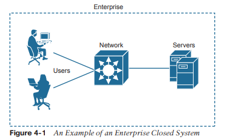
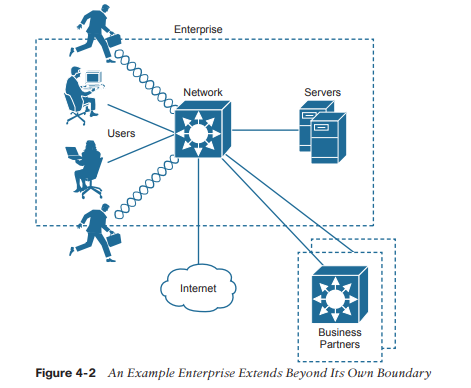
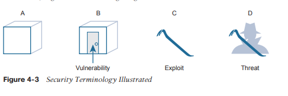
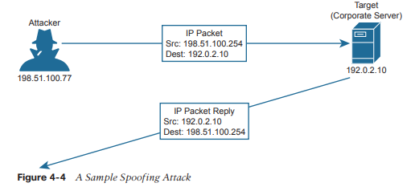
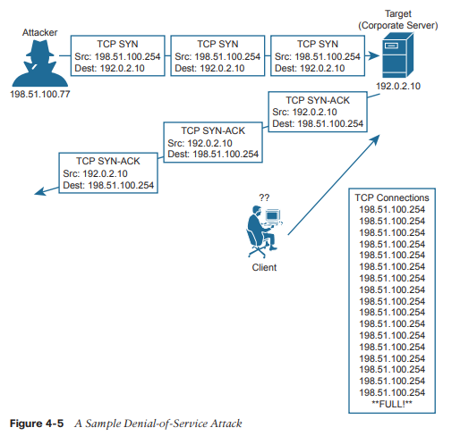

# Arquitectura de Seguridad

**En este capítulo se tratan los siguientes temas del examen:**
### Fundamentos de seguridad

- Definir conceptos clave de seguridad (amenazas, vulnerabilidades, exploits y técnicas de mitigación)
- Describir los elementos del programa de seguridad (concienciación del usuario, formación y control de acceso físico)
- Describir los elementos de las políticas de contraseñas de seguridad, como la administración, la complejidad y las alternativas de contraseñas (autenticación multifactor, certificados y biometría)
- Diferenciar los conceptos de autenticación, autorización y contabilidad

A medida que ha aprendido sobre varias tecnologías de red, es probable que su atención se haya centrado en el uso de dispositivos de red para construir redes funcionales. Al fin y al cabo, las redes deben permitir que los datos fluyan libremente para que todos los usuarios conectados tengan una buena experiencia, ¿verdad? El hecho desafortunado es que no se puede confiar en que todos los usuarios conectados obedezcan las reglas y sean buenos ciudadanos de la red. En este capítulo, aprenderá sobre muchos aspectos de una red empresarial que se pueden explotar, así como algunas formas de protegerlos.

### Terminología de seguridad

En un mundo perfecto, se podría construir una red que admita a todos los usuarios de una empresa, con la suposición de que todos los usuarios son conocidos, que todos los usuarios están aprobados para acceder a todo lo que hay en la red y que todos los usuarios utilizarán los recursos disponibles exactamente de acuerdo con algunas directrices corporativas. La red que se muestra en la Figura 4-1 podría representar este escenario. Incluso este sistema ideal y cerrado no es completamente seguro porque un usuario puede decidir comportarse mal para molestar a un compañero de trabajo o para ver información en el servidor corporativo que debería estar restringida o confidencial.

  
Ahora considere que casi ninguna empresa utiliza un entorno tan limitado y cerrado. Después de todo, es probable que la empresa quiera conectarse de alguna manera a la Internet pública y tal vez a algunos socios corporativos. También es probable que quiera permitir que sus trabajadores sean móviles y lleven computadoras portátiles, tabletas y teléfonos inteligentes dentro y fuera de los límites corporativos para mayor comodidad. Es posible que la empresa desee proporcionar acceso a la red a los invitados que visiten. Si la empresa ofrece conectividad inalámbrica a sus empleados (e invitados), también podría ofrecer su acceso inalámbrico a personas que se encuentran dentro del alcance de las señales. Y la lista sigue y sigue. A medida que la red y su conectividad se expanden, como se muestra en la Figura 4-2, la empresa tendrá más dificultades para mantener el límite seguro y cerrado a su alrededor.

Para comenzar a proteger una red, primero debe comprender qué podría salir mal con ella.
Piense en una red empresarial como una simple instalación en forma de caja, como se muestra en la parte A de la Figura 4-3. Cuando todas las paredes, el piso y el techo están hechos de un material muy resistente y son muy gruesos, es probable que el contenido dentro de la caja permanezca a salvo de daños o robos. El propietario, sin embargo, puede tener dificultades para entrar y salir de la caja.

Supongamos que se introduce una puerta por conveniencia, como se muestra en la parte B de la Figura 4-3. El propietario ahora puede ir y venir, pero también podría hacerlo cualquier otra persona. Incluso si la puerta está cerrada, alguien podría encontrar una manera de abrir la puerta y acceder a los tesoros que contiene. Debido a que ninguna puerta es impenetrable, la puerta se convierte en una _vulnerabilidad_. En términos de seguridad, una vulnerabilidad es cualquier cosa que pueda considerarse una debilidad que puede comprometer la seguridad de otra cosa, como la integridad de los datos o el rendimiento de un sistema.

El hecho de que exista una vulnerabilidad significa que nada está necesariamente en peligro. En el ejemplo de la puerta cerrada, nadie más que el propietario de confianza puede abrir la puerta a menos que se utilice algún tipo de herramienta que no sea la llave. Una herramienta de este tipo se puede utilizar para explotar una vulnerabilidad. De hecho, la herramienta en sí se denomina _exploit_, como se muestra en la barra de palanca en la parte C de la Figura 4-3. Un exploit no es muy efectivo si se usa contra cualquier otra cosa que no sea la debilidad o vulnerabilidad objetivo.

Técnicamente, un exploit como la palanca no es muy efectivo por sí mismo. Alguien debe recogerlo y usarlo contra la vulnerabilidad. En la parte D de la Figura 4-3, un usuario malintencionado posee la palanca y tiene la intención de usarla para abrir la puerta cerrada. Ahora existe la posibilidad real de entrar, destruir, robar o modificar algo sin permiso. Esto se conoce como _amenaza_.

En el mundo de TI de redes, sistemas, estaciones de trabajo y aplicaciones, hay muchas, muchas vulnerabilidades y exploits diferentes que pueden ser aprovechados por usuarios malintencionados para convertirse en amenazas para una organización y sus datos. El resto de este capítulo proporciona una descripción general de muchos de ellos, junto con algunas técnicas que puede aprovechar para contrarrestar o prevenir la actividad maliciosa. Estas medidas se conocen como _técnicas de mitigación_. Es posible que esté pensando en algunas formas en que el propietario del edificio de la Figura 4-3 podría mitigar las amenazas a las que se enfrenta. Tal vez podría agregar cerraduras más fuertes y seguras a la puerta, un marco de puerta más robusto para resistir las fuerzas indiscretas o un sistema de alarma para detectar una intrusión y alertar a las autoridades.

### Amenazas comunes a la seguridad
Dado que las redes empresariales modernas suelen estar formadas por muchas partes que funcionan juntas, protegerlas puede convertirse en una tarea muy compleja. Al igual que con la simple analogía de la caja, no se puede intentar protegerla eficazmente hasta que se hayan identificado muchas de las vulnerabilidades, se hayan evaluado los numerosos exploits que existen y se haya dado cuenta de dónde podrían provenir las amenazas. Sólo entonces se podrán implementar las contramedidas y mitigaciones adecuadas.

También debe considerar algunos atributos importantes de los recursos empresariales que deben protegerse y preservarse. A medida que analiza las numerosas amenazas que se analizan en este capítulo, piense en la vulnerabilidad y el exploit que hace posible la amenaza. Observe cuántas partes diferentes de la red empresarial presentan vulnerabilidades y cómo se diseñan las amenazas para aprovechar las debilidades.

### Ataques que falsifican direcciones

Cuando los sistemas se comportan normalmente, se puede confiar en los parámetros y servicios y utilizarlos de forma eficaz. Por ejemplo, cuando una máquina envía un paquete IP, todos esperan que la dirección IP de origen sea la propia dirección IP de la máquina. La dirección MAC de origen en la trama Ethernet.

Se espera que sea la dirección MAC del propio remitente. Incluso servicios como DHCP y DNS deberían hacer lo mismo; Si una máquina envía una solicitud DHCP o DNS, espera que cualquier respuesta DHCP o DNS provenga de un servidor legítimo y confiable.
Los ataques de suplantación de identidad se centran en una vulnerabilidad; las direcciones y los servicios tienden a ser implícitamente confiables. Los ataques suelen tener lugar sustituyendo los valores esperados por valores falsificados o falsificados. Los ataques de suplantación de direcciones pueden ser sencillos y directos, en los que un valor de dirección se sustituye por otro.

Por ejemplo, un atacante puede enviar paquetes con una dirección IP de origen falsificada en lugar de la suya propia, como se muestra en la Figura 4-4. Cuando el objetivo recibe los paquetes, enviará tráfico de retorno a la dirección falsificada, en lugar de a la dirección real del atacante. Si la dirección falsificada existe, entonces un host desprevenido con esa dirección recibirá el paquete. Si la dirección no existe, el paquete se reenviará y luego se eliminará de la red.

Un atacante también puede enviar direcciones MAC falsificadas para agregar información falsa a las tablas de reenvío utilizadas por los conmutadores de capa 2 o a las tablas ARP utilizadas por otros hosts y enrutadores. Las solicitudes DHCP con direcciones MAC falsificadas también se pueden enviar a un servidor DHCP legítimo, llenando su tabla de arrendamiento de direcciones y sin dejar direcciones IP libres para uso normal.

Tenga en cuenta que el Capítulo 6, “Implementación de la seguridad del puerto del conmutador”, analiza una herramienta que se puede utilizar para ayudar a mitigar la suplantación de direcciones MAC. En el Capítulo 8, “Snooping DHCP e inspección ARP”, puede obtener más información sobre la inspección ARP dinámica (DAI) y cómo utilizarla para mitigar la suplantación de direcciones IP mediante ARP.

Ataques de denegación de servicio
En el funcionamiento normal de una aplicación empresarial, los clientes abren conexiones a servidores corporativos para intercambiar información. Esto podría ocurrir en forma de sesiones basadas en web que están abiertas tanto a usuarios internos como a usuarios externos en la Internet pública. El proceso es simple: los usuarios abren un navegador web en el sitio corporativo, que luego abre una conexión TCP con el servidor web corporativo; entonces puede tener lugar alguna transacción. Si todos los usuarios se portan bien y realizan transacciones legítimas, los servidores corporativos (con suerte) no estarán estresados y muchos clientes podrán hacer negocios con normalidad.
Ahora supongamos que un usuario malintencionado encuentra una manera de abrir una conexión anormal al mismo servidor corporativo. La conexión TCP comienza cuando el usuario malintencionado envía un indicador SYN al servidor, pero la dirección IP de origen se reemplaza por una dirección falsa. El servidor agrega la conexión TCP a su tabla de conexiones de clientes y responde a la dirección falsa con un SYN-ACK. Debido a que la dirección falsa no está involucrada en la conexión TCP, no hay una respuesta ACK para completar el protocolo de enlace de tres vías TCP. La conexión incompleta permanece en la tabla del servidor hasta que finalmente expira y se elimina. Durante este tiempo, el atacante puede intentar abrir muchas, muchas más conexiones anormales a un ritmo tal que la tabla de conexiones del servidor se llena. En ese momento, el servidor ya no puede mantener conexiones TCP con usuarios legítimos, por lo que todas sus transacciones comerciales se detienen. La Figura 4-5 ilustra este proceso.

