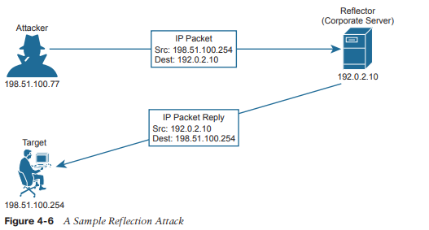
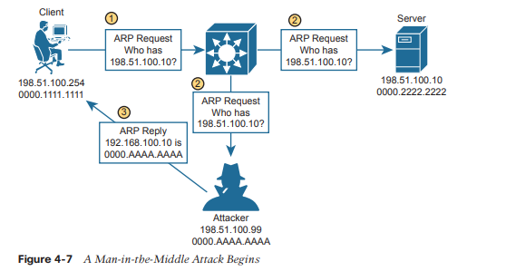
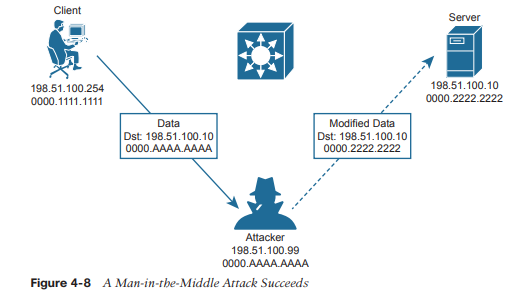
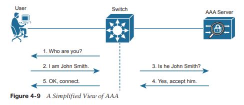

# Arquitectura de Seguridad

**En este capítulo se tratan los siguientes temas del examen:**
### Fundamentos de seguridad
- Definir conceptos clave de seguridad (amenazas, vulnerabilidades, exploits y técnicas de mitigación)
- Describir los elementos del programa de seguridad (concienciación del usuario, formación y control de acceso físico)
- Describir los elementos de las políticas de contraseñas de seguridad, como la administración, la complejidad y las alternativas de contraseñas (autenticación multifactor, certificados y biometría)
- Diferenciar los conceptos de autenticación, autorización y contabilidad

A medida que ha aprendido sobre varias tecnologías de red, es probable que su atención se haya centrado en el uso de dispositivos de red para construir redes funcionales. Al fin y al cabo, las redes deben permitir que los datos fluyan libremente para que todos los usuarios conectados tengan una buena experiencia, ¿verdad? El hecho desafortunado es que no se puede confiar en que todos los usuarios conectados obedezcan las reglas y sean buenos ciudadanos de la red. En este capítulo, aprenderá sobre muchos aspectos de una red empresarial que se pueden explotar, así como algunas formas de protegerlos
### Terminología de seguridad
En un mundo perfecto, se podría construir una red que admita a todos los usuarios de una empresa, con la suposición de que todos los usuarios son conocidos, que todos los usuarios están aprobados para acceder a todo lo que hay en la red y que todos los usuarios utilizarán los recursos disponibles exactamente de acuerdo con algunas directrices corporativas. La red que se muestra en la Figura 4-1 podría representar este escenario. Incluso este sistema ideal y cerrado no es completamente seguro porque un usuario puede decidir comportarse mal para molestar a un compañero de trabajo o para ver información en el servidor corporativo que debería estar restringida o confidencial.

  
Ahora considere que casi ninguna empresa utiliza un entorno tan limitado y cerrado. Después de todo, es probable que la empresa quiera conectarse de alguna manera a la Internet pública y tal vez a algunos socios corporativos. También es probable que quiera permitir que sus trabajadores sean móviles y lleven computadoras portátiles, tabletas y teléfonos inteligentes dentro y fuera de los límites corporativos para mayor comodidad. Es posible que la empresa desee proporcionar acceso a la red a los invitados que visiten. Si la empresa ofrece conectividad inalámbrica a sus empleados (e invitados), también podría ofrecer su acceso inalámbrico a personas que se encuentran dentro del alcance de las señales. Y la lista sigue y sigue. A medida que la red y su conectividad se expanden, como se muestra en la Figura 4-2, la empresa tendrá más dificultades para mantener el límite seguro y cerrado a su alrededor.

Para comenzar a proteger una red, primero debe comprender qué podría salir mal con ella.
Piense en una red empresarial como una simple instalación en forma de caja, como se muestra en la parte A de la Figura 4-3. Cuando todas las paredes, el piso y el techo están hechos de un material muy resistente y son muy gruesos, es probable que el contenido dentro de la caja permanezca a salvo de daños o robos. El propietario, sin embargo, puede tener dificultades para entrar y salir de la caja.

Supongamos que se introduce una puerta por conveniencia, como se muestra en la parte B de la Figura 4-3. El propietario ahora puede ir y venir, pero también podría hacerlo cualquier otra persona. Incluso si la puerta está cerrada, alguien podría encontrar una manera de abrir la puerta y acceder a los tesoros que contiene. Debido a que ninguna puerta es impenetrable, la puerta se convierte en una _vulnerabilidad_. En términos de seguridad, una vulnerabilidad es cualquier cosa que pueda considerarse una debilidad que puede comprometer la seguridad de otra cosa, como la integridad de los datos o el rendimiento de un sistema.

El hecho de que exista una vulnerabilidad significa que nada está necesariamente en peligro. En el ejemplo de la puerta cerrada, nadie más que el propietario de confianza puede abrir la puerta a menos que se utilice algún tipo de herramienta que no sea la llave. Una herramienta de este tipo se puede utilizar para explotar una vulnerabilidad. De hecho, la herramienta en sí se denomina _exploit_, como se muestra en la barra de palanca en la parte C de la Figura 4-3. Un exploit no es muy efectivo si se usa contra cualquier otra cosa que no sea la debilidad o vulnerabilidad objetivo.

Técnicamente, un exploit como la palanca no es muy efectivo por sí mismo. Alguien debe recogerlo y usarlo contra la vulnerabilidad. En la parte D de la Figura 4-3, un usuario malintencionado posee la palanca y tiene la intención de usarla para abrir la puerta cerrada. Ahora existe la posibilidad real de entrar, destruir, robar o modificar algo sin permiso. Esto se conoce como _amenaza_.

En el mundo de TI de redes, sistemas, estaciones de trabajo y aplicaciones, hay muchas, muchas vulnerabilidades y exploits diferentes que pueden ser aprovechados por usuarios malintencionados para convertirse en amenazas para una organización y sus datos. El resto de este capítulo proporciona una descripción general de muchos de ellos, junto con algunas técnicas que puede aprovechar para contrarrestar o prevenir la actividad maliciosa. Estas medidas se conocen como _técnicas de mitigación_. Es posible que esté pensando en algunas formas en que el propietario del edificio de la Figura 4-3 podría mitigar las amenazas a las que se enfrenta. Tal vez podría agregar cerraduras más fuertes y seguras a la puerta, un marco de puerta más robusto para resistir las fuerzas indiscretas o un sistema de alarma para detectar una intrusión y alertar a las autoridades.
### Amenazas comunes a la seguridad
Dado que las redes empresariales modernas suelen estar formadas por muchas partes que funcionan juntas, protegerlas puede convertirse en una tarea muy compleja. Al igual que con la simple analogía de la caja, no se puede intentar protegerla eficazmente hasta que se hayan identificado muchas de las vulnerabilidades, se hayan evaluado los numerosos exploits que existen y se haya dado cuenta de dónde podrían provenir las amenazas. Sólo entonces se podrán implementar las contramedidas y mitigaciones adecuadas.

También debe considerar algunos atributos importantes de los recursos empresariales que deben protegerse y preservarse. A medida que analiza las numerosas amenazas que se analizan en este capítulo, piense en la vulnerabilidad y el exploit que hace posible la amenaza. Observe cuántas partes diferentes de la red empresarial presentan vulnerabilidades y cómo se diseñan las amenazas para aprovechar las debilidades.
### Ataques que falsifican direcciones
Cuando los sistemas se comportan normalmente, se puede confiar en los parámetros y servicios y utilizarlos de forma eficaz. Por ejemplo, cuando una máquina envía un paquete IP, todos esperan que la dirección IP de origen sea la propia dirección IP de la máquina. La dirección MAC de origen en la trama Ethernet.

Se espera que sea la dirección MAC del propio remitente. Incluso servicios como DHCP y DNS deberían hacer lo mismo; Si una máquina envía una solicitud DHCP o DNS, espera que cualquier respuesta DHCP o DNS provenga de un servidor legítimo y confiable.

Los ataques de suplantación de identidad se centran en una vulnerabilidad; las direcciones y los servicios tienden a ser implícitamente confiables. Los ataques suelen tener lugar sustituyendo los valores esperados por valores falsificados o falsificados. Los ataques de suplantación de direcciones pueden ser sencillos y directos, en los que un valor de dirección se sustituye por otro.

Por ejemplo, un atacante puede enviar paquetes con una dirección IP de origen falsificada en lugar de la suya propia, como se muestra en la Figura 4-4. Cuando el objetivo recibe los paquetes, enviará tráfico de retorno a la dirección falsificada, en lugar de a la dirección real del atacante. Si la dirección falsificada existe, entonces un host desprevenido con esa dirección recibirá el paquete. Si la dirección no existe, el paquete se reenviará y luego se eliminará de la red.

Un atacante también puede enviar direcciones MAC falsificadas para agregar información falsa a las tablas de reenvío utilizadas por los conmutadores de capa 2 o a las tablas ARP utilizadas por otros hosts y enrutadores. Las solicitudes DHCP con direcciones MAC falsificadas también se pueden enviar a un servidor DHCP legítimo, llenando su tabla de arrendamiento de direcciones y sin dejar direcciones IP libres para uso normal.

Tenga en cuenta que el Capítulo 6, “Implementación de la seguridad del puerto del conmutador”, analiza una herramienta que se puede utilizar para ayudar a mitigar la suplantación de direcciones MAC. En el Capítulo 8, “Snooping DHCP e inspección ARP”, puede obtener más información sobre la inspección ARP dinámica (DAI) y cómo utilizarla para mitigar la suplantación de direcciones IP mediante ARP.
### Ataques de denegación de servicio
En el funcionamiento normal de una aplicación empresarial, los clientes abren conexiones a servidores corporativos para intercambiar información. Esto podría ocurrir en forma de sesiones basadas en web que están abiertas tanto a usuarios internos como a usuarios externos en la Internet pública. El proceso es simple: los usuarios abren un navegador web en el sitio corporativo, que luego abre una conexión TCP con el servidor web corporativo; entonces puede tener lugar alguna transacción. Si todos los usuarios se portan bien y realizan transacciones legítimas, los servidores corporativos (con suerte) no estarán estresados y muchos clientes podrán hacer negocios con normalidad.

Ahora supongamos que un usuario malintencionado encuentra una manera de abrir una conexión anormal al mismo servidor corporativo. La conexión TCP comienza cuando el usuario malintencionado envía un indicador SYN al servidor, pero la dirección IP de origen se reemplaza por una dirección falsa. El servidor agrega la conexión TCP a su tabla de conexiones de clientes y responde a la dirección falsa con un SYN-ACK. Debido a que la dirección falsa no está involucrada en la conexión TCP, no hay una respuesta ACK para completar el protocolo de enlace de tres vías TCP. La conexión incompleta permanece en la tabla del servidor hasta que finalmente expira y se elimina. 

Durante este tiempo, el atacante puede intentar abrir muchas, muchas más conexiones anormales a un ritmo tal que la tabla de conexiones del servidor se llena. En ese momento, el servidor ya no puede mantener conexiones TCP con usuarios legítimos, por lo que todas sus transacciones comerciales se detienen. La Figura 4-5 ilustra este proceso.

Cuando un atacante puede agotar un recurso del sistema, los servicios y sistemas dejan de estar disponibles o fallan. Esto se denomina ataque de denegación de servicio (DoS) porque niega el servicio a usuarios u operaciones legítimos. Los ataques DoS pueden involucrar algo tan simple como paquetes de eco (ping) ICMP, una avalancha de paquetes UDP y conexiones TCP, como el ataque de inundación TCP SYN descrito anteriormente. Estos ataques pueden tener éxito siempre que un sistema tenga una vulnerabilidad en el protocolo o tipo de tráfico que se explota.

Los atacantes pueden llevar la idea de DoS aún más lejos al reclutar a muchos otros sistemas para que participen. Para hacer esto, el atacante configura una computadora de control maestro en algún lugar de Internet. A continuación, muchas computadoras deben infectarse primero con código malicioso o malware aprovechando las vulnerabilidades presentes en esas máquinas. Luego, cada máquina se convierte silenciosamente en un "robot", que parece funcionar normalmente, mientras espera órdenes del control maestro. Cuando llega el momento de comenzar un ataque, el control maestro envía un comando a cada robot y le dice que inicie un ataque de denegación de servicio contra un único host objetivo. Esto se denomina ataque distribuido de denegación de servicio (DDoS) porque el ataque se distribuye entre una gran cantidad de bots, todos inundando o atacando al mismo objetivo.
### Ataques de reflexión y amplificación
Recuerde que en un ataque de suplantación de identidad, el atacante envía paquetes con una dirección de origen falsificada a un objetivo. El objetivo es obligar al objetivo a lidiar con el tráfico falsificado y enviar el tráfico de retorno hacia una fuente inexistente. Al atacante no le importa adónde va el tráfico de retorno o que no pueda entregarse con éxito.

En un ataque algo relacionado, el atacante vuelve a enviar paquetes con una dirección de origen falsificada hacia un host activo. Sin embargo, el anfitrión no es el objetivo previsto; el objetivo es lograr que el host refleje el intercambio hacia la dirección falsificada que es el objetivo. Esto se conoce como ataque de reflexión, como se ilustra en la Figura 4-6, y el host que refleja el tráfico hacia el objetivo se llama reflector. El atacante también podría enviar los paquetes falsificados a múltiples reflectores, lo que provocaría que el objetivo recibiera múltiples copias del tráfico inesperado.

El impacto de un ataque de reflexión puede parecer limitado porque la víctima es un único host objetivo y la cantidad de tráfico que se refleja hacia el objetivo es proporcional a los paquetes enviados por el atacante. Si un atacante puede enviar una pequeña cantidad de tráfico a un reflector y
Si se aprovecha un protocolo o servicio para generar un gran volumen de tráfico hacia un objetivo, entonces se ha producido un ataque de amplificación. En efecto, tal ataque amplifica los esfuerzos del atacante.
para perturbar el objetivo. Otro resultado es que se pueden consumir grandes cantidades de ancho de banda de la red reenviando el tráfico amplificado hacia el objetivo, especialmente si hay muchos reflectores involucrados. Algunos mecanismos de DNS y NTP se han explotado en el pasado para establecer nuevos registros de enorme consumo de ancho de banda durante un ataque de amplificación
### Ataques de intermediario  (Man in the middle)
Muchos tipos de ataques tienen como objetivo interrumpir o comprometer directamente los sistemas específicos, a menudo con resultados notables. A veces, un atacante podría querer espiar los datos que pasan de una máquina a otra, evitando ser detectado. Un ataque de intermediario hace precisamente eso, al permitir que el atacante se introduzca silenciosamente en la ruta de comunicación como intermediario entre dos sistemas objetivo.

Un tipo de ataque de intermediario explota la tabla ARP que mantiene cada host para comunicarse con otros hosts en su segmento de red local. Normalmente, si un host necesita enviar datos a otro, busca el host de destino en su tabla ARP. Si se encuentra una entrada, la trama Ethernet se puede enviar directamente a la dirección MAC de destino; de lo contrario, el remitente debe transmitir una solicitud ARP que contenga la dirección IP del destino y esperar a que el destino responda con una respuesta ARP y su propia dirección MAC.

En el paso 1, un cliente transmite una solicitud ARP para averiguar qué dirección MAC utiliza el host con la dirección IP 198.51.100.10. En el paso 2, la solicitud ARP se envía a todos los hosts del dominio de transmisión. Esto permite al atacante escuchar la solicitud ARP y prepararse para explotar la información obtenida. El propietario legítimo de 198.51.100.10 puede responder con su propia respuesta ARP y una dirección MAC real, como se esperaba. Sin embargo, en el paso 3, el atacante simplemente espera un breve momento y luego envía una respuesta ARP falsificada que contiene su propia dirección MAC, en lugar de la del destino real. El objetivo es que el atacante envíe la última respuesta ARP para que cualquier host que escuche actualice su tabla ARP con la más información reciente. 

Este proceso envenena efectivamente la entrada de la tabla ARP en cualquier sistema que reciba la respuesta ARP falsificada. A partir de ese momento, un sistema envenenado reenviará el tráfico ciegamente a la dirección MAC del atacante, que ahora se hace pasar por el destino. El atacante puede conocer la dirección MAC del destino real porque recibió una respuesta ARP anterior del host de destino. La Figura 4-8 muestra el resultado final. El atacante puede repetir este proceso envenenando las entradas ARP en múltiples hosts y luego retransmitiendo el tráfico entre ellos sin una fácil detección.

Una vez que un atacante se ha insertado entre dos hosts, puede escuchar e inspeccionar pasivamente todo el tráfico que pasa entre ellos. El atacante también podría desempeñar un papel activo y modificar los datos que pasan.
### Resumen del ataque de suplantación de direcciones
A medida que analiza los distintos tipos de ataques de suplantación de direcciones, recuerde que el objetivo del atacante es disfrazar su identidad y engañar a otros sistemas de forma maliciosa. Utilice la Tabla 4-2 para revisar los conceptos y características de cada tipo de ataque.

| **Goal**                                                      | **DoS/DDoS** | **Reflection** | **Amplification** | **Man-inthe-Middle** |
| ------------------------------------------------------------- | ------------ | -------------- | ----------------- | -------------------- |
| Exhaust a system service or resource; crash the target system | Yes          | No             | No                | No                   |
| Trick an unwitting accomplice host to send traffic to target  | No           | Yes            | Yes               | No                   |
| Eavesdrop on traffic                                          | No           | No             | No                | Yes                  |
| Modify traffic passing through                                | No           | No             | No                | Yes                  |

### Ataques de reconocimiento
Cuando un atacante tiene la intención de lanzar un ataque contra un objetivo, es posible que desee identificar algunas vulnerabilidades para que el ataque pueda centrarse y ser más eficaz. Se puede utilizar un ataque de reconocimiento para descubrir más detalles sobre el objetivo y sus sistemas antes de un ataque real.

Durante un ataque de reconocimiento, el atacante puede utilizar algunas herramientas comunes para descubrir detalles públicos como quién posee un dominio y qué rangos de direcciones IP se utilizan allí. Por ejemplo, el comando nslookup existe en muchos sistemas operativos y puede realizar una búsqueda de DNS para resolver una dirección IP de un nombre de dominio completo. Si un atacante conoce el nombre de dominio de una empresa, nslookup puede revelar el propietario del dominio y el espacio de direcciones IP registrado en él. Los comandos whois y dig son herramientas complementarias que pueden consultar información DNS para revelar información detallada sobre los propietarios de dominios, información de contacto, servidores de correo, servidores de nombres autorizados, etc.

Luego, el atacante puede avanzar y utilizar barridos de ping para enviar pings a cada dirección IP en el rango objetivo. Los hosts que responden al barrido de ping se convierten en objetivos activos. Las herramientas de escaneo de puertos pueden luego recorrer una variedad de puertos UDP y TCP para ver si un host de destino responde en algún número de puerto. Cualquier respuesta indica que se está ejecutando un servicio correspondiente en el objetivo.
anfitrión.
Tenga en cuenta que un ataque de reconocimiento no es un ataque verdadero porque, como resultado, no se explota nada. Se utiliza para recopilar información sobre sistemas y servicios de destino para que las vulnerabilidades puedan descubrirse y explotarse mediante otros tipos de ataques.
### Ataques de desbordamiento de búfer
Los sistemas operativos y las aplicaciones normalmente leen y escriben datos utilizando buffers y espacio de memoria temporal. Los buffers también son importantes cuando un sistema se comunica con otro, ya que los paquetes IP y las tramas Ethernet van y vienen. Siempre que el espacio de memoria se mantenga adecuadamente y los datos se coloquen dentro de los límites correctos del búfer, todo debería funcionar como se esperaba.

Sin embargo, algunos sistemas y aplicaciones tienen vulnerabilidades que pueden permitir que los buffers se desborden. Esto significa que algunos datos entrantes podrían almacenarse en ubicaciones de memoria inesperadas si se permite que un búfer se llene más allá de su límite. Un atacante puede aprovechar esta condición enviando datos mayores de lo esperado. Si existe una vulnerabilidad, el sistema objetivo podría almacenar esos datos, desbordando su búfer hacia otra área de la memoria y eventualmente colapsando un servicio o todo el sistema. El atacante también podría crear especialmente el mensaje grande insertando código malicioso en él. Si el sistema de destino almacena esos datos como resultado de un desbordamiento del búfer, entonces puede ejecutar el código malicioso sin darse cuenta.
### Malware
Algunos tipos de amenazas a la seguridad pueden presentarse en forma de software malicioso o malware. Por ejemplo, un caballo de Troya es un software malicioso que está oculto y empaquetado dentro de otro software que parece normal y legítimo. Si un usuario bien intencionado decide instalarlo, el software troyano también se instala silenciosamente. Entonces, el malware puede ejecutar sus propios ataques en el sistema local o contra otros sistemas. El malware troyano puede propagarse de una computadora a otra solo mediante la interacción del usuario, como abrir archivos adjuntos de correo electrónico, descargar software de Internet e insertar una unidad USB en una computadora.
Por el contrario, los virus son malware que pueden propagarse más fácilmente entre sistemas. Para propagarse, el software antivirus debe inyectarse en otra aplicación y luego depender de los usuarios para transportar el software de la aplicación infectada a otras víctimas.
Otro tipo de malware es capaz de propagarse e infectar otros sistemas por sí solo. Un atacante desarrolla software de gusano y lo deposita en un sistema. A partir de ese momento, el gusano se replica y se propaga a otros sistemas a través de sus vulnerabilidades, luego se replica y se propaga una y otra vez.
En resumen, la Tabla 4-3 enumera las ideas clave detrás de cada tipo de malware descrito en esta sección.

| **Characteristic**                | **Trojan Horse** | **Virus** | **Worm** |
| --------------------------------- | ---------------- | --------- | -------- |
| Packaged inside other software    | Yes              | No        | No       |
| Self-injected into other software | No               | Yes       | No       |
| Propagates automatically          | No               | No        | Yes      |

### Vulnerabilidades humanas
Muchos tipos de ataques deben aprovechar una vulnerabilidad en un sistema operativo, servicio u otros tipos de software de aplicación. En otras palabras, un atacante o el malware involucrado debe encontrar una debilidad en el sistema informático objetivo. Todavía hay muchos otros ataques que pueden tener éxito aprovechando las debilidades de los humanos que utilizan los sistemas informáticos.

Un ataque bastante sencillo se llama ingeniería social, donde la confianza humana y los comportamientos sociales pueden convertirse en vulnerabilidades de seguridad. Por ejemplo, un atacante podría hacerse pasar por un miembro del personal de TI e intentar contactar a los usuarios finales reales a través de llamadas telefónicas, correos electrónicos y redes sociales. El objetivo final podría ser convencer a los usuarios de que revelen sus credenciales o establezcan sus contraseñas en un valor "temporal" debido a algún mantenimiento de TI ficticio que se llevará a cabo, lo que permitirá al atacante obtener fácil acceso a sistemas seguros. Los atacantes también pueden estar físicamente presentes y observar en secreto a los usuarios mientras ingresan sus credenciales.
El phishing es una técnica que utilizan los atacantes para atraer a las víctimas a visitar sitios web maliciosos. La idea es disfrazar la invitación como algo legítimo, asustar a las víctimas para que sigan un enlace o engañar a los usuarios para que exploren contenido que los convenza de ingresar su información confidencial.

El phishing se presenta de muchas formas. El Spear phishing se dirige a un grupo de usuarios similares que podrían trabajar para la misma empresa, comprar en las mismas tiendas, etc., y que reciben el mismo correo electrónico convincente con un enlace a un sitio malicioso. La caza de ballenas es similar, pero tiene como objetivo individuos de alto perfil en corporaciones, gobiernos y organizaciones. El phishing también puede ocurrir a través de comunicaciones tradicionales, como llamadas de voz (vishing) y mensajes de texto SMS (smishing).

Pharming también intenta enviar a las víctimas a un sitio web malicioso, pero requiere un enfoque más drástico. En lugar de incitar a las víctimas a seguir un enlace disfrazado, el pharming implica comprometer los servicios que dirigen a los usuarios hacia un sitio web conocido o confiable. Por ejemplo, un atacante puede comprometer un servicio DNS o editar archivos de hosts locales para cambiar la entrada de un sitio legítimo. Cuando una víctima intenta visitar el sitio utilizando su enlace real, la resolución del nombre alterada devuelve la dirección de un sitio malicioso.

En un ataque de abrevadero, un atacante determina qué usuarios visitan con frecuencia un sitio; entonces ese sitio se ve comprometido y el malware se deposita allí. El malware infecta sólo a los usuarios objetivo que visitan el sitio, dejando ilesos a los demás usuarios.

Puede consultar la Tabla 4-4 para revisar las ideas clave detrás de cada tipo de vulnerabilidad humana que se explota comúnmente.

| Tipo de Ataque     | Objetivo                                                     |
| ------------------ | ------------------------------------------------------------ |
| Social engineering | Exploits human trust and social behavior                     |
| Phishing           | Disguises a malicious invitation as something legitimate     |
| Spear phishing     | Targets group of similar users                               |
| Whaling            | Targets high-profile individuals                             |
| Vishing            | Uses voice calls                                             |
| Smishing           | Uses SMS text messages                                       |
| Pharming           | Uses legitimate services to send users to a compromised site |
| Watering hole      | Targets specific victims who visit a compromised site        |

### Vulnerabilidades de contraseña
La mayoría de los sistemas de una red empresarial utilizan alguna forma de autenticación para otorgar o denegar el acceso de los usuarios. Cuando los usuarios acceden a un sistema, normalmente intervienen un nombre de usuario y una contraseña. Puede resultar bastante fácil adivinar el nombre de usuario de alguien basándose en su nombre real. Si la contraseña del usuario está configurada con algún valor predeterminado o con una palabra o cadena de texto que sea fácil de adivinar, un atacante también podría obtener acceso fácilmente al sistema.
Piense como un atacante por un momento y vea si puede adivinar algunas contraseñas que podría probar si quisiera iniciar sesión en un sistema aleatorio. Quizás haya pensado en contraseñas como contraseña, contraseña123, 123456, etc. Quizás podrías probar con el nombre de usuario admin y la contraseña admin.

Un atacante puede lanzar un ataque en línea ingresando cada contraseña adivinada cuando el sistema solicita las credenciales de usuario. Por el contrario, un ataque fuera de línea ocurre cuando el atacante puede recuperar las contraseñas cifradas o cifradas con anticipación, luego se desconecta en una computadora externa y usa el software allí para intentar repetidamente recuperar la contraseña real.

Los atacantes también pueden utilizar software para realizar ataques de diccionario para descubrir la contraseña de un usuario. El software intentará iniciar sesión automáticamente con contraseñas tomadas de un diccionario o lista de palabras. Es posible que tenga que realizar miles o millones de intentos antes de descubrir la contraseña real. Además, el software puede realizar un ataque de fuerza bruta probando todas las combinaciones posibles de cadenas de letras, números y símbolos. Los ataques de fuerza bruta requieren recursos informáticos muy potentes y una gran cantidad de tiempo.

Para mitigar los ataques a contraseñas, una empresa debe implementar políticas de contraseñas para todos los usuarios. Dicha política podría incluir pautas que requieran una cadena de contraseña larga compuesta por una combinación de caracteres en mayúsculas y minúsculas junto con números y algunos caracteres especiales. El objetivo es exigir que todas las contraseñas sean cadenas complejas que sean difíciles de adivinar o revelar mediante un ataque de contraseña. Además, la gestión de contraseñas debería exigir que todas las contraseñas se cambien periódicamente, de modo que ni siquiera los ataques prolongados de fuerza bruta puedan recuperar una contraseña antes de volver a cambiarla.
#### Alternativas de contraseña
Una cadena de contraseña simple es el único factor que un usuario debe ingresar para ser autenticado.

Debido a que una contraseña debe recordarse y no anotarse en ningún lado, es posible que
Piensa en tu contraseña como "algo que sabes". Ojalá nadie más lo sepa también; de lo contrario, podrían usarlo para hacerse pasar por usted al autenticarse.

Una empresa también podría considerar el uso de credenciales alternativas que aporten más complejidad y más seguridad. Las credenciales multifactor requieren que los usuarios proporcionen valores o factores que provienen de diferentes fuentes, lo que reduce la posibilidad de que un atacante posea todos los factores. Un viejo dicho describe las credenciales de dos factores como “algo que tienes” (una clave criptográfica que cambia dinámicamente o un mensaje de texto que contiene un código de tiempo limitado) y “algo que sabes” (una contraseña).

Un certificado digital puede servir como un factor alternativo porque sirve como una forma confiable de identificación, se adhiere a un formato estandarizado y contiene información cifrada. Si una empresa admite el uso de certificados, entonces un usuario debe solicitar y recibir un certificado único para utilizarlo con fines específicos. Por ejemplo, los certificados utilizados para autenticar usuarios deben aprobarse para la autenticación. Para que sean confiables, los certificados deben ser otorgados y firmados digitalmente por una autoridad certificadora (CA) confiable. Siempre que los servicios utilizados por la empresa conozcan y confíen en la CA, también se puede confiar en los certificados individuales firmados por esa CA.

Los certificados digitales también son urgentes, ya que cada uno está aprobado para un rango de tiempo específico. Una vez que un certificado caduque, se rechazará cualquier intento de autenticarse con él. El usuario que posee el certificado puede solicitar uno nuevo antes de la fecha de vencimiento o en cualquier momento posterior. Los certificados también se pueden revocar si la empresa decide revocar los privilegios de un usuario, si el usuario se separa de la empresa, etc. Incluso si el usuario todavía posee un certificado revocado, se le negará el acceso cuando intente autenticarse con él.

Dado que los certificados digitales existen como archivos en una computadora o dispositivo, se podría pensar que se pueden copiar y utilizar libremente para identificar a personas distintas de los propietarios originales. Cada certificado digital también debe llevar prueba de posesión que demuestre que realmente fue otorgado al usuario que lo presenta durante la autenticación. Esta prueba está integrada en el contenido cifrado del certificado, como resultado de la combinación de claves públicas que la máquina del usuario y el servidor de autenticación pueden compartir públicamente, junto con claves privadas que cada parte mantiene en privado y en secreto. Siempre que el servidor de autenticación pueda verificar que el certificado se creó utilizando las claves públicas y privadas correctas, el certificado debe estar en posesión del propietario esperado. De lo contrario, se rechazará la autenticación para mantener alejado a un impostor.

Las credenciales biométricas llevan el esquema aún más lejos al proporcionar un factor que representa "algo que eres". La idea es utilizar algún atributo físico del cuerpo de un usuario para identificar de forma única a esa persona. Los atributos físicos suelen ser exclusivos de la estructura corporal de cada individuo y no pueden robarse ni duplicarse fácilmente. Por ejemplo, la huella digital de un usuario se puede escanear y utilizar como factor de autenticación. Otros ejemplos incluyen reconocimiento facial, huellas palmares, reconocimiento de voz, reconocimiento de iris y escaneos de retina. Como es de esperar, se puede confiar más en algunos métodos que en otros. A veces, los sistemas de reconocimiento facial pueden engañarse cuando se les presentan fotografías o máscaras de personas de confianza. Las lesiones y el proceso de envejecimiento también pueden alterar patrones biométricos como las huellas dactilares, las formas faciales y los patrones del iris. Para ayudar a mitigar posibles debilidades, también se pueden recopilar y utilizar múltiples credenciales biométricas para autenticar a los usuarios.

En resumen, la Tabla 4-5 enumera las ideas clave utilizadas en cada alternativa a la autenticación de contraseña.

| **Characteristic**  | **Password Only** | **Two-Factor** | **Digital Certificates** | **Biometric** |
| ---------------------- | ----------------- | -------------- | ------------------------ | ------------- |
| Something you know     | yes               | yes            |                          |               |
| Something you have     |                   | yes            | yes                      |               |
| Something you are      |                   |                |                          | yes           |

### Controlar y monitorear el acceso de los usuarios
Puede gestionar la actividad del usuario hacia y a través de sistemas con mecanismos de autenticación, autorización y contabilidad (AAA, también pronunciado "triple-A"). AAA utiliza métodos estandarizados para solicitar a los usuarios sus credenciales antes de permitir o autorizar el acceso. Los protocolos de contabilidad también pueden registrar la actividad de los usuarios en los sistemas empresariales. AAA se usa comúnmente para controlar y monitorear el acceso a dispositivos de red como enrutadores, conmutadores, firewalls, etc.

En pocas palabras, puedes pensar en AAA de la siguiente manera:
- Autenticación: ¿Quién es el usuario?
- Autorización: ¿Qué puede hacer el usuario?
- Contabilidad: ¿Qué hizo el usuario?

Por ejemplo, un administrador de red puede tener varios métodos para administrar usuarios que podrían intentar iniciar sesión en un conmutador para realizar alguna operación. En el nivel más básico, puede autenticar usuarios con contraseñas simples que se configuran en la consola del conmutador y en las líneas VTY. La autorización podría ser igualmente simple: cuando los usuarios inician sesión correctamente, reciben autorización para obtener privilegios de nivel EXEC. Al ingresar la contraseña secreta de habilitación correcta, los usuarios podrían recibir autorización para un nivel de privilegio más alto.

En un escenario simple, si un usuario conoce la contraseña correcta, puede conectarse al conmutador. ¿Pero quién es ese usuario? ¡Es posible que nunca sepas quién inició sesión y cambió la configuración o reinició el conmutador! En su lugar, puede configurar nombres de usuario y contraseñas individuales en el conmutador. Eso resolvería el problema del anonimato del usuario, pero su red podría constar de muchos usuarios administrativos y muchos conmutadores, lo que requeriría bastante configuración y mantenimiento de nombres de usuario.

Una solución más escalable es aprovechar funciones AAA que sean centralizadas, estandarizadas, resistentes y flexibles. Por ejemplo, un servidor de autenticación centralizado puede contener una base de datos de todos los usuarios posibles y sus contraseñas, así como políticas para autorizar las actividades de los usuarios. A medida que los usuarios van y vienen, sus cuentas se pueden actualizar fácilmente en un solo lugar. Todos los conmutadores y enrutadores consultarían el servidor AAA para obtener información actualizada sobre un usuario. Para mayor seguridad, los servidores AAA también pueden admitir credenciales de usuario multifactor y más. Cisco implementa servicios AAA en su plataforma Identity Services Engine (ISE).

Los servidores AAA generalmente admiten los dos protocolos siguientes para comunicarse con los recursos de la empresa.
- TACACS+: protocolo propietario de Cisco que separa cada una de las funciones AAA. La comunicación es segura y encriptada a través del puerto TCP 49.
- RADIUS: protocolo basado en estándares que combina autenticación y autorización en un único recurso. La comunicación utiliza los puertos UDP 1812 y 1813 (contabilidad) pero no está completamente cifrada.

Tanto TACACS+ como RADIUS están organizados como un modelo cliente/servidor, donde un dispositivo de autenticación actúa como un cliente que habla con un servidor AAA. La Figura 4-9 muestra una vista simplificada del proceso, donde un usuario intenta conectarse a un conmutador con fines de administración. En la función de cliente AAA, el conmutador suele denominarse Dispositivo de acceso a la red (NAD) o Servidor de acceso a la red (NAS). Cuando un usuario intenta conectarse al conmutador, el conmutador solicita al usuario las credenciales y luego las pasa al servidor AAA. En términos simples, si el usuario pasa la autenticación, el servidor AAA devuelve un mensaje de "aceptación" al conmutador. Si el servidor AAA requiere credenciales adicionales, como en la autenticación multifactor, devuelve un mensaje de "desafío" al conmutador. De lo contrario, se devuelve un mensaje de "rechazo", negando el acceso al usuario.

### Desarrollo de un programa de seguridad para educar a los usuarios
Un enfoque eficaz que una empresa puede adoptar para mejorar la seguridad de la información es educar a su comunidad de usuarios a través de un programa de seguridad corporativo. Es posible que la mayoría de los usuarios no tengan experiencia en TI, por lo que es posible que no reconozcan las vulnerabilidades o no se den cuenta de las consecuencias de sus propias acciones. Por ejemplo, si los usuarios corporativos reciben un mensaje de correo electrónico que contiene un mensaje sobre una orden legal para su arresto o una amenaza de exponer algún supuesto comportamiento ilegal, podrían verse tentados a seguir un enlace a un sitio malicioso. Una acción de este tipo podría infectar la computadora de un usuario y luego abrir una puerta trasera o introducir malware o un gusano que luego podría afectar las operaciones comerciales.

Un programa de seguridad eficaz debe tener los siguientes elementos básicos:
- Concientización del usuario: todos los usuarios deben ser conscientes de la necesidad de mantener la confidencialidad de los datos para proteger la información corporativa, así como sus propias credenciales e información personal. También se les debe informar sobre posibles amenazas, planes para engañar y procedimientos adecuados para informar incidentes de seguridad. También se debe indicar a los usuarios que sigan pautas estrictas con respecto a la pérdida de datos. Por ejemplo, los usuarios no deben incluir información confidencial en correos electrónicos o archivos adjuntos, no deben conservar ni transmitir esa información desde un teléfono inteligente, ni almacenarla en servicios en la nube o unidades de almacenamiento extraíbles.
- Capacitación de usuarios: Se debe exigir a todos los usuarios que participen en capacitación formal periódica para que se familiaricen con todas las políticas de seguridad corporativas. (Esto también implica que la empresa debe desarrollar y publicar políticas de seguridad formales para que las sigan sus empleados, usuarios y socios comerciales).
- Control de acceso físico: las ubicaciones de infraestructura, como armarios de red y centros de datos, deben permanecer cerradas de forma segura. El acceso con credenciales a ubicaciones confidenciales es una solución escalable que ofrece un seguimiento de auditoría de identidades y marcas de tiempo cuando se concede el acceso. Los administradores pueden controlar el acceso de forma granular y eliminar rápidamente el acceso cuando un empleado es despedido.

