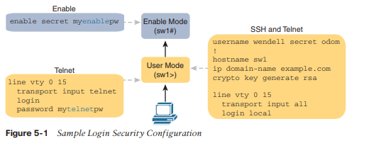
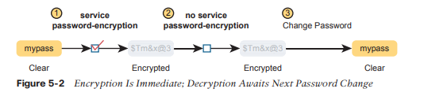
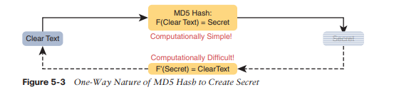
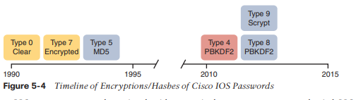
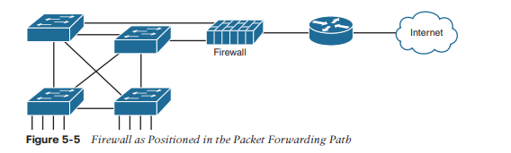

# Protección de los  dispositivos de red

Este capítulo cubre los siguientes temas de examen:
- Fundamentos de red
	- Explicar el papel de los componentes de la red
		- Firewalls e IPS de próxima generación
- Servicios de IP
	- Configurar dispositivos de red para acceso remoto utilizando SSH
- Fundamentos de seguridad
	- Configurar el control de acceso al dispositivo utilizando contraseñas locales

 Todos los dispositivos en la red incluyen algunos métodos para que los dispositivos se comuniquen legítimamente utilizando la red. Para proteger esos dispositivos, el plan de seguridad incluirá una amplia variedad de herramientas y técnicas de mitigación.
 
Este capítulo se centra en dos necesidades de seguridad particulares en una red empresarial. Primero, el acceso a la CLI de los dispositivos de red debe protegerse. El equipo de ingeniería de red debe poder acceder a los dispositivos de forma remota, por lo que los dispositivos deben permitir el acceso remoto de SSH (y posiblemente Telnet). La primera mitad de este capítulo analiza cómo configurar las contraseñas para mantenerlas seguras y cómo filtrar los intentos de inicio de sesión en los propios dispositivos.

La segunda mitad del capítulo recurre a dos funciones de seguridad diferentes con mayor frecuencia implementadas con electrodomésticos especialmente diseñados: firewalls e IPSS. Estos dispositivos juntos monitorean el tráfico en tránsito para determinar si el tráfico es legítimo o si podría ser parte de algún exploit. Si se considera que es parte de una exploit, o si está contrario a las reglas definidas por los dispositivos, pueden descartar los mensajes, detener cualquier ataque antes de comenzar.
### Asegurando contraseñas de iOS
La mejor manera de proteger las contraseñas en los dispositivos Cisco IOS es no almacenar contraseñas en dispositivos iOS. Es decir, para cualquier función que pueda usar un servidor externo de autenticación, autorización y contabilidad (AAA), úselo. Sin embargo, es común almacenar algunas contraseñas en una configuración de enrutador o conmutador, y esta primera sección del capítulo analiza algunas de las formas de proteger esas contraseñas.

Como breve revisión, la Figura 5-1 resume una configuración de seguridad de inicio de sesión típica en un enrutador o conmutador. En la parte inferior izquierda, verá el soporte de Telnet configurado, con el uso de una contraseña solo (no se requiere nombre de usuario). A la derecha, la configuración agrega soporte para iniciar sesión con el nombre de usuario y la contraseña, admitiendo los usuarios de Telnet y SSH. La parte superior izquierda muestra el comando único requerido para definir una contraseña de habilitación de manera segura.



El resto de esta primera sección analiza cómo hacer que estas contraseñas sean seguras. En particular, esta sección busca formas de evitar mantener las contraseñas de texto claro en la configuración y almacenar las contraseñas de manera que dificultan a los atacantes aprender la contraseña.
### Cifrar contraseñas de iOS anteriores con contraseña de servicio a cifrado
Algunas contraseñas de iOS de estilo anterior crean una exposición de seguridad porque las contraseñas existen en el archivo de configuración como texto claro. Estas contraseñas de texto de claro se pueden ver en versiones impresas de los archivos de configuración, en una copia de copia de seguridad del archivo de configuración almacenado en un servidor, o como se muestra en la pantalla de un ingeniero de red.

 Cisco intentó resolver este problema de texto de claro agregando un comando para cifrar esas contraseñas: el comando de configuración global de contraseña `service password-encription`. Este comando encripta las contraseñas que normalmente se mantienen como texto claro, específicamente las contraseñas de estos comandos: 
 
**password** password (console or vty mode)
**username** name **password** password (global)
**enable password** password (global)
 
Para ver cómo funciona, el ejemplo 5-1 muestra cómo el comando de contraseña de contraseña de servicio encripta la contraseña de la consola de texto de texto. El ejemplo usa el show running-config | Sección de línea Con 0 Comando tanto antes como después del cifrado; Este comando enumera solo la sección de la configuración sobre la consola.

```
Switch3# show running-config | section line con 0 
line con 0  
password cisco  
login

Switch3# configure terminal
Enter configuration commands, one per line. End with CNTL/Z.
Switch3(config)# service password-encryption
Switch3(config)# ^Z

Switch3# show running-config | section line con 0
line con 0  
password 7 070C285F4D06  
login
```

Un examen detallado del resultado del comando `show running-config` antes y después revela tanto el efecto obvio como un nuevo concepto. El proceso de cifrado ahora oculta la contraseña original en texto claro. Además, IOS necesita una forma de indicar que el valor en el comando `password` muestra una contraseña cifrada en lugar de texto sin cifrar. IOS agrega el tipo de cifrado o codificación “7” al comando, que se refiere específicamente a contraseñas cifradas con el comando `service password-encryption`. (IOS considera que las contraseñas de texto sin cifrar son del tipo 0; algunos comandos enumeran el 0 y otros no).

Mientras que el comando global `service password-encryption` cifra las contraseñas, el comando global `no service password-encryption` no descifra inmediatamente las contraseñas a su estado de texto sin cifrar. En cambio, el proceso funciona como se muestra en la Figura 5-2. Básicamente, después de ingresar el comando `no service password-encryption`, las contraseñas permanecen cifradas hasta que las cambie.



Desafortunadamente, el comando `service password-encryption` no protege muy bien las contraseñas. Armado con el valor cifrado, puede buscar en Internet y encontrar sitios con herramientas para descifrar estas contraseñas. De hecho, puede tomar la contraseña cifrada de este ejemplo, conectarla a uno de estos sitios y se descifrará como "cisco". Por lo tanto, el comando `service password-encryption` ralentizará a los curiosos, pero no detendrá a un atacante experto.

**Codificación de contraseñas habilitadas con hashes**

En los primeros días de IOS, Cisco usaba el comando global `enable password password` para definir la contraseña que los usuarios tenían que usar para alcanzar el modo habilitar (después de usar el comando `enable` EXEC). Sin embargo, como se acaba de señalar, el comando `enable password password` almacenó la contraseña como texto sin cifrar, y el comando `service password-encryption` cifró la contraseña de una manera que se podía descifrar fácilmente.

Cisco resolvió el problema de las formas débiles de almacenar la contraseña del comando global `enable password password` haciendo un reemplazo más seguro: el comando global `enable secret password`. Sin embargo, ambos comandos existen en IOS incluso hoy en día. Las siguientes páginas analizan estos dos comandos desde varios ángulos, incluidas las interacciones entre estos dos comandos, por qué el comando `enable secret` es más seguro, junto con una nota sobre algunos avances en cómo IOS protege `enable secret password`.
#### Interacciones entre habilitar contraseña y habilitar secreto
Primero, para la vida real: utilice el comando global `enable secret password` e ignore el comando global `enable password password`. Esto ha sido así durante unos 20 años.

Sin embargo, para ser completo, Cisco nunca ha eliminado el comando `enable password`, mucho más débil, de IOS. Entonces, en un solo conmutador (o enrutador), puede configurar uno u otro,

#### Hacer que Enable Secret sea verdaderamente secreto con un hash
El comando  `enable secret` protege el valor de la contraseña al ni siquiera almacenar la contraseña en texto claro en la configuración. Sin embargo, esa frase puede causarle un poco de confusión: si el enrutador o conmutador no recuerda la contraseña en texto claro, ¿cómo puede saber el conmutador que el usuario escribió la contraseña correcta después de usar el comando `enable`

Primero, de forma predeterminada, IOS utiliza una función hash llamada Message Digest 5 (MD5) para almacenar un valor alternativo en la configuración, en lugar de la contraseña de texto sin cifrar. Piense en MD5 como una fórmula matemática bastante compleja. Además, esta fórmula se elige de modo que, incluso si conoce el resultado exacto de la fórmula (es decir, el resultado después de introducir la contraseña en texto sin cifrar a través de la fórmula como entrada), sea computacionalmente difícil calcular la contraseña en texto sin cifrar original. . La Figura 5-3 muestra las ideas principales:



Entonces, si la contraseña original en texto claro no se puede volver a crear, ¿cómo puede un conmutador o enrutador usarla para compararla con la contraseña en texto claro escrita por el usuario? La respuesta depende de otro hecho sobre estos hashes de seguridad como MD5: cada entrada de texto sin cifrar da como resultado un resultado único de la fórmula matemática.

El comando `enable secret fred` genera un hash MD5. Si un usuario escribe **fred** al intentar ingresar al modo habilitar, IOS ejecutará MD5 con ese valor y obtendrá el mismo hash MD5 que aparece en el comando `enable secret`, por lo que IOS permite al usuario acceder a habilitar modo. Si el usuario escribiera cualquier otro valor además de **fred**, IOS calcularía un hash MD5 diferente al valor almacenado con el comando `enable secret`, y IOS rechazaría el intento de ese usuario de alcanzar el modo de habilitación.

Sabiendo ese hecho, el conmutador puede hacer una comparación cuando un usuario escribe una contraseña después de usar el comando EXEC `enable` de la siguiente manera:

| **Step 1.** | IOS calcula el hash MD5 de la contraseña en el comando `enable secret` y almacena el hash de la contraseña en la configuración.                                                                                                     |
| ----------- | ----------------------------------------------------------------------------------------------------------------------------------------------------------------------------------------------------------------------------------- |
| **Step 2.** | Cuando el usuario escribe el comando `enable` para alcanzar el modo habilitar, una contraseña que debe compararse con ese comando de configuración, IOS codifica la contraseña en texto sin cifrar tal como la escribió el usuario. |
| **Step 3.** | IOS compara los dos valores hash: si son iguales, la contraseña ingresada por el usuario debe ser la misma que la contraseña configurada.                                                                                           |

Como resultado, IOS puede almacenar el hash de la contraseña pero nunca almacenar la contraseña en texto claro; sin embargo, aún puede determinar si el usuario escribió la misma contraseña.

Los conmutadores y enrutadores ya utilizan la lógica que se describe aquí, pero puede ver la evidencia observando la configuración del conmutador. El ejemplo 5-2 muestra la creación del comando **enable secret**, con algunos detalles relacionados. Este ejemplo muestra el valor almacenado (en hash) como se revela en la salida del comando "show running-configuration". Ese resultado también muestra que IOS cambió el comando `enable secret fred` para enumerar el tipo de cifrado 5 (lo que significa que la contraseña enumerada es en realidad un hash MD5 de la contraseña de texto sin cifrar). La larga cadena de texto galimatías es el hash, lo que impide que otros lean la contraseña.

```
Switch3(config)# enable secret fred
Switch3(config)# ^Z 

Switch3# show running-config | include enable secret

enable secret 5 $1$ZGMA$e8cmvkz4UjiJhVp7.maLE1

Switch3# configure terminal
Enter configuration commands, one per line. End with CNTL/Z.
Switch3(config)# no enable secret
Switch3(config)# ^Z
```

El final del ejemplo también muestra un punto importante sobre la eliminación de la contraseña secreta de habilitación: después de estar en el modo `enable`, puede eliminar la contraseña secreta de habilitación usando el comando `no enable secret`, sin siquiera tener que ingresar el valor de la contraseña. También puede sobrescribir la contraseña anterior simplemente repitiendo el comando enable secret. Pero no puede ver la contraseña original en texto claro.
### Hashes mejorados para Enable Secret de Cisco
El uso de cualquier función hash para codificar contraseñas depende de varias características clave de la función hash particular. En particular, cada valor de entrada posible debe dar como resultado un único valor hash, de modo que cuando los usuarios escriban una contraseña, solo un valor de contraseña coincida con cada valor hash. Además, el algoritmo hash debe resultar en matemáticas computacionalmente difíciles para calcular la contraseña de texto claro basada en el valor hash para disuadir a los atacantes.

El algoritmo hash MD5 existe desde hace unos 30 años. A lo largo de esos años, las computadoras se han vuelto mucho más rápidas y los investigadores han encontrado formas creativas de atacar el algoritmo MD5, haciendo que MD5 sea menos difícil de descifrar. Es decir, a alguien que viera su configuración en ejecución le resultaría más fácil recrear sus contraseñas secretas en texto claro que en los primeros años de MD5.

Estos hechos no pretenden decir que MD5 sea malo, pero como muchas funciones criptográficas anteriores a MD5, se han logrado avances y se necesitaban nuevas funciones. Para brindar opciones más recientes que crearían un desafío mucho mayor para los atacantes, Cisco agregó dos hashes adicionales en la década de 2010, como se indica en la Figura 5-4.



IOS ahora admite dos tipos de algoritmos alternativos en las imágenes de IOS de enrutador y conmutador más recientes. Ambos usan un hash SHA-256 en lugar de MD5, pero con dos opciones más nuevas, cada una de las cuales tiene algunas diferencias en los detalles de cómo cada algoritmo usa SHA-256. La Tabla 5-2 muestra la configuración de los tres tipos de algoritmos en el comando `enable secret`.

| **Command**                                        | **Type** | **Algorithm** |
| -------------------------------------------------- | -------- | ------------- |
| **enable [algorithm-type md5] secret** _password_  | 5        | MD5           |
| **enable algorithm-type sha256 secret** _password_ | 8        | SHA-256       |
| **enable algorithm-type scrypt secret** _password_ | 9        | SHA-256       |

El ejemplo 5-3 muestra el cambio del comando `enable secret` de MD5 al algoritmo scrypt. Es de destacar que el ejemplo muestra que solo debe existir un comando `enable secret` entre esos tres comandos en la Tabla 5-2. Básicamente, si configura otro comando `enable secret` con un tipo de algoritmo diferente, ese comando reemplaza cualquier comando `enable secret` existente.

```
R1# show running-config | include enable
enable secret 5 $1$ZSYj$725dBZmLUJ0nx8gFPTtTv0
R1# configure terminal
Enter configuration commands, one per line. End with CNTL/Z. 

R1(config)# enable algorithm-type scrypt secret mypass1
R1(config)# ^Z

R1# 
R1# show running-config | include enable
enable secret 9 $9$II/EeKiRW91uxE$fwYuOE5EHoii16AWv2wSywkLJ/KNeGj8uK/24B0TVU6 
R1#
```

Siguiendo el proceso que se muestra en el ejemplo, el primer comando confirma que el comando `enable secret` actual usa codificación tipo 5, lo que significa que usa MD5. En segundo lugar, el usuario configura la contraseña utilizando un algoritmo tipo scrypt. El último comando confirma que solo existe un comando `enable secret` en la configuración, ahora con codificación tipo 9.
### Codificación de contraseñas para nombres de usuario locales
Cisco agregó el comando `enable secret` en la década de 1990 para superar los problemas con el comando `enable password`. Los comandos `username`, `password` y `user secret` tienen un historial similar. Originalmente, IOS admitía el comando `username user password password`, un comando que tenía los mismos problemas de ser una contraseña de texto sin cifrar o un valor mal cifrado (con la función de cifrado de contraseña del servicio). Muchos años después, Cisco agregó el comando global `username user secret password`, que codificaba la contraseña como un hash MD5, y Cisco agregó soporte para los hashes SHA-256 más nuevos más adelante.

Hoy en día, se prefiere el comando `username secret` es preferible sobre el comando `username password`;  sin embargo, IOS no utiliza la misma lógica para el comando `username` que para permitir que los comandos `enable secret` y `enable password` existan en la misma configuración. IOS permite
- Solo un comando de nombre de usuario para un nombre de usuario determinado: ya sea un comando `username name password password` o un comando `username name secrte password`.
- Una combinación de comandos (`username password` y `username secret`) en el mismo enrutador o conmutador (para diferentes nombres de usuario)

Debe utilizar el comando `username secret` en lugar del comando `username password` cuando sea posible. Sin embargo, tenga en cuenta que algunas funciones de IOS requieren que el enrutador conozca una contraseña de texto sin cifrar mediante el comando `username` (por ejemplo, cuando se realizan algunos métodos de autenticación comunes para enlaces serie llamados PAP y CHAP). En esos casos, aún necesitarás usar el comando `username` y `password`

Como se mencionó, las versiones más recientes de IOS tanto en conmutadores como en enrutadores utilizan opciones de codificación adicionales más allá de MD5, tal como lo admite el comando `enable secret`. La Tabla 5-3 muestra la sintaxis de esas tres opciones en el comando `username`, con la opción MD5 mostrada como una opción porque es la opción predeterminada utilizada con el comando `username secret`.

| **Command**                                                        | **Type** | **Algorithm** |
| ------------------------------------------------------------------ | -------- | ------------- |
| **username** _name_ [**algorithm-type md5**] **secret** _password_ | 5        | MD5           |
| **username** _name_ **algorithm-type sha256 secret** _password_    | 8        | SHA-256       |
| **username** _name_ **algorithm-type scrypt secret** _password_    | 9        | SHA-256       |

### Controlar los ataques a contraseñas con ACL
Los atacantes pueden intentar iniciar sesión repetidamente en sus dispositivos de red para obtener acceso, pero IOS tiene una función que usa ACL para evitar que el atacante vea siquiera una solicitud de contraseña. Cuando un usuario externo se conecta a un enrutador o conmutador mediante Telnet o SSH, IOS utiliza una línea vty para representar la conexión de ese usuario. IOS puede aplicar una ACL a las líneas vty, filtrando las direcciones que pueden hacer telnet o SSH en el enrutador o conmutador. Si se filtra, el usuario nunca ve un mensaje de inicio de sesión.

Por ejemplo, imagine que todos los dispositivos del personal de ingeniería de redes se conectan a la subred 10.1.1.0/24. La política de seguridad establece que solo el personal de ingeniería de redes debe poder realizar telnet o SSH en cualquiera de los enrutadores Cisco de una red. En tal caso, la configuración que se muestra en el Ejemplo 5-4 podría usarse en cada enrutador para denegar el acceso desde direcciones IP que no estén en esa subred.

```
line vty 0 4  
login  
password cisco  
access-class 3 in 
! 
! Next command is a global command that matches IPv4 packets with 
! a source address that begins with 10.1.1.  
access-list 3 permit 10.1.1.0 0.0.0.255
```

El comando `access-class` se refiere a la lógica de coincidencia en la `access-list 3`. La palabra clave in se refiere a conexiones Telnet y SSH en este enrutador; en otras palabras, personas que realizan telnet en este enrutador. Tal como está configurado, ACL 3 verifica la dirección IP de origen de los paquetes para detectar conexiones Telnet entrantes.

IOS también admite el uso de ACL para filtrar conexiones Telnet y SSH salientes. Por ejemplo, considere un usuario que usa Telnet o SSH por primera vez para conectarse a la CLI y ahora se encuentra en modo de usuario o habilitado. Con un filtro vty saliente, IOS aplicará la lógica ACL si el usuario intenta los comandos telnet o ssh para conectarse desde el dispositivo local a otro dispositivo.

Para configurar una ACL de VTY saliente, utilice el comando `access-class` `acl out` en el modo de configuración de VTY. Una vez configurado, el enrutador filtra cualquier intento realizado por los usuarios actuales de vty de utilizar los comandos telnet y ssh para iniciar nuevas conexiones a otros dispositivos.

De las dos opciones (proteger las conexiones entrantes y salientes), proteger las conexiones entrantes, con diferencia, la más importante y la más común. Sin embargo, para ser completos, las ACL de VTY salientes tienen una característica sorprendentemente extraña en la forma en que usan la ACL. Cuando se utiliza la palabra clave `out`, la ACL de IP estándar enumerada en el comando `access-class` en realidad mira la dirección IP de destino y no la de origen. Es decir, filtra según el dispositivo al que intenta conectarse el comando telnet o ssh.
### Firewalls y sistemas de prevención de intrusiones
El siguiente tema examina las funciones de un par de tipos diferentes de dispositivos de red: firewalls y sistemas de prevención de intrusiones (IPS). Ambos dispositivos funcionan para proteger redes, pero con objetivos y enfoques ligeramente diferentes.

Tradicionalmente, un firewall se ubica en la ruta de reenvío de todos los paquetes para que luego pueda elegir qué paquetes descartar y cuáles permitir. Al hacerlo, el firewall protege la red de diferentes tipos de problemas al permitir que solo los tipos de tráfico previstos entren y salgan de la red. De hecho, en su forma más básica, los firewalls realizan el mismo tipo de trabajo que los enrutadores con las ACL, pero los firewalls pueden realizar esa función de filtrado de paquetes con muchas más opciones, además de realizar otras tareas de seguridad.

La Figura 5-5 muestra un diseño de red típico para un sitio que utiliza un firewall físico. La figura muestra un firewall, como el firewall Cisco Adaptive Security Appliance (ASA), conectado a un enrutador Cisco, que a su vez se conecta a Internet. Todo el tráfico empresarial que vaya hacia o desde Internet se enviaría a través del firewall. El firewall consideraría sus reglas y elegiría para cada paquete si se le debe permitir el paso.



Aunque los firewalls tienen algunas características similares a las de un enrutador (como reenvío y filtrado de paquetes), brindan características de seguridad mucho más avanzadas que un enrutador tradicional. Por ejemplo, la mayoría de los firewalls pueden utilizar los siguientes tipos de lógica para elegir si descartar o permitir un paquete:
- Al igual que las ACL de IP del enrutador, haga coincidir las direcciones IP de origen y destino
- Al igual que las ACL de IP del enrutador, identifique las aplicaciones haciendo coincidir su TCP estático conocido y Puertos UDP
- Observe los flujos de la capa de aplicación para saber qué puertos TCP y UDP adicionales utiliza un flujo en particular y filtre según esos puertos.
- Haga coincidir el texto en el URL de una solicitud HTTP (es decir, observe y compare el contenido de lo que a menudo se denomina dirección web) y haga coincidir patrones para decidir si se permite o deniega la descarga de la página web identificada por ese URL.
- Mantenga la información de estado almacenando información sobre cada paquete y tome decisiones sobre el filtrado de paquetes futuros en función de la información de estado histórica (lo que se denomina inspección de estado o firewall con estado).

La función de firewall con estado proporciona los medios para prevenir una variedad de ataques y es una de las diferencias más obvias entre el procesamiento ACL de un enrutador y el filtrado de seguridad mediante un firewall. Los enrutadores deben dedicar el menor tiempo posible a procesar cada paquete para que los paquetes experimenten un pequeño retraso al pasar a través del enrutador. El enrutador no puede tomarse el tiempo para recopilar información sobre un paquete y luego, para paquetes futuros, considerar alguna información de estado guardada sobre paquetes anteriores al tomar una decisión de filtrado. Debido a que se centran en la seguridad de la red, los firewalls guardan cierta información sobre los paquetes y pueden considerar esa información para futuras decisiones de filtrado.

Como ejemplo de los beneficios de utilizar un firewall con estado, considere un simple ataque de denegación de servicio (DoS). Un atacante puede realizar este tipo de ataque contra un servidor web utilizando herramientas que crean (o comienzan a crear) un gran volumen de conexiones TCP al servidor. El firewall podría permitir conexiones TCP a ese servidor normalmente, pero imagine que el servidor normalmente podría recibir 10 nuevas conexiones TCP por segundo en condiciones normales y 100 por segundo en los momentos de mayor actividad. Un ataque DoS podría intentar miles o más de conexiones TCP por segundo, aumentando el uso de CPU y RAM en el servidor y, finalmente, sobrecargando el servidor hasta el punto de que no pueda atender a usuarios legítimos.
Un firewall con estado podría rastrear la cantidad de conexiones TCP por segundo (es decir, registrar información de estado basada en paquetes anteriores), incluida la cantidad de solicitudes de conexión TCP desde cada dirección IP de cliente a cada dirección de servidor. El firewall con estado podría detectar una gran cantidad de conexiones TCP, verificar su información de estado y luego notar que la cantidad de solicitudes es muy grande desde una pequeña cantidad de clientes a ese servidor en particular, lo cual es típico de algunos tipos de ataques DoS. El firewall con estado podría entonces comenzar a filtrar esos paquetes, ayudando al servidor web a sobrevivir al ataque, mientras que un firewall sin estado o una ACL de enrutador no habrían tenido la información histórica del estado para darse cuenta de que se estaba produciendo un ataque DoS.