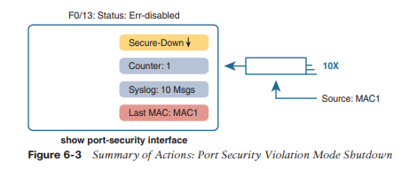
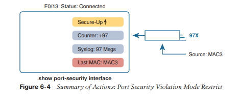

# Implementación de seguridad en puertos del switch

Este capítulo cubre los siguientes temas del examen:
- Fundamentos de Seguridad
	- Configurar funciones de seguridad de Capa 2 (espionaje DHCP, inspección ARP dinámica y seguridad de puertos)

En las redes modernas, la seguridad debe implementarse en profundidad. La arquitectura de seguridad debe utilizar cortafuegos y sistemas de prevención de intrusiones (IPS) en ubicaciones estratégicas, y los hosts deben utilizar herramientas antivirus y antimalware. Los enrutadores, que ya deben existir en toda la empresa en el borde entre las redes de área local y las redes de área amplia, se pueden configurar con listas de control de acceso IP para filtrar paquetes relacionados con diferentes rangos de direcciones IP en esa empresa.

Los conmutadores LAN tienen una oportunidad única como punto de aplicación de la seguridad, en particular los conmutadores LAN conectados a dispositivos terminales. Los atacantes suelen lanzar ataques desde los puntos finales conectados a un conmutador LAN empresarial. El atacante podría obtener acceso físico al punto final o infectar primero el dispositivo para luego lanzar un ataque. Además, un dispositivo móvil puede infectarse mientras está fuera de la red de la empresa y luego conectarse a la red de la empresa, lanzándose el ataque en ese punto.

Los ingenieros deben asumir que los ataques pueden lanzarse desde dispositivos de usuario final conectados directamente a los puertos de acceso de los conmutadores LAN de la empresa, por lo que los conmutadores Cisco incluyen una serie de herramientas útiles para ayudar a prevenir varios tipos de ataques. Este capítulo analiza una de esas herramientas: la seguridad portuaria.
### Conceptos y configuración de seguridad portuaria
Si el ingeniero de redes sabe qué dispositivos deben cablearse y conectarse a interfaces particulares en un conmutador, puede usar la seguridad del puerto para restringir esa interfaz de modo que solo los dispositivos esperados puedan usarla. Esto reduce la exposición a ataques en los que el atacante conecta una computadora portátil a algún puerto de conmutador no utilizado. Cuando ese dispositivo inapropiado intenta enviar tramas a la interfaz del conmutador, el conmutador puede realizar diferentes acciones, que van desde simplemente emitir mensajes informativos hasta apagar efectivamente la interfaz.

La seguridad de puertos identifica los dispositivos según la dirección MAC de origen de las tramas Ethernet que envían los dispositivos. Por ejemplo, en la Figura 6-1, la PC1 envía una trama, con la dirección MAC de la PC1 como dirección de origen. La interfaz F0/1 de SW1 se puede configurar con seguridad de puerto y, de ser así, SW1 examinaría la dirección MAC de la PC1 y decidiría si a la PC1 se le permitió enviar tramas al puerto F0/1.


La seguridad del puerto tampoco tiene restricciones sobre si la trama proviene de un dispositivo local o se reenvió a través de otros conmutadores. Por ejemplo, el conmutador SW1 podría usar seguridad de puerto en su interfaz G0/1, verificando la dirección MAC de origen de la trama desde la PC2, cuando se reenvía a SW1 desde SW2.

Port Security tiene varias opciones flexibles, pero todas operan con los mismos conceptos básicos. En primer lugar, los conmutadores habilitan la seguridad de puerto por puerto, con diferentes configuraciones disponibles por puerto. Cada puerto tiene una cantidad máxima de direcciones MAC permitidas, lo que significa que para todas las tramas que ingresan a ese puerto, solo se puede usar esa cantidad de direcciones MAC de origen diferentes antes de que la seguridad del puerto piense que se ha producido una infracción. Cuando llega una trama con una nueva dirección MAC de origen, lo que hace que la cantidad de direcciones MAC supere el máximo permitido, se produce una violación de la seguridad del puerto. En ese momento, el conmutador toma medidas y, de forma predeterminada, descarta todo el tráfico entrante futuro en ese puerto.

 La siguiente lista resume estas ideas comunes a todas las variaciones de seguridad portuaria:
- Examina las tramas recibidas en la interfaz para determinar si se ha producido una infracción.
- Define una cantidad máxima de direcciones MAC de origen únicas permitidas para todas las tramas que ingresan a la interfaz.
- Mantiene una lista y un contador de todas las direcciones MAC de origen únicas en la interfaz.
- Monitorea las direcciones MAC recién aprendidas, considerando que esas direcciones MAC causan una infracción si la dirección MAC recién aprendida empujara el número total de entradas de la tabla MAC para la interfaz más allá de las direcciones MAC máximas permitidas configuradas para ese puerto.
- Toma medidas para descartar tramas de las direcciones MAC infractoras, además de otras acciones según el modo de infracción configurado.

Esas reglas definen los conceptos básicos, pero la seguridad portuaria también permite otras opciones, incluidas opciones como estas:
- Defina un máximo de tres direcciones MAC, definiendo las tres direcciones MAC específicas.
- Defina un máximo de tres direcciones MAC, pero permita que esas direcciones se aprendan dinámicamente, permitiendo que se aprendan las primeras tres direcciones MAC.
- Defina un máximo de tres direcciones MAC, predefiniendo una dirección MAC específica y permitiendo que dos más se aprendan dinámicamente.

Quizás le guste la idea de predefinir las direcciones MAC para la seguridad del puerto, pero encontrar la dirección MAC de cada dispositivo puede ser una molestia. La seguridad del puerto proporciona un compromiso útil utilizando una función llamada direcciones MAC seguras y fijas. Con esta característica, la seguridad del puerto aprende las direcciones MAC de cada puerto para que no tenga que configurar previamente los valores. También agrega las direcciones MAC aprendidas a la configuración de seguridad del puerto (en el archivo `runningconfig`). Esta característica ayuda a reducir el gran esfuerzo de averiguar la dirección MAC de cada dispositivo.

Como puede ver, Port Security tiene muchas opciones detalladas. Las siguientes secciones lo guiarán a través de estas opciones para reunir las ideas.
### Configurar Port Security
La configuración de port security implica varios pasos. En primer lugar, la seguridad del puerto funciona tanto en los puertos de acceso como en los puertos troncales, pero requiere que usted configure estáticamente el puerto como troncal o como puerto de acceso, en lugar de dejar que el conmutador decida dinámicamente si usar el enlace troncal. La siguiente lista de verificación de configuración detalla cómo habilitar la seguridad del puerto, establecer el máximo de direcciones MAC permitidas por puerto y configurar las direcciones MAC reales:
**Paso 1.** Utilice los subcomandos `switchport mode access` o `switchport mode trunk`, respectivamente, para hacer que la interfaz del switch sea un acceso estático o una interfaz troncal.
**Paso 2.** Utilice el subcomando `switchport port-security` para habilitar la seguridad del puerto en la interfaz.
**Paso 3.** (Opcional) Utilice el subcomando `switchport port-security maximun [interface]`  para anular el número máximo predeterminado de direcciones MAC permitidas asociadas con la interfaz (1).
**Paso 4.** (Opcional) Utilice el comando `switchport-security violation {protect | restringir | Shutdown}`  para anular la acción predeterminada que se debe realizar ante una violación de seguridad (apagado).
**Paso 5.** (Opcional) Utilice el subcomando `switchport port-security mac-address mac-address` para predefinir cualquier dirección MAC de origen permitida para esta interfaz. Utilice el comando varias veces para definir más de una dirección MAC.
**Paso 6.** (Opcional) Utilice el subcomando `switchport port-security mac-address sticky` para indicarle al switch que realice un “aprendizaje permanente” de direcciones MAC aprendidas dinámicamente.

Para demostrar cómo configurar esta variedad de ajustes, la Figura 6-2 y el Ejemplo 6-1 muestran cuatro ejemplos de seguridad de puerto. Tres puertos funcionan como puertos de acceso, mientras que el puerto F0/4, conectado a otro conmutador, funciona como troncal.


```
SW1# show running-config 
(Lines omitted for brevity)

interface FastEthernet0/1  
switchport mode access  
switchport port-security  
switchport port-security mac-address 0200.1111.1111 
!

interface FastEthernet0/2  
switchport mode access  
switchport port-security  
switchport port-security mac-address sticky 
!

interface FastEthernet0/3  
switchport mode access  
switchport port-security 
! 
interface FastEthernet0/4  
switchport mode trunk  
switchport port-security  
switchport port-security maximum 8
```

Primero, escanee la configuración de las cuatro interfaces en el Ejemplo 6-1, centrándose en los dos primeros subcomandos de la interfaz en cada caso. Tenga en cuenta que las primeras tres interfaces del ejemplo utilizan los mismos dos primeros subcomandos de interfaz, que coinciden con los dos primeros pasos de configuración indicados antes de la Figura 6-2. El comando `switchport port-security` habilita la seguridad del puerto, con todos los valores predeterminados, y el comando `switchport mode access` cumple con el requisito de configurar el puerto como puerto de acceso o troncal. El puerto final, F0/4, tiene una configuración similar, excepto que se ha configurado como troncal en lugar de como puerto de acceso.

A continuación, escanee las cuatro interfaces nuevamente y observe que la configuración difiere en cada interfaz después de esos dos primeros subcomandos de interfaz. Cada interfaz simplemente muestra un ejemplo diferente de perspectiva.

La primera interfaz, FastEthernet 0/1, agrega un subcomando de seguridad de puerto opcional:
dirección mac de seguridad del puerto switchport 0200.1111.1111, que define una dirección MAC de origen específica. Con la configuración de dirección de origen máxima predeterminada de 1, solo se permitirán en este puerto tramas con MAC de origen 0200.1111.1111. Cuando una trama con una fuente distinta de 0200.1111.1111 ingresa a F0/1, el conmutador normalmente realizará el aprendizaje de la dirección MAC y querrá agregar la nueva dirección MAC de origen a la tabla de direcciones MAC. La seguridad del puerto considerará esa acción como aprender demasiadas direcciones MAC en el puerto, tomando la acción de infracción predeterminada para deshabilitar la interfaz.

Como segundo ejemplo, FastEthernet 0/2 usa la misma lógica que FastEthernet 0/1, excepto que usa la función de aprendizaje permanente. Para el puerto F0/2, la configuración del comando `switchport port-security mac-address sticky` le indica al switch que aprenda dinámicamente las direcciones MAC de origen y agregue comandos de seguridad de puerto a la configuración en ejecución. El ejemplo 6-2 muestra el archivo running-config que enumera la dirección MAC aprendida en este caso.

```
SW1# show running-config interface f0/2
Building configuration... 
Current configuration : 188 bytes 
!

interface FastEthernet0/2  
switchport mode access  
switchport port-security  
switchport port-security mac-address sticky  
switchport port-security mac-address sticky 0200.2222.2222
```

La seguridad del puerto no guarda la configuración de las direcciones fijas, así que use el comando `copy running-config startup-config` si lo desea.

Las otras dos interfaces del ejemplo 6-1 no predefinen direcciones MAC ni realizan aprendizaje fijo de las direcciones MAC. La única diferencia entre la configuración de seguridad de puertos de estas dos interfaces es que FastEthernet 0/4 admite ocho direcciones MAC porque se conecta a otro conmutador y debe recibir tramas con múltiples direcciones MAC de origen. La interfaz F0/3 utiliza el máximo predeterminado de una dirección MAC.
### Verificación de la seguridad portuaria
El comando `show port-security` proporciona la mayor información sobre cómo funciona la seguridad del puerto, como se muestra en el Ejemplo 6-3. Este comando enumera los ajustes de configuración para la seguridad del puerto en una interfaz; Además, enumera varios datos importantes sobre el funcionamiento actual de la seguridad portuaria, incluida información sobre cualquier violación de la seguridad. Los dos comandos del ejemplo muestran las interfaces F0/1 y F0/2, según la configuración del Ejemplo 6-1.

```
SW1# show port-security interface fastEthernet 0/1
Port Security                 : Enabled
Port Status                   : Secure-shutdown
Violation Mode                : Shutdown
Aging Time                    : 0 mins
Aging Type                    : Absolute
SecureStatic Address Aging    : Disabled
Maximum MAC Addresses         : 1
Total MAC Addresses           : 1
Configured MAC Addresses      : 1
Sticky MAC Addresses          : 0
Last Source Address:Vlan      : 0013.197b.5004:1
Security Violation Count      : 1

SW1# show port-security interface fastEthernet 0/2
Port Security                 : Enabled
Port Status                   : Secure-up
Violation Mode                : Shutdown
Aging Time                    : 0 mins
Aging Type                    : Absolute
SecureStatic Address Aging    : Disabled
Maximum MAC Addresses         : 1
Total MAC Addresses           : 1
Configured MAC Addresses      : 1
Sticky MAC Addresses          : 1
Last Source Address:Vlan      : 0200.2222.2222:1
Security Violation Count      : 0
```

Los dos comandos del Ejemplo 6-3 confirman que se ha producido una infracción de seguridad en FastEthernet 0/1, pero no se ha producido ninguna infracción en FastEthernet 0/2. El comando `show port-security interface fastethernet 0/1` muestra que la interfaz está en un estado de apagado seguro, lo que significa que la interfaz se ha deshabilitado debido a la seguridad del puerto. En este caso, otro dispositivo conectado al puerto F0/1, que envía una trama con una dirección MAC de origen distinta de 0200.1111.1111, está provocando una infracción. Sin embargo, el puerto Fa0/2, que utilizaba aprendizaje fijo, simplemente aprendió la dirección MAC utilizada por el Servidor 2.
### Direcciones MAC de seguridad de puertos
Para completar este capítulo, tómese un momento para pensar en la conmutación de Capa 2, junto con todos esos ejemplos de resultados del comando EXEC dinámico `show mac Address-Table`.

Una vez que un puerto de switch se ha configurado con seguridad de puerto, el switch ya no considera las direcciones MAC asociadas con ese puerto como entradas dinámicas como se enumeran en el comando `show mac Address-Table Dynamic EXEC`. Incluso si las direcciones MAC se aprenden dinámicamente, una vez que se ha habilitado la seguridad del puerto, debe usar una de estas opciones para ver las entradas de la tabla MAC asociadas con los puertos que usan la seguridad del puerto:
- `show mac address-table secure`: enumera las direcciones MAC asociadas con los puertos que utilizan seguridad de puerto
- `show mac Address-Table static`: enumera las direcciones MAC asociadas con los puertos que utilizan seguridad de puerto, así como cualquier otra dirección MAC definida estáticamente.

El ejemplo 6-4 prueba este punto. Muestra dos comandos sobre la interfaz F0/2 del ejemplo de seguridad del puerto que se muestra en la Figura 6-2 y el Ejemplo 6-1. En ese ejemplo, la seguridad del puerto se configuró en F0/2 con aprendizaje fijo, por lo que, literalmente, el conmutador aprendió una dirección MAC de ese puerto (0200.2222.2222). Sin embargo, el comando `show mac Address-Table Dynamic` no enumera la dirección y el puerto porque IOS considera que la entrada de la tabla MAC es una entrada estática. El comando `show mac Address-Table Secure` enumera la dirección y el puerto.

```
SW1#  show mac address-table secure interface F0/2
           Mac Address Table
-------------------------------------------
Vlan    Mac Address       Type          Ports
----    -----------        --------     -----
 1       0200.2222.2222   STATIC        Fa0/2
Total Mac Addresses for this criterion: 1

SW1#  show mac address-table dynamic interface f0/2
           Mac Address Table
-------------------------------------------
Vlan    Mac Address       Type          Ports
----    -----------        --------     -----

SW1#
```

### Port Security Violation Modes
El modo de infracción define cómo debe reaccionar la seguridad portuaria cuando se produce una infracción.

Primero, para revisar, ¿qué es una violación a la protección portuaria? Cualquier trama recibida que infrinja las reglas de seguridad del puerto en una interfaz. Por ejemplo:
- Para una interfaz que permite dos direcciones MAC cualesquiera, se produce una infracción cuando el total de direcciones MAC preconfiguradas y aprendidas en la interfaz excede el máximo configurado de dos.
- Para una interfaz que predefine todas las direcciones MAC específicas permitidas en la interfaz, se produce una infracción cuando el conmutador recibe una trama cuya MAC de origen no es una de esas direcciones configuradas.

Con la seguridad de puerto, cada puerto del switch se puede configurar para utilizar uno de los tres modos de infracción que definen las acciones a tomar cuando se produce una infracción. Las tres opciones hacen que el conmutador descarte la trama infractora (una trama cuya dirección MAC de origen elevaría el número de direcciones MAC aprendidas por encima del límite). Sin embargo, los modos varían en cuanto a la cantidad de otros pasos que toman. Por ejemplo, algunos modos incluyen la acción del conmutador que genera mensajes syslog y mensajes SNMP Trap, mientras que algunos definen la acción para deshabilitar la interfaz. La Tabla 6-2 enumera los tres modos, sus acciones, junto con las palabras clave que habilitan cada modo en la violación de seguridad del puerto del puerto de conmutación {protect | restringir | apagado} subcomando de interfaz.

| **Option on the switchport port-security violation Command**                          | **Protect** | **Restrict** | **Shutdown** |
| ------------------------------------------------------------------------------------- | ----------- | ------------ | ------------ |
| Discards offending traffic                                                            | Yes         | Yes          | Yes          |
| Sends log and SNMP messages                                                           | No          | Yes          | Yes          |
| Disables the interface by putting it in an err-disabled state, discarding all traffic | No          | No           | Yes          |

Debido a que IOS reacciona de manera tan diferente con el modo de apagado en comparación con los modos de restricción y protección, ahora se explican las diferencias: primero para el modo de apagado y luego para los otros dos modos.
### Modo de apagado de seguridad del puerto
Cuando se utiliza el modo de violación de apagado (predeterminado) y se produce una violación de la seguridad del puerto en un puerto, la seguridad del puerto detiene todo el reenvío de tramas en la interfaz, tanto dentro como fuera del puerto. En efecto, actúa como si la seguridad portuaria hubiera cerrado el puerto; sin embargo, no configura literalmente el puerto con el subcomando de interfaz de apagado. En cambio, la seguridad del puerto utiliza la función de desactivación de errores. Los conmutadores Cisco utilizan el estado de error deshabilitado para una amplia gama de propósitos, pero cuando se utiliza el modo de apagado de seguridad del puerto y se produce una infracción, sucede lo siguiente:
- El estado de la interfaz del conmutador (por mostrar interfaces y mostrar el estado de las interfaces) cambia a un estado de error deshabilitado.
- El estado de seguridad del puerto de la interfaz del switch (según `show port-security`) cambia a un estado seguro.
- El switch deja de enviar y recibir tramas en la interfaz.

Una vez que la seguridad del puerto ha colocado un puerto en estado de desactivación de errores, de forma predeterminada, el puerto permanece en ese estado hasta que alguien toma medidas. Para recuperarse de un estado de error deshabilitado, la interfaz debe cerrarse con el comando `shutdown` y luego habilitarse con el comando `no shutdown`. Como alternativa, el conmutador se puede configurar para recuperarse automáticamente del estado de error deshabilitado, cuando es causado por la seguridad del puerto, con estos comandos:
- `errdisable recovery cause psecure-violation`: un comando global para habilitar la recuperación automática para interfaces en un estado de error deshabilitado causado por la seguridad del puerto
- `errdisable recovery interval`: un comando global para establecer el tiempo de espera antes de recuperar la interfaz

Para observar más de cerca el modo `shutdown`, comience verificando el estado de configuración del conmutador. Puede verificar la configuración de seguridad del puerto en cualquier interfaz con el comando `show port-security interface type number`, como se vio en el Ejemplo 6-2, pero el comando `show port-security` (como se enumera en el Ejemplo 6-5) muestra un resultado más breve. con una línea por interfaz habilitada.

```
SW1#  show port-security
Secure Port  MaxSecureAddr  CurrentAddr  SecurityViolation  Security Action
                 (Count)       (Count)          (Count)
--------------------------------------------------------------------------
Fa0/13               1            1                1          Shutdown
---------------------------------------------------------------------------

Total Addresses in System (excluding one mac per port) : 0
Max Addresses limit in System (excluding one mac per port) : 8192
```


Tenga en cuenta que para los siguientes ejemplos, un conmutador ha configurado la seguridad del puerto solo en el puerto Fa0/13. En este caso, el conmutador parece estar configurado para admitir una dirección MAC, ya ha alcanzado ese total y tiene una acción de violación de seguridad de "shutdown".

A continuación, el Ejemplo 6-6 muestra los resultados después de que ya se haya producido una violación de la seguridad del puerto en el puerto F0/13. El primer comando confirma el estado de error desactivado (según el comando `show interfaces status`) y el estado de apagado seguro (según el comando `show port-security`).

```
! The next lines show the log message generated when the violation occurred.
Jul 31 18:00:22.810: %PORT_SECURITY-2-PSECURE_VIOLATION: Security violation occurred, caused by MAC address d48c.b57d.8200 on port FastEthernet0/13

! The next command shows the err-disabled state, implying a security violation.
SW1# show interfaces Fa0/13 status

Port    Name                   Status        Vlan   Duplex  Speed  Type Fa0/13                         err-disabled  1      auto     auto  10/100BaseTX 
!
! The next command's output has shading for several of the most important facts.
SW1#  show port-security interface Fa0/13
Port Security                  : Enabled
Port Status                    : Secure-shutdown
Violation Mode                 : Shutdown
Aging Time                     : 0 mins
Aging Type                     : Absolute
SecureStatic Address Aging     : Disabled
Maximum MAC Addresses          : 1
Total MAC Addresses            : 1
Configured MAC Addresses       : 1
Sticky MAC Addresses           : 0
Last Source Address:Vlan       : 0200.3333.3333:2
Security Violation Count       : 1
```

El resultado del comando `show port-security interface` enumera el estado actual de seguridad del puerto (secure-shutdown), así como el modo configurado (shutdown). La última línea de resultado enumera la cantidad de infracciones que causaron que la interfaz fallara a un estado de error deshabilitado, mientras que la penúltima línea identifica la dirección MAC y la VLAN del dispositivo que causó la infracción.
La Figura 6-3 resume estos comportamientos, suponiendo el mismo escenario que se muestra en el ejemplo.


### Modos de protección y restricción de seguridad portuaria
Los modos de infracción restringir y proteger adoptan un enfoque muy diferente para proteger los puertos. Estos modos aún descartan el tráfico infractor, pero la interfaz permanece en un estado conectado (up/up) y en un estado de seguridad del puerto seguro. Como resultado, el puerto continúa enviando buen tráfico pero descarta el tráfico infractor.

Tener un puerto aparentemente en buen estado que también descarta el tráfico puede ser un desafío a la hora de solucionar problemas. Básicamente, debe conocer la función y luego saber cómo saber cuándo la seguridad del puerto está descartando parte del tráfico en un puerto aunque el estado de la interfaz parezca bueno.

Con el modo de protección, la única acción que realiza el conmutador ante una trama que viola las reglas de seguridad del puerto es descartar la trama. El conmutador no cambia el puerto a un estado de desactivación de errores, no genera mensajes y ni siquiera incrementa el contador de infracciones.
El ejemplo 6-7 muestra una muestra con modo de protección después de que se hayan producido varias infracciones. Tenga en cuenta que el comando `show` confirma el modo (protección) tal como se configuró en la parte superior del ejemplo, con un estado de seguridad del puerto de seguridad, un estado que no cambiará en el modo de protección. Además, tenga en cuenta que el contador en la parte inferior muestra 0, aunque se hayan producido varias infracciones, porque el modo de protección no cuenta los fotogramas infractores.

```
SW1# show running-config 
! Lines omitted for brevity 
interface FastEthernet0/13   
   switchport mode access   
   switchport port-security   
   switchport port-security mac-address 0200.1111.1111   
   switchport port-security violation protect
! Lines omitted for brevity

SW1# show port-security interface Fa0/13
Port Security                 : Enabled
Port Status                   : Secure-up
Violation Mode                : Protect
Aging Time                    : 0 mins
Aging Type                    : Absolute
SecureStatic Address Aging    : Disabled
Maximum MAC Addresses         : 1
Total MAC Addresses           : 1
Configured MAC Addresses      : 1
Sticky MAC Addresses          : 0
Last Source Address:Vlan      : 0000.0000.0000:0
Security Violation Count      : 0
```

Mientras que el modo shutdown desactiva la interfaz y el modo de protección no hace más que descartar el tráfico infractor, el modo de restricción proporciona un compromiso entre los otros dos modos. Si el ejemplo 6-7 hubiera utilizado el modo de violación de restricción en lugar de proteger, el estado del puerto también habría permanecido en un estado seguro; sin embargo, IOS mostraría alguna indicación de la actividad de seguridad del puerto, como un contador de violaciones incremental preciso, así como mensajes de syslog. El ejemplo 6-8 muestra un ejemplo del contador de infracciones y finaliza con un mensaje de syslog de seguridad de puerto de ejemplo. En este caso, hasta el momento 97 tramas entrantes violaron las reglas, y la trama más reciente tenía una dirección MAC de origen de 0200.3333.3333 en la VLAN 1.

```
SW1# show port-security interface fa0/13
Port Security                 : Enabled
Port Status                   : Secure-up
Violation Mode                : Restrict
Aging Time                    : 0 mins
Aging Type                    : Absolute
SecureStatic Address Aging    : Disabled
Maximum MAC Addresses         : 1
Total MAC Addresses           : 1
Configured MAC Addresses      : 1
Sticky MAC Addresses          : 0
Last Source Address:Vlan      : 0200.3333.3333:1
Security Violation Count      : 97
! 
! The following log message also points to a port security issue. 
! 01:46:58: %PORT_SECURITY-2-PSECURE_VIOLATION: Security violation occurred, caused by MAC address 0200.3333.3333 on port FastEthernet0/13.
```

La Figura 6-4 resume los puntos clave sobre el modo restringido para la seguridad del puerto. En este caso, la figura coincide nuevamente con el mismo escenario que el ejemplo, con un total de 97 tramas infractoras llegando hasta el momento, siendo la más reciente la de la dirección MAC de origen MAC3.



### Comandos de referencia


| Comando                                                                | Modo / Propósito / Descripción                                                                                                                                                         |
| ---------------------------------------------------------------------- | -------------------------------------------------------------------------------------------------------------------------------------------------------------------------------------- |
| `switchport mode {access \| trunk}`                                    | Interface configuration mode command that tells the switch to always be an access port, or always be a trunk port                                                                      |
| `switchport port-security mac-address mac-address`                     | Interface configuration mode command that statically adds a specific MAC address as an allowed MAC address on the interface                                                            |
| `switchport port-security mac-address sticky`                          | Interface subcommand that tells the switch to learn MAC addresses on the interface and add them to the configuration for the interface as secure MAC addresses                         |
| `switchport port-security maximum value`                               | Interface subcommand that sets the maximum number of static secure MAC addresses that can be assigned to a single interface                                                            |
| `switchport port-security violation {protect \| restrict \| shutdown}` | Interface subcommand that tells the switch what to do if an inappropriate MAC address tries to access the network through a secure switch port                                         |
| `errdisable recovery cause psecure-violation`                          | Global command that enables the automatic recovery from err-disabled state for ports that reach that state due to port security violations                                             |
| `errdisable recovery interval seconds`                                 | Global command that sets the delay, in seconds, before a switch attempts to recover an interface in err-disabled mode, regardless of the reason for that interface being in that state |
| `shutdown`                                 `no shutdown`               | Interface subcommands that administratively disable and enable an interface, respectively                                                                                              |
| `show running-config`                                                  | Lists the currently used configuration                                                                                                                                                 |
| `show running-config \| interface type number`                         | Displays the running-configuration excerpt of the listed interface and its subcommands only                                                                                            |
| `show mac address-table dynamic [interface type number]`               | Lists the dynamically learned entries in the switch’s address (forwarding) table                                                                                                       |
| `show mac address-table secure [interface type number]`                | Lists MAC addresses defined or learned on ports configured with port security                                                                                                          |
| `show mac address-table static [interface type number]`                | Lists static MAC addresses and MAC addresses learned or defined with port security                                                                                                     |
| `show interfaces [interface type number] status`                       | Lists one output line per interface (or for only the listed interface if included), noting the description, operating state, and settings for duplex and speed on each interface       |
| `show port-security interface type number`                             | Lists an interface’s port security configuration settings and security operational status                                                                                              |
| `show port-security`                                                   | Lists one line per interface that summarizes the port security settings for any interface on which it is enabled                                                                       |
