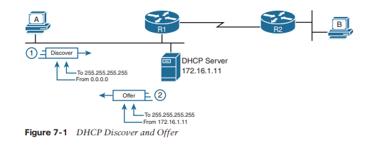
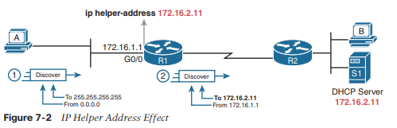
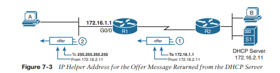
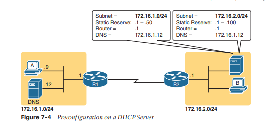
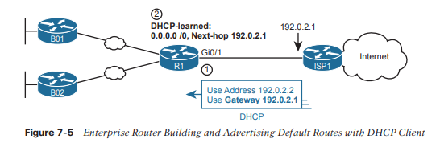
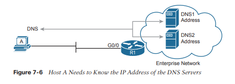
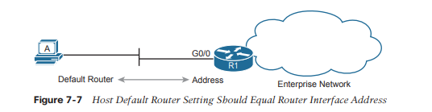
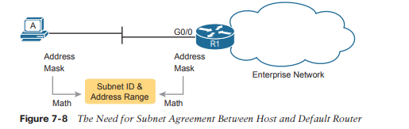
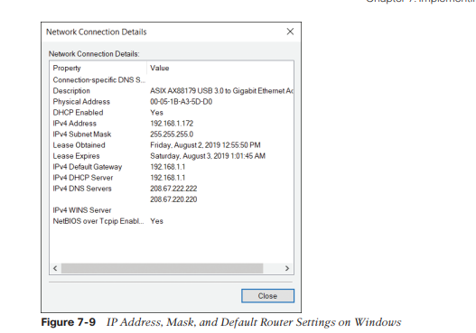

# Implementación de DHCP

Este capítulo cubre los siguientes temas del examen:
- Fundamentos de la red
	- Identificar parámetros de IP para el sistema operativo del cliente (Windows, Mac OS, Linux)
- Servicios de IP
	- Explicar el papel de DHCP y DNS dentro de la red.
	- Configurar y verificar el cliente y la retransmisión DHCP

En el mundo de TCP/IP, la palabra host se refiere a cualquier dispositivo con una dirección IP: su teléfono, su tableta, una PC, un servidor, un enrutador, un conmutador; cualquier dispositivo que utilice IP para brindar un servicio o simplemente necesite una dirección IP para ser administrada. El término anfitrión también incluye algunos dispositivos menos obvios: la pantalla de vídeo publicitaria electrónica del centro comercial, su medidor de energía eléctrica que utiliza la misma tecnología que los teléfonos móviles para enviar su información de consumo eléctrico para facturación, su nuevo automóvil.

 No importa el tipo de host, cualquier host que utilice IPv4 necesita cuatro configuraciones de IPv4 para funcionar correctamente:
- Dirección IP
- Máscara de subred
- Enrutadores predeterminados
- Direcciones IP del servidor DNS
### Protocolo de configuración host dinámico
El Protocolo de configuración dinámica de host (DHCP) proporciona uno de los servicios más utilizados en una red TCP/IP. La gran mayoría de los hosts en una red TCP/IP son dispositivos de usuario, y la gran mayoría de los dispositivos de usuario aprenden su configuración de IPv4 mediante DHCP.

El uso de DHCP tiene varias ventajas sobre la otra opción de configurar manualmente los ajustes de IPv4. La configuración de la IP del host se encuentra en un servidor DHCP, y cada cliente aprende estas configuraciones mediante mensajes DHCP. Como resultado, la configuración IP del host la controla el personal de TI, en lugar de la configuración local en cada host, lo que genera menos errores de usuario. DHCP permite la asignación permanente de direcciones de host, pero más comúnmente, DHCP asigna una concesión temporal de direcciones IP. Con estas concesiones, el servidor DHCP puede recuperar direcciones IP cuando un dispositivo se elimina de la red, haciendo un mejor uso de las direcciones disponibles.

DHCP también permite la movilidad. Por ejemplo, cada vez que un usuario se muda a una nueva ubicación con una tableta (a una cafetería, a la ubicación de un cliente o de regreso a la oficina), el dispositivo del usuario puede conectarse a otra LAN inalámbrica y usar DHCP para arrendar una nueva dirección IP. en esa LAN y comenzar a trabajar en la nueva red. Sin DHCP, el usuario tendría que solicitar información sobre la red local y configurar los ajustes manualmente, y no pocos usuarios cometerían errores.

Aunque DHCP funciona automáticamente para los hosts de los usuarios, requiere cierta preparación de la red, con cierta configuración en los enrutadores. En algunas redes empresariales, la configuración del enrutador puede ser un solo comando en muchas de las interfaces LAN del enrutador (`ip helper-address server-ip`), que identifica el servidor DHCP por su dirección IP. En otros casos, el enrutador actúa como servidor DHCP. De todos modos, los enrutadores tienen algún papel que desempeñar.
### Conceptos de DHCP
Siéntese por un momento y piense en el papel de DHCP para una computadora host. El host actúa como cliente DHCP. Como cliente DHCP, el host comienza sin configuración de IPv4: sin dirección IPv4, sin máscara, sin enrutador predeterminado y sin direcciones IP de servidor DNS. Pero un cliente DHCP sí tiene conocimiento del protocolo DHCP, por lo que puede utilizar ese protocolo para (a) descubrir un servidor DHCP y (b) solicitar arrendar una dirección IPv4.

DHCP utiliza los siguientes cuatro mensajes entre el cliente y el servidor:
**Discover**: enviado por el cliente DHCP para encontrar un servidor DHCP dispuesto
**Offer**: enviada por un servidor DHCP para ofrecerle a ese cliente una dirección IP específica (e informarle al cliente de sus otros parámetros).
**Request**: enviada por el cliente DHCP para solicitarle al servidor que alquile la dirección IPv4 que figura en el mensaje de oferta.
 **Acknowledgment**: enviada por el servidor DHCP para asignar la dirección y enumerar la máscara, el enrutador predeterminado y las direcciones IP del servidor DNS.
 
Los clientes DHCP, sin embargo, tienen un problema único: aún no tienen una dirección IP, pero necesitan enviar estos mensajes DHCP dentro de paquetes IP. Para que eso funcione, los mensajes DHCP utilizan dos direcciones IPv4 especiales que permiten que un host que no tiene dirección IP aún pueda enviar y recibir mensajes en la subred local:
**0.0.0.0**: una dirección reservada para su uso como dirección IPv4 de origen para hosts que aún no tienen una dirección IP.
**255.255.255.255**: la dirección IP de transmisión local. Los paquetes enviados a esta dirección de destino se transmiten a través del enlace de datos local, pero los enrutadores no los reenvían.

Para ver cómo funcionan estas direcciones, la Figura 7-1 muestra un ejemplo de las direcciones IP utilizadas entre un host (A) y un servidor DHCP en la misma LAN. El host A, un cliente, envía un mensaje Discover, con la dirección IP de origen 0.0.0.0 porque el host A aún no tiene una dirección IP para usar. El host A envía el paquete al destino 255.255.255.255, que se envía en una trama de transmisión LAN y llega a todos los hosts de la subred. El cliente espera que haya un servidor DHCP en la subred local. ¿Por qué? Los paquetes enviados a 255.255.255.255 solo van a hosts en la subred local; El enrutador R1 no reenviará este paquete.



Ahora mire el mensaje de oferta enviado por el servidor DHCP. El servidor vuelve a configurar la dirección IP de destino en 255.255.255.255. ¿Por qué? El host A todavía no tiene una dirección IP, por lo que el servidor no puede enviar un paquete directamente al host A. Entonces, el servidor envía el paquete a la dirección de "todos los hosts locales en la subred" (255.255.255.255). (El paquete también se encapsula en una trama de transmisión Ethernet).

Tenga en cuenta que todos los hosts de la subred reciben el mensaje de oferta. Sin embargo, el mensaje Discover original enumera un número llamado ID de cliente, que incluye la dirección MAC del host, que identifica al host original (host A en este caso). Como resultado, el host A sabe que el mensaje de oferta está destinado al host A. El resto de los hosts recibirán el mensaje de oferta, pero observe que el mensaje enumera el ID de cliente DHCP de otro dispositivo, por lo que el resto de los hosts ignoran el mensaje de oferta. .

### Compatibilidad con DHCP para subredes remotas con retransmisión DHCP
Los ingenieros de redes tienen que tomar una decisión de diseño importante con DHCP: ¿colocan un servidor DHCP en cada subred LAN o ubican un servidor DHCP en un sitio central? La pregunta es legítima. Los enrutadores Cisco pueden actuar como servidor DHCP, por lo que un diseño distribuido podría usar el enrutador en cada sitio como servidor DHCP. Con un servidor DHCP en cada subred, como se muestra en la Figura 7-1, los flujos de protocolo permanecen locales en cada LAN.

Sin embargo, un enfoque de servidor DHCP centralizado también tiene ventajas. De hecho, algunos documentos de diseño de Cisco sugieren un diseño centralizado como mejor práctica, en parte porque permite el control y la configuración centralizados de todas las direcciones IPv4 asignadas en toda la empresa.

Con un servidor DHCP centralizado, esos mensajes DHCP que fluyeron solo en la subred local en la Figura 7-1 de alguna manera deben fluir a través de la red IP hasta el servidor DHCP centralizado y viceversa. Para que eso funcione, los enrutadores conectados a las subredes LAN remotas necesitan un subcomando de interfaz: el comando `ip helper-address server-ip`.

El subcomando `ip helper-address server-ip` le dice al enrutador que haga lo siguiente para los mensajes que llegan a una interfaz, desde un cliente DHCP:

Este comando evita la regla "no enrutar paquetes enviados a 255.255.255.255" cambiando la dirección IP de destino. Una vez que el destino se ha configurado para que coincida con la dirección IP del servidor DHCP, la red puede enrutar el paquete al servidor.

 La Figura 7-2 muestra un ejemplo del proceso. El host A se encuentra a la izquierda, como cliente DHCP. El servidor DHCP (172.16.2.11) se encuentra a la derecha. R1 tiene configurado un comando ip helper-address 172.16.2.11, en su interfaz G0/0. En el paso 1, el enrutador R1 detecta el paquete DHCP entrante destinado a 255.255.255.255. El paso 2 muestra los resultados de cambiar la dirección IP de origen y de destino, con el R1 enrutando el paquete.



El enrutador utiliza un proceso similar para devolver mensajes DHCP desde el servidor. Primero, para el paquete de retorno del servidor DHCP, el servidor simplemente invierte la dirección IP de origen y destino del paquete recibido del enrutador (agente de retransmisión). Por ejemplo, en la Figura 7-2, el mensaje Descubrir enumera la dirección IP de origen 172.16.1.1, por lo que el servidor envía el mensaje Oferta a la dirección IP de destino 172.16.1.1.

Cuando un enrutador recibe un mensaje DHCP, dirigido a una de las direcciones IP del enrutador, se da cuenta de que el paquete podría ser parte de la función de retransmisión DHCP. Cuando eso sucede, el agente de retransmisión DHCP (enrutador R1) necesita cambiar la dirección IP de destino, para que el cliente DHCP real (host A), que aún no tiene una dirección IP, pueda recibir y procesar el paquete.

La Figura 7-3 muestra un ejemplo de cómo funcionan estas direcciones, cuando R1 recibe el mensaje de oferta DHCP enviado a la propia dirección 172.16.1.1 de R1. R1 cambia el destino del paquete a 255.255.255.255 y lo reenvía a G0/0, porque el paquete estaba destinado a la dirección IP 172.16.1.1 de G0/0. Como resultado, todos los hosts de esa LAN (incluido el cliente DHCP A) recibirán el mensaje.

Muchas redes empresariales utilizan un servidor DHCP centralizado, por lo que la configuración normal del enrutador incluye un comando `ip helper-address` en cada interfaz/subinterfaz LAN. Con esa configuración estándar, los hosts de usuarios fuera de cualquier interfaz LAN del enrutador siempre pueden llegar al servidor DHCP y arrendar una dirección IP.



### Información almacenada en el servidor DHCP
Un servidor DHCP puede parecer una gran pieza de hardware, ubicada en una gran habitación cerrada con mucho aire acondicionado para mantener el hardware fresco. Sin embargo, como la mayoría de los servidores, el servidor es en realidad un software que se ejecuta en algunos sistemas operativos de servidor. El servidor DHCP podría ser un software descargado de forma gratuita e instalado en una PC antigua. Sin embargo, debido a que el servidor debe estar disponible todo el tiempo para admitir nuevos clientes DHCP, la mayoría de las empresas instalan el software en un centro de datos muy estable y altamente disponible, con funciones de alta disponibilidad. Sin embargo, el servicio DHCP todavía se crea mediante software.

Para estar listo para responder a los clientes DHCP y proporcionarles una dirección IPv4 y otra información, el servidor DHCP (software) necesita configuración. Los servidores DHCP normalmente organizan estas configuraciones de IPv4 por subred, porque la información que el servidor le brinda al cliente suele ser la misma para todos los hosts en la misma subred, pero ligeramente diferente para hosts en diferentes subredes. Por ejemplo, las reglas de direccionamiento IP nos dicen que todos los hosts en la misma subred deben usar la misma máscara, pero los hosts en diferentes subredes tendrían una configuración de puerta de enlace predeterminada diferente.

La siguiente lista muestra los tipos de configuraciones que el servidor DHCP necesita conocer para admitir clientes DHCP:
**ID de subred y máscara**: el servidor DHCP puede utilizar esta información para conocer todas las direcciones de la subred. (El servidor DHCP sabe que no debe ceder el ID de subred ni la dirección de transmisión de subred).
**Direcciones reservadas (excluidas)**: el servidor necesita saber qué direcciones de la subred no debe arrendar. Esta lista permite al ingeniero reservar direcciones para usarlas como direcciones IP estáticas. Por ejemplo, la mayoría de las direcciones IP de enrutadores y conmutadores, direcciones de servidores y direcciones de casi cualquier cosa que no sean dispositivos de usuario utilizan una dirección IP asignada estáticamente. La mayoría de las veces, los ingenieros utilizan la misma convención para todas las subredes, ya sea reservando las direcciones IP más bajas en todas las subredes o reservando las direcciones IP más altas en todas las subredes.
**Enrutadores predeterminados**: esta es la dirección IP del enrutador en esa subred.
**Direcciones IP de DNS**: esta es una lista de direcciones IP del servidor DNS.

La Figura 7-4 muestra el concepto detrás de la configuración previa en un servidor DHCP para dos subredes basadas en LAN, 172.16.1.0/24 y 172.16.2.0/24. El servidor DHCP se encuentra a la derecha. Para cada subred, el servidor define todos los elementos de la lista. En este caso, la configuración reserva las direcciones IP más bajas de la subred para usarlas como direcciones estáticas.

La configuración también puede enumerar otros parámetros. Por ejemplo, puede establecer el límite de tiempo para arrendar una dirección IP. El servidor alquila una dirección por un tiempo (normalmente varios días) y luego el cliente puede solicitar renovar el contrato. Si el cliente no renueva, el servidor puede reclamar la dirección IP y volver a colocarla en el grupo de direcciones IP disponibles. La configuración del servidor establece el tiempo máximo de arrendamiento.



DHCP utiliza tres modos de asignación, basados ​​en pequeñas diferencias en la configuración en el servidor DHCP. La asignación dinámica se refiere a los mecanismos y la configuración de DHCP que se describen a lo largo de este resumen. Otro método, la asignación automática, establece el tiempo de concesión de DHCP en infinito. Como resultado, una vez que el servidor elige una dirección del grupo y asigna la dirección IP a un cliente, la dirección IP permanece con ese mismo cliente indefinidamente. Un tercer modo, la asignación estática, preconfigura la dirección IP específica para un cliente en función de la dirección MAC del cliente. Ese cliente específico es el único cliente que luego usa la dirección IP.

 Además, el servidor DHCP se puede configurar para proporcionar otras opciones de configuración útiles. Por ejemplo, un servidor puede proporcionar la dirección IP de un servidor TFTP (Protocolo trivial de transferencia de archivos). Los servidores TFTP proporcionan un medio básico para almacenar archivos que luego pueden transferirse a un host cliente. Resulta que los teléfonos IP de Cisco dependen de TFTP para recuperar varios archivos de configuración cuando el teléfono se inicializa. DHCP desempeña un papel clave al proporcionar la dirección IP del servidor TFTP que deben usar los teléfonos.
### Configuración de funciones DHCP en enrutadores y conmutadores
Los enrutadores y conmutadores Cisco admiten una variedad de funciones. Los enrutadores se pueden configurar para que actúen como servidores DHCP con solo unos pocos comandos sencillos, una característica útil en el laboratorio y en algunos casos limitados. Más comúnmente, la empresa utiliza un servidor DHCP centralizado (que no se ejecuta en un enrutador), pero con la función de retransmisión DHCP del enrutador en casi todas las interfaces de enrutador. Finalmente, los enrutadores y conmutadores de Cisco también pueden actuar como clientes DHCP y aprenden sus direcciones IP de un servidor DHCP.
### Configuración de la retransmisión DHCP
La configuración de la retransmisión DHCP requiere una decisión sencilla y un único comando de configuración directo. Primero, debe identificar las interfaces que necesitan la función. La función de retransmisión DHCP debe configurarse para cualquier interfaz de enrutador que se conecte a una subred donde
- Los clientes DHCP existen en la subred.
- Los servidores DHCP no existen en la subred

Una vez que se han identificado dichas interfaces, la configuración requiere el subcomando de interface `ip helper-address` en cada una de esas interfaces. Por ejemplo, como se muestra en la Figura 7-3 anterior, la interfaz G0/0 del R1 debe configurarse con el subcomando de interfaz `ip helper-address 172.16.2.11`. Una vez habilitado en una interfaz, el agente de retransmisión DHCP de IOS realiza cambios en las direcciones de los mensajes DHCP entrantes como se describió anteriormente en este capítulo. Sin el agente de retransmisión DHCP, la solicitud DHCP nunca llega al servidor.

Para verificar el agente de retransmisión, puede usar el comando `show running-config` y buscar el comando de configuración única o usar el comando `show ip interface g0/0` como se muestra en el Ejemplo 7-1. La línea resaltada confirma la configuración configurada. Tenga en cuenta que si no hubiera comandos de dirección IP auxiliar configurados en la interfaz, el texto diría "La dirección auxiliar no está configurada".

```
R1#  show ip interface g0/0
GigabitEthernet0/0 is up, line protocol is up
  Internet address is 172.16.1.1/24
  Broadcast address is 255.255.255.255   
  Address determined by non-volatile memory
  MTU is 1500 bytes
  Helper address is 172.16.2.11
! Lines omitted for brevity (about 20 lineSc
```
### Configuración de un conmutador como cliente DHCP
Un conmutador puede actuar como cliente DHCP para arrendar su dirección IP. En la mayoría de los casos, querrá utilizar una dirección IP estática para que el personal pueda identificar más fácilmente la dirección del conmutador para la administración remota. Sin embargo, como ejemplo de cómo puede funcionar un cliente DHCP, el siguiente tema muestra cómo configurar y verificar las operaciones del cliente DHCP en un conmutador.

Para configurar un conmutador para que utilice DHCP para arrendar una dirección, configure la dirección IP de un conmutador como de costumbre, pero con el subcomando de interface `ip address dhcp`. El ejemplo 7-2 muestra una muestra.

```
Emma# configure terminal 
Enter configuration commands, one per line. End with CNTL/Z.
Emma(config)# interface vlan 1
Emma(config-if)# ip address dhcp
Emma(config-if)# no shutdown Emma(config-if)# ^Z
Emma#
00:38:20: %LINK-3-UPDOWN: Interface Vlan1, changed state to up
00:38:21: %LINEPROTO-5-UPDOWN: Line protocol on Interface Vlan1, changed state to up
```

Para verificar que DHCP funcionó, comience con la forma tradicional de verificar las direcciones IP en las interfaces VLAN del switch: el comando `show interfaces vlan x` como se muestra en el Ejemplo 7-3. Primero, verifique el estado de la interfaz, porque el conmutador no intenta DHCP hasta que la interfaz VLAN alcance un estado activo. En particular, si olvida emitir el comando de `no shutdown`, la interfaz VLAN 1 permanecerá en estado de apagado y aparecerá como "administrativamente inactiva" en la salida del comando show.

```
Emma#  show interfaces vlan 1
Vlan1 is up, line protocol is up   
Hardware is EtherSVI, address is 0019.e86a.6fc0 (bia 0019.e86a.6fc0)
  Internet address is 192.168.1.101/24   
  MTU 1500 bytes, BW 1000000 Kbit, DLY 10 usec,     
	  reliability 255/255, txload 1/255, rxload 1/255
! lines omitted for brevity
```

La segunda mitad del Ejemplo 7-3 muestra la salida del comando `show interfaces vlan x`, que enumera la dirección IP de la interfaz en la tercera línea. Si configura estáticamente la dirección IP, la dirección IP siempre aparecerá en la lista; sin embargo, cuando se utiliza DHCP, esta línea sólo existe si DHCP se realizó correctamente. Además, tenga en cuenta que, cuando está presente, la salida no indica si la dirección se configuró estáticamente o se aprendió con DHCP. El resultado muestra 192.168.1.101 como dirección, pero sin información para identificar si la dirección IP es estática o aprendida por DHCP.

Para ver más detalles específicos de DHCP, utilice el comando `show dhcp lease` para ver la dirección IP alquilada (temporalmente) y otros parámetros. (Tenga en cuenta que el conmutador no almacena la configuración IP aprendida por DHCP en el archivo de configuración en ejecución). El ejemplo 7-4 muestra un resultado de muestra. Tenga en cuenta también que el conmutador también aprende su configuración de puerta de enlace predeterminada mediante DHCP.

```
Emma#  show dhcp lease
Temp IP addr: 192.168.1.101   for peer on Interface: Vlan1
Temp sub net mask: 255.255.255.0    
	DHCP Lease server: 192.168.1.1, state: 3 Bound
	DHCP transaction id: 1966    
	Lease: 86400 secs,  Renewal: 43200 secs,  Rebind: 75600 secs
	Temp default-gateway addr: 192.168.1.1|

   Next timer fires after: 11:59:45    
   Retry count: 0   Client-ID: cisco-0019.e86a.6fc0-Vl1
   Hostname: Emma

Emma#  show ip default-gateway
192.168.1.1
```

### Configuración de un enrutador como cliente DHCP
Al igual que con los conmutadores, puede configurar las interfaces del enrutador para arrendar una dirección IP mediante DHCP en lugar de utilizar una dirección IP estática, aunque esos casos serán raros. En la mayoría de los casos, tiene más sentido configurar estáticamente las direcciones IP de la interfaz del enrutador con la dirección que figura en el subcomando de interfaz `ip address [adrress] [mask]`. Sin embargo, configurar un enrutador para arrendar una dirección mediante DHCP tiene sentido en algunos casos con un enrutador conectado a Internet; de hecho, la mayoría de los enrutadores domésticos hacen precisamente eso.

Un enrutador con un enlace a Internet puede conocer su dirección IP y su máscara con DHCP y también conocer la dirección del enrutador ISP vecino como puerta de enlace predeterminada. La Figura 7-5 muestra un ejemplo, con tres enrutadores a la izquierda en un sitio empresarial. El enrutador R1 usa DHCP para conocer su dirección IP (192.0.2.2) del enrutador ISP a través de una conexión a Internet.



El proceso DHCP proporciona una dirección IP de puerta de enlace predeterminada al enrutador R1, pero los enrutadores normalmente no utilizan una configuración de puerta de enlace predeterminada; Sólo los hosts utilizan una configuración de puerta de enlace predeterminada. Sin embargo, el enrutador aprovecha esa información al convertir esa dirección IP de la puerta de enlace predeterminada en la base para una ruta predeterminada. Por ejemplo, en la Figura 7-5, el enrutador R1 agrega dinámicamente una ruta predeterminada a su tabla de enrutamiento con la dirección IP de la puerta de enlace predeterminada del mensaje DHCP (que es la dirección IP del enrutador ISP) como la dirección del siguiente salto. En ese punto, R1 tiene una buena ruta que puede utilizar para reenviar paquetes a Internet.

Además, el enrutador R1 puede distribuir esa ruta predeterminada al resto de enrutadores utilizando un protocolo de enrutamiento interno como OSPF. 

El ejemplo 7-5 muestra la configuración en el enrutador R1 para que coincida con la Figura 7-5. Tenga en cuenta que comienza con R1 configurando su interfaz G0/1 para usar DHCP para conocer la dirección IP que se usará en la interfaz, usando el comando `ip address dhcp`.

```
R1# configure terminal 
R1(config)# interface gigabitethernet0/1 
R1(config-if)# ip address dhcp 
R1(config-if)# end

R1#
R1# show ip route static
! Legend omitted Gateway of last resort is 192.0.2.1 to network 0.0.0.0

S*    0.0.0.0/0 [254/0] via 192.0.2.1
```

El final del ejemplo muestra la ruta predeterminada agregada a la tabla de enrutamiento del R1 como resultado de aprender una dirección de puerta de enlace predeterminada de 192.0.2.1 desde DHCP. Curiosamente, IOS muestra esta ruta como una ruta estática (destino 0.0.0.0/0), aunque la ruta se aprende dinámicamente según la puerta de enlace predeterminada aprendida por DHCP. Para reconocer esta ruta como una ruta predeterminada aprendida por DHCP, observe el valor de distancia administrativa de 254. IOS usa una distancia administrativa predeterminada de 1 para rutas estáticas configuradas con el comando de configuración de ruta ip, pero un valor predeterminado de 254 para rutas predeterminadas agregadas debido a DHCP.
### Identificación de la configuración IPv4 del host
Ya sea que haya aprendido a usar DHCP o no, cada host que usa IP versión 4 necesita tener algunas configuraciones para funcionar correctamente. Esta segunda división principal del capítulo examina esas configuraciones y muestra ejemplos de esas configuraciones en Windows, Linux y macOS.
### Configuración de host para IPv4
Para funcionar correctamente, un host IPv4 necesita conocer estos valores:
- Direcciones IP del servidor DNS
- Dirección IP de puerta de enlace predeterminada (enrutador)
- Dirección IP propia del dispositivo
- Máscara de subred propia del dispositivo

Para revisar los conceptos básicos, el host debe conocer la dirección IP de uno o más servidores DNS para enviar las solicitudes de resolución de nombres de los servidores. Para las empresas, los servidores pueden residir en la empresa, como se muestra en la Figura 7-6. El host de la izquierda (a veces llamado punto final) normalmente conoce las direcciones de al menos dos servidores DNS por motivos de redundancia. Si el primer DNS no responde, el punto final puede intentar resolver el nombre con el siguiente servidor DNS.



Cada punto final necesita conocer la dirección IP de un enrutador que reside en la misma subred. El punto final utiliza ese enrutador como su enrutador predeterminado o puerta de enlace predeterminada, como se muestra en la Figura 7-7. Desde una perspectiva lógica del host, el host puede reenviar paquetes destinados a direcciones fuera de la subred al enrutador predeterminado, y ese enrutador luego reenvía el paquete según su tabla de enrutamiento.



Por supuesto, cada dispositivo necesita su propia dirección IP y máscara de subred. Igualmente importante es tener en cuenta que el host y el enrutador predeterminado deben ponerse de acuerdo en cuanto a las direcciones dentro de la subred. El host utilizará la dirección y la máscara para hacer los cálculos y determinar qué direcciones están en la misma subred y cuáles en otras subredes. Para que el enrutamiento funcione correctamente, la dirección de interfaz y la máscara del enrutador predeterminado deben dar como resultado la misma definición de subred con las mismas direcciones, como se muestra en la Figura 7-8.


### Configuración de IP del host en Windows
La mayoría de los sistemas operativos del mundo (sin duda, los sistemas operativos más comunes con los que la gente trabaja todos los días) tienen una ventana de configuración de fácil acceso que enumera la mayoría, si no todas, las configuraciones de IPv4 en un solo lugar. Por ejemplo, la Figura 7-9 muestra la pantalla de configuración de red desde un host de Windows 10 desde el área de red del Panel de control de Windows. Este ejemplo en particular muestra las cuatro grandes configuraciones: dirección, máscara, enrutador y DNS.

Sin embargo, más allá de la GUI, la mayoría de los sistemas operativos tienen una variedad de comandos de red disponibles desde una línea de comandos. Con todas las versiones de Windows, los comandos ipconfig e ipconfig /all proporcionan la ayuda más directa, como se muestra en el Ejemplo 7-6. Como puede ver, ambos enumeran la dirección, la máscara y la puerta de enlace predeterminada, y el comando `ipconfig /all` también enumera la configuración del servidor DNS.



```
C:\DOCUME1\OWNER> ipconfig

Windows IP Configuration

Ethernet adapter Ethernet3:

	Connection-specific DNS Suffix  . :
	IPv4 Address. . . . . . . . . . . : 192.168.1.172
	Subnet Mask . . . . . . . . . . . : 255.255.255.0    
	Default Gateway . . . . . . . . . : 192.168.1.1
	
C:\DOCUME1\OWNER> ipconfig /all
! Lines omitted for brevity 
Ethernet adapter Ethernet 3:

	Connection-specific DNS Suffix  . :
	Description . . . . . . . . . . . : ASIX AX88179 USB 3.0 to Gigabit Ethernet
Adapter    
	Physical Address. . . . . . . . . : 00-05-1B-A3-5D-D0
	DHCP Enabled. . . . . . . . . . . : Yes
	Autoconfiguration Enabled . . . . : Yes
	IPv4 Address. . . . . . . . . . . : 192.168.1.172(Preferred)
	Subnet Mask . . . . . . . . . . . : 255.255.255.0
	Lease Obtained. . . . . . . . . . : Friday, August 2, 2019 12:55:50 PM    
	Lease Expires . . . . . . . . . . : Saturday, August 3, 2019 1:01:45 AM
	Default Gateway . . . . . . . . . : 192.168.1.1
	DHCP Server . . . . . . . . . . . : 192.168.1.1
	DNS Servers . . . . . . . . . . . : 208.67.222.222
										208.67.220.220

    NetBIOS over Tcpip. . . . . . . . : Enabled
```

Otro comando común en la mayoría de los sistemas operativos host de usuarios es el comando `netstat -rn`. Este comando enumera la tabla de enrutamiento IP del host. Es interesante que en la parte superior de la tabla se enumera una ruta basada en la puerta de enlace predeterminada, con la subred y la máscara de destino enumeradas como 0.0.0.0 y 0.0.0.0. La parte superior del resultado también enumera varias otras rutas relacionadas con tener una interfaz en funcionamiento, como una ruta a la subred conectada a la interfaz. El ejemplo 7-7 muestra un extracto del comando `netstat -rn` del mismo host de Windows, con la ruta predeterminada y la ruta a la subred local (192.168.1.0) enumeradas. Tenga en cuenta que una puerta de enlace "en enlace" significa que la PC cree que el destino está en la subred local (enlace).

```
C:\DOCUME1\OWNER>  netstat -rn

IPv4 Route Table =========================================================================== Active Routes:
Network Destination        Netmask          Gateway       Interface  Metric
		0.0.0.0              0.0.0.0       192.168.1.1      192.168.1.172     25
		127.0.0.0          255.0.0.0           On-link          127.0.0.1    331
		127.0.0.1    255.255.255.255           On-link          127.0.0.1    331
	127.255.255.255  255.255.255.255           On-link          127.0.0.1    331
	    169.254.0.0      255.255.0.0           On-link    169.254.244.178    291
    169.254.244.178  255.255.255.255           On-link    169.254.244.178    291
    169.254.255.255  255.255.255.255           On-link    169.254.244.178    291
        192.168.1.0    255.255.255.0           On-link      192.168.1.172    281
    192.168.1.172     255.255.255.255          On-link      192.168.1.172    281     
    192.168.1.255     255.255.255.255          On-link      192.168.1.172    281

! Lines omitted for brevity
```

