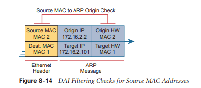
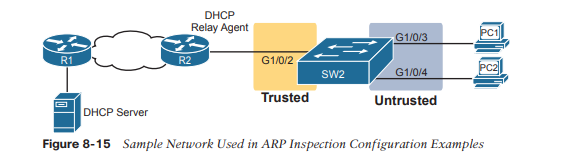

# Indagación DHCP e inspección ARP

Este capítulo cubre los siguientes temas del examen:
- Fundamentos de seguridad
	- Configurar funciones de seguridad de Capa 2 (espionaje DHCP, inspección ARP dinámica y seguridad de puertos)

Para entender los tipos de riesgos que existen en las redes modernas, primero hay que entender las reglas. Luego hay que pensar en cómo un atacante podría aprovechar esas reglas de diferentes maneras. Algunos ataques pueden causar daños como parte de un ataque de denegación de servicio (DoS), mientras que un ataque de reconocimiento puede recopilar más datos para prepararse para algún otro ataque. Para cada protocolo y función que aprenda en redes, existen métodos posibles para aprovechar esas características y darle una ventaja al atacante.

Este capítulo analiza dos características del conmutador que ayudan a prevenir algunos tipos de ataques que pueden provocar que el atacante obtenga copias de los paquetes enviados hacia/desde un host legítimo. Una de estas funciones, DHCP Snooping, detecta mensajes DHCP que quedan fuera del uso normal de DHCP (mensajes que pueden ser parte de un ataque) y los descarta. También observa los mensajes DHCP que fluyen a través de un conmutador LAN, creando una tabla que enumera los detalles de los flujos DHCP legítimos, de modo que otras funciones del conmutador puedan saber qué concesiones DHCP legítimas existen para los dispositivos conectados al conmutador.

La segunda característica de este tipo, la inspección dinámica de ARP (DAI), también ayuda a evitar que los paquetes se redireccionen a un host atacante. Algunos ataques ARP intentan convencer a los hosts para que envíen paquetes al dispositivo del atacante en lugar de al destino real. El conmutador observa los mensajes ARP a medida que fluyen a través del conmutador. El conmutador verifica los mensajes ARP entrantes, comparándolos con el funcionamiento normal de ARP y verificando los detalles con otras fuentes de datos, incluida la tabla de enlaces de DHCP Snooping. Cuando el mensaje ARP no coincide con la información conocida sobre las direcciones legítimas en la red, el conmutador filtra el mensaje ARP.
### Espionaje DHCP
Los servidores DHCP desempeñan un papel vital en la mayoría de las redes actuales, y casi todos los puntos finales de los usuarios utilizan DHCP para conocer su dirección IP, máscara, puerta de enlace predeterminada y direcciones IP del servidor DNS. El Capítulo 7, “Implementación de DHCP”, muestra cómo debería funcionar DHCP en circunstancias normales. Esta sección ahora examina cómo los atacantes podrían usar DHCP para sus propios fines y cómo dos herramientas específicas (DHCP Snooping y Dynamic ARP Inspection (DAI)) ayudan a derrotar esos ataques.
### Conceptos de espionaje DHCP
DHCP Snooping en un conmutador actúa como un firewall o una ACL en muchos sentidos. Analiza los mensajes entrantes en el subconjunto especificado de puertos en una VLAN. DHCP Snooping nunca filtra mensajes que no son DHCP, pero puede optar por filtrar mensajes DHCP, aplicando lógica para tomar una decisión: permitir el mensaje DHCP entrante o descartar el mensaje.

Si bien DHCP proporciona un servicio de Capa 3, DHCP Snooping opera en conmutadores LAN y se usa comúnmente en conmutadores LAN de Capa 2 y se habilita en puertos de Capa 2. La razón para poner DHCP Snooping en el conmutador es que la función debe realizarse entre un dispositivo de usuario final típico (el tipo de dispositivo que actúa como cliente DHCP) y servidores DHCP o agentes de retransmisión DHCP.

La Figura 8-1 muestra una red de ejemplo que proporciona un buen contexto para analizar el DHCP Snooping. Primero, todos los dispositivos se conectan al conmutador SW2 de Capa 2, con todos los puertos como puertos de conmutador de Capa 2, todos en la misma VLAN. Los clientes DHCP típicos se encuentran a la derecha de la figura. A la izquierda se muestran otros dispositivos que podrían ser la ruta para llegar a un servidor DHCP.


DHCP Snooping funciona primero en todos los puertos de una VLAN, pero DHCP Snooping confía o no en cada puerto. Para entender por qué, considere este resumen de las reglas generales utilizadas por DHCP Snooping. Tenga en cuenta que las reglas diferencian entre los mensajes que normalmente envían los servidores (como DHCPOFFER y DHCPACK) y los que normalmente envían los clientes DHCP:
- Los mensajes DHCP recibidos en un puerto que no es de confianza, para mensajes normalmente enviados por un servidor, siempre serán descartados.
- Los mensajes DHCP recibidos en un puerto que no es de confianza, como normalmente los envía un cliente DHCP, pueden filtrarse si parecen ser parte de un ataque.
- Los mensajes DHCP recibidos en un puerto confiable serán reenviados; Los puertos confiables no filtran (descartan) ningún mensaje DHCP.
### Un ejemplo de ataque: un servidor DHCP falso
Para darle una perspectiva, la Figura 8-2 muestra la PC de un usuario legítimo en el extremo derecho y el servidor DHCP legítimo en el extremo izquierdo. Sin embargo, un atacante conectó su computadora portátil a la LAN y comenzó su ataque DHCP actuando como un servidor DHCP. Siguiendo los pasos de la figura, supongamos que la PC1 está intentando ceder una dirección IP mientras el atacante realiza su ataque:
1. La PC1 envía una transmisión LAN con el primer mensaje DHCP de la PC1 (DHCPDISCOVER).
2. La PC del atacante, que actúa como un servidor DHCP falso, responde al DHCPDISCOVER con un DHCPOFFER.


En este ejemplo, el servidor DHCP creado y utilizado por el atacante en realidad alquila un útil
Dirección IP a la PC1, en la subred correcta, con la máscara correcta. ¿Por qué? El atacante quiere que la PC1 funcione, pero con un giro. Observe la puerta de enlace predeterminada asignada a la PC1: 10.1.1.2, que es la dirección de la PC del atacante, en lugar de 10.1.1.1, que es la dirección del enrutador R1. Ahora la PC1 cree que tiene todo lo que necesita para conectarse a la red, y lo tiene, pero ahora todos los paquetes enviados por la PC1 a lo que cree que es su enrutador predeterminado fluyen primero a través de la PC del atacante, creando un intermediario. ataque, como se muestra en la Figura 8-3.


Tenga en cuenta que el DHCP legítimo también devuelve un mensaje DHCPOFFER al host PC1, pero la mayoría de los hosts utilizan el primer DHCPOFFER recibido y el atacante probablemente será el primero en este escenario.

Los dos pasos de la figura muestran el flujo de datos una vez que se ha completado DHCP. Para cualquier tráfico destinado a salir de la subred, la PC1 envía sus paquetes a su puerta de enlace predeterminada, 10.1.1.2, que resulta ser el atacante. El atacante reenvía los paquetes al R1. El usuario de la PC1 puede conectarse a todas y cada una de las aplicaciones como de costumbre, pero ahora el atacante puede conservar una copia de todo lo enviado por la PC1.
### Lógica de espionaje DHCP
El ejemplo anterior muestra solo un ataque en el que el atacante actúa como un servidor DHCP (servidor DHCP falso). DHCP Snooping derrota estos ataques al hacer que la mayoría de los puertos
no confiable, que por definición filtraría los mensajes del servidor DHCP que llegan a los puertos que no son confiables. Por ejemplo, en las Figuras 8-2 y 8-3, al conectar el puerto al atacante, un puerto no confiable de DHCP Snooping derrota el ataque.

Para apreciar el conjunto más amplio de reglas y lógica de DHCP Snooping, es útil tener una referencia útil de algunos de los mensajes y procesos DHCP más comunes. Para una revisión rápida, el flujo de mensajes normal incluye esta secuencia: DISCOVER, OFFER, REQUEST, ACK (DORA). En particular:
- Los clientes envían DISCOVER y REQUEST.
- Los servidores envían OFFER y ACK.

Además, los clientes DHCP también utilizan los mensajes DHCP RELEASE y DHCP DECLINE.
Cuando un cliente tiene un contrato de arrendamiento funcional para una dirección pero ya no quiere usarla, el cliente DHCP puede decirle al servidor DHCP que ya no necesita la dirección y devolverla al servidor DHCP, con el mensaje DHCP RELEASE. De manera similar, un cliente puede enviar un mensaje DHCP DECLINE para rechazar el uso de una dirección IP durante el flujo normal de mensajes DORA.

 Pasemos ahora a la lógica para el DHCP Snooping de puertos que no son de confianza. La Figura 8-4 resume las ideas, con dos puertos de switch. A la izquierda, el puerto del conmutador se conecta a un servidor DHCP, por lo que se debe confiar en él; de lo contrario, DHCP no funcionaría porque el conmutador filtraría todos los mensajes DHCP enviados por el servidor DHCP. A la derecha, la PC1 se conecta a un puerto que no es de confianza con un cliente DHCP.


La siguiente lista resume las reglas de DHCP Snooping:
1. Examine todos los mensajes DHCP entrantes.
2. Si normalmente lo envían los servidores, descarte el mensaje.
3. Si normalmente lo envían los clientes, filtre de la siguiente manera:
a. Para los mensajes DISCOVER y REQUEST, verifique la coherencia de la dirección MAC entre la trama Ethernet y el mensaje DHCP.
b. Para mensajes RELEASE o DECLINE, verifique la interfaz entrante más la dirección IP versus la tabla de enlaces de DHCP Snooping.
4. Para los mensajes no filtrados que resultan en una concesión de DHCP, cree una nueva entrada en la tabla de enlaces de DHCP Snooping.
Las siguientes páginas completan la discusión de conceptos explicando un poco más sobre los pasos 3 y 4 de la lista.
### Filtrado de mensajes DISCOVER según la dirección MAC
DHCP Snooping realiza una comprobación sencilla de los mensajes más comunes enviados por el cliente: DESCUBRIR y SOLICITAR. Primero, tenga en cuenta que los mensajes DHCP definen el campo chaddr (dirección de hardware del cliente) para identificar al cliente. Los hosts en LAN incluyen la dirección MAC del dispositivo como parte de chaddr. Como es habitual, los hosts Ethernet encapsulan los mensajes DHCP dentro de tramas Ethernet y esas tramas, por supuesto, incluyen una dirección MAC de origen, una dirección que debe ser la misma dirección MAC utilizada en el campo chaddr de DHCP. DHCP Snooping realiza una comprobación sencilla para asegurarse de que esos valores coincidan.

La Figura 8-5 muestra cómo un atacante podría intentar sobrecargar el servidor DHCP y arrendar todas las direcciones en la subred. La PC del atacante utiliza la pseudodirección MAC A, por lo que los tres mensajes DISCOVER en la figura muestran una dirección Ethernet de origen de "A". Sin embargo, cada mensaje (en los datos de DHCP) identifica una dirección MAC diferente en el valor chaddr (que se muestra como MAC1, MAC2 y MAC3 en la figura para mayor brevedad), por lo que desde una perspectiva de DHCP, cada mensaje parece ser una solicitud de DHCP diferente. . El atacante puede intentar arrendar todas las direcciones IP de la subred para que ningún otro host pueda obtener una concesión.


La característica principal de DHCP Snooping derrota este tipo de ataque en puertos que no son de confianza. Comprueba la dirección MAC de origen del encabezado Ethernet y compara esa dirección con la dirección MAC en el encabezado DHCP y, si los valores no coinciden, DHCP Snooping descarta el mensaje.
### Filtrado de mensajes que liberan direcciones IP
Antes de ver la siguiente parte de la lógica, primero debe comprender la tabla de vinculación de DHCP Snooping.

DHCP Snooping crea la tabla de enlace de DHCP Snooping para todos los flujos DHCP que ve que permite completar. Es decir, para cualquier flujo DHCP legítimo que funcione, mantiene una lista de algunos de los hechos importantes. Luego, DHCP Snooping y otras funciones como la inspección dinámica de ARP pueden utilizar la tabla para tomar decisiones.

Como ejemplo, considere la Figura 8-6, que repite la misma topología que la Figura 8-4, ahora con una entrada en su tabla de vinculación de DHCP Snooping.


En esta red simple, el cliente DHCP de la derecha alquila la dirección IP 172.16.2.101 del servidor DHCP de la izquierda. La función DHCP Snooping del conmutador combina la información de los mensajes DHCP con información sobre el puerto (interfaz G1/0/3, asignada a la VLAN 11 por el conmutador) y la coloca en la tabla de vinculación de DHCP Snooping.

Luego, DHCP Snooping aplica una lógica de filtrado adicional que utiliza la tabla de vinculación de DHCP Snooping: verifica los mensajes enviados por el cliente como RELEASE y DECLINE que harían que el servidor DHCP pudiera liberar una dirección. Por ejemplo, un usuario legítimo podría arrendar la dirección 172.16.2.101 y, en algún momento, devolver la dirección al servidor; sin embargo, antes de que el cliente haya terminado con su arrendamiento, un atacante podría enviar un mensaje DHCP RELEASE para liberar esa dirección nuevamente al grupo. El atacante podría intentar inmediatamente arrendar esa dirección, esperando que el servidor DHCP le asigne esa misma dirección 172.16.2.101.

 La Figura 8-7 muestra un ejemplo. La PC1 ya tiene una dirección DHCP (172.16.2.101), y SW2 incluye una entrada en la tabla de vinculación de DHCP Snooping. La figura muestra la acción mediante la cual el atacante desde el puerto G1/0/5 intenta liberar la dirección de la PC1. DHCP Snooping compara el mensaje entrante, la interfaz entrante y la entrada de la tabla coincidente:
1. El mensaje entrante es un mensaje DHCP RELEASE en el puerto G1/0/5 con la dirección 172.16.2.101.
2. La tabla de vinculación de DHCP Snooping enumera 172.16.2.101 como originalmente arrendado a través de mensajes que llegan al puerto G1/0/3.
3. DHCP Snooping descarta el mensaje DHCP RELEASE.


### Configuración de espionaje DHCP
DHCP Snooping requiere varios pasos de configuración para que funcione. Primero, necesita usar un par de comandos globales asociados: uno para habilitar DHCP Snooping y otro para enumerar las VLAN en las que usar DHCP Snooping. Ambos deben estar incluidos para que funcione DHCP Snooping.

En segundo lugar, aunque no es literalmente necesario, a menudo necesitarás configurar algunos puertos como puertos confiables. La mayoría de los conmutadores que utilizan DHCP Snooping para una VLAN tienen algunos puertos confiables y algunos puertos que no son confiables, y con un valor predeterminado de no confiable, es necesario configurar los puertos confiables
### Configuración de DHCP Snooping en un conmutador de capa 2
 Todos los siguientes ejemplos se basan en la topología ilustrada en la Figura 8-8, con el conmutador de capa 2 SW2 como el conmutador en el que se habilita la vigilancia DHCP. El servidor DHCP se encuentra al otro lado de la WAN, a la izquierda de la figura. Como resultado, se debe confiar en el puerto de SW2 conectado al enrutador R2 (un agente de retransmisión DHCP). A la derecha, dos PC de muestra pueden usar la configuración predeterminada que no es de confianza.


El switch SW2 coloca todos los puertos en la figura en VLAN 11, por lo que para habilitar DHCP Snooping en VLAN 11, SW2 requiere dos comandos, como se muestra cerca de la parte superior del Ejemplo 8-1: `ip dhcp snooping` e `ip dhcp snooping vlan 11`. Luego, Para cambiar la lógica en el puerto G1/0/2 (conectado al enrutador) para que sea confiable, la configuración incluye el subcomando `ip dhcp snooping trust`.

```
ip dhcp snooping 
ip dhcp snooping vlan 11
no ip dhcp snooping information option 
! 
interface GigabitEthernet1/0/2  
ip dhcp snooping trust
```

Tenga en cuenta que el comando `no ip dhcp snooping information option` del Ejemplo 8-1 se explicará en un mejor contexto justo después del Ejemplo 8-2, pero se enumera en el Ejemplo 8-1 para completar el ejemplo.

Con esta configuración, el conmutador sigue los pasos lógicos detallados en la sección anterior titulada "Lógica de vigilancia DHCP". Para ver algo de apoyo a esa afirmación, mire el Ejemplo 8-2, que muestra el resultado del comando `show ip dhcp snooping` en el conmutador SW2.

```
SW2# show ip dhcp snooping
Switch DHCP snooping is enabled
Switch DHCP gleaning is disabled 
DHCP snooping is configured on following VLANs:
11 
DHCP snooping is operational on following VLANs:
11 
Smartlog is configured on following VLANs:
none 
Smartlog is operational on following VLANs:
none 
DHCP snooping is configured on the following L3 Interfaces:

Insertion of option 82 is disabled    
	circuit-id default format: vlan-mod-port    
	remote-id: bcc4.938b.a180 (MAC) 
Option 82 on untrusted port is not allowed
Verification of hwaddr field is enabled
Verification of giaddr field is enabled 
DHCP snooping trust/rate is configured on the following Interfaces:

Interface                     Trusted    Allow option    Rate limit (pps)
-----------------------    -------    ------------    ----------------
GigabitEthernet1/0/2        yes         yes               unlimited
  Custom circuit-ids:
```

Las líneas resaltadas en el ejemplo señalan algunos de los ajustes de configuración clave. Comenzando desde arriba, los dos primeros confirman la configuración de los comandos `ip dhcp snooping` e `ip dhcp snooping vlan 11`, respectivamente. Además, las líneas resaltadas en la parte inferior del resultado muestran una sección que enumera los puertos confiables; en este caso, solo el puerto G1/0/2.

Además, es posible que hayas notado que la línea resaltada en el medio indica que la inserción de la opción 82 está deshabilitada. Esa línea confirma la adición del comando `no ip shcp information option` en el Ejemplo 8-1. Para comprender por qué el ejemplo incluye este comando, considere estos datos sobre los agentes de retransmisión DHCP:
- Los agentes de retransmisión DHCP agregan nuevos campos a las solicitudes DHCP, definidos como campos de encabezado DHCP de la opción 82 (en RFC 3046).
- DHCP Snooping utiliza configuraciones predeterminadas que funcionan bien si el conmutador actúa como un conmutador de Capa 3 y como un agente de retransmisión DHCP, lo que significa que el conmutador debe insertar los campos de la opción DHCP 82 en los mensajes DHCP. De hecho, el conmutador utiliza de forma predeterminada la opción de información de espionaje ip dhcp.
- Cuando el conmutador no actúa también como agente de retransmisión DHCP, la configuración predeterminada impide que DHCP funcione para los usuarios finales. El conmutador configura campos en los mensajes DHCP como si fuera un agente de retransmisión DHCP, pero los cambios en esos mensajes hacen que la mayoría de los servidores DHCP (y la mayoría de los agentes de retransmisión DHCP) ignoren los mensajes DHCP recibidos.
- La conclusión: para que DHCP Snooping funcione en un conmutador que no sea también un agente de retransmisión DHCP, desactive la función de opción 82 utilizando el comando global no ip dhcp snooping information option.

Con esto concluye la configuración de DHCP Snooping que es necesaria y que necesitará con mayor frecuencia para que la función funcione. El resto de esta sección analiza algunas funciones opcionales de DHCP Snooping.
### Limitación de las tasas de mensajes DHCP
Sabiendo que DHCP Snooping previene sus ataques, ¿qué podrían hacer los atacantes en respuesta? Diseñe nuevos ataques, incluido el ataque al propio DHCP Snooping.

Una forma de atacar el DHCP Snooping aprovecha el hecho de que utiliza la CPU de uso general en un conmutador. Sabiendo esto, los atacantes pueden idear ataques para generar grandes volúmenes de mensajes DHCP en un intento de sobrecargar la función DHCP Snooping y la propia CPU del switch. El objetivo puede ser un simple ataque de denegación de servicio o una combinación de ataques que podrían provocar que DHCP Snooping no pueda examinar cada mensaje, permitiendo que otros ataques DHCP funcionen.

Para ayudar a prevenir este tipo de ataques, DHCP Snooping incluye una función opcional que rastrea la cantidad de mensajes DHCP entrantes. Si la cantidad de mensajes DHCP entrantes excede ese límite durante un período de un segundo, DHCP Snooping trata el evento como un ataque y mueve el puerto a un estado de error deshabilitado. Además, la función se puede habilitar tanto en interfaces confiables como en interfaces no confiables.

Aunque limitar la velocidad de los mensajes DHCP puede ayudar, colocar el puerto en un estado deshabilitado por errores puede crear problemas. Como recordatorio, una vez que esté en el estado de error deshabilitado, el conmutador no enviará ni recibirá tramas para la interfaz. Sin embargo, el estado de error deshabilitado puede ser una acción demasiado severa porque la acción de recuperación predeterminada para un estado de error deshabilitado requiere la configuración de un subcomando de apagado y luego de no apagado en la interfaz.

Para ayudar a lograr un mejor equilibrio, puede habilitar la limitación de la velocidad de DHCP Snooping y luego también configurar el conmutador para que se recupere automáticamente del estado de error deshabilitado del puerto, sin la necesidad de un apagado y luego ningún comando de apagado.

El ejemplo 8-3 muestra cómo habilitar los límites de velocidad de DHCP Snooping y la recuperación deshabilitada por errores. Primero, observe la mitad inferior de la configuración, en las interfaces, para ver la configuración sencilla de los límites por interfaz utilizando los subcomandos de interfaz `ip dhcp snooping rate limit [number interface]`. La parte superior de la configuración utiliza dos comandos globales para indicarle a IOS que se recupere de un estado de error deshabilitado si es causado por DHCP Snooping, y que use una cantidad de segundos no predeterminada para esperar antes de recuperar la interfaz. Tenga en cuenta que la configuración del Ejemplo 8-3 se basaría en la configuración principal para DHCP Snooping como se muestra en el Ejemplo 8-1.

```
errdisable recovery cause dhcp-rate-limit 
errdisable recovery interval 30 
!
interface GigabitEthernet1/0/2  
ip dhcp snooping limit rate 10 
!
interface GigabitEthernet1/0/3  
ip dhcp snooping limit rate 2
```

Una repetición del comando `show ip dhcp snooping` ahora muestra los límites de velocidad cerca del final de la salida, como se indica en el Ejemplo 8-4.

```
SW2# show ip dhcp snooping
! Lines omitted for brevity

Interface                        Trusted    Allow option    Rate limit (pps)
-----------------------    -------    ------------    ----------------
GigabitEthernet1/0/2            yes         yes               10
  Custom circuit-ids:
GigabitEthernet1/0/3            no          no                2
  Custom circuit-ids:
```

### Resumen de configuración de espionaje DHCP
La siguiente lista de verificación de configuración resume los comandos incluidos en esta sección sobre cómo configurar DHCP Snooping.
	**Paso 1**. Configure este par de comandos (ambos obligatorios):
		**A**. Utilice el comando global `ip dhcp snooping` para habilitar DHCP Snooping en el conmutador.
		**B**. Utilice el comando global `ip dhcp snooping vlan vlan-list` para identificar las VLAN en las que utilizar DHCP Snooping.
	**Paso 2**. (Opcional): Utilice el comando global `no ip dhcp snooping information option` en conmutadores de capa 2 para deshabilitar la inserción de datos de la opción DHCP 82 en mensajes DHCP, específicamente en conmutadores que no actúan como agente de retransmisión DHCP.
	**Paso 3**. Configure el subcomando `ip dhcp snooping trust interface` para anular la configuración predeterminada de no confiable.
	**Paso 4**. (Opcional): Configure los límites de velocidad de DHCP Snooping y la recuperación deshabilitada por errores:
		**A**. (Opcional): Configure el subcomando de interfaz `ip dhcp snooping limit rate number` para establecer un límite de mensajes DHCP por segundo.
		**B**. (Opcional): Configure el subcomando de interfaz `no ip dhcp snooping limit rate number` para eliminar un límite existente y restablecer la interfaz para usar el valor predeterminado sin límite de velocidad.
		**C**. (Opcional): Configure el comando global `errdisable recovery cause dhcp-rate-limit` para habilitar la función de recuperación automática desde el modo err-disabled, asumiendo que el switch colocó el puerto en estado err-disabled debido a que se excedieron los límites de velocidad de espionaje de DHCP. .
		**D**. (Opcional): Configure los comandos globales de segundos del intervalo de recuperación `errdisable` para establecer el tiempo de espera antes de recuperarse de un estado de error deshabilitado de la interfaz (independientemente de la causa del estado de error deshabilitado).
### Inspección dinámica de ARP
La función de inspección dinámica de ARP (DAI) en un conmutador examina los mensajes ARP entrantes en puertos que no son de confianza para filtrar aquellos que cree que son parte de un ataque. La característica principal de DAI compara los mensajes ARP entrantes con dos fuentes de datos: la tabla de vinculación de DHCP Snooping y cualquier ACL ARP configurada. Si el mensaje ARP entrante no coincide con las tablas del conmutador, el conmutador descarta el mensaje ARP.
### Conceptos DAI
Para comprender los ataques que DAI puede prevenir, debe estar preparado para comparar las operaciones ARP normales con el uso anormal de ARP utilizado en algunos tipos de ataques. Esta sección utiliza el mismo flujo, primero revisa algunos detalles importantes de ARP y luego muestra cómo un atacante puede simplemente enviar una respuesta ARP, llamada ARP gratuito, lo que hace que los hosts agreguen entradas ARP incorrectas a sus tablas ARP.
### Revisión de ARP IP normal
Si lo único que le importa es cómo funciona ARP normalmente, sin preocuparse por los ataques, puede pensar en ARP en la profundidad que se muestra en la Figura 8-9. La figura muestra una secuencia típica. La PC1 host necesita enviar un paquete IP a su enrutador predeterminado (R2), por lo que la PC1 primero envía un mensaje de solicitud ARP en un intento de conocer la dirección MAC asociada con la dirección 172.16.2.2 de R2. El enrutador R2 devuelve una respuesta ARP, que enumera la dirección MAC del R2 (tenga en cuenta que la figura muestra pseudodirecciones MAC para ahorrar espacio).


Las tablas ARP en la parte inferior de la figura implican un hecho importante: ambos hosts aprenden la dirección MAC del otro host con este flujo de dos mensajes. La PC1 no solo aprende la dirección MAC de R2 en función de la respuesta ARP (mensaje 2), sino que el enrutador R2 aprende la dirección IP y MAC de PC1 debido a la solicitud ARP (mensaje 1). Para ver por qué, observe la vista más detallada de esos mensajes como se muestra en la Figura 8-10.


Los mensajes ARP definen los campos de dirección IP y de hardware (MAC) de origen, así como los campos de dirección de destino. Campos de dirección IP y hardware. El origen debe incluir la dirección IP y MAC del dispositivo emisor, sin importar si el mensaje es una respuesta ARP o una solicitud ARP. Por ejemplo, el mensaje 1 en la figura, enviado por la PC1, enumera las direcciones IP y MAC de la PC1 en los campos de origen, razón por la cual el enrutador R2 podría aprender esa información. La PC2 también aprende la dirección MAC de R2 según los campos de dirección de origen en la respuesta ARP.
### ARP gratuito como vector de ataque
Normalmente, un host utiliza ARP cuando conoce la dirección IP de otro host y quiere conocer la dirección MAC de ese host. Sin embargo, por razones legítimas, es posible que un host también desee informar a todos los hosts de la subred sobre su dirección MAC. Esto podría resultar útil cuando un host cambia su dirección MAC, por ejemplo. Entonces, ARP apoya la idea de un mensaje ARP gratuito con estas características:
- Es una respuesta ARP.
- Se envía sin haber recibido primero una petición ARP.
- Se envía a una dirección de difusión de destino Ethernet para que todos los hosts de la subred reciban el mensaje.

Por ejemplo, si la dirección MAC de un host es MAC A y cambia a MAC B, para hacer que todos los demás hosts actualicen sus tablas ARP, el host podría enviar un ARP gratuito que enumere una MAC de origen de MAC B.

Los atacantes pueden aprovechar los ARP gratuitos porque permiten que el host emisor haga que otros hosts cambien sus tablas ARP. La Figura 8-11 muestra un ejemplo de este tipo iniciado por la PC A. (un atacante) con un ARP gratuito. Sin embargo, este ARP enumera la dirección IP de la PC1 pero la dirección MAC de un dispositivo diferente (PC A) en el paso 1, lo que hace que el enrutador actualice su tabla ARP (paso 2).


En este punto, cuando R2 reenvía paquetes IP a la dirección IP de la PC1 (172.16.2.101), R2 los encapsulará en una trama Ethernet con la PC A como destino en lugar de con la dirección MAC de la PC1. Al principio, esto podría parecer que impide que la PC1 funcione, pero en cambio podría ser parte de un ataque de intermediario para que la PC A pueda copiar todos los mensajes. La Figura 8-12 muestra la idea de lo que sucede en este punto:
1. La PC1 envía mensajes a algún servidor en el lado izquierdo del enrutador R2.
2. El servidor responde a la dirección IP de la PC1, pero R2 reenvía ese paquete a la dirección MAC de la PC A, en lugar de a la PC1.
3. La PC A copia el paquete para su posterior procesamiento.
4. La PC A reenvía el paquete dentro de una nueva trama a la PC1 para que la PC1 siga funcionando.


### Lógica de inspección ARP dinámica
DAI tiene una variedad de funciones que pueden prevenir este tipo de ataques ARP. Para entender cómo, considere la secuencia de un host cliente típico con respecto a DHCP y ARP. Cuando un host aún no tiene una dirección IP (es decir, antes de que se complete el proceso DHCP), no necesita usar ARP. Una vez que el host alquila una dirección IP y aprende su máscara de subred, necesita ARP para aprender las direcciones MAC de otros hosts o del enrutador predeterminado en la subred, por lo que envía algunos mensajes ARP. En resumen, primero ocurre DHCP y luego ARP.

DAI adopta un enfoque para interfaces que no son de confianza que confirma la corrección de un ARP basándose en los datos de DHCP Snooping sobre los mensajes DHCP anteriores. Los mensajes DHCP normales correctos enumeran la dirección IP arrendada a un host, así como la dirección MAC de ese host. La función DHCP Snooping también registra esos hechos en la tabla de vinculación de DHCP Snooping del conmutador.

 Para cualquier puerto DAI que no sea de confianza, DAI compara los campos de dirección IP de origen y MAC de origen del mensaje ARP con la tabla de enlaces de DHCP Snooping. Si se encuentra en la tabla, DAI permite el paso del ARP, pero si no, DAI descarta el ARP. Por ejemplo, la Figura 8-13 muestra el paso 1 en el que el atacante en la PC A intenta el ARP gratuito mostrado anteriormente en la Figura 8-11. En el paso 2, DAI hace una comparación con la tabla de vinculación de DHCP Snooping y no encuentra una coincidencia con MAC A junto con la dirección IP 172.16.2.101, por lo que DAI descartaría el mensaje.


DAI trabaja con la idea de puertos confiables y no confiables con las mismas reglas generales que
Espionaje DHCP. Los puertos de acceso conectados a los dispositivos del usuario final a menudo no son de confianza ni para DHCP Snooping ni para DAI. DAI debe confiar en los puertos conectados a otros conmutadores, enrutadores y el servidor DHCP (cualquier cosa que no sean enlaces a dispositivos de usuario final).

Tenga en cuenta que, aunque DAI puede usar la tabla DHCP Snooping como se muestra aquí, también puede usar datos configurados estáticamente similares que enumeran pares correctos de direcciones IP y MAC a través de una herramienta llamada ARP ACL. El uso de ACL ARP con DAI resulta útil para puertos conectados a dispositivos que utilizan direcciones IP estáticas en lugar de DHCP. Tenga en cuenta que DAI busca tanto los datos de enlace de DCHP Snooping como las ACL de ARP.

Más allá de esa característica principal, tenga en cuenta que DAI también puede realizar otras comprobaciones opcionalmente. Por ejemplo, el encabezado Ethernet que encapsula el ARP debe tener direcciones que coincidan con las direcciones MAC de origen y destino del ARP. La Figura 8-14 muestra un ejemplo de la comparación de la dirección MAC de origen de Ethernet y el campo de hardware de origen del mensaje ARP.



Se puede habilitar DAI para realizar las comparaciones que se muestran en la figura, descartando estos mensajes:
- Mensajes con una dirección MAC de origen del encabezado Ethernet que no es igual a la dirección de hardware de origen (MAC) de ARP
- Mensajes de respuesta ARP con una dirección MAC de destino del encabezado Ethernet que no es igual a la dirección de hardware de destino (MAC) de ARP.
- Mensajes con direcciones IP inesperadas en los dos campos de dirección IP ARP

Finalmente, al igual que DHCP Snooping, DAI realiza su trabajo en la CPU del conmutador en lugar de en el ASIC del conmutador, lo que significa que el propio DAI puede ser más susceptible a ataques DoS. El atacante podría generar una gran cantidad de mensajes ARP, lo que aumentaría el uso de la CPU en el conmutador. DAI puede evitar estos problemas limitando la velocidad del número de mensajes ARP en un puerto a lo largo del tiempo.
### Configuración de inspección dinámica de ARP
La configuración de DAI requiere sólo unos pocos comandos, con la habitual mayor variedad de ajustes de configuración opcionales. Esta sección examina la configuración de DAI, primero con configuraciones en su mayoría predeterminadas y con dependencia de DHCP Snooping. Luego muestra algunas de las funciones opcionales, como límites de velocidad, recuperación automática del estado de error deshabilitado y cómo habilitar comprobaciones adicionales de los mensajes ARP entrantes.
### Configuración de la inspección ARP en un conmutador de capa 2
Antes de configurar DAI, debe pensar en la función y tomar algunas decisiones en función de sus objetivos, topología y funciones del dispositivo. Las decisiones incluyen lo siguiente:
- Elija si desea confiar en DHCP Snooping, ARP ACL o ambos.
- Si utiliza DHCP Snooping, configúrelo y haga que los puertos correctos sean confiables para DHCP Snooping.
- Elija las VLAN en las que habilitar DAI.
- Haga que DAI sea confiable (en lugar de la configuración predeterminada de no confiable) en puertos seleccionados en esas VLAN, generalmente para los mismos puertos en los que confiaba para DHCP Snooping.

Todos los ejemplos de configuración en esta sección utilizan la misma red de muestra utilizada en el
Temas de configuración de DHCP Snooping, repetidos aquí como Figura 8-15. Al igual que con DHCP Snooping, el interruptor SW2 de la derecha debe configurarse para confiar en el puerto conectado al enrutador (G1/0/2), pero no confiar en los dos puertos conectados a las PC.



El ejemplo 8-5 muestra la configuración requerida para habilitar DAI en el conmutador SW2 en la Figura 8-15, una configuración que sigue una progresión similar en comparación con DHCP Snooping. Todos los puertos en la figura se conectan a la VLAN 11, por lo que para habilitar DAI en la VLAN 11, simplemente agregue el comando global `ip arp Inspection vlan 11`. Luego, para cambiar la lógica en el puerto G1/0/2 (conectado al enrutador) para que DAI confíe en él, agregue el subcomando `ip arp Inspection Trust`.

```
ip arp inspection vlan 11 
! 
interface GigabitEthernet1/0/2  
ip arp inspection trust
```

El ejemplo 8-5 configura DAI, pero omite tanto DHCP Snooping como ARP ACL. (Si configurara un conmutador solo con los comandos que se muestran en el ejemplo 8-5, el conmutador filtraría todos los ARP que ingresan a todos los puertos que no son de confianza en la VLAN 11). El ejemplo 8-6 muestra una configuración DAI completa y funcional que agrega la configuración de DHCP Snooping. para que coincida con la configuración DAI en el ejemplo 8-5. Tenga en cuenta que el Ejemplo 8-6 combina la configuración anterior de DHCP Snooping del Ejemplo 8-1 para esta misma topología con la configuración DAI que se acaba de mostrar en el Ejemplo 8-5, con resaltados para las líneas de configuración específicas de DAI.

```
ip arp inspection vlan 11 
ip dhcp snooping 
ip dhcp snooping vlan 11 
no ip dhcp snooping information option 
!
interface GigabitEthernet1/0/2  
ip dhcp snooping trust  
ip arp inspection trust
```

Recuerde, DHCP ocurre primero con los clientes DHCP y luego envían mensajes ARP. Con la configuración del Ejemplo 8-6, el conmutador crea su tabla de vinculación de DHCP Snooping analizando los mensajes DHCP entrantes. A continuación, cualquier mensaje ARP entrante en puertos DAI que no sean de confianza debe tener información coincidente en esa tabla vinculante.

El ejemplo 8-7 confirma los datos clave sobre el funcionamiento correcto de DAI en esta red de muestra según la configuración del ejemplo 8-6. El comando `show ip arp Inspection` proporciona ambos ajustes de configuración junto con variables de estado y contadores. Por ejemplo, las líneas resaltadas muestran el total de mensajes ARP recibidos en puertos que no son de confianza en esa VLAN y la cantidad de mensajes ARP descartados (actualmente 0).

```
SW2# show ip arp inspection

Source Mac Validation      : Disabled
Destination Mac Validation : Disabled
IP Address Validation      : Disabled

 Vlan     Configuration    Operation   ACL Match Static ACL  
 ----     -----------       -------   ---------   ----------

   11     Enabled            Active
 Vlan     ACL Logging       DHCP Logging       Probe Logging
 ----     -----------       ------------       -------------
   11     Deny               Deny                Off

 Vlan       Forwarded          Dropped     DHCP Drops       ACL Drops
 ----       ---------          -------     ----------       ---------
   11           59                0             0               0

 Vlan   DHCP Permits    ACL Permits  Probe Permits   Source MAC Failures
 ----   ------------    -----------  -------------   -------------------
   11         7              0             49                 0

 Vlan   Dest MAC Failures   IP Validation Failures   Invalid Protocol Data
 ----   -----------------   ----------------------   ---------------------
 
 Vlan   Dest MAC Failures   IP Validation Failures   Invalid Protocol Data
 ----   -----------------   ----------------------   ---------------------
   11           0                    0                          0

SW2# show ip dhcp snooping binding

MacAddress         IpAddress      Lease(sec) Type       VLAN  Interface
-----------------  -------------  ---------- ---------  ----  ----------------
02:00:11:11:11:11  172.16.2.101   86110 dhcp-snooping    11  GigabitEthernet1/0/3 02:00:22:22:22:22  172.16.2.102   86399 dhcp-snooping    11  GigabitEthernet1/0/4

Total number of bindings: 2
```

