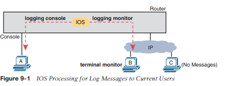
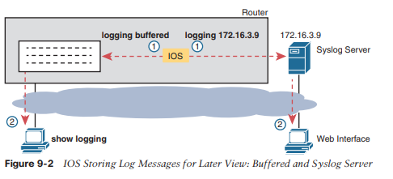
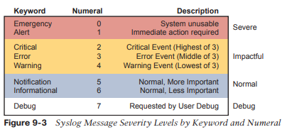
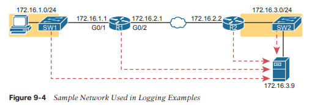

# Protocolos de administración de dispositivos

Este capítulo cubre los siguientes temas del examen:
- Acceso a la red
	- Configurar y verificar protocolos de descubrimiento de Capa 2 (Cisco Discovery Protocol y LLDP)
- Servicios de propiedad intelectual
	- Configurar y verificar NTP operando en modo cliente y servidor.
	- Describir el uso de las funciones de syslog, incluidas las instalaciones y los niveles.

La primera sección principal de este capítulo se centra en los mensajes de registro y syslog. La mayoría de los dispositivos informáticos necesitan notificar al administrador sobre cualquier problema importante; Generalmente, en el mundo de la informática, los mensajes de este tipo se denominan mensajes de registro. Los dispositivos Cisco también generan mensajes de registro. La primera sección muestra cómo un dispositivo Cisco maneja esos mensajes y cómo puede configurar enrutadores y conmutadores para ignorar los mensajes o guardarlos de diferentes maneras.
A continuación, diferentes funciones de enrutador y conmutador se benefician de la sincronización de sus relojes horarios. Como la mayoría de los dispositivos informáticos, los enrutadores y conmutadores tienen una función de reloj interno para mantener el tiempo. El protocolo de hora de red (NTP) proporciona un medio para que los dispositivos sincronicen su hora, como se analiza en la segunda sección.

La última sección principal se centra en dos protocolos que realizan el mismo tipo de trabajo: Cisco Discovery Protocol (CDP) y Link Layer Discovery Protocol (LLDP). Ambos proporcionan un medio para que los dispositivos de red conozcan los dispositivos vecinos, sin necesidad de que IPv4 o IPv6 estén funcionando en ese momento.
### Registro de mensajes del sistema (Syslog)
Es sorprendente lo útiles que los dispositivos Cisco intentan ser para sus administradores. Cuando tienen lugar eventos importantes (e incluso no tan importantes), estos dispositivos Cisco intentan notificar a los administradores con mensajes detallados del sistema. Como aprenderá en esta sección, estos mensajes varían desde los más mundanos hasta aquellos que son increíblemente importantes. Afortunadamente, los administradores tienen una gran variedad de opciones para almacenar estos mensajes y recibir alertas sobre aquellos que podrían tener el mayor impacto en la infraestructura de la red.

Cuando ocurre un evento que el sistema operativo del dispositivo considera interesante, ¿cómo nos notifica el sistema operativo a los humanos? Cisco IOS puede enviar los mensajes a cualquier persona que haya iniciado sesión actualmente en el dispositivo. También puede almacenar el mensaje para que un usuario pueda verlo más tarde.
### Envío de mensajes en tiempo real a usuarios actuales
Cisco IOS que se ejecuta en un dispositivo al menos intenta permitir que los usuarios actuales vean los mensajes de registro cuando suceden. No todos los enrutadores o conmutadores pueden tener usuarios conectados, pero si algún usuario inicia sesión, el enrutador o conmutador se beneficia al informar al ingeniero de red sobre cualquier problema.

De forma predeterminada, IOS muestra mensajes de registro a los usuarios de la consola para todos los niveles de gravedad de los mensajes. Ese valor predeterminado ocurre debido al comando de configuración global de la consola de registro predeterminado. De hecho, si ha estado utilizando un puerto de consola durante el tiempo que ha leído esto, es probable que ya haya notado muchos mensajes de syslog, como mensajes sobre interfaces activas o desactivadas.

Para otros usuarios (es decir, usuarios de Telnet y SSH), el dispositivo requiere un proceso de dos pasos antes de que el usuario vea los mensajes. En primer lugar, IOS tiene otra configuración global (monitor de registro) que le indica a IOS que habilite el envío de mensajes de registro a todos los usuarios registrados. Sin embargo, esa configuración predeterminada no es suficiente para permitir que el usuario vea los mensajes de registro. El usuario también debe emitir el comando EXEC del monitor de terminal durante la sesión de inicio de sesión, que le indica a IOS que esta sesión de terminal desea recibir mensajes de registro.

La Figura 9-1 resume estos puntos clave sobre cómo el IOS en un enrutador o conmutador Cisco procesa los mensajes de registro para los usuarios actualmente conectados. En la figura, el usuario A se sienta frente a la consola y siempre recibe mensajes de registro. A la derecha, el hecho de que el usuario B vea mensajes (porque el usuario B emitió el comando de monitorización de terminal después de iniciar sesión), y el usuario C no, muestra que cada usuario puede controlar si recibe o no mensajes de registro.



### Almacenamiento de mensajes de registro para revisión posterior
Al iniciar sesión en la consola y en los terminales, ocurre un evento, IOS envía los mensajes a la consola y a las sesiones del terminal, y luego IOS puede descartar el mensaje. Sin embargo, claramente sería útil conservar una copia de los mensajes de registro para su posterior revisión, por lo que IOS proporciona dos medios principales para conservar una copia.

IOS puede almacenar copias de los mensajes de registro en la RAM en virtud del comando de configuración global `logging buffered`. Luego, cualquier usuario puede volver más tarde y ver los mensajes de registro antiguos utilizando el comando EXEC `show logging`.

Como segunda opción, una opción que se utiliza con frecuencia en redes de producción, todos los dispositivos almacenan sus mensajes de registro de forma centralizada en un servidor syslog. RFC 5424 define el protocolo syslog, que proporciona los medios por los cuales un dispositivo como un conmutador o enrutador puede utilizar un protocolo UDP para enviar mensajes a un servidor syslog para su almacenamiento. Todos los dispositivos pueden enviar sus mensajes de registro al servidor. Posteriormente, un usuario puede conectarse al servidor (normalmente con una interfaz gráfica de usuario) y examinar los mensajes de registro desde varios dispositivos. Para configurar un enrutador o conmutador para enviar mensajes de registro a un servidor syslog, agregue el host de registro {dirección | hostname} comando global, que hace referencia a la dirección IP o al nombre de host del servidor syslog.



### Formato de mensaje de registro
IOS define el formato de los mensajes de registro. El mensaje comienza con algunos campos de datos sobre el mensaje, seguidos de un texto más fácil de leer para los humanos. Por ejemplo, observe detenidamente este mensaje de muestra:

**A timestamp**: *Dec 18 17:10:15.079 
**The facility on the router that generated the message**: %LINEPROTO 
**The severity level**: 5 
**A mnemonic for the message**: UPDOWN 
**The description of the message**: Line protocol on Interface FastEthernet0/0, changed state to down

IOS dicta la mayor parte del contenido de los mensajes, pero al menos puede activar y desactivar el uso de la marca de tiempo (que se incluye de forma predeterminada) y un número de secuencia de mensajes de registro (que no está habilitado de forma predeterminada). El ejemplo 9-1 invierte esos valores predeterminados desactivando las marcas de tiempo y activando los números de secuencia.

```
R1(config)# no service timestamps 
R1(config)# service sequence-numbers
R1(config)# end

R1#
000011: %SYS-5-CONFIG_I: Configured from console by console
```

Para ver el cambio de formato, consulte el mensaje de registro al final del ejemplo. Como es habitual, cuando sale del modo de configuración, el dispositivo emite otro mensaje de registro. Al comparar este mensaje con el ejemplo anterior, puede ver que ahora ya no incluye la hora del día, pero sí un número de secuencia.
### Niveles de gravedad de los mensajes de registro
Los mensajes de registro pueden informarle simplemente sobre algún evento mundano o pueden informarle sobre algún evento crítico. Para ayudarlo a comprender la importancia de cada mensaje, IOS asigna a cada mensaje un nivel de gravedad (como se indica en los mismos mensajes en la página anterior). La Figura 9-3 muestra los niveles de gravedad: cuanto menor sea el número, más grave será el evento que provocó el mensaje. (Tenga en cuenta que los valores de la izquierda y el centro se utilizan en los comandos de IOS).



La Figura 9-3 divide los ocho niveles de gravedad en cuatro secciones sólo para entender un poco más su significado. Los dos niveles superiores de la figura son los más graves. Los mensajes de este nivel significan que existe un problema grave e inmediato. Los tres niveles siguientes, denominados Crítico, Error y Advertencia, también informan sobre eventos que afectan al dispositivo, pero no son tan inmediatos ni tan graves. Por ejemplo, un mensaje de registro común sobre una interfaz que falla y queda físicamente inactiva se muestra como un mensaje de nivel de gravedad 3.

Continuando con la figura, IOS utiliza los siguientes dos niveles (5 y 6) para mensajes que tratan más de notificar al usuario que de identificar errores. Finalmente, el último nivel de la figura se utiliza para los mensajes solicitados por el comando `debug`, como se muestra en un ejemplo más adelante en este capítulo.

La Tabla 9-2 resume los comandos de configuración utilizados para habilitar el registro y establecer el nivel de gravedad para cada tipo. Cuando se establece el nivel de gravedad, IOS enviará mensajes de ese nivel de gravedad y otros más graves (números de gravedad más bajos) al servicio identificado en el comando. Por ejemplo, el comando `logging console 4` hace que IOS envíe mensajes de nivel de gravedad 0–4 a ​​la consola. Además, tenga en cuenta que el comando para deshabilitar cada servicio es la versión no del comando, con no delante del comando (`no logging console`, `no logging monitor`, etc.).

| **Service** | **To Enable Logging**                    | **To Set Message Levels**                           |
| ----------- | ---------------------------------------- | --------------------------------------------------- |
| Console     | **logging console**                      | **logging console** _level-name_ \| _level-number_  |
| Monitor     | **logging monitor**                      | **logging monitor** _level-name_ \| _level-number_  |
| Buffered    | **logging buffered**                     | **logging buffered** _level-name_ \| _level-number_ |
| Syslog      | **logging host** _address_ \| _hostname_ | **logging trap** _level-name_ \| _level-number_     |

### Configuración y verificación del registro del sistema
Con la información de la Tabla 9-2, configurar syslog en un enrutador o conmutador Cisco IOS debería ser relativamente sencillo. El ejemplo 9-2 muestra una muestra, basada en la Figura 9-4. La figura muestra un servidor syslog en la dirección IP 172.16.3.9. Ambos conmutadores y ambos enrutadores utilizarán la misma configuración que se muestra en el Ejemplo 9-2, aunque el ejemplo muestra el proceso de configuración en un solo dispositivo, el enrutador R1.



```
logging console 7 
logging monitor debug 
logging buffered 4 
logging host 172.16.3.9 
logging trap warning
```

Primero, tenga en cuenta que el ejemplo configura el mismo nivel de mensaje en la consola y para la supervisión del terminal (nivel 7 o depuración), y el mismo nivel para el almacenamiento en búfer y el registro en el servidor syslog (nivel 4 o advertencia). Los niveles se pueden configurar usando el nivel de gravedad numérico o el nombre como se muestra anteriormente en la Figura 9-3.

El comando `show logging` confirma esos mismos ajustes de configuración y también enumera los mensajes de registro según la configuración almacenada en el búfer de registro. El Ejemplo 9-3 muestra un ejemplo, con los ajustes de configuración que coinciden con el Ejemplo 9-2 resaltados en gris.

```
R1# show logging 
Syslog logging: enabled (0 messages dropped, 3 messages rate-limited, 0 flushes, 0 overruns, xml disabled, filtering disabled) 

No Active Message Discriminator. 

No Inactive Message Discriminator. 

	Console logging: level debugging, 45 messages logged, xml disabled, filtering disabled 
	Monitor logging: level debugging, 0 messages logged, xml disabled, filtering disabled 
	Buffer logging: level warnings, 0 messages logged, xml disabled, filtering disabled
	Exception Logging: size (8192 bytes) 
	Count and timestamp logging messages: disabled 
	Persistent logging: disabled 
	
No active filter modules. 

	Trap logging: level warnings, 0 message lines logged 
		Logging to 172.16.3.9 (udp port 514, audit disabled, 
			link up), 0 message lines logged, 
			0 message lines rate-limited, 
			0 message lines dropped-by-MD, 
			xml disabled, sequence number disabled 
			filtering disabled Logging Source-Interface: VRF Name: 
			
Log Buffer (8192 bytes):
```

Quizás ya hayas notado que conocer los nombres de los ocho niveles de mensajes de registro puede resultar útil si deseas comprender el resultado de los comandos. La mayoría de los comandos `show` enumeran los niveles de mensajes de registro por nombre, no por número. Como puede ver en los resaltados grises en este ejemplo, dos niveles enumeran "depuración" y dos enumeran "advertencia", aunque algunos de los comandos de configuración se refieren a esos niveles por número.

 Además, no puede saber esto a partir del resultado, pero en el Ejemplo 9-3, el enrutador R1 no tiene mensajes de registro almacenados en el búfer. (Tenga en cuenta el valor del contador de 0 para los mensajes de registro almacenados en el búfer). Si algún mensaje de registro se hubiera almacenado en el búfer, los mensajes de registro reales se enumerarían al final del comando. En este caso, acababa de iniciar el enrutador y aún no se habían almacenado mensajes en el buffer. (También puede borrar los mensajes antiguos del registro con el comando EXEC de registro claro).

El siguiente ejemplo muestra la diferencia entre los niveles de gravedad actuales. Este ejemplo muestra al usuario deshabilitando la interfaz G0/1 en R1 con el comando `shutdown` y luego volviéndola a habilitar con el comando `no shutdown`. Si observa detenidamente los mensajes resaltados, verá varios mensajes de gravedad 5 y un mensaje de gravedad 3. El comando de configuración global `logging buffered 4` en R1 (consulte el Ejemplo 9-2) significa que R1 no almacenará en buffer los mensajes de registro de nivel de gravedad 5, pero sí almacenará en buffer los mensajes de nivel de gravedad 3. El ejemplo 9-4 finaliza mostrando ese mensaje de registro al final de la salida del comando `show logging`.

```
R1# configure terminal 
Enter configuration commands, one per line. End with CNTL/Z. 
R1(config)# interface g0/1 
R1(config-if)# shutdown 
R1(config-if)# *Oct 21 20:07:07.244: %LINK-5-CHANGED: Interface GigabitEthernet0/1, changed state to administratively down 
*Oct 21 20:07:08.244: %LINEPROTO-5-UPDOWN: Line protocol on Interface GigabitEther-
net0/1, changed state to down 
R1(config-if)# no shutdown 
R1(config-if)# *Oct 21 20:07:24.312: %LINK-3-UPDOWN: Interface GigabitEthernet0/1, changed state to up 
*Oct 21 20:07:25.312: %LINEPROTO-5-UPDOWN: Line protocol on Interface GigabitEthernet0/1, changed state to up 
R1(config-if)# ^Z 
R1# *Oct 21 20:07:36.546: %SYS-5-CONFIG_I: Configured from console by console 
R1# show logging 
! Skipping about 20 lines, the same lines in Example 9-3, until the last few lines 

Log Buffer (8192 bytes): 

*Oct 21 20:07:24.312: %LINK-3-UPDOWN: Interface GigabitEthernet0/1, changed state to up
```

### El comando de depuración y los mensajes de registro
De los ocho niveles de gravedad de los mensajes de registro, un nivel, el nivel de depuración (7), tiene un propósito especial: para los mensajes generados como resultado de que un usuario haya iniciado sesión en el enrutador o conmutador y emita un comando de depuración.

El comando `debug EXEC` le brinda al ingeniero de red una forma de pedirle a IOS que supervise ciertos eventos internos, y que el proceso de monitoreo continúe a lo largo del tiempo, de modo que IOS pueda emitir mensajes de registro cuando ocurran esos eventos. El ingeniero puede iniciar sesión, emitir el comando de depuración y continuar con otros trabajos. El usuario puede incluso cerrar sesión en el dispositivo y la depuración permanece habilitada. IOS continúa monitoreando la solicitud en ese comando de depuración y genera mensajes de registro sobre cualquier evento relacionado. La depuración permanece activa hasta que algún usuario emite el comando no debug con los mismos parámetros, deshabilitando la depuración.

La mejor manera de ver cómo funciona el comando `debug` y cómo utiliza los mensajes de registro es ver un ejemplo. El ejemplo 9-5 muestra un ejemplo de depuración de mensajes de saludo OSPF para el enrutador R1 en la Figura 9-4. El enrutador (R1) habilita OSPF en dos interfaces y ha establecido una relación de vecino OSPF con el enrutador R2 (RID 2.2.2.2). El resultado de la depuración muestra un mensaje de registro para el saludo enviado en cada una de las cuatro interfaces habilitadas para OSPF, así como mensajes de registro para los mensajes de saludo recibidos de cada uno de los tres vecinos OSPF.

```
R1# debug ip ospf hello 
OSPF hello debugging is on
R1#
*Aug 10 13:38:19.863: OSPF-1 HELLO Gi0/1: Send hello to 224.0.0.5 area 0 from
172.16.1.1
*Aug 10 13:38:21.199: OSPF-1 HELLO Gi0/2: Rcv hello from 2.2.2.2 area 0 172.16.2.2|
*Aug 10 13:38:22.843: OSPF-1 HELLO Gi0/2: Send hello to 224.0.0.5 area 0 from
172.16.2.1
R1#
```

El usuario de la consola ve los mensajes de registro creados en nombre de ese comando de depuración una vez que se completa el comando de depuración. Según la configuración anterior en el Ejemplo 9-2, el comando de registro de la consola 7 del R1 nos dice que el usuario de la consola recibirá los niveles de gravedad del 0 al 7, que incluyen mensajes de depuración de nivel 7. Tenga en cuenta que con la configuración actual, estos mensajes de depuración no estarían en el búfer de mensajes de registro local debido al nivel en el comando `login buffered warning`, ni se enviarían al servidor syslog debido al comando de nivel `logging trap 4`.

Tenga en cuenta que el usuario de la consola ve automáticamente los mensajes de registro como se muestra en el Ejemplo 9-4. Sin embargo, como se indica en el texto que describe la Figura 9-1, un usuario que se conecte al R1 también deberá emitir el comando `terminal monitor` para ver esos mensajes de depuración. Por ejemplo, cualquiera que haya iniciado sesión con SSH en el momento en que se recopiló el resultado del Ejemplo 9-4 no habría visto el resultado, incluso con el comando `logging monitor debug` configurado en el enrutador R1, sin antes emitir un comando `terminal monitor`.

Tenga en cuenta que todas las opciones de depuración habilitadas utilizan la CPU del enrutador, lo que puede causar problemas al enrutador. Puede monitorear el uso de la CPU con el comando `show Process cpu`, pero debe tener cuidado al usar los comandos de depuración con cuidado en dispositivos de producción. Además, tenga en cuenta que cuantos más usuarios de CLI reciban mensajes de depuración, más CPU se consumirá. Por lo tanto, algunas instalaciones optan por no incluir mensajes de registro a nivel de depuración para el registro de la consola y del terminal, lo que requiere que los usuarios busquen esos mensajes en el búfer de registro o syslog, solo para reducir la carga de la CPU del enrutador.
### Protocolo de tiempo de red (NTP)
Cada dispositivo de red tiene algún concepto de fecha y reloj de hora. Por ejemplo, los mensajes de registro analizados en la primera sección principal de este capítulo tenían una marca de tiempo con la fecha y hora del día indicadas. Ahora imagine mirar todos los mensajes de registro de todos los enrutadores y conmutadores almacenados en un servidor syslog. Todos esos mensajes tienen una fecha y una marca de tiempo, pero ¿cómo se asegura de que las marcas de tiempo sean consistentes? ¿Cómo se asegura de que todos los dispositivos sincronicen sus relojes de hora del día para poder entender todos los mensajes de registro en el servidor syslog? ¿Cómo podrías entender los mensajes de un evento que afectó a dispositivos en tres zonas horarias diferentes?

Por ejemplo, considere los mensajes en dos enrutadores, R1 y R2, como se muestra en el Ejemplo 9-6. Los enrutadores R1 y R2 no sincronizan sus relojes. Sigue ocurriendo un problema en el enlace serie entre los dos enrutadores. Un ingeniero de redes examina todos los mensajes de registro almacenados en el servidor syslog. Sin embargo, cuando el ingeniero ve algunos mensajes de R1, a las 13:38:39 (alrededor de la 1:40 p. m.), no piensa en buscar mensajes de R2 que tengan una marca de tiempo de alrededor de las 9:45 a. m.

```
*Oct 19 13:38:37.568: %OSPF-5-ADJCHG: Process 1, Nbr 2.2.2.2 on Serial0/0/0 from FULL to DOWN, Neighbor Down: Interface down or detached

*Oct 19 13:38:40.568: %LINEPROTO-5-UPDOWN: Line protocol on Interface Serial0/0/0, changed state to down
```
```
! These messages happened on router R2
Oct 19 09:44:09.027: %LINK-3-UPDOWN: Interface Serial0/0/1, changed state to down
Oct 19 09:44:09.027: %OSPF-5-ADJCHG: Process 1, Nbr 1.1.1.1 on Serial0/0/1 from FULL to DOWN, Neighbor Down: Interface down or detached
```

En realidad, los mensajes en ambas partes del Ejemplo 9-6 ocurrieron con una diferencia de 0,5 segundos entre sí porque emití un comando de apagado en uno de los enrutadores. Sin embargo, los relojes horarios de los dos enrutadores no estaban sincronizados, lo que hace que los mensajes en los dos enrutadores parezcan no relacionados. Con relojes sincronizados, los dos enrutadores habrían enumerado marcas de tiempo prácticamente idénticas de casi exactamente la misma hora en la que ocurrieron estos mensajes, lo que haría mucho más fácil leer y correlacionar los mensajes.

Los enrutadores, conmutadores, otros dispositivos de red y prácticamente todos los dispositivos conocidos en el mundo de la TI tienen un reloj con la hora del día. Por diversas razones, tiene sentido sincronizar esos relojes para que todos los dispositivos tengan la misma hora del día, además de las diferencias en la zona horaria. El protocolo de tiempo de red (NTP) proporciona los medios para hacer precisamente eso.

NTP ofrece a cualquier dispositivo una forma de sincronizar sus relojes de hora del día. NTP proporciona mensajes de protocolo que los dispositivos utilizan para conocer la marca de tiempo de otros dispositivos. Los dispositivos se envían marcas de tiempo entre sí con mensajes NTP, intercambiando mensajes continuamente, y un dispositivo cambia su reloj para que coincida con el del otro, y finalmente sincroniza los relojes. Como resultado, las acciones que se benefician de la sincronización, como las marcas de tiempo en los mensajes de registro, funcionan mucho mejor.
### Configuración de la hora y la zona horaria
El trabajo de NTP es sincronizar los relojes, pero NTP funciona mejor si configura el reloj del dispositivo a una hora razonablemente cercana antes de habilitar la función de cliente NTP con el comando `ntp server`. Por ejemplo, mi reloj de pulsera marca las 8:52 p.m. ahora mismo. Antes de iniciar NTP en un nuevo enrutador o conmutador para que se sincronice con otro dispositivo, debo configurar la hora en 8:52 p. m., configurar la fecha y zona horaria correctas e incluso decirle al dispositivo que se ajuste al horario de verano y luego habilitar NTP. Configurar la hora correctamente le da a NTP un buen comienzo para la sincronización.

El ejemplo 9-7 muestra cómo configurar la fecha, hora, zona horaria y horario de verano. Curiosamente, utiliza dos comandos de configuración (para la zona horaria y el horario de verano) y un comando EXEC para configurar la fecha y la hora en el enrutador.

```
R1# configure terminal
Enter configuration commands, one per line. End with CNTL/Z.
R1(config)# clock timezone EST -5
R1(config)# clock summer-time EDT recurring
R1(config)# ^Z
R1#
R1# clock set 20:52:49 21 October 2015
Oct 21 20:52:49.000: %SYS-6-CLOCKUPDATE: System clock has been updated from 00:36:38
UTC Thu Oct 22 2015 to 20:52:49 UTC Wed Oct 21 2015, configured from console by console. 
R1# show clock
20:52:55.051 EDT Wed Oct 21 2015
```

