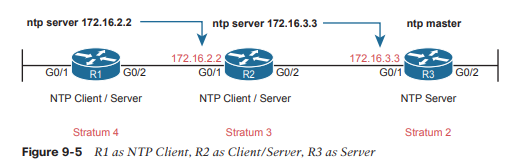
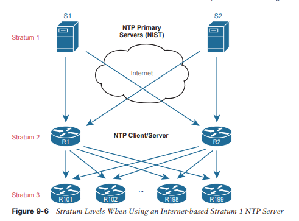
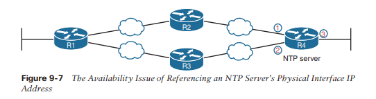
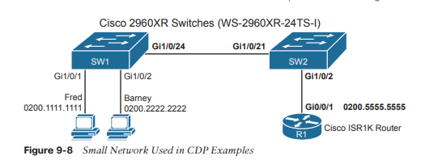

# Protocolos de administración de dispositivos

Este capítulo cubre los siguientes temas del examen:
- Acceso a la red
	- Configurar y verificar protocolos de descubrimiento de Capa 2 (Cisco Discovery Protocol y LLDP)
- Servicios de propiedad intelectual
	- Configurar y verificar NTP operando en modo cliente y servidor.
	- Describir el uso de las funciones de syslog, incluidas las instalaciones y los niveles.

La primera sección principal de este capítulo se centra en los mensajes de registro y syslog. La mayoría de los dispositivos informáticos necesitan notificar al administrador sobre cualquier problema importante; Generalmente, en el mundo de la informática, los mensajes de este tipo se denominan mensajes de registro. Los dispositivos Cisco también generan mensajes de registro. La primera sección muestra cómo un dispositivo Cisco maneja esos mensajes y cómo puede configurar enrutadores y conmutadores para ignorar los mensajes o guardarlos de diferentes maneras.
A continuación, diferentes funciones de enrutador y conmutador se benefician de la sincronización de sus relojes horarios. Como la mayoría de los dispositivos informáticos, los enrutadores y conmutadores tienen una función de reloj interno para mantener el tiempo. El protocolo de hora de red (NTP) proporciona un medio para que los dispositivos sincronicen su hora, como se analiza en la segunda sección.

La última sección principal se centra en dos protocolos que realizan el mismo tipo de trabajo: Cisco Discovery Protocol (CDP) y Link Layer Discovery Protocol (LLDP). Ambos proporcionan un medio para que los dispositivos de red conozcan los dispositivos vecinos, sin necesidad de que IPv4 o IPv6 estén funcionando en ese momento.
### Registro de mensajes del sistema (Syslog)
Es sorprendente lo útiles que los dispositivos Cisco intentan ser para sus administradores. Cuando tienen lugar eventos importantes (e incluso no tan importantes), estos dispositivos Cisco intentan notificar a los administradores con mensajes detallados del sistema. Como aprenderá en esta sección, estos mensajes varían desde los más mundanos hasta aquellos que son increíblemente importantes. Afortunadamente, los administradores tienen una gran variedad de opciones para almacenar estos mensajes y recibir alertas sobre aquellos que podrían tener el mayor impacto en la infraestructura de la red.

Cuando ocurre un evento que el sistema operativo del dispositivo considera interesante, ¿cómo nos notifica el sistema operativo a los humanos? Cisco IOS puede enviar los mensajes a cualquier persona que haya iniciado sesión actualmente en el dispositivo. También puede almacenar el mensaje para que un usuario pueda verlo más tarde.
### Envío de mensajes en tiempo real a usuarios actuales
Cisco IOS que se ejecuta en un dispositivo al menos intenta permitir que los usuarios actuales vean los mensajes de registro cuando suceden. No todos los enrutadores o conmutadores pueden tener usuarios conectados, pero si algún usuario inicia sesión, el enrutador o conmutador se beneficia al informar al ingeniero de red sobre cualquier problema.

De forma predeterminada, IOS muestra mensajes de registro a los usuarios de la consola para todos los niveles de gravedad de los mensajes. Ese valor predeterminado ocurre debido al comando de configuración global de la consola de registro predeterminado. De hecho, si ha estado utilizando un puerto de consola durante el tiempo que ha leído esto, es probable que ya haya notado muchos mensajes de syslog, como mensajes sobre interfaces activas o desactivadas.

Para otros usuarios (es decir, usuarios de Telnet y SSH), el dispositivo requiere un proceso de dos pasos antes de que el usuario vea los mensajes. En primer lugar, IOS tiene otra configuración global (monitor de registro) que le indica a IOS que habilite el envío de mensajes de registro a todos los usuarios registrados. Sin embargo, esa configuración predeterminada no es suficiente para permitir que el usuario vea los mensajes de registro. El usuario también debe emitir el comando EXEC del monitor de terminal durante la sesión de inicio de sesión, que le indica a IOS que esta sesión de terminal desea recibir mensajes de registro.

La Figura 9-1 resume estos puntos clave sobre cómo el IOS en un enrutador o conmutador Cisco procesa los mensajes de registro para los usuarios actualmente conectados. En la figura, el usuario A se sienta frente a la consola y siempre recibe mensajes de registro. A la derecha, el hecho de que el usuario B vea mensajes (porque el usuario B emitió el comando de monitorización de terminal después de iniciar sesión), y el usuario C no, muestra que cada usuario puede controlar si recibe o no mensajes de registro.


### Almacenamiento de mensajes de registro para revisión posterior
Al iniciar sesión en la consola y en los terminales, ocurre un evento, IOS envía los mensajes a la consola y a las sesiones del terminal, y luego IOS puede descartar el mensaje. Sin embargo, claramente sería útil conservar una copia de los mensajes de registro para su posterior revisión, por lo que IOS proporciona dos medios principales para conservar una copia.

IOS puede almacenar copias de los mensajes de registro en la RAM en virtud del comando de configuración global `logging buffered`. Luego, cualquier usuario puede volver más tarde y ver los mensajes de registro antiguos utilizando el comando EXEC `show logging`.

Como segunda opción, una opción que se utiliza con frecuencia en redes de producción, todos los dispositivos almacenan sus mensajes de registro de forma centralizada en un servidor syslog. RFC 5424 define el protocolo syslog, que proporciona los medios por los cuales un dispositivo como un conmutador o enrutador puede utilizar un protocolo UDP para enviar mensajes a un servidor syslog para su almacenamiento. Todos los dispositivos pueden enviar sus mensajes de registro al servidor. Posteriormente, un usuario puede conectarse al servidor (normalmente con una interfaz gráfica de usuario) y examinar los mensajes de registro desde varios dispositivos. Para configurar un enrutador o conmutador para enviar mensajes de registro a un servidor syslog, agregue el host de registro {dirección | hostname} comando global, que hace referencia a la dirección IP o al nombre de host del servidor syslog.


### Formato de mensaje de registro
IOS define el formato de los mensajes de registro. El mensaje comienza con algunos campos de datos sobre el mensaje, seguidos de un texto más fácil de leer para los humanos. Por ejemplo, observe detenidamente este mensaje de muestra:

**A timestamp**: *Dec 18 17:10:15.079 
**The facility on the router that generated the message**: %LINEPROTO 
**The severity level**: 5 
**A mnemonic for the message**: UPDOWN 
**The description of the message**: Line protocol on Interface FastEthernet0/0, changed state to down

IOS dicta la mayor parte del contenido de los mensajes, pero al menos puede activar y desactivar el uso de la marca de tiempo (que se incluye de forma predeterminada) y un número de secuencia de mensajes de registro (que no está habilitado de forma predeterminada). El ejemplo 9-1 invierte esos valores predeterminados desactivando las marcas de tiempo y activando los números de secuencia.

```
R1(config)# no service timestamps 
R1(config)# service sequence-numbers
R1(config)# end

R1#
000011: %SYS-5-CONFIG_I: Configured from console by console
```

Para ver el cambio de formato, consulte el mensaje de registro al final del ejemplo. Como es habitual, cuando sale del modo de configuración, el dispositivo emite otro mensaje de registro. Al comparar este mensaje con el ejemplo anterior, puede ver que ahora ya no incluye la hora del día, pero sí un número de secuencia.
### Niveles de gravedad de los mensajes de registro
Los mensajes de registro pueden informarle simplemente sobre algún evento mundano o pueden informarle sobre algún evento crítico. Para ayudarlo a comprender la importancia de cada mensaje, IOS asigna a cada mensaje un nivel de gravedad (como se indica en los mismos mensajes en la página anterior). La Figura 9-3 muestra los niveles de gravedad: cuanto menor sea el número, más grave será el evento que provocó el mensaje. (Tenga en cuenta que los valores de la izquierda y el centro se utilizan en los comandos de IOS).


La Figura 9-3 divide los ocho niveles de gravedad en cuatro secciones sólo para entender un poco más su significado. Los dos niveles superiores de la figura son los más graves. Los mensajes de este nivel significan que existe un problema grave e inmediato. Los tres niveles siguientes, denominados Crítico, Error y Advertencia, también informan sobre eventos que afectan al dispositivo, pero no son tan inmediatos ni tan graves. Por ejemplo, un mensaje de registro común sobre una interfaz que falla y queda físicamente inactiva se muestra como un mensaje de nivel de gravedad 3.

Continuando con la figura, IOS utiliza los siguientes dos niveles (5 y 6) para mensajes que tratan más de notificar al usuario que de identificar errores. Finalmente, el último nivel de la figura se utiliza para los mensajes solicitados por el comando `debug`, como se muestra en un ejemplo más adelante en este capítulo.

La Tabla 9-2 resume los comandos de configuración utilizados para habilitar el registro y establecer el nivel de gravedad para cada tipo. Cuando se establece el nivel de gravedad, IOS enviará mensajes de ese nivel de gravedad y otros más graves (números de gravedad más bajos) al servicio identificado en el comando. Por ejemplo, el comando `logging console 4` hace que IOS envíe mensajes de nivel de gravedad 0–4 a ​​la consola. Además, tenga en cuenta que el comando para deshabilitar cada servicio es la versión no del comando, con no delante del comando (`no logging console`, `no logging monitor`, etc.).

| **Service** | **To Enable Logging**                    | **To Set Message Levels**                           |
| ----------- | ---------------------------------------- | --------------------------------------------------- |
| Console     | **logging console**                      | **logging console** _level-name_ \| _level-number_  |
| Monitor     | **logging monitor**                      | **logging monitor** _level-name_ \| _level-number_  |
| Buffered    | **logging buffered**                     | **logging buffered** _level-name_ \| _level-number_ |
| Syslog      | **logging host** _address_ \| _hostname_ | **logging trap** _level-name_ \| _level-number_     |

### Configuración y verificación del registro del sistema
Con la información de la Tabla 9-2, configurar syslog en un enrutador o conmutador Cisco IOS debería ser relativamente sencillo. El ejemplo 9-2 muestra una muestra, basada en la Figura 9-4. La figura muestra un servidor syslog en la dirección IP 172.16.3.9. Ambos conmutadores y ambos enrutadores utilizarán la misma configuración que se muestra en el Ejemplo 9-2, aunque el ejemplo muestra el proceso de configuración en un solo dispositivo, el enrutador R1.


```
logging console 7 
logging monitor debug 
logging buffered 4 
logging host 172.16.3.9 
logging trap warning
```

Primero, tenga en cuenta que el ejemplo configura el mismo nivel de mensaje en la consola y para la supervisión del terminal (nivel 7 o depuración), y el mismo nivel para el almacenamiento en búfer y el registro en el servidor syslog (nivel 4 o advertencia). Los niveles se pueden configurar usando el nivel de gravedad numérico o el nombre como se muestra anteriormente en la Figura 9-3.

El comando `show logging` confirma esos mismos ajustes de configuración y también enumera los mensajes de registro según la configuración almacenada en el búfer de registro. El Ejemplo 9-3 muestra un ejemplo, con los ajustes de configuración que coinciden con el Ejemplo 9-2 resaltados en gris.

```
R1# show logging 
Syslog logging: enabled (0 messages dropped, 3 messages rate-limited, 0 flushes, 0 overruns, xml disabled, filtering disabled) 

No Active Message Discriminator. 

No Inactive Message Discriminator. 

	Console logging: level debugging, 45 messages logged, xml disabled, filtering disabled 
	Monitor logging: level debugging, 0 messages logged, xml disabled, filtering disabled 
	Buffer logging: level warnings, 0 messages logged, xml disabled, filtering disabled
	Exception Logging: size (8192 bytes) 
	Count and timestamp logging messages: disabled 
	Persistent logging: disabled 
	
No active filter modules. 

	Trap logging: level warnings, 0 message lines logged 
		Logging to 172.16.3.9 (udp port 514, audit disabled, 
			link up), 0 message lines logged, 
			0 message lines rate-limited, 
			0 message lines dropped-by-MD, 
			xml disabled, sequence number disabled 
			filtering disabled Logging Source-Interface: VRF Name: 
			
Log Buffer (8192 bytes):
```

Quizás ya hayas notado que conocer los nombres de los ocho niveles de mensajes de registro puede resultar útil si deseas comprender el resultado de los comandos. La mayoría de los comandos `show` enumeran los niveles de mensajes de registro por nombre, no por número. Como puede ver en los resaltados grises en este ejemplo, dos niveles enumeran "depuración" y dos enumeran "advertencia", aunque algunos de los comandos de configuración se refieren a esos niveles por número.

 Además, no puede saber esto a partir del resultado, pero en el Ejemplo 9-3, el enrutador R1 no tiene mensajes de registro almacenados en el búfer. (Tenga en cuenta el valor del contador de 0 para los mensajes de registro almacenados en el búfer). Si algún mensaje de registro se hubiera almacenado en el búfer, los mensajes de registro reales se enumerarían al final del comando. En este caso, acababa de iniciar el enrutador y aún no se habían almacenado mensajes en el buffer. (También puede borrar los mensajes antiguos del registro con el comando EXEC de registro claro).

El siguiente ejemplo muestra la diferencia entre los niveles de gravedad actuales. Este ejemplo muestra al usuario deshabilitando la interfaz G0/1 en R1 con el comando `shutdown` y luego volviéndola a habilitar con el comando `no shutdown`. Si observa detenidamente los mensajes resaltados, verá varios mensajes de gravedad 5 y un mensaje de gravedad 3. El comando de configuración global `logging buffered 4` en R1 (consulte el Ejemplo 9-2) significa que R1 no almacenará en buffer los mensajes de registro de nivel de gravedad 5, pero sí almacenará en buffer los mensajes de nivel de gravedad 3. El ejemplo 9-4 finaliza mostrando ese mensaje de registro al final de la salida del comando `show logging`.

```
R1# configure terminal 
Enter configuration commands, one per line. End with CNTL/Z. 
R1(config)# interface g0/1 
R1(config-if)# shutdown 
R1(config-if)# *Oct 21 20:07:07.244: %LINK-5-CHANGED: Interface GigabitEthernet0/1, changed state to administratively down 
*Oct 21 20:07:08.244: %LINEPROTO-5-UPDOWN: Line protocol on Interface GigabitEther-
net0/1, changed state to down 
R1(config-if)# no shutdown 
R1(config-if)# *Oct 21 20:07:24.312: %LINK-3-UPDOWN: Interface GigabitEthernet0/1, changed state to up 
*Oct 21 20:07:25.312: %LINEPROTO-5-UPDOWN: Line protocol on Interface GigabitEthernet0/1, changed state to up 
R1(config-if)# ^Z 
R1# *Oct 21 20:07:36.546: %SYS-5-CONFIG_I: Configured from console by console 
R1# show logging 
! Skipping about 20 lines, the same lines in Example 9-3, until the last few lines 

Log Buffer (8192 bytes): 

*Oct 21 20:07:24.312: %LINK-3-UPDOWN: Interface GigabitEthernet0/1, changed state to up
```

### El comando de depuración y los mensajes de registro
De los ocho niveles de gravedad de los mensajes de registro, un nivel, el nivel de depuración (7), tiene un propósito especial: para los mensajes generados como resultado de que un usuario haya iniciado sesión en el enrutador o conmutador y emita un comando de depuración.

El comando `debug EXEC` le brinda al ingeniero de red una forma de pedirle a IOS que supervise ciertos eventos internos, y que el proceso de monitoreo continúe a lo largo del tiempo, de modo que IOS pueda emitir mensajes de registro cuando ocurran esos eventos. El ingeniero puede iniciar sesión, emitir el comando de depuración y continuar con otros trabajos. El usuario puede incluso cerrar sesión en el dispositivo y la depuración permanece habilitada. IOS continúa monitoreando la solicitud en ese comando de depuración y genera mensajes de registro sobre cualquier evento relacionado. La depuración permanece activa hasta que algún usuario emite el comando no debug con los mismos parámetros, deshabilitando la depuración.

La mejor manera de ver cómo funciona el comando `debug` y cómo utiliza los mensajes de registro es ver un ejemplo. El ejemplo 9-5 muestra un ejemplo de depuración de mensajes de saludo OSPF para el enrutador R1 en la Figura 9-4. El enrutador (R1) habilita OSPF en dos interfaces y ha establecido una relación de vecino OSPF con el enrutador R2 (RID 2.2.2.2). El resultado de la depuración muestra un mensaje de registro para el saludo enviado en cada una de las cuatro interfaces habilitadas para OSPF, así como mensajes de registro para los mensajes de saludo recibidos de cada uno de los tres vecinos OSPF.

```
R1# debug ip ospf hello 
OSPF hello debugging is on
R1#
*Aug 10 13:38:19.863: OSPF-1 HELLO Gi0/1: Send hello to 224.0.0.5 area 0 from
172.16.1.1
*Aug 10 13:38:21.199: OSPF-1 HELLO Gi0/2: Rcv hello from 2.2.2.2 area 0 172.16.2.2|
*Aug 10 13:38:22.843: OSPF-1 HELLO Gi0/2: Send hello to 224.0.0.5 area 0 from
172.16.2.1
R1#
```

El usuario de la consola ve los mensajes de registro creados en nombre de ese comando de depuración una vez que se completa el comando de depuración. Según la configuración anterior en el Ejemplo 9-2, el comando de registro de la consola 7 del R1 nos dice que el usuario de la consola recibirá los niveles de gravedad del 0 al 7, que incluyen mensajes de depuración de nivel 7. Tenga en cuenta que con la configuración actual, estos mensajes de depuración no estarían en el búfer de mensajes de registro local debido al nivel en el comando `login buffered warning`, ni se enviarían al servidor syslog debido al comando de nivel `logging trap 4`.

Tenga en cuenta que el usuario de la consola ve automáticamente los mensajes de registro como se muestra en el Ejemplo 9-4. Sin embargo, como se indica en el texto que describe la Figura 9-1, un usuario que se conecte al R1 también deberá emitir el comando `terminal monitor` para ver esos mensajes de depuración. Por ejemplo, cualquiera que haya iniciado sesión con SSH en el momento en que se recopiló el resultado del Ejemplo 9-4 no habría visto el resultado, incluso con el comando `logging monitor debug` configurado en el enrutador R1, sin antes emitir un comando `terminal monitor`.

Tenga en cuenta que todas las opciones de depuración habilitadas utilizan la CPU del enrutador, lo que puede causar problemas al enrutador. Puede monitorear el uso de la CPU con el comando `show Process cpu`, pero debe tener cuidado al usar los comandos de depuración con cuidado en dispositivos de producción. Además, tenga en cuenta que cuantos más usuarios de CLI reciban mensajes de depuración, más CPU se consumirá. Por lo tanto, algunas instalaciones optan por no incluir mensajes de registro a nivel de depuración para el registro de la consola y del terminal, lo que requiere que los usuarios busquen esos mensajes en el búfer de registro o syslog, solo para reducir la carga de la CPU del enrutador.
### Protocolo de tiempo de red (NTP)
Cada dispositivo de red tiene algún concepto de fecha y reloj de hora. Por ejemplo, los mensajes de registro analizados en la primera sección principal de este capítulo tenían una marca de tiempo con la fecha y hora del día indicadas. Ahora imagine mirar todos los mensajes de registro de todos los enrutadores y conmutadores almacenados en un servidor syslog. Todos esos mensajes tienen una fecha y una marca de tiempo, pero ¿cómo se asegura de que las marcas de tiempo sean consistentes? ¿Cómo se asegura de que todos los dispositivos sincronicen sus relojes de hora del día para poder entender todos los mensajes de registro en el servidor syslog? ¿Cómo podrías entender los mensajes de un evento que afectó a dispositivos en tres zonas horarias diferentes?

Por ejemplo, considere los mensajes en dos enrutadores, R1 y R2, como se muestra en el Ejemplo 9-6. Los enrutadores R1 y R2 no sincronizan sus relojes. Sigue ocurriendo un problema en el enlace serie entre los dos enrutadores. Un ingeniero de redes examina todos los mensajes de registro almacenados en el servidor syslog. Sin embargo, cuando el ingeniero ve algunos mensajes de R1, a las 13:38:39 (alrededor de la 1:40 p. m.), no piensa en buscar mensajes de R2 que tengan una marca de tiempo de alrededor de las 9:45 a. m.

```
*Oct 19 13:38:37.568: %OSPF-5-ADJCHG: Process 1, Nbr 2.2.2.2 on Serial0/0/0 from FULL to DOWN, Neighbor Down: Interface down or detached

*Oct 19 13:38:40.568: %LINEPROTO-5-UPDOWN: Line protocol on Interface Serial0/0/0, changed state to down
```
```
! These messages happened on router R2
Oct 19 09:44:09.027: %LINK-3-UPDOWN: Interface Serial0/0/1, changed state to down
Oct 19 09:44:09.027: %OSPF-5-ADJCHG: Process 1, Nbr 1.1.1.1 on Serial0/0/1 from FULL to DOWN, Neighbor Down: Interface down or detached
```

En realidad, los mensajes en ambas partes del Ejemplo 9-6 ocurrieron con una diferencia de 0,5 segundos entre sí porque emití un comando de apagado en uno de los enrutadores. Sin embargo, los relojes horarios de los dos enrutadores no estaban sincronizados, lo que hace que los mensajes en los dos enrutadores parezcan no relacionados. Con relojes sincronizados, los dos enrutadores habrían enumerado marcas de tiempo prácticamente idénticas de casi exactamente la misma hora en la que ocurrieron estos mensajes, lo que haría mucho más fácil leer y correlacionar los mensajes.

Los enrutadores, conmutadores, otros dispositivos de red y prácticamente todos los dispositivos conocidos en el mundo de la TI tienen un reloj con la hora del día. Por diversas razones, tiene sentido sincronizar esos relojes para que todos los dispositivos tengan la misma hora del día, además de las diferencias en la zona horaria. El protocolo de tiempo de red (NTP) proporciona los medios para hacer precisamente eso.

NTP ofrece a cualquier dispositivo una forma de sincronizar sus relojes de hora del día. NTP proporciona mensajes de protocolo que los dispositivos utilizan para conocer la marca de tiempo de otros dispositivos. Los dispositivos se envían marcas de tiempo entre sí con mensajes NTP, intercambiando mensajes continuamente, y un dispositivo cambia su reloj para que coincida con el del otro, y finalmente sincroniza los relojes. Como resultado, las acciones que se benefician de la sincronización, como las marcas de tiempo en los mensajes de registro, funcionan mucho mejor.
### Configuración de la hora y la zona horaria
El trabajo de NTP es sincronizar los relojes, pero NTP funciona mejor si configura el reloj del dispositivo a una hora razonablemente cercana antes de habilitar la función de cliente NTP con el comando `ntp server`. Por ejemplo, mi reloj de pulsera marca las 8:52 p.m. ahora mismo. Antes de iniciar NTP en un nuevo enrutador o conmutador para que se sincronice con otro dispositivo, debo configurar la hora en 8:52 p. m., configurar la fecha y zona horaria correctas e incluso decirle al dispositivo que se ajuste al horario de verano y luego habilitar NTP. Configurar la hora correctamente le da a NTP un buen comienzo para la sincronización.

El ejemplo 9-7 muestra cómo configurar la fecha, hora, zona horaria y horario de verano. Curiosamente, utiliza dos comandos de configuración (para la zona horaria y el horario de verano) y un comando EXEC para configurar la fecha y la hora en el enrutador.

```
R1# configure terminal
Enter configuration commands, one per line. End with CNTL/Z.
R1(config)# clock timezone EST -5
R1(config)# clock summer-time EDT recurring
R1(config)# ^Z
R1#
R1# clock set 20:52:49 21 October 2015
Oct 21 20:52:49.000: %SYS-6-CLOCKUPDATE: System clock has been updated from 00:36:38
UTC Thu Oct 22 2015 to 20:52:49 UTC Wed Oct 21 2015, configured from console by console. 
R1# show clock
20:52:55.051 EDT Wed Oct 21 2015
```

Concéntrese primero en los dos comandos de configuración. Debe configurar los dos primeros comandos antes de configurar la hora del día con el comando EXEC `clock set` porque los dos comandos de configuración afectan la hora configurada. En el primer comando, `clock timezone` define el comando y una palabra clave. El siguiente parámetro, `EST` en este caso, es cualquier valor que elija, pero elija el nombre de la zona horaria del dispositivo. Este valor aparece en los comandos `show`, por lo que aunque usted invente el valor, el valor debe ser significativo para todos. Elegí EST, el acrónimo de Hora estándar del este de EE. UU. El parámetro “-5” significa que este dispositivo tiene un retraso de 5 horas en la hora universal coordinada (UTC).

`clock summer-time` La parte del segundo comando define qué hacer, nuevamente siendo el `EDT` un campo en el que podría haber usado cualquier valor. Sin embargo, debe utilizar un valor significativo. Este es el valor que se muestra con la hora en los comandos `show` cuando el horario de verano está vigente, así que elegí EDT porque es el acrónimo de horario de verano en esa misma zona horaria EST. Finalmente, la palabra clave recurrente le dice al enrutador que avance una hora y retroceda una hora automáticamente a lo largo de los años.

El comando EXEC `clock set` establece la hora, el día del mes, el mes y el año. Sin embargo, tenga en cuenta que IOS interpreta la hora escrita en el comando en el contexto de la zona horaria y el horario de verano. En el ejemplo, el comando `clock set` muestra una hora de 20:52:49 (el comando usa una sintaxis de hora con un formato de 24 horas, no con un formato de 12 horas más a.m./p.m.). Como resultado de esa hora más los dos comandos de configuración anteriores, el comando `show clock` (emitido segundos después) enumera esa hora, pero también anota la hora como EDT, en lugar de hora UTC.
### Configuración NTP básica
Con NTP, los servidores proporcionan información sobre la hora del día a los clientes y los clientes reaccionan ajustando sus relojes para que coincidan. El proceso requiere pequeños ajustes repetidos a lo largo del tiempo para mantener esa sincronización. La configuración en sí puede ser simple o extensa una vez que agrega la configuración de seguridad y la redundancia.

Cisco proporciona dos comandos de configuración ntp que dictan cómo funciona NTP en un enrutador o conmutador, de la siguiente manera:

-  **ntp master** {_stratum-level_}**:** NTP server mode—el dispositivo actúa sólo como servidor NTP y no como cliente NTP. El dispositivo obtiene la información horaria del reloj interno del dispositivo.

- **ntp server** {_address_ | _hostname_}**:** NTP client/server mode—el dispositivo actúa como cliente y servidor. Primero, actúa como un cliente NTP, para sincronizar la hora con un servidor. Una vez sincronizado, el dispositivo puede actuar como un servidor NTP, para suministrar tiempo a otros clientes NTP.

Para ver un ejemplo que muestra la sintaxis de configuración básica y los comandos `show`, considere la Figura 9-5. Con esta sencilla configuración:
-  R3 acts as an NTP server only.
- R2 acts in client/server mode—primero como cliente NTP para sincronizar la hora con el servidor NTP R3, luego como servidor para suministrar hora al cliente NTP R1.
- R1 acts in client/server mode—primero como cliente NTP para sincronizar la hora con el servidor NTP R2. (R1 estará dispuesto a actuar como servidor, pero en este ejemplo ningún dispositivo hace referencia a R1 como servidor NTP).



Como puede ver, NTP requiere poca configuración para que funcione con un único comando de configuración en cada dispositivo. El ejemplo 9-8 recopila la configuración de los dispositivos que se muestran en la figura para facilitar su consulta.

```
! Configuration on R1: 
ntp server 172.16.2.2
```
```
! Configuration on R2: 
ntp server 172.16.3.3
```
```
! Configuration on R3:
ntp master 2
```

El ejemplo 9-9 enumera el resultado del comando `show ntp status` en R1, y la primera línea de resultado incluye algunos elementos de estado importantes. Primero, muestra un estado de sincronizado, que confirma que el cliente NTP ha completado el proceso de cambiar su hora para que coincida con la hora del servidor. Cualquier enrutador que actúe como cliente NTP incluirá "no sincronizado" en esa primera línea hasta que se complete el proceso de sincronización NTP con al menos un servidor. También confirma la dirección IP del servidor (el reloj de referencia de este dispositivo) con la dirección IP configurada en el Ejemplo 9-8 (172.16.2.2).

```
R1# show ntp status 
Clock is synchronized, stratum 4, reference is 172.16.2.2 nominal freq is 250.0000 Hz, actual freq is 250.0000 Hz, precision is 2**21 
ntp uptime is 1553800 (1/100 of seconds), resolution is 4000 
reference time is DA5E7147.56CADEA7 (19:54:31.339 EST Thu Feb 4 2016) 
clock offset is 0.0986 msec, root delay is 2.46 msec 
root dispersion is 22.19 msec, peer dispersion is 5.33 msec 
loopfilter state is 'CTRL' (Normal Controlled Loop), drift is 0.000000009 s/s 
system poll interval is 64, last update was 530 sec ago.
```

A continuación, observe el resultado del comando `show ntp Associations` de R1 y R2, como se muestra en el Ejemplo 9-10. Este comando enumera todos los servidores NTP que el dispositivo local puede intentar usar, con información de estado sobre la asociación entre el dispositivo local (cliente) y los distintos servidores NTP. Comenzando con R1, tenga en cuenta que tiene una asociación (es decir, una relación con un servidor NTP), basada en el comando de configuración one ntp server 172.16.2.2 en R1. El * significa que R1 se comunicó exitosamente con el servidor. Verá datos similares del mismo resultado de comando tomado del enrutador R2.

```
R1# show ntp associations 
! This output is taken from router R1, acting in client/server mode    
address      ref clock     st  when poll  reach  delay  offset  disp 
*~172.16.2.2 172.16.3.3    3   50    64   377    1.223  0.090   4.469

* sys.peer, # selected, + candidate, - outlyer, x falseticker, ~ configured
```
```
R2# show ntp associations
! This output is taken from router R2, acting in client/server mode  
address       ref clock    st  when poll  reach  delay  offset  disp 
*~172.16.3.3  127.127.1.1  2   49    64   377    1.220  -7.758  3.695

* sys.peer, # selected, + candidate, - outlyer, x falseticker, ~ configured
```

### Reloj y estrato de referencia NTP
Los servidores NTP deben aprender la hora de algún dispositivo. Para dispositivos que actúan en modo cliente/servidor NTP, el dispositivo utiliza la función de cliente NTP para aprender la hora. Sin embargo, los dispositivos que actúan únicamente como servidor NTP obtienen su tiempo del hardware interno del dispositivo o de algún reloj externo utilizando mecanismos distintos de NTP.

Por ejemplo, cuando se configura con el comando `ntp master`, un enrutador/conmutador Cisco utiliza el hardware de su dispositivo interno para determinar la hora. Todas las computadoras, incluidos los dispositivos de red, necesitan algún medio para mantener el tiempo por innumerables razones, por lo que incluyen componentes de hardware y procesos de software para mantener el tiempo incluso durante períodos en los que el dispositivo pierde energía.

Además, los servidores y clientes NTP utilizan un número para mostrar la precisión percibida de los datos de su reloj de referencia según el nivel del estrato. Cuanto más bajo sea el nivel del estrato, más preciso se considera el reloj de referencia. Un servidor NTP que utiliza su hardware interno o un reloj de referencia externo establece su propio nivel de estrato. Luego, un cliente NTP agrega 1 al nivel de estrato que aprende de su servidor NTP, de modo que el nivel de estrato aumenta cuanto más saltos se alejan de la fuente de reloj original.

Por ejemplo, en la Figura 9-5, puede ver el servidor primario NTP (R3) con un estrato de 2. R2, que hace referencia a R3, agrega 1 por lo que tiene un estrato de 3. R1 usa R2 como su servidor NTP. por lo tanto, R1 agrega 1 para tener un estrato de 4. Estos niveles de estrato crecientes permiten que los dispositivos hagan referencia a varios servidores NTP y luego usen información de tiempo del mejor servidor NTP, siendo el mejor el servidor con el nivel de estrato más bajo.

Los enrutadores y conmutadores utilizan el nivel de estrato predeterminado de 8 para su reloj de referencia interno según la configuración predeterminada de 8 para el nivel de estrato en el comando `ntp master [stratum-level]`. El comando le permite establecer un valor del 1 al 15; En el ejemplo 9-8, el comando `ntp master 2` configuró el nivel de estrato del enrutador R3 en 2.

Para ver la evidencia, consulte el Ejemplo 9-10, que muestra dos comandos basados ​​en la misma configuración en el Ejemplo 9-8 y la Figura 9-5. El resultado destaca detalles sobre relojes de referencia y niveles de estrato, de la siguiente manera:

**R1**: según el comando `ntp server 172.16.2.2` configurado, el comando `show` enumera la misma dirección (que es la dirección del enrutador R2). Los campos ref clock (reloj de referencia) y st (estrato) representan el reloj de referencia de R2 como 172.16.3.3; en otras palabras, el servidor NTP de R2, que es R3 en este caso. El valor del primer campo de 3 muestra el estrato de R2.
**R2**: según el comando `ntp server 172.16.3.3` configurado, el comando `show` enumera 172,16,3,3, que es una dirección en el enrutador R3. La salida señala el reloj de referencia de R3 como
127.127.1.1: una indicación de que el servidor (R3) obtiene su reloj internamente. Enumera el valor st (estrato) de R3 de 2, consistente con el comando ntp master 2 configurado en R3 (según el Ejemplo 9-8).

En el servidor primario NTP (R3 en este caso), la salida tiene más marcadores que indican el uso del reloj interno. El ejemplo 9-11 muestra la salida de R3, con un reloj de referencia de la dirección de loopback 127.127.1.1, que se usa para referirse al hecho de que este enrutador obtiene sus datos de reloj internamente. Además, en el resultado del comando `show ntp Associations` en la parte inferior, observe la misma dirección, junto con un valor de reloj de referencia de ".LOCL". De hecho, R3, según el comando de configuración `ntp master`, tiene una asociación con su reloj interno.

```
R3# show ntp status 
Clock is synchronized, stratum 2, reference is 127.127.1.1    
nominal freq is 250.0000 Hz, actual freq is 250.0000 Hz, precision is 2**20 
ntp uptime is 595300 (1/100 of seconds), resolution is 4000 
reference time is E0F9174C.87277EBB (16:13:32.527 daylight Sat Aug 10 2019) 
clock offset is 0.0000 msec, root delay is 0.00 msec 
root dispersion is 0.33 msec, peer dispersion is 0.23 msec 
loopfilter state is 'CTRL' (Normal Controlled Loop), drift is 0.000000000 s/s 
system poll interval is 16, last update was 8 sec ago.

R3# show ntp associations   
address           ref clock         st   when   poll reach  delay  offset   disp
*~127.127.1.1     .LOCL.             1     15     16   377  0.000   0.000  0.232

* sys.peer, # selected, + candidate, - outlyer, x falseticker, ~ configured
```

### Configuración NTP redundante
En lugar de utilizar un dispositivo de red como reloj de referencia para la empresa, puede consultar mejores fuentes de tiempo en Internet o comprar un servidor NTP especialmente diseñado que tenga un mejor hardware de reloj. Por ejemplo, una empresa podría utilizar NTP para hacer referencia a servidores NTP que utilizan un reloj atómico como fuente de referencia, como los servidores primarios NTP de la Figura 9-6, que son administrados por el Instituto Nacional de Estándares y Tecnología (NIST) de EE. UU. (ver tf.nist.gov).



Para un buen diseño, la configuración NTP empresarial debe hacer referencia a al menos dos servidores NTP externos para lograr redundancia. Además, solo unos pocos dispositivos empresariales deberían hacer referencia a esos servidores NTP externos y luego actuar como cliente y servidor NTP. La mayoría de los dispositivos de la empresa, como los que se muestran en la parte inferior de la figura, actuarían como clientes NTP. El ejemplo 9-12 muestra la configuración en los enrutadores R1 y R2 en la figura para lograr este diseño.

```
ntp server time-a-b-nist.gov 
ntp server time-a-g.nist.gov
```

Además de hacer referencia a servidores primarios NTP redundantes, algunos enrutadores de la empresa deben estar preparados para suministrar datos de reloj si esos servidores primarios NTP se vuelven inaccesibles. Existe una exposición con la configuración del Ejemplo 9-12 porque si los enrutadores R1 y R2 ya no escuchan los mensajes NTP de los servidores NTP en Internet, perderán su único reloj de referencia. Después de perder su reloj de referencia, R1 y R2 ya no podrían ser servidores NTP útiles para el resto de la empresa.
Para superar este posible problema, los enrutadores también se pueden configurar con el comando `ntp master`, lo que da como resultado esta lógica:
1. Establezca una asociación con los servidores NTP según el comando `ntp server`.
2. Establezca una asociación con su reloj interno usando el comando `ntp master stratum`.
3. Establezca el nivel de estrato del reloj interno (según el comando `ntp master {stratum-level}`) en un nivel de estrato más alto (peor) que el de los servidores NTP basados ​​en Internet.
4. Sincronice con la mejor fuente de hora (la más baja) conocida, que será uno de los servidores NTP de Internet en este escenario.

La lógica tiene algunos pasos, pero la configuración en sí es simple, como se muestra en el Ejemplo 9-13. En comparación con el ejemplo 9-12, simplemente agregue el comando `ntp master`. Los servidores NTP utilizados en este ejemplo tienen un nivel de estrato 1, por lo que el uso del comando `ntp master 7`, con un estrato mucho más alto, hará que los enrutadores R1 y R2 utilicen uno de los servidores NTP NIST cuando esté disponible y utilicen el nivel de estrato 1. fuente de reloj solo cuando se pierde la conectividad con los servidores NIST.

```
ntp server time-a-b-nist.gov 
ntp server time-a-g.nist.gov 
ntp master 7
```

### NTP utilizando una interfaz de bucle invertido para una mejor disponibilidad
Un servidor NTP aceptará mensajes NTP que lleguen a cualquiera de sus direcciones IPv4 de forma predeterminada. Sin embargo, los clientes hacen referencia a una dirección IP específica en el servidor NTP. Eso crea un problema de disponibilidad.

Por ejemplo, considere la topología en la Figura 9-7, con el enrutador R4 a la derecha actuando como servidor NTP y los otros enrutadores actuando como clientes. R4 tiene tres direcciones IP que los clientes pueden ingresar en los comandos de dirección de su servidor ntp. Ahora considere lo que sucede cuando falla una interfaz en R4, pero solo una. No importa cuál de las tres interfaces falle, esa dirección IP en esa interfaz no se puede usar para enviar y recibir paquetes. En ese caso, para cualquier cliente NTP que haya hecho referencia a esa dirección IP específica
- Probablemente todavía habría una ruta para llegar a la propia R4.
- El cliente NTP no podría enviar paquetes a la dirección configurada porque esa interfaz está inactiva.


Lo que se necesita es una forma de enviar un paquete a R4, una forma que no esté ligada al estado de ninguna interfaz. Es decir, siempre que haya alguna ruta para enviar paquetes al propio R4, permita que NTP siga funcionando. El objetivo es evitar el caso en el que una falla de una sola interfaz en el enrutador R4 también provoque una falla en NTP.

Cisco utiliza la interfaz loopback del enrutador para satisfacer esa necesidad exacta. Las interfaces de bucle invertido son interfaces virtuales internas de Cisco IOS, creadas mediante el comando `interface loopback`, donde el número es un número entero. Una vez configurada, esa interfaz de bucle invertido existe dentro de ese enrutador y no está vinculada a ninguna interfaz física. A una interfaz de bucle invertido se le puede asignar una dirección IP, los protocolos de enrutamiento pueden anunciar sobre la subred y usted puede hacer ping/trazar la ruta a esa dirección. Actúa como otras interfaces físicas en muchos sentidos, pero una vez configurada, permanece en estado activo siempre que

El ejemplo 9-14 muestra el pequeño cambio de configuración que agrega la interfaz loopback a la configuración NTP, que se basa en la Figura 9-5. En este caso, la configuración del Ejemplo 9-14 cambia ligeramente la configuración mostrada anteriormente en el Ejemplo 9-8. R1, que aún actúa como cliente, ahora apunta a la nueva dirección IP de la interfaz loopback de R2: 172.16.9.9. R2 ahora tiene configuración para una nueva interfaz de bucle invertido (bucle invertido 0). R2 también tiene un comando que le indica que use la dirección IP de esa interfaz loopback 0 como dirección de origen al enviar paquetes NTP.

```
! Configuration on R1, a client 
ntp server 172.16.9.9
```
```
! Configuration on R2 for its server function 
interface loopback 0    
	ip address 172.16.9.9 255.255.255.0 
!
ntp master 4 
ntp source loopback 0 
! Verification on router R2

R2# show interfaces loopback 0 
Loopback0 is up, line protocol is up
   Hardware is Loopback
   Internet address is 172.16.9.9/24
! lines omitted for brevity
```

Las interfaces loopback tienen una amplia gama de usos en todas las funciones de IOS. Se mencionan aquí con NTP porque NTP es una característica que puede beneficiarse del uso de interfaces loopback. (Como recordatorio, OSPF utiliza interfaces de bucle invertido con la configuración de OSPF para un propósito completamente diferente).
### Análisis de topología mediante CDP y LLDP
Las dos primeras secciones principales de este capítulo mostraron dos características (syslog y NTP) que funcionan de la misma manera tanto en enrutadores como en conmutadores. Esta sección final muestra otra característica común a los enrutadores y conmutadores, con dos protocolos similares: el Protocolo de descubrimiento de Cisco (CDP) y el Protocolo de descubrimiento de capa de enlace (LLDP). Esta sección se centra en CDP, seguida de LLDP.
### Examinar la información obtenida por CDP
CDP descubre información básica sobre enrutadores y conmutadores vecinos sin necesidad de conocer las contraseñas de los dispositivos vecinos. Para descubrir información, los enrutadores y conmutadores envían mensajes CDP a cada una de sus interfaces. Básicamente, los mensajes anuncian información sobre el dispositivo que envió el mensaje CDP. Los dispositivos que admiten CDP obtienen información sobre otros escuchando los anuncios enviados por otros dispositivos.
CDP descubre varios detalles útiles de los dispositivos Cisco vecinos:
- **Identificador del dispositivo**: normalmente el nombre del host
- **Lista de direcciones**: direcciones de red y de enlace de datos
- **Identificador de puerto**: la interfaz en el enrutador remoto o conmutador en el otro extremo del enlace que envió el anuncio CDP.
- **Lista de capacidades**: información sobre qué tipo de dispositivo es (por ejemplo, un enrutador o un conmutador)
- **Plataforma**: el modelo y el nivel del sistema operativo que se ejecuta en el dispositivo CDP desempeña dos funciones generales: proporcionar información a los dispositivos para admitir alguna función y proporcionar información a los ingenieros de red que administran los dispositivos. Por ejemplo, los teléfonos IP de Cisco utilizan CDP para conocer los ID de VLAN de voz y datos configurados en el conmutador de acceso. Para esa segunda función, CDP tiene comandos show que enumeran información sobre dispositivos vecinos, así como información sobre cómo está funcionando CDP. La Tabla 9-3 describe los tres comandos show que enumeran la información CDP más importante.

| **Command**                            | **Description**                                                                                                                         |
| -------------------------------------- | --------------------------------------------------------------------------------------------------------------------------------------- |
| **show cdp neighbors** [_type number_] | Lists one summary line of information about each neighbor or just the neighbor found on a specific interface if an interface was listed |
| **show cdp neighbors detail**          | Lists one large set (approximately 15 lines) of information, one set for every neighbor                                                 |
| **show cdp entry** _name_              | Lists the same information as the **show cdp neighbors detail** command, but only for the named neighbor (case sensitive)               |

El siguiente ejemplo muestra el poder de la información en los comandos CDP. El ejemplo utiliza la red que se muestra en la Figura 9-8, y el Ejemplo 9-15 enumera el resultado de varios comandos `show cdp`.



```
SW2#  show cdp neighbors
Capability Codes:   R - Router, T - Trans Bridge, B - Source Route Bridge 
					S - Switch, H - Host, I - IGMP, r - Repeater, P - Phone,
					D - Remote, C - CVTA, M - Two-port Mac Relay

Device ID          Local Intrfce     Holdtme    Capability  Platform  Port ID
SW1                Gig 1/0/21         155             S I   WS-C2960X Gig 1/0/24
R1                 Gig 1/0/2          131            R S I  C1111-8P  Gig 0/0/1

Total cdp entries displayed : 2
```

El comando `show cdp neighbours` enumera una línea por vecino. (Busque la columna ID del dispositivo y la lista que incluye SW1 y R1). Cada una de esas dos líneas enumera la información de topología más importante sobre cada vecino: el nombre del host del vecino (ID del dispositivo), la interfaz del dispositivo local y el nombre del dispositivo vecino. interfaz (bajo el encabezado Puerto).

Preste mucha atención a la interfaz del dispositivo local y a la interfaz del dispositivo vecino, comparando el ejemplo con la figura. Por ejemplo, el comando `show cdp neighbours` de SW2 enumera una entrada para SW1, con la interfaz local de SW2 de Gi0/2 y la interfaz de SW1 de Gi0/1 bajo el título "ID de puerto".

Este comando también enumera la plataforma, identificando el modelo específico del enrutador o conmutador vecino. Entonces, incluso usando esta información básica, podría construir una figura como la Figura 9-8 o confirmar que los detalles de la figura son correctos.

La Figura 9-8 y el Ejemplo 9-15 proporcionan un buen contexto de por qué los dispositivos aprenden sobre vecinos directos con CDP, pero no sobre otros vecinos. Primero, CDP define la encapsulación que utiliza el encabezado del enlace de datos, pero no el encabezado IP. Para garantizar que todos los dispositivos reciban un mensaje CDP, el encabezado Ethernet utiliza una dirección MAC de destino de multidifusión (0100.0CCC.CCCC). Sin embargo, cuando cualquier dispositivo que admita CDP recibe un mensaje CP, el dispositivo procesa el mensaje y luego lo descarta, en lugar de reenviarlo. Entonces, por ejemplo, cuando el enrutador R1 envía un mensaje CDP a la dirección de multidifusión Ethernet 0100.0CCC.CCCC, el conmutador SW2 lo recibe, lo procesa, pero no lo reenvía al conmutador SW1, por lo que SW1 no incluirá al enrutador R1 como vecino CDP.

A continuación, considere el comando `show cdp Neighbours Detail` como se muestra en el ejemplo 9-16, nuevamente tomado del conmutador SW2. Este comando enumera más detalles, como habrás adivinado. El detalle enumera el nombre completo del modelo de conmutador (WS-2960XR-24TS-I) y la dirección IP configurada en el dispositivo vecino. Hay que mirar con atención, pero el ejemplo tiene un largo grupo de mensajes para cada uno de los dos vecinos; el ejemplo incluye una línea de comentario resaltada en gris para ayudarle a encontrar el punto divisorio entre grupos de mensajes.

```
SW2# show cdp neighbors detail
-------------------------

Device ID: SW1 
Entry address(es):
  IP address: 1.1.1.1
Platform: cisco WS-C2960XR-24TS-I,  Capabilities: Switch IGMP Interface: GigabitEthernet1/0/21,  Port ID (outgoing port): GigabitEthernet1/0/24
Holdtime : 144 sec

Version :
Cisco IOS Software, C2960X Software (C2960X-UNIVERSALK9-M), Version 15.2(6)E2, RELEASE SOFTWARE (fc4)
Technical Support: http://www.cisco.com/techsupport 
Copyright (c) 1986-2018 by Cisco Systems, Inc. 
Compiled Thu 13-Sep-18 03:43 by prod_rel_team

advertisement version: 2
Protocol Hello:  OUI=0x00000C, Protocol ID=0x0112; payload len=27, value=00000000FFFFF
FFF01022501000000000000BCC4938BA180FF0000 
VTP Management Domain: 'fred'
Native VLAN: 1
Duplex: full 
Management address(es):
  IP address: 1.1.1.1

-------------------------
Device ID: R1 
Entry address(es):
  IP address: 10.12.25.5
Platform: cisco C1111-8P,  Capabilities: Router Switch IGMP Interface: GigabitEthernet1/0/2,  Port ID (outgoing port): GigabitEthernet0/0/1
Holdtime : 151 sec

Version :
Cisco IOS Software [Fuji], ISR Software (ARMV8EB_LINUX_IOSD-UNIVERSALK9_IAS-M), Version 16.8.1, RELEASE SOFTWARE (fc3) 
Technical Support: http://www.cisco.com/techsupport 
Copyright (c) 1986-2018 by Cisco Systems, Inc. 
Compiled Tue 27-Mar-18 10:56 by mcpre

advertisement version: 2
VTP Management Domain: ''
Duplex: full 
Management address(es):
  IP address: 10.12.25.5

Total cdp entries displayed : 2
```

Como puede ver, puede sentarse en un dispositivo y descubrir mucha información sobre un dispositivo vecino, un hecho que en realidad crea una exposición a la seguridad. Cisco recomienda desactivar CDP en cualquier interfaz que no necesite CDP. Para los conmutadores, cualquier puerto de conmutador conectado a otro conmutador, un enrutador o un teléfono IP debe utilizar CDP.

Finalmente, tenga en cuenta que CDP muestra información sobre los vecinos conectados directamente. Por ejemplo, mostrar cdp vecinos en SW1 enumeraría una entrada para SW2 en este caso, pero no para R1, porque R1 no está conectado directamente a SW1.
### Configuración y verificación de CDP
La mayor parte del trabajo que realiza con CDP se relaciona con lo que CDP puede decirle con los comandos `show`. Sin embargo, es una característica de IOS, por lo que puede configurar CDP y usar algunos comandos `show` para examinar el estado del propio CDP.

Normalmente, IOS habilita CDP globalmente y en cada interfaz de forma predeterminada. Luego puede deshabilitar CDP por interfaz con el subcomando `no cdp enable` y luego volver a habilitarlo con el subcomando `cdp enable`. Para deshabilitar y volver a habilitar CDP globalmente en el dispositivo, use los comandos globales `no cdp run` y `cdp run`, respectivamente.
Para examinar el estado del propio CDP, utilice los comandos de la Tabla 9-4.

| **Command**                            | **Description**                                                                                                                                              |
| -------------------------------------- | ------------------------------------------------------------------------------------------------------------------------------------------------------------ |
| **show cdp**                           | States whether CDP is enabled globally and lists the default update and holdtime timers                                                                      |
| **show cdp interface** [_type number_] | States whether CDP is enabled on each interface, or a single interface if the interface is listed, and states update and holdtime timers on those interfaces |
| **show cdp traffic**                   | Lists global statistics for the number of CDP advertisements sent and received                                                                               |
El ejemplo 9-17 enumera el resultado de muestra de cada uno de los comandos de la Tabla 9-4, según el interruptor SW2 de la Figura 9-8.

```
SW2#  show cdp
Global CDP information:
	Sending CDP packets every 60 seconds
	Sending a holdtime value of 180 seconds
	Sending CDPv2 advertisements is enabled

SW2#  show cdp interface GigabitEthernet1/0/2
GigabitEthernet1/0/2 is up, line protocol is up
  Encapsulation ARPA   Sending CDP packets every 60 seconds
  Holdtime is 180 seconds

SW2#  show cdp traffic
CDP counters :
	Total packets output: 304, Input: 305 
	Hdr syntax: 0, Chksum error: 0, Encaps failed: 0
	No memory: 0, Invalid packet: 0,
	CDP version 1 advertisements output: 0, Input: 0
	CDP version 2 advertisements output: 304, Input: 305
```

Los dos primeros comandos del ejemplo enumeran dos configuraciones relacionadas sobre cómo funciona CDP: el tiempo de envío y el tiempo de espera. CDP envía mensajes cada 60 segundos de forma predeterminada, con un tiempo de espera de 180 segundos. El tiempo de espera le indica al dispositivo cuánto tiempo debe esperar después de dejar de recibir noticias de un dispositivo antes de eliminar esos detalles de las tablas CDP. Puede anular los valores predeterminados con los comandos globales `cdp timer [segundos]` y `cdp holdtime [segundos]`, respectivamente.
### Examinar la información aprendida por LLDP
Cisco creó el CDP, propiedad de Cisco, antes de que existiera cualquier estándar para un protocolo similar. CDP tiene muchos beneficios. Como protocolo de Capa 2, ubicado sobre Ethernet, no depende de un protocolo de Capa 3 que funcione. Proporciona información del dispositivo que puede resultar útil de diversas formas. Cisco tenía una necesidad pero no veía un estándar que la satisficiera, por lo que creó un protocolo, como ha sido el caso muchas veces a lo largo de la historia con muchas empresas y protocolos.

El Protocolo de descubrimiento de capa de enlace (LLDP), definido en el estándar IEEE 802.1AB, proporciona un protocolo estandarizado que proporciona las mismas características generales que CDP. LLDP tiene una configuración similar y comandos `show` prácticamente idénticos en comparación con CDP.

Todos los ejemplos de LLDP utilizan la misma topología utilizada en los ejemplos de CDP según la Figura 9-8 (la misma figura utilizada en los ejemplos de CDP). El ejemplo 9-18 enumera los vecinos LLDP del conmutador SW2 tal como se descubrieron después de que se habilitó LLDP en todos los dispositivos y puertos en esa figura. El ejemplo resalta los elementos que coinciden con un resultado similar del comando `show cdp neighbours` que se enumera al final del ejemplo, también del conmutador SW2.

```
SW2#  show lldp neighbors
Capability codes:
    (R) Router, (B) Bridge, (T) Telephone, (C) DOCSIS Cable Device
    (W) WLAN Access Point, (P) Repeater, (S) Station, (O) Other

Device ID             Local Intf     Hold-time  Capability       Port ID
R1                     Gi1/0/2         120         R                 Gi0/0/1
SW1                    Gi1/0/21        120         B                 Gi1/0/24

Total entries displayed: 2

SW2#  show cdp neighbors
CapabilityCodes: R - Router, T - Trans Bridge, B - Source Route Bridge 
				 S - Switch, H - Host, I - IGMP, r - Repeater, P - Phone,
				 D - Remote, C - CVTA, M - Two-port Mac Relay

Device ID          Local Intrfce     Holdtme    Capability  Platform  Port ID
SW1                Gig 1/0/21         155             S I   WS-C2960X Gig 1/0/24
R1                 Gig 1/0/2          131            R S I  C1111-8P  Gig 0/0/1
Total entries displayed: 2
```

La conclusión más importante del resultado es la coherencia entre CDP y LLDP en la forma en que se refieren a las interfaces. Tanto el comando `show cdp neighbours` como el `show lldp neighbours` tienen columnas “local intf” (interfaz) e “port ID”. Estas columnas se refieren a la interfaz del dispositivo local y a la interfaz del dispositivo vecino, respectivamente.

Sin embargo, la salida LLDP del ejemplo difiere de la CDP en algunos aspectos importantes:
- LLDP utiliza B como código de capacidad para conmutación, en referencia a puente, un término para el tipo de dispositivo que existía antes de los conmutadores que realizaban las mismas funciones básicas.
- LLDP no identifica IGMP como una capacidad, mientras que CDP sí (I).
- CDP enumera la plataforma del vecino, un código que define el tipo de dispositivo, mientras que LLDP no.
- LLDP enumera capacidades con diferentes convenciones (consulte el próximo Ejemplo 9-19).

Los primeros tres elementos de la lista son relativamente sencillos, pero el último elemento requiere una mirada más cercana y con más detalle. Curiosamente, CDP enumera todas las capacidades del vecino en la salida del comando `show cdp neighbours`, sin importar si el dispositivo habilita actualmente todas esas funciones. En cambio, LLDP enumera las capacidades habilitadas (configuradas), en lugar de todas las capacidades admitidas, en el resultado del comando `show lldp neighbours`.

LLDP marca la diferencia en las capacidades totales de un vecino y las capacidades configuradas con los comandos `show lldp Neighbours Detail` y `Show lldp Entry Hostname`. Estos comandos proporcionan resultados detallados idénticos: el primer comando proporciona detalles para todos los vecinos y el segundo proporciona detalles para el vecino único de la lista. El ejemplo 9-19 muestra el detalle del vecino R1.

```
SW2#  show lldp entry R1

Capability codes:
    (R) Router, (B) Bridge, (T) Telephone, (C) DOCSIS Cable Device     
    (W) WLAN Access Point, (P) Repeater, (S) Station, (O) Other 
 ------------------------------------------------

Local Intf: Gi1/0/2 
Chassis id: 70ea.1a9a.d300
Port id: Gi0/0/1 Port Description: GigabitEthernet0/0/1
System Name: R1

System Description:
Cisco IOS Software [Fuji], ISR Software (ARMV8EB_LINUX_IOSD-UNIVERSALK9_IAS-M),
Version 16.8.1, RELEASE SOFTWARE (fc3)
Technical Support: http://www.cisco.com/techsupport 
Copyright (c) 1986-2018 by Cisco Systems, Inc. 
Compiled Tue 27-Mar-18 10:56 by mcpre
Time remaining: 100 seconds
System Capabilities: B,R
Enabled Capabilities: R 
Management Addresses:
    IP: 10.12.25.5
Auto Negotiation - not supported
Physical media capabilities - not advertised 
Media Attachment Unit type - not advertised
Vlan ID: - not advertised

Total entries displayed: 1
```

Primero, con respecto a las capacidades del dispositivo, tenga en cuenta que el resultado del comando LLDP enumera dos líneas sobre las capacidades del vecino:
**Capacidades del sistema**: Qué puede hacer el dispositivo
**Capacidades habilitadas**: Qué hace el dispositivo ahora con su configuración actual
Por ejemplo, en el Ejemplo 9-19, el R1 vecino afirma tener la capacidad de realizar enrutamiento y conmutación (códigos R y B), pero también afirma estar utilizando actualmente solo su capacidad de enrutamiento, como se indica en la línea "capacidades habilitadas".

Además, tómese un momento para observar el resultado en busca de similitudes con CDP. Por ejemplo, este resultado enumera detalles para el vecino, R1, que usa su puerto local G0/0/1, con un nombre de host de R1. El resultado también indica el nombre y la versión de IOS, de los cuales una persona experimentada puede inferir el número de modelo, pero no hay ninguna mención explícita del modelo.
### Configuración y verificación de LLDP
LLDP utiliza un modelo de configuración similar al de CDP, pero con algunas diferencias clave. En primer lugar, los dispositivos Cisco de forma predeterminada desactivan LLDP. Además, LLDP separa el envío y la recepción de mensajes LLDP como funciones separadas. Por ejemplo, el procesamiento de soporte LLDP recibe mensajes LLDP en una interfaz para que el conmutador o enrutador conozca el dispositivo vecino sin transmitir mensajes LLDP al dispositivo vecino. Para admitir ese modelo, los comandos incluyen opciones para activar/desactivar la transmisión de mensajes LLDP por separado del procesamiento de mensajes recibidos.

Los tres comandos de configuración de LLDP son los siguientes:
- `[no] lldp run`: un comando de configuración global que establece el modo predeterminado de operación LLDP para cualquier interfaz que no tenga subcomandos LLDP más específicos (lldp transmitir, lldp recibir). El comando global `lldp run` habilita LLDP en ambas direcciones en esas interfaces, mientras que `no lldp run` deshabilita LLDP.
- `[no] lldp transmit`: un subcomando de interfaz que define la operación de LLDP en la interfaz independientemente del comando global `[no] lldp run`. El subcomando `lldp transmit` hace que el dispositivo transmita mensajes LLDP, mientras que` no lldp transmit` hace que no transmita mensajes LLDP.
- `[no] lldp receive`: un subcomando de interfaz que define la operación de LLDP en la interfaz independientemente del comando global `[no] lldp run`. El subcomando `lldp receive` hace que el dispositivo procese los mensajes LLDP recibidos, mientras que `no receive lldp` hace que no procese los mensajes LLDP recibidos.

Por ejemplo, considere un conmutador que no tiene ningún comando de configuración LLDP. El ejemplo 9-20 agrega una configuración que primero habilita LLDP para todas las interfaces (en ambas direcciones) con el comando global` lldp run`. Luego muestra cómo deshabilitar LLDP en ambas direcciones en Gi1/0/17 y cómo deshabilitar LLDP en una dirección en Gi1/0/18.

```
lldp run
!
interface gigabitEthernet1/0/17  
	no lldp transmit  
	no lldp receive !

interface gigabitEthernet1/0/18  
	no lldp receive
```

