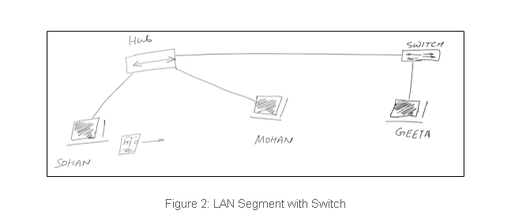

# Broadcast vs Collision Domain

Hoy hablemos de dos términos: dominio de transmisión y dominio de colisión. Estos dos se utilizan en exceso en el curso CCNA y comprenderlos ayudará a comprender por qué se utilizan enrutadores y conmutadores en una red. ¡Simple pero vale la pena leerlo!

**Dominio de transmisión:** un término de Ethernet utilizado para describir cuando un usuario está transmitiendo; todos los demás usuarios deben prestarle atención y procesarlo. Las retransmisiones en una red son útiles pero las retransmisiones excesivas (tormentas de retransmisiones) no son buenas para ninguna red.

**Dominio de colisión:** es un término de Ethernet que se utiliza para describir una configuración de red en la que un usuario envía tráfico y otros usuarios lo observan. Si dos usuarios envían tráfico simultáneamente, se produce una colisión y ambos usuarios necesitan retransmitir datos.

### Local Area Network

La Figura 1 muestra la configuración LAN básica utilizando el HUB. Puede ver que dos usuarios (Sohan y Mohan) están conectados a esto mediante un conjunto de cables. La siguiente red es un ejemplo de un dominio de colisión y un dominio de transmisión.

Para una red doméstica con pocos hosts, esto parece simple, pero la vida en una red grande (configuración empresarial) no es tan simple y necesita más configuración y configuración de seguridad para que todo funcione.

Figure 1: Basic LAN Setup

Cuando una red grande utiliza el Hub como agregado para la conectividad de múltiples usuarios, se crea un gran dominio de colisión y un dominio de transmisión, lo que no es bueno para la productividad del usuario. Con tantas transmisiones y colisiones, esta red no puede soportar la ejecución de las últimas aplicaciones transaccionales.

### Switch & Router Role

La Figura 2 muestra una LAN con un Switch agregado. Podemos decir que esta red tiene dos segmentos, uno con Hub y otro segmento son los usuarios conectados al conmutador. Cuando construimos una red usando conmutadores (capa 2), cada puerto representa un dominio de colisión separado en el conmutador. Significa que varios usuarios pueden enviar tráfico al mismo tiempo [más usuarios son productivos y agregan valor a la organización]. Desde el punto de vista de las redes, las redes conmutadas (donde se utilizan conmutadores) son menos ruidosas en comparación con las construidas con concentradores.

Entonces las cosas están mejor aquí. Por ejemplo, si Sohan está enviando tráfico, Mohan debe prestarle atención ya que ambos están en el mismo dominio de colisión [ambos están conectados al Hub]. Sin embargo, a Geeta no le importa: seguirá trabajando sin prestar atención a los datos enviados por Sohan. Sin embargo, si hay una transmisión de Sohan en la red, Mohan y Geeta deberán procesarla en este escenario, ya que todavía es un dominio de transmisión.

Broadcast Domains = 1

Figure 2: LAN Segment with Switch

Un dominio de difusión grande es un problema en cualquier red, ya que provoca una congestión innecesaria que puede sobrecargar nuestra red, lo que a su vez ralentiza a todos los usuarios de la red. Resaltemos algunas de las razones clave que añaden congestión a la red:

- Gran colisión o dominio de difusión con muchos hosts
- Transmisiones excesivas por dispositivos, incluido ARP
- Tráfico de multidifusión excesivo
- Mala conectividad al utilizar enlaces de bajo ancho de banda
- Agregar dispositivos tontos como Hub

La Figura 3 a continuación es una versión mejorada de la red en la Figura 2. Podemos ver claramente en la Figura 2 que Hub no crea un segmento, sino que conecta un segmento. Sin embargo, un conmutador crea un segmento en cada puerto conectado. Ambos conmutadores tienen 2 dominios de colisión cada uno y, cuando se introduce un enrutador en esta red, tenemos 2 dominios de transmisión. Los enrutadores de cualquier red crean segmentos en los que las transmisiones enviadas en un segmento no se reenvían a otro segmento. El enrutador también rompe el dominio de colisión. Por ejemplo, digamos que Sohan envía una transmisión, será procesada por todos los dispositivos en el interruptor izquierdo, incluido Mohan. Como el enrutador también está conectado a este conmutador, la interfaz del enrutador también recibe la transmisión, pero no se reenviará al conmutador del lado derecho.

Tenemos 4 dominios de colisión visibles y dos dominios de transmisión en la siguiente red.

Figure 3: Router Breaks Broadcast Domain

Nota: la red en la Figura 3 es solo para fines ilustrativos. Las LAN grandes no se construyen utilizando enrutadores. Generalmente, el enrutador se utiliza para construir la WAN (red de área amplia).

En la Figura 3, cada dispositivo está conectado a su propio dominio de colisión (cada puerto de conmutador = 1 dominio de colisión). Y el enrutador segmentó la red en dos dominios de transmisión. Entonces, a Geeta y Sita no les molesta el ruido creado por Sohan y Mohan, ya que ambos están en redes completamente diferentes.

El objetivo principal de utilizar conmutadores de capa 2 es hacer que una LAN funcione mejor, optimizar su rendimiento y proporcionar más ancho de banda (capacidad para enviar más datos entre hosts) a los dispositivos. Los conmutadores solo cambian tramas de un puerto a otro dentro de la red conmutada.