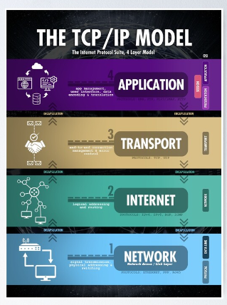

¿Alguna vez ha pensado en cómo los equipos de red de diferentes proveedores pueden comunicarse entre sí? Me refiero a que una computadora portátil de HP se conecta a un módem inalámbrico instalado por su proveedor de servicios de Internet fabricado por otra empresa.

Las redes funcionan perfectamente porque hablan el idioma común o siguen las mismas reglas. Estas reglas comunes se definen como estándares y protocolos. Estos estándares se definen como modelos de red. Puede considerar estos modelos como un modelo para diseñar la red. Diferentes empresas de redes siguen estos modelos durante el desarrollo de sus productos. Los dispositivos finales en una red funcionarán porque siguen el modelo o modelo de referencia estándar.

Espero que esté conmigo y tenga una idea amplia de por qué se requiere un modelo de red en el mundo real. Ahora hablemos del modelo de red TCP/IP. Es un modelo de red ampliamente utilizado.
# Modelo de red

El modelo de redes también se conoce como modelo de redes. Se puede decir que es un documento detallado que cubre todos los aspectos de la red. Puede pensar en el modelo de referencia como múltiples documentos planos que se utilizan al construir una casa.

Todos los que contribuyen a construir la casa con todas las facilidades, ya sea arquitecto, electricista, carpintero o plomero, se refieren al mismo documento para construir una casa como está descrita en el plano. De manera similar, el modelo de red divide las funciones en categorías más pequeñas llamadas capas. Cada capa contiene los protocolos y estándares relacionados.

Diferentes empresas construyen sus productos y siguen la capa respectiva. Garantiza que el producto recientemente desarrollado no cause ningún problema con la red que ya está en funcionamiento con otros dispositivos. Esto hace que su producto sea compatible con otros en el entorno de producción.

# Evolución del modelo de networking

Inicialmente, cuando no existía un modelo de red al que referirse, cada OEM tenía su propio modelo de red propietario. Aquí estoy hablando del escenario de los años 1970. Como puede imaginar, solía haber diferentes redes que hablaban con dispositivos de los mismos fabricantes de equipos originales. El equipo de la red solía gestionar esta red diferente por separado.

En la década de 1980, la Organización Internacional de Normalización (ISO) comenzó a trabajar en un proyecto para estandarizar los protocolos de red para permitir la interoperabilidad en todo el mundo. Este trabajo se conoce como modelo de red Open System Interconnect (OSI).

Paralelamente, de forma abierta y menos formal, neutral respecto a los proveedores, el Departamento de Defensa de Estados Unidos (DoD) inició el proyecto. Además, más investigadores voluntarios de varias universidades se unieron y contribuyeron a los esfuerzos del Departamento de Defensa, y se formó el modelo de red TCP/IP.

Inicialmente, las empresas utilizaban los protocolos OSI y TCP/IP juntos en el desarrollo de sus redes. Sin embargo, a finales de la década de 1990, TCP/IP dominó y se convirtió en la opción común.
### Modelo de red TCP/IP
El modelo de red TCP/IP define los protocolos en varias capas que permiten que los dispositivos se comuniquen. TCP/IP utiliza los documentos llamados Solicitud de comentarios. Estos documentos RFC destacan los protocolos y su implementación en detalle.

Cualquier dispositivo que esté encendido y conectado mediante el cable correcto a una red se comunicará con otros dispositivos en la red. Esto se debe a que la empresa que fabricó el dispositivo implementó la funcionalidad TCP/IP al construir el dispositivo.

TCP/IP divide las funciones de red en múltiples capas para comprender la función de red.

Las 2 capas superiores (Aplicación y Transporte) se centran en las aplicaciones que necesitan enviar y recibir datos. Las capas inferiores (red, enlace de datos y capa física) se centran en cómo transferir bits a través de enlaces individuales. En este enfoque por capas, cada capa proporciona los servicios a la capa justo encima.

**Capa de aplicación**: define protocolos que brindan servicios a las aplicaciones que se ejecutan en un dispositivo.

**Capa de transporte**: proporciona servicios a los protocolos de la capa de aplicación, como recuperación de errores, interacción de un extremo a otro en la misma capa, etc.

**Capa de red**: incluye un protocolo principal: Protocolo de Internet (IP). IP proporciona funciones como direccionamiento y enrutamiento de paquetes en una red.

**Enlace de datos y capa física**: ambos trabajan en estrecha colaboración y definen los protocolos y el hardware para entregar los datos a través de la red física. La capa física define el cableado y el flujo de energía a través del cable físico. Como sabe, la capa de red está más en el enrutamiento, la capa de red utiliza la información del enlace de datos para realizar el reenvío de paquetes al dispositivo del siguiente salto.

Espero que encuentres esto informativo. Nos vemos pronto con información detallada sobre el modelo de red TCP/IP.