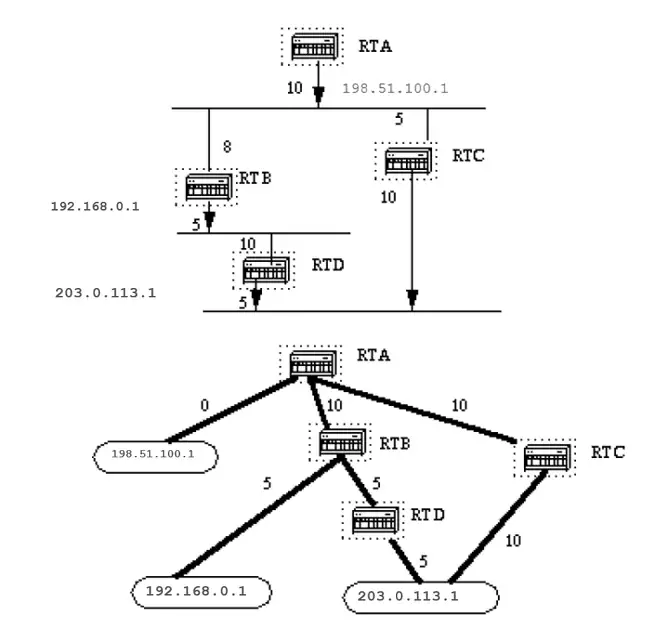

# Comprender Open Shortest Path First (OSPF): 

## Guía de diseño

### Introducción
Este documento describe cómo funciona OSPF y cómo se puede utilizar para diseñar y construir redes grandes y complicadas.
### Información de contexto
El protocolo Abrir primero la ruta más corta (OSPF), definido en RFC 2328, es un protocolo de puerta de enlace interior que se utiliza para distribuir información de enrutamiento dentro de un único sistema autónomo.

El protocolo OSPF se desarrolló debido a la necesidad de la comunidad de Internet de introducir un protocolo de puerta de enlace interno (IGP) no propietario y de alta funcionalidad para la familia de protocolos TCP/IP.

La discusión sobre la creación de un IGP interoperable común para Internet comenzó en 1988 y no se formalizó hasta 1991.

En ese momento, el Grupo de Trabajo de OSPF solicitó que se considerara a OSPF para avanzar al Borrador de Estándar de Internet.

El protocolo OSPF se basa en la tecnología de estado de enlace, que se aleja de los algoritmos basados en vectores de Bellman-Ford utilizados en los protocolos de enrutamiento de Internet tradicionales, como RIP.

OSPF ha introducido nuevos conceptos como autenticación de actualizaciones de enrutamiento, máscaras de subred de longitud variable (VLSM), resumen de rutas, etc.

Estos capítulos analizan la terminología y el algoritmo de OSPF y los beneficios y matices del protocolo en el diseño de las grandes y complicadas redes actuales.
### OSPF frente a RIP

El rápido crecimiento y expansión de las redes modernas ha llevado el protocolo de información de enrutamiento (RIP) a sus límites. RIP tiene ciertas limitaciones que pueden causar problemas en redes grandes:

- RIP tiene un límite de 15 saltos. Una red que abarca más de 15 saltos (15 enrutadores) se considera inalcanzable.
- RIP no puede manejar máscaras de subred de longitud variable (VLSM). Dada la escasez de direcciones IP y la flexibilidad que ofrece VLSM en la asignación eficiente de direcciones IP, esto se considera un defecto importante.
- 
Las transmisiones periódicas de la tabla de enrutamiento completa consumen una gran cantidad de ancho de banda. Este es un problema importante con las redes grandes, especialmente en enlaces lentos y nubes WAN.

- La convergencia de RIP es más lenta que OSPF. En redes grandes la convergencia llega a ser del orden de minutos.
- Los enrutadores RIP pasan por un período de retención y recolección de basura y lentamente agotan el tiempo de espera de la información que no se ha recibido recientemente. Esto no es apropiado en entornos grandes y podría provocar inconsistencias en el enrutamiento.
- RIP no tiene ningún concepto de retrasos en la red ni costos de enlace. Las decisiones de enrutamiento se basan en el número de saltos. Siempre se prefiere la ruta con el número de saltos más bajo hasta el destino, incluso si la ruta más larga tiene un mejor ancho de banda de enlace agregado y menos demoras.
- Las redes RIP son redes planas. No existe el concepto de áreas o límites. Con la introducción del enrutamiento sin clases y el uso inteligente de agregación y resumen, las redes RIP se han quedado atrás.

Se introdujeron mejoras en una nueva versión de RIP llamada RIP2. RIP2 aborda los problemas de VLSM, autenticación y actualizaciones de enrutamiento de multidifusión.

RIP2 no es una gran mejora con respecto a RIP (ahora llamado RIP1) porque todavía tiene las limitaciones de recuento de saltos y convergencia lenta que son esenciales en redes grandes.

OSPF, por otro lado, aborda la mayoría de los problemas presentados anteriormente:

- Con OSPF, no hay limitación en el recuento de saltos.
- El uso inteligente de VLSM es muy útil en la asignación de direcciones IP.
- OSPF utiliza multidifusión de IP para enviar actualizaciones del estado del enlace. Esto garantiza un menor consumo de recursos de proceso en enrutadores que no escuchan paquetes OSPF. Las actualizaciones solo se envían en caso de que se produzcan cambios de ruta en lugar de periódicamente. Esto garantiza un ancho de banda eficiente.
- OSPF tiene mejor convergencia que RIP. Esto se debe a que los cambios de ruta se propagan instantáneamente y no periódicamente.
- OSPF permite un mejor equilibrio de carga.
- OSPF permite una definición lógica de redes donde los enrutadores se pueden dividir en áreas. Esto limita la explosión de actualizaciones del estado de los enlaces en toda la red. Esto también proporciona un mecanismo para agregar rutas y disminuir la propagación innecesaria de información de subred.
- OSPF permite enrutar la autenticación a través de diferentes métodos de autenticación de contraseña.
- OSPF permite la transferencia y etiquetado de rutas externas inyectadas en un Sistema Autónomo. Esto realiza un seguimiento de las rutas externas inyectadas por protocolos exteriores como BGP.
Esto conduce a una mayor complejidad en la configuración y resolución de problemas de las redes OSPF.

Los administradores que están acostumbrados a la simplicidad de RIP enfrentan el desafío de la cantidad de información nueva que deben aprender para mantenerse al día con las redes OSPF.

Esto introduce una mayor sobrecarga en la asignación de memoria y la utilización de la CPU. Algunos de los enrutadores que ejecutan RIP deben actualizarse para poder manejar la sobrecarga causada por OSPF.
### ¿Qué queremos decir con estados de enlace?

OSPF es un protocolo de estado de enlace. Piense en un enlace como una interfaz en el enrutador. El estado del enlace es una descripción de esa interfaz y de su relación con sus enrutadores vecinos.

Una descripción de la interfaz incluiría, por ejemplo, la dirección IP de la interfaz, la máscara, el tipo de red a la que está conectada, los enrutadores conectados a esa red, etc.

La colección de todos estos estados de enlace formaría una base de datos de estados de enlace.
### Primer algoritmo del camino más corto

OSPF utiliza un algoritmo de ruta más corta primero para construir y calcular la ruta más corta a todos los destinos. El camino más corto se calcula con el algoritmo de Dijkstra.
El algoritmo por sí solo es complicado. Esta es una mirada de alto nivel a los distintos pasos del algoritmo:
1. Tras la inicialización o debido a cualquier cambio en la información de enrutamiento, un enrutador genera un anuncio de estado de enlace. Este anuncio representa la colección de todos los estados de enlace en ese enrutador.
2. Todos los enrutadores intercambian estados de enlace mediante inundaciones. Cada enrutador que recibe una actualización del estado del enlace debe almacenar una copia en su base de datos del estado del enlace y luego propagar la actualización a otros enrutadores.
3. Una vez completada la base de datos de cada enrutador, el enrutador calcula un árbol de ruta más corta a todos los destinos. El enrutador utiliza el algoritmo de Dijkstra para calcular el árbol de ruta más corto, los destinos, el costo asociado y el siguiente salto para llegar a esos destinos desde la tabla de enrutamiento IP.
4. En caso de que no se produzcan cambios en la red OSPF, como el costo de un enlace o una red que se agrega o elimina, OSPF permanece muy silencioso. Los cambios se comunican a través de paquetes de estado de enlace y el algoritmo de Dijkstra se recalcula para encontrar la ruta más corta.
El algoritmo coloca cada enrutador en la raíz de un árbol y calcula la ruta más corta a cada destino en función del costo acumulado requerido para llegar a ese destino.

Cada enrutador tiene su propia vista de la topología, aunque todos los enrutadores crean un árbol de ruta más corta que utiliza la misma base de datos de estado de enlace. Estas secciones indican lo que implica la creación de un árbol de ruta más corta.
### Costo OSPF

El costo (también llamado métrica) de una interfaz en OSPF es una indicación de la sobrecarga requerida para enviar paquetes a través de una determinada interfaz.

El costo de una interfaz es inversamente proporcional al ancho de banda de esa interfaz. Un mayor ancho de banda indica un menor costo

Hay más gastos generales (mayor costo) y demoras de tiempo involucradas a través de una línea serial de 56k que a través de una línea Ethernet de 10M.

La fórmula utilizada para calcular el costo es:
- costo= 10000 0000/ancho de banda en bps

Por ejemplo, cuesta 10 EXP8/10 EXP7 = 10 cruzar una línea Ethernet de 10M y 10 EXP8/1544000 = 64 cruzar una línea T1.

De forma predeterminada, el coste de una interfaz se calcula en función del ancho de banda; puede forzar el costo de una interfaz con el comando del modo de subconfiguración de la interfaz ip ospf cost `<value>`.
### Árbol de camino mas corto

Consulte este diagrama de red con los costos de interfaz indicados. Para construir el árbol de ruta más corta para RTA, tendríamos que hacer de RTA la raíz del árbol y calcular el costo más pequeño para cada destino.



Esta es la vista de la red tal como se ve desde RTA. Tenga en cuenta la dirección de las flechas al calcular el costo.
El costo de la interfaz de RTB a la red 198.51.100.1 no es relevante cuando el costo se calcula en 192.168.0.1.
RTA puede llegar a 192.168.0.1 vía RTB con un costo de 15 (10+5).
RTA también puede llegar a 203.0.113.1 por medio de RTC con un costo de 20 (10+10) o por medio de RTB con un costo de 20 (10+5+5).
En caso de que existan rutas de igual costo al mismo destino, la implementación de OSPF realiza un seguimiento de hasta seis (6) saltos próximos al mismo destino.

Después de que el router crea el árbol de ruta más corta, genera la tabla de routing. Las redes conectadas directamente se alcanzan por medio de una métrica (costo) de 0 y otras redes se alcanzan según el costo calculado en el árbol.
## Routers de área y de borde

Como se mencionó anteriormente, OSPF utiliza la saturación para intercambiar las actualizaciones de estado de los enlaces entre los routers. Cualquier cambio de la información de ruteo se distribuye a todos los routers en la red.

Las áreas se introducen para que pongan un límite en la explosión de actualizaciones de estado de link. La saturación y el cálculo del algoritmo Dijkstra en un router se limitan a los cambios dentro de un área.

Todos los routers dentro de un área tienen la base de datos de estado de link exacta. Los routers que corresponden a varias áreas y conectan estas áreas al área de estructura básica se denominan routers de borde (ABR).

Por lo tanto, los ABR deben mantener información que describa las áreas troncales y las otras áreas asociadas.


Un área es específica de la interfaz. Un router que tiene todas sus interfaces dentro de la misma área se denomina router interno (IR).

Un router que tiene interfaces en varias áreas se denomina router de borde de área (ABR).

Los routers que actúan como puertas de enlace (redistribución) entre los protocolos OSPF y otros protocolos de ruteo (IGRP, EIGRP, IS-IS, RIP, BGP, estático) u otras instancias de proceso de ruteo OSPF, se denominan routers de margen de sistema autónomo (ASBR). Cualquier router puede ser un ABR o un ASBR.
## Paquetes de estado de link

Existen diferentes tipos de paquetes de estado de enlace que son los que normalmente se ven en una base de datos de OSPF (Apéndice A e ilustrados aquí).


Los enlaces del router son una indicación del estado de las interfaces en un router que pertenece a un área designada. Cada router genera un enlace de router para todas sus interfaces.

Los ABR generan enlaces de resumen; es así como la información de alcance de la red se disemina entre las áreas.

Por lo general, toda la información se inserta en la red troncal (área 0) y esta red la pasa a otras áreas.

Los ABR también propagan el alcance de ASBR. Así es como los routers saben la forma de llegar a rutas externas en otros AS.

Un router designado (DR) genera los enlaces de redes en un segmento (los DR se tratan más adelante).  

Esta información es una muestra de todos los routers conectados a un segmento de acceso múltiple en particular como Ethernet, Token Ring y FDDI (también NBMA)

Los links externos indicar redes fuera de AS. Estas redes se inyectan en OSPF mediante la redistribución. ASBR inserta estas rutas en un sistema autónomo.

## Habilitación de OSPF en el router

La habilitación de OSPF en el router comprende dos pasos en el modo de configuración:

 - Habilite un proceso OSPF con el `router ospf <process-id>` comando. - Asignación de área a las interfaces con el `network <network or IP address> <mask> <area-id>` comando.  

  El ID del proceso OSPF es un valor numérico local en el router. No tiene que coincidir con las id del proceso en otros routers.  

  Es posible ejecutar varios procesos OSPF en el mismo router, pero no se recomienda dado que crea múltiples instancias de base de datos que agregan una sobrecarga adicional al router.  

   El `network` comando es un método de asignación de una interfaz a un área determinada. La máscara se utiliza como acceso directo y coloca una lista de interfaces en la misma área con una línea de configuración.   

  La máscara contiene bits comodines: 0 es una coincidencia y 1 es un bit de "no preocuparse"; por ejemplo, 0.0.255.255 indica una coincidencia en los dos primeros bytes del número de red.  

  El ID de área es el número de área en el que queremos que esté la interfaz. El id de área puede ser un número entero entre 0 y 4294967295 o puede tomar una forma similar a una dirección de IP A.B.C.D.  

Aquí tiene un ejemplo:


```
RTA# interface Ethernet0 
ip address 192.168.0.2 255.255.255.0 
interface Ethernet1 
ip address 192.168.0.5 255.255.255.0 
interface Ethernet2 
ip address 192.168.0.3 255.255.255.0 
router ospf 100 
network 192.168.0.4 0.0.255.255 area 0.0.0.0 
network 192.168.0.3 0.0.0.0 area 23
```

  La primera sentencia de red coloca a E0 y E1 en la misma área 0.0.0.0, y la segunda sentencia de red coloca a E2 en el área 23. Observe la máscara 0.0.0.0, que indica una concordancia total en la dirección IP.  

  Esta es una forma sencilla de colocar una interfaz en un área determinada si no puede resolver una máscara.  
##   Autenticación OSPF  

  Es posible autenticar los paquetes OSPF para que los routers puedan participar en los dominios de ruteo en función de contraseñas predefinidas.  

   De forma predeterminada, un router utiliza un valor Null de autenticación, lo que significa que los intercambios de ruteo en una red no están autenticados. Existen otros dos métodos de autenticación: autenticación y **Message Digest** autenticación de contraseña simple (MD-5).   

###   Autenticación simple mediante contraseña  

  La autenticación simple de contraseña permite que se configure una contraseña (clave) por área. Los routers de la misma área que desean participar en el dominio de routing deben configurarse con la misma clave.  

  La desventaja de este método es que es vulnerable a los ataques pasivos. Cualquier persona que tenga un analizador de link podría obtener la contraseña desde el cable fácilmente.  

  Para habilitar la autenticación de la contraseña, utilice estos comandos:  

   - **ip ospf authentication-key key** (esto va bajo la interfaz específica) 
   -  **area area-id authentication** (esto pasa por debajo `router ospf <process-id>`)     

  Aquí tiene un ejemplo:  

```
interface Ethernet0 
ip address 10.0.0.1 255.255.255.0 
ip ospf authentication-key mypassword 
router ospf 10 
network 10.0.0.0 0.0.255.255 area 0 
area 0 authentication
```
###   Autenticación del resumen de mensaje  

  La autenticación de Digest de mensaje es una autenticación criptográfica. Se configura una clave (contraseña) y un ID de clave en cada router.  

  El router utiliza un algoritmo basado en el paquete OSPF, en la clave y en la identificación de clave para generar "un resumen de mensaje" que se agrega al paquete.  

  A diferencia de la autenticación simple, la clave no se intercambia a través del cable. También se incluye un número de secuencia no decreciente en cada paquete OSPF para protegerlo contra los ataques de repetición.  

  Este método también permite transiciones ininterrumpidas entre las claves. Esto resulta útil para los administradores que desean cambiar la contraseña de OSPF sin interrumpir la comunicación.  

  Si se configura una interfaz con una clave nueva, el router envía copias múltiples del mismo paquete, cada una autenticada por claves diferentes.  

  El router no envía paquetes duplicados cuando detecta que todos sus vecinos han adoptado la nueva clave.  

  Estos son los comandos utilizados para la autenticación del resumen del mensaje:  

   - **ip ospf message-digest-key keyid md5 key** (se utiliza en la interfaz)
   -  **area area-id authentication message-digest** (se utiliza en `router ospf <process-id>`)     

  Aquí tiene un ejemplo:  

```
interface Ethernet0 
ip address 10.0.0.1 255.255.255.0 
ip ospf message-digest-key 10 md5 mypassword 
router ospf 10 
network 10.0.0.0 0.0.255.255 area 0 
area 0 authentication 
message-digest 
```
##   La estructura básica y área 0  

  OSPF tiene limitaciones especiales cuando se trata de áreas múltiples. Si se configura más de un área, una de ellas tiene que ser el área 0. A esto se le llama la estructura básica.  

  Una buena práctica de diseño de red es comenzar con el área 0 y, luego, expandirse hacia las otras áreas.  

  La red troncal debe estar en el centro de todas las demás áreas; es decir, todas las áreas deben estar conectadas físicamente a la red troncal.  

  La razón es que OSPF espera que todas las áreas inserten información de routing en la red troncal y que, en respuesta, esta disemine la información a las otras áreas.  

  Este diagrama ilustra el flujo de información en una red de OSPF:  

  

  En este diagrama, todas las áreas están conectadas directamente a la red troncal. En el improbable caso de que se introduzca una nueva área que no pueda tener acceso físico directo a la red troncal, se debe configurar un enlace virtual.  

  Los enlaces virtuales se analizan en la próxima sección. Observe los distintos tipos de información de ruteo. Las rutas que se generan desde el interior de un área (el destino pertenece al área) se llaman **rutas dentro del área**.  

   Estas rutas se representan normalmente con la letra **O en la tabla de IP Routing.** Las rutas que se originan en otras áreas se llaman  **inter-area** o **Summary routes**.    

   La anotación de estas reglas es **O IA en la tabla de IP Routing.** Las rutas que se originan desde otros protocolos de ruteo (o diferentes procesos OSPF) y que se inyectan en OSPF mediante la redistribución se llaman **external routes**.   

   En la tabla de IP Routing, estas rutas están representadas por **O E2 u O E1.** Se prefieren varias rutas al mismo destino en este orden: **intra-area, inter-area, external E1, external E2**. Los tipos externos E1 y E2 se explicarán luego.   

##   links virtuales  

  Los links virtuales se utilizan para dos propósitos:  

  - Para un área que no tiene una conexión física con la red troncal - Para emparchar la red troncal en caso de que se produzca una discontinuidad del área 0  
###   Áreas no conectadas físicamente al área 0  

  Como se mencionó anteriormente, el área 0 debe estar en el centro de todas las demás áreas. En algunos casos extraños, en que es imposible tener un área físicamente conectada con la estructura básica, se utiliza un link virtual.  

  El enlace virtual suministra al área desconectada una ruta lógica a la red troncal. El link virtual tiene que establecerse entre dos ABR que tengan una área común, con un ABR conectado a la estructura básica.  

  

  En este ejemplo, el área 1 no tiene una conexión física directa al área 0. Debe configurarse un link virtual entre RTA y RTB. El área 2 se utilizará como un área de tránsito y RTB es el punto de entrada en el área 0.  

   De esta manera, RTA y el área 1 tienen una conexión lógica con la red troncal. Para configurar un link virtual, utilice el subcomando OSPF del `area <area-id> virtual-link <RID>` router tanto en el RTA como en el RTB, donde area-id es el área de tránsito.   

  En el diagrama, es el área 2. RID es la ID del router. La ID del router de OSPF suele ser la dirección IP más alta del cuadro o la dirección de loopback más alta, si existe.  

   El ID del router sólo se calcula en el momento del inicio. Para encontrar el ID del router, utilice el **show ip ospf interface** comando.   

  Tenga en cuenta que 10.0.0.11 y 10.0.0.22 son las respectivas RID de RTA y RTB; la configuración de OSPF para ambos routers sería la siguiente:  

```
RTA# router ospf 10 area 2 virtual-link 10.0.0.22 
RTB# router ospf 10 area 2 virtual-link 10.0.0.11
```
###   Red troncal  

  OSPF permite el enlace de partes discontinuas de la red troncal mediante un enlace virtual. En algunos casos, es necesario conectar distintas áreas 0.  

  Esto puede ocurrir si, por ejemplo, una empresa intenta combinar dos redes de OSPF separadas en una red con un área común 0. En otros casos, se agregan links virtuales para redundancia por si alguna falla del router divide la estructura básica en dos.  

  Un enlace virtual se puede configurar entre ABR separados que entran en contacto con el área 0 desde cada lado y comparten un área en común (ilustrada aquí).  

  

  En este diagrama, dos áreas 0 están conectadas entre sí a través de un enlace virtual. En el caso de que un área común no exista, se podría crear un área adicional; por ejemplo el área 3, para que funcione como área de tránsito.  

  Si un área diferente de la red troncal se divide en particiones, la red troncal se ocupa de la tarea de partición sin utilizar ningún enlace virtual.  

  Una parte del área dividida conoce la otra parte a través de rutas entre áreas en lugar de rutas dentro del área.  
##   Vecinos  

  Los routers que comparten un segmento común se convierten en vecinos en ese segmento. Los vecinos son elegidos a través del protocolo de saludo. **Los paquetes de saludo** se envían periódicamente desde cada interfaz mediante la multidifusión IP (Apéndice B).  

  Los routers se convierten en vecinos apenas se detectan dentro del paquete de saludo del vecino. De esta manera, se garantiza una comunicación bidireccional. La negociación entre vecinos se aplica sólo a la dirección primaria.  

  Las direcciones secundarias se pueden configurar en una interfaz con la restricción de que deben pertenecer a la misma área que la dirección primaria.  

  Dos routers no se convierten en vecinos a menos que coincidan con este criterio.  

   - **Area-id:** Dos routers que tienen un segmento común; sus interfaces deben pertenecer a la misma área en ese segmento. Las interfaces deben pertenecer a la misma subred y tener una máscara similar.  
   - **Authentication:** OSPF permite la configuración de una contraseña para un área específica. Los routers que quieren convertirse en vecinos tienen que intercambiar la misma contraseña en un segmento determinado. 
   -  **Hello and Dead Intervals:** OSPF intercambia **Hello** paquetes en cada segmento. Esta es una forma de keepalive que los routers utilizan para reconocer su existencia en un segmento y para elegir un router designado (DR) en segmentos de acceso múltiple.      

   El  **Hello** intervalo especifica el tiempo, en segundos, entre los **Hello** paquetes que un router envía en una interfaz OSPF.    

   El intervalo muerto es el número de segundos que no se han visto los **Hello** paquetes de un router antes de que sus vecinos declaren que el router OSPF está inactivo.   

   - El OSPF requiere que estos intervalos sean exactamente los mismos entre dos vecinos. Si cualquiera de estos intervalos es diferente, estos routers no se convierten en vecinos en un segmento particular. Los comandos de interfaz del router utilizados para establecer estos temporizadores son:  **ip ospf hello-interval seconds** y **ip ospf dead-interval seconds**.   -  **Stub area flag:** Dos routers también tienen que acordar el indicador de área stub en los **Hello** paquetes para convertirse en vecinos. Las áreas de rutas internas se tratarán en una sección posterior. Tenga en cuenta que la definición de áreas de rutas internas afecta el proceso de elección de vecinos.      
##   Adyacencias  

   La adyacencia es el siguiente paso luego del proceso de establecimiento de vecinos. Los routers adyacentes son routers que van más allá del simple **Hello** intercambio y continúan con el proceso de intercambio de bases de datos.   

  Para reducir la cantidad de intercambio de información en un segmento determinado, OSPF selecciona un router como Router designado (DR) y un router como Router designado de respaldo (BDR) en cada segmento de acceso múltiple.  

  Se elige el BDR como mecanismo de respaldo en caso de que falle el DR. La idea detrás de esto es que los routers tienen un punto central de contacto para el intercambio de la información.  

  En lugar de intercambiar actualizaciones con cada router que pertenezca al segmento, todos los routers intercambian información con el DR y BDR.  

  El DR y BDR transmiten la información al resto. En términos matemáticos, esto cancela el intercambio de información de O(n*n) a O(n), donde n es el número de routers en un segmento de acceso múltiple.  

  Este modelo de router ilustra el DR y BDR:  

  

   En este diagrama, todos los routers comparten un segmento de acceso múltiple común. Debido al intercambio de **Hello** paquetes, un router es elegido DR y otro es elegido BDR.   

  Cada router perteneciente al segmento (que ya se haya convertido en vecino) intenta establecer una adyacencia con el DR y BDR.  
###   Elección DR  

   La elección de DR y BDR se realiza a través del  **Hello** protocolo. Los **Hello** paquetes se intercambian a través de paquetes de multidifusión IP (apéndice B) en cada segmento.    

  El router con la prioridad de OSPF más alta en un segmento se convierte en el DR para dicho segmento. El mismo proceso se repite para BDR. En caso de empate, gana el router con la RID más alta.  

   El valor predeterminado para la prioridad de interfaz OSPF es uno. Recuerde que los conceptos DR y BDR son para cada segmento de acceso múltiple. El valor de prioridad OSPF en una interfaz se realiza con el comando `ip ospf priority <value> interface`.   

  Un valor 0 de prioridad señala una interfaz que no debe elegirse como DR o BDR. El estado de la interfaz con prioridad cero será **DROTHER**. Esto ilustra la elección del DR:  

  

  En este diagrama, RTA y RTB tienen la misma prioridad de interfaz, pero RTB tiene una RID mayor. RTB sería DR en ese segmento. RTC tiene mayor prioridad que RTB. RTC es DR en ese segmento.  
###   Creación de la adyacencia  

  El proceso de creación de la adyacencia tiene efecto después de que se han completado varias etapas. Los routers adyacentes tendrán la misma base de datos de estados de enlace.  

  Este es un resumen de los estados por los que pasa una interfaz antes de tornarse adyacente a otro router:  

  - **Inactiva:** no se ha recibido información de ningún componente del segmento. 
  - **Intento:** en las nubes de acceso múltiple sin difusión, como **Frame Relay** y X.25, este estado indica que no se ha recibido ninguna información reciente del vecino. Para contactar al vecino, envíe paquetes de **saludo** en el intervalo de sondeo de velocidad reducida. 
  - **Inicialización:** la interfaz ha detectado un paquete de **saludo** proveniente de un vecino, pero aún no se ha establecido la comunicación bidireccional. 
  - **Dos vías:** hay comunicación bidireccional con un vecino. El router se ha visto a sí mismo en los paquetes de **saludo** provenientes de un vecino. Al final de esta etapa, se habría realizado la elección del DR y el BDR. Al final de la etapa de dos vías, los routers deciden si proceden a crear una adyacencia. La decisión depende de si uno de los routers es un DR o un BDR o si el link es un link virtual o punto a punto. 
  - **Inicio de intercambio:** los routers tratan de establecer el número de secuencia inicial que se usará en los paquetes de intercambio de información. La secuencia numérica asegura que los routers siempre reciban la información más reciente. Un router se convierte en primario y el otro en secundario. El router primario consulta la información al router secundario. - **Intercambio:** los routers describen sus bases de datos de estados de enlace completas a través de los paquetes de descripción de las bases de datos enviados. En este estado, los paquetes se podrían distribuir en forma de inundaciones a otras interfaces del router. 
  - **Carga:** en este estado, los routers finalizan el intercambio de información. Los routers han creado una lista de peticiones de estado de link y una lista de retransmisión de estado de link. Toda la información que parezca incompleta o desactualizada se coloca en la lista de solicitud. Las actualizaciones se colocan en la lista de retransmisión hasta que sean reconocidas. 
  - **Completo:** en este estado, la adyacencia se ha completado. Los routers vecinos son completamente adyacentes. Los routers adyacentes tienen una base de datos de estados de enlace similar.  

  Aquí tiene un ejemplo:  

  

  RTA, RTB, RTD y RTF tienen un segmento en común (E0) en el área 0.0.0.0. Estas son las configuraciones de RTA y RTF: RTB y RTD deben tener una configuración similar a RTF y no se incluyen.  
  
```
RTA# hostname RTA 
interface Loopback0 
ip address 203.0.113.41 255.255.255.0 
interface Ethernet0 
ip address 203.0.113.141 255.255.255.0 
router ospf 10 
network 203.0.113.41 0.0.0.0 area 1 
network 203.0.113.100 0.0.255.255 area 0.0.0.0 

RTF# hostname RTF 
interface Ethernet0 
ip address 203.0.113.142 255.255.255.0 
router ospf 10 
network 203.0.113.100 0.0.255.255 area 0.0.0.0 
```

  Este es un ejemplo simple que demuestra un par de comandos que son muy útiles para depurar las redes de OSPF.  

  - `show ip ospf interface <interface>`

  Este comando es una verificación rápida para determinar si todas las interfaces pertenecen a las áreas en las que deben estar. La secuencia en la que son listados los comandos de red OSPF es muy importante.  

  En la configuración de RTA, si la instrucción `network 203.0.113.100 0.0.255.255 area 0.0.0.0` se colocara antes de la instrucción `network 203.0.113.41 0.0.0.0 area 1`, todas las interfaces estarían en el área 0, lo que es incorrecto porque el loopback está en el área 1.  

  Este es el resultado del comando en RTA, RTF, RTB y RTD:  

```
RTA#show ip ospf interface e0 
Ethernet0 is up, line protocol is up 
Internet Address 203.0.113.141 255.255.255.0, Area 0.0.0.0 
Process ID 10, Router ID 203.0.113.41, Network Type BROADCAST, Cost: 10 Transmit Delay is 1 sec, State BDR, Priority 1 
Designated Router (ID) 203.0.113.151, Interface address 203.0.113.142 
Backup Designated router (ID) 203.0.113.41, Interface address 203.0.113.141 
Timer intervals configured, Hello 10, Dead 40, Wait 40, Retransmit 5 Hello due in 0:00:02 
Neighbor Count is 3, Adjacent 
neighbor count is 3 Adjacent with neighbor 203.0.113.151 (Designated Router) Loopback0 is up, line protocol is up 
Internet Address 203.0.113.41 255.255.255.255, Area 1 Process ID 10, Router ID 203.0.113.41, Network Type LOOPBACK, Cost: 1 
Loopback interface is treated as a stub Host 

RTF#show ip ospf interface e0 
Ethernet0 is up, line protocol is up 
Internet Address 203.0.113.142 255.255.255.0, Area 0.0.0.0 
Process ID 10, Router ID 203.0.113.151, Network Type BROADCAST, Cost: 10 Transmit Delay is 1 sec, State DR, Priority 1 
Designated Router (ID) 203.0.113.151, Interface address 203.0.113.142 Backup 
Designated router (ID) 203.0.113.41, Interface address 203.0.113.141 
Timer intervals configured, Hello 10, Dead 40, Wait 40, Retransmit 5 Hello due in 0:00:08 
Neighbor Count is 3, Adjacent 
neighbor count is 3 Adjacent with neighbor 203.0.113.41 (Backup Designated Router) 

RTD#show ip ospf interface e0 
Ethernet0 is up, line protocol is up 
Internet Address 203.0.113.144 255.255.255.0, Area 0.0.0.0 
Process ID 10, Router ID 192.0.2.174, Network Type BROADCAST, Cost: 10 Transmit Delay is 1 sec, State DROTHER, Priority 1 
Designated Router (ID) 203.0.113.151, Interface address 203.0.113.142 Backup
Designated router (ID) 203.0.113.41, Interface address 203.0.113.141 
Timer intervals configured, Hello 10, Dead 40, Wait 40, Retransmit 5 Hello due in 0:00:03 Neighbor 
Count is 3, Adjacent neighbor count is 2  
Adjacent with neighbor 203.0.113.151 (Designated Router) 
Adjacent with neighbor 203.0.113.41 (Backup Designated Router) 

RTB#show ip ospf interface e0 
Ethernet0 is up, line protocol is up 
Internet Address 203.0.113.143 255.255.255.0, Area 0.0.0.0 
Process ID 10, Router ID 203.0.113.121, Network Type BROADCAST, Cost: 10 Transmit Delay is 1 sec, State DROTHER, Priority 1 
Designated Router (ID) 203.0.113.151, Interface address 203.0.113.142 Backup 
Designated router (ID) 203.0.113.41, Interface address 203.0.113.141 
Timer intervals configured, Hello 10, Dead 40, Wait 40, Retransmit 5 Hello due in 0:00:03 Neighbor Count is 3, Adjacent neighbor count is 2 Adjacent with neighbor 203.0.113.151 (Designated Router) 
Adjacent with neighbor 203.0.113.41 (Backup Designated Router)
```

  El resultado muestra información muy importante. En el resultado de RTA, Ethernet 0 se encuentra en el área 0.0.0.0. La ID del proceso es 10 (router ospf 10) y la ID del router es 203.0.113.41.  

  Recuerde que el RID es la dirección IP más alta del cuadro o la interfaz del loopback, calculada durante el arranque o al reiniciarse el proceso OSPF.  

  El estado de la interfaz es BDR. Dado que todos los routers tienen la misma prioridad de OSPF en Ethernet 0 (el valor predeterminado es 1), la interfaz de RTF se seleccionó como DR debido a la RID más alta.  

  De la misma forma, RTA se seleccionó como BDR. El RTD y el RTB no son ni un DR ni BDR y su estado es DROTHER.  

  Observe la cantidad de vecinos y la cantidad de vecinos adyacentes. RTD tiene tres vecinos y es adyacente a dos de ellos, el DR y el BDR. RTF posee tres vecinos y está adyacente a todos ellos porque es el DR.  

  La información acerca del tipo de red es importante y determina el estado de la interfaz. En redes de difusión como Ethernet, la elección del DR y BDR debería ser irrelevante para el usuario final.  

  No debería importar quiénes son los DR o BDR. En otros casos, tales como medios NBMA como Frame Relay y X.25, esto es muy importante para que OSPF funcione correctamente.  

  Con la introducción de las subinterfaces de punto a punto y punto a multipunto, la elección del DR ya no es un problema. OSPF por NBMA se analiza en la siguiente sección.  

  Otro comando que debemos tener en cuenta es:  

  - `show ip ospf neighbor`   

  Echemos un vistazo al resultado de RTD:  

```
RTD#show ip ospf neighbor 
Neighbor ID Pri State Dead 
Time Address Interface 203.0.113.121 1 2WAY/DROTHER 0:00:37 203.0.113.143 
Ethernet0 203.0.113.151 1 FULL/DR 0:00:36 203.0.113.142 
Ethernet0 203.0.113.41 1 FULL/BDR 0:00:34 203.0.113.141 
Ethernet0
```

   El `show ip ospf neighbor` comando muestra el estado de todos los vecinos en un segmento determinado. No se alarme si la **ID de vecino** no pertenece al segmento que está mirando.   

  En nuestro caso 203.0.113.121 y 203.0.113.151 no están en Ethernet0. De hecho, la **ID de vecino** es la RID que podría ser cualquier dirección IP en el cuadro.  

  RTD y RTB son solo vecinos, motivo por el cual el estado es 2WAY/DROTHER. RTD es adyacente a RTA y RTF y el estado es FULL/DR y FULL/BDR.  
###   Adyacencias en interfaces punto-a-punto  

  OSPF siempre forma una adyacencia con el vecino del otro lado de una interfaz de punto a punto tal como las líneas seriales de punto a punto. No existe ningún concepto de DR o BDR. El estado de las interfaces seriales es punto a punto.  
###   Adyacencias en redes de Acceso múltiple sin difusión (NBMA)  

  Se debe tener especial cuidado con la configuración de OSPF en medios de acceso múltiple que no son de difusión, como Frame Relay, X.25, ATM. El protocolo considera estos medios como cualquier otro medio de broadcast como Ethernet.  

  Las nubes de NBMA generalmente se incorporan a la topología eje de conexión y radio. Los PVC o SVC están dispuestos en una malla parcial y la topología física no proporciona el acceso múltiple que OSPF puede detectar.  

  La selección del DR se convierte en un problema debido a que el DR y el BDR necesitan tener una conectividad física total con todos los routers existentes en la nube.  

  Dada la ausencia de capacidades de difusión, el DR y BDR necesitan tener una lista estática de todos los routers conectados a la nube.  

   Esto se logra con el `neighbor ip-address [priority number] [poll-interval seconds]` comando, donde `ip-address` y `priority` son la dirección IP y la prioridad OSPF dada al vecino.   

  Un vecino con prioridad 0 se considera que no reúne las condiciones para la elección de DR. `poll-interval` es el tiempo que espera una interfaz de NBMA antes de sondear (enviar un mensaje de **saludo**) a un vecino aparentemente inactivo.  

   El **neighbor** comando se aplica a los routers con potencial DR o BDR (la prioridad de la interfaz no es igual a 0). Esto muestra un diagrama de red donde la selección del DR es muy importante:   

    

  En este diagrama, es esencial que la interfaz de RTA con la nube se elija como DR. Esto se debe a que RTA es el único router que tiene conectividad total con otros routers.  

  La elección del DR podría estar influenciada por el parámetro de prioridad ospf en las interfaces. Los routers que no necesitan convertirse en DR o BDR tienen una prioridad de 0; otros routers podrían tener una prioridad más baja.  

   El **neighbor** comando no se trata en profundidad en este documento y se vuelve obsoleto a través del nuevo tipo de red de interfaz, independientemente del medio físico subyacente. Esto se explica en la siguiente sección.   
##   Cómo evitar los DR y el comando neighbor en las NBMA  

  Pueden utilizarse distintos métodos para evitar las complicaciones de la configuración de vecinos estáticos y routers específicos que se convierten en DR o BDR en la nube sin difusión.  

  Qué método específico usar depende de si estamos diseñando una red desde cero o si estamos corrigiendo un diseño ya existente.  
###   Subinterfaces punto a punto  

  Una subinterfaz es una manera lógica de definir una interfaz. Es posible dividir una misma interfaz física en varias interfaces lógicas con cada una de las subinterfaces definidas como de punto a punto.  

  Originalmente, esto se creó para gestionar mejor los problemas ocasionados por un split horizon entre NBMA y protocolos de ruteo basados en vectores.  

  Una subinterfaz punto a punto tiene las propiedades de cualquier interfaz punto a punto física. En lo que respecta a OSPF, una adyacencia siempre se forma sobre una subinterfaz punto a punto sin elección de DR ni BDR.  

  Esta es una imagen de las subinterfaces de punto a punto:  

  

  En este diagrama, en RTA, podemos dividir Serial 0 en dos subinterfaces de punto a punto: S0.1 y S0.2. De esta manera, OSPF toma la nube como un conjunto de enlaces de punto a punto y no como una red de acceso múltiple.  

  El único inconveniente del punto a punto es que cada segmento pertenece a una subred diferente. Esto es inaceptable porque algunos administradores ya han asignado una subred IP para la nube completa.  

  Otra solución alternativa es utilizar las interfaces sin numerar de IP en la nube. Esto podría ser un problema también para los administradores que administran la WAN basándose en las direcciones IP de las líneas seriales. Esta es una configuración típica para RTA y RTB:  

```
RTA# interface Serial 0 
no ip address 
encapsulation frame-relay 
interface Serial0.1 
point-to-point 
ip address 198.51.100.36 255.255.252.0 
frame-relay 
interface-dlci 20 
interface Serial0.2 
point-to-point 
ip address 198.51.100.46 255.255.252.0 
frame-relay 
interface-dlci 30 
router ospf 10 
network 198.51.100.1 0.0.255.255 area 1 

RTB# interface Serial 0 
no ip address 
encapsulation frame-relay 
interface Serial0.1 
point-to-point 
ip address 198.51.100.35 255.255.252.0 
frame-relay 
interface-dlci 40 
interface Serial1 
ip address 198.51.100.11 255.255.255.0 
router ospf 10 
network 198.51.100.1 0.0.255.255 area 1 
network 198.51.100.10 0.0.255.255 area 0
```
###   Selección de tipos de red de interfaz  

  El comando que se usa para configurar el tipo de red de una interfaz OSPF es:  

`ip ospf network {broadcast | non-broadcast | point-to-multipoint}`

  **Interfaces punto a multipunto**  

  Una interfaz de OSPF de punto a multipunto se define como una interfaz de punto a punto numerada con uno o más vecinos. Este concepto lleva el concepto de punto a punto previamente descrito a un nivel superior.  

  Los administradores no deben preocuparse por las subredes múltiples para cada enlace de punto a punto. La nube está configurada como una subred.  

  Esto funciona bien para quienes migran al concepto de punto a punto sin cambiar la dirección IP en la nube. Además, pueden ignorar los DR y las instrucciones de los vecinos.  

  La conexión punto a multipunto de OSPF funciona mediante el intercambio de actualizaciones adicionales de estados de enlace que contienen un número de elementos de información que describen la conectividad con los routers vecinos.  

  [](https://www.cisco.com/c/dam/en/us/support/docs/ip/open-shortest-path-first-ospf/7039-1-12.png "Interfaces punto a multipunto")  
```
RTA# interface Loopback0 
ip address 203.0.113.101 255.255.255.0 
interface Serial0 
ip address 198.51.100.101 255.255.255.0 
encapsulation frame-relay 
ip ospf 
network point-to-multipoint 
router ospf 10 
network 198.51.100.1 0.0.255.255 area 1 

RTB# interface Serial0 
ip address 198.51.100.102 255.255.255.0 
encapsulation frame-relay 
ip ospf 
network point-to-multipoint 
interface Serial1 
ip address 198.51.100.11 255.255.255.0 
router ospf 10 
network 198.51.100.1 0.0.255.255 area 1 
network 198.51.100.10 0.0.255.255 area 0
```

   Tenga en cuenta que no se configuró ninguna instrucción de asignación de retransmisión de tramas estáticas; esto se debe a que el ARP inverso se encarga de la asignación del DLCI a la dirección IP. Observemos algunos de los productos  `show ip ospf interface` y `show ip ospf route` productos:    

```
RTA#show ip ospf interface s0 
Serial0 is up, line protocol is up 
Internet Address 198.51.100.101 255.255.255.0, Area 0 Process ID 10, Router ID 203.0.113.101, Network Type POINT_TO_MULTIPOINT, Cost: 64 
Transmit Delay is 1 sec, State POINT_TO_MULTIPOINT, Timer intervals configured, Hello 30, Dead 120, Wait 120, Retransmit 5 Hello due in 0:00:04 
Neighbor Count is 2, Adjacent neighbor count is 2 Adjacent with neighbor 198.51.100.174 Adjacent with neighbor 198.51.100.130 

RTA#show ip ospf neighbor 
Neighbor ID Pri State Dead Time 
Address Interface 198.51.100.103 1 FULL/ - 0:01:35 198.51.100.103 
Serial0 198.51.100.102 1 FULL/ - 0:01:44 198.51.100.102 
Serial0 

RTB#show ip ospf interface s0 
Serial0 is up, line protocol is up 
Internet Address 198.51.100.102 255.255.255.0, Area 0 
Process ID 10, Router ID 198.51.100.102, Network Type POINT_TO_MULTIPOINT, Cost: 64 
Transmit Delay is 1 sec, State POINT_TO_MULTIPOINT, Timer intervals configured, Hello 30, Dead 120, Wait 120, Retransmit 5 Hello due in 0:00:14 Neighbor Count is 1, Adjacent neighbor count is 1 Adjacent with neighbor 203.0.113.101 

RTB#show ip ospf neighbor 
Neighbor ID Pri State Dead Time 
Address Interface 203.0.113.101 1 FULL/ - 0:01:52 198.51.100.101 Serial0
```

  El único inconveniente de una conexión de punto a multipunto es que genera varias rutas Hosts (rutas con máscara 255.255.255.255) para todos los vecinos. Observe las rutas del host en la tabla de routing IP para RTB:  

```
RTB#show ip route 
Codes: C - connected, S - static, I - IGRP, R - RIP, M - mobile, B - BGP D - EIGRP, EX - EIGRP external, O - OSPF, IA - OSPF inter area E1 - OSPF external type 1, E2 - OSPF external type 2, E - EGP i - IS-IS, L1 - IS-IS level-1, L2 - IS-IS level-2, * - candidate default Gateway of last resort is not set 203.0.113.210 255.255.255.255 is subnetted, 1 subnets 
O 203.0.113.101 [110/65] via 198.51.100.101, Serial0 198.51.100.1 is variably subnetted, 3 subnets, 2 masks 
O 198.51.100.103 255.255.255.255 [110/128] via 198.51.100.101, 00:00:00, Serial0 
O 198.51.100.101 255.255.255.255 [110/64] via 198.51.100.101, 00:00:00, Serial0 
C 198.51.100.100 255.255.255.0 is directly connected, Serial0 172.16.0.0 255.255.255.0 is subnetted, 1 subnets 
C 172.16.0.1 is directly connected, Serial1 

RTC#show ip route 
203.0.113.210 255.255.255.255 is subnetted, 1 subnets 
O 203.0.113.101 [110/65] via 198.51.100.101, Serial1 198.51.100.1 is variably subnetted, 4 subnets, 2 masks 
O 198.51.100.102 255.255.255.255 [110/128] via 198.51.100.101,Serial1 
O 198.51.100.101 255.255.255.255 [110/64] via 198.51.100.101, Serial1 
C 198.51.100.100 255.255.255.0 is directly connected, Serial1 172.16.0.0 255.255.255.0 is subnetted, 1 subnets 
O 172.16.0.1 [110/192] via 198.51.100.101, 00:14:29, Serial1 
```

  Observe que en la tabla de routing IP de RTC, la red 172.16.0.1 puede alcanzarse a través del siguiente salto 198.51.100.101 y no a través de 198.51.100.102, como se ve normalmente en las nubes Frame Relay que comparten la misma subred.  

  Esta es una ventaja de la configuración de punto a multipunto porque no necesita la asignación estática en RTC para alcanzar el próximo salto 198.51.100.102.  

  **Interfaces de difusión**  

   Este enfoque es una solución alternativa para el **neighbor** comando que enumera estáticamente todos los vecinos actuales. La interfaz está configurada lógicamente para difundir y se comporta como si el router estuviera conectado a una LAN.   

  La elección del DR y BDR se lleva a cabo; garantice una topología de malla completa o una selección estática del DR según la prioridad de la interfaz. El comando que configura la interfaz en modo de transmisión es:  

`ip ospf network broadcast` 
##   Resumen de ruta y OSPF  

  Resumir es consolidar varias rutas en un solo anuncio. Esto se realiza normalmente en los límites de los Routers de borde de área (ABR).  

  Aunque puede configurarse el resumen entre dos áreas cualesquiera, es mejor resumir en la dirección de la red troncal. De esta manera, la red troncal recibe todas las direcciones agregadas y, a su vez, las inserta, ya resumidas, en otras áreas.  

  Hay dos tipos de resumen:  

  - Resumen de rutas interzonales - Resumen de ruta externa  
###   Resumen de rutas interzonales  

  El resumen de las rutas interzonales se realiza en las ABR y se aplica a las rutas ubicadas dentro del AS. No se aplica a las rutas externas inyectadas dentro de OSPF vía redistribución.  

  Para aprovechar al máximo el resumen, los números de la red en las áreas se deben asignar de forma contigua para juntar estas direcciones en un rango.  

  Para especificar un rango de direcciones, realice esta tarea en el modo de configuración del router:  

`area area-id range address mask`  

  Donde **area-id** es el área que contiene las redes que se van a resumir. “address” y “mask” especifican el rango de direcciones que se van a resumir en un rango. Este es un ejemplo de resumen:  

  
  
  En este diagrama, RTB resume el rango de subredes de 172.16.0.64 a 172.16.0.95 en un rango: 172.16.0.64 255.255.224.0. Para lograr esto, enmascare los primeros tres bits del extremo izquierdo de 64 con una máscara de 255.255.224.0.  

  De la misma manera, RTC genera la dirección de resumen 172.16.0.96 255.255.224.0 en la red troncal. Observe que este resumen fue exitoso porque tenemos dos alcances distintos de subredes, 64-95 y 96-127.  

  Es difícil resumir si las subredes entre el área 1 y el área 2 se superponen. El área de backbone recibiría rangos de resumen que se superpondrían y los routers en el centro no sabrían dónde enviar el tráfico basado en la dirección de resumen.  

  Esta es la configuración relativa de RTB:  

```
RTB# router ospf 100 area 1 range 172.16.0.64 255.255.224.0
```

  Antes de la versión 12.1(6) del software Cisco IOS®, se recomendaba configurar manualmente en el ABR una ruta estática de descarte para la dirección de resumen a fin de evitar posibles bucles de routing. Para la ruta resumida que se muestra, utilice este comando:  

```
ip route 172.16.0.64 255.255.224.0 null0 
```

   En la versión 12.1(6) y las versiones superiores de Cisco IOS®, la ruta de descarte se genera automáticamente de manera predeterminada. Para descartar la ruta, configure los comandos bajo `router ospf`:   

   - Ya sea **[no] discard-route internal** - O bien **[no] discard-route external**    

  Nota sobre el cálculo de la métrica de dirección de resumen: la RFC 1583 indicaba calcular la métrica de las rutas de resumen en función de la métrica mínima de las rutas de componentes disponibles.  

  [Con la RFC 2178 (que se reemplazó por la RFC 2328) cambió el método especificado para calcular las métricas de las rutas de resumen de modo que el componente del resumen con el costo máximo (o mayor) determine el costo del resumen.](https://www.ietf.org/rfc/rfc2178.txt)  

  Antes de Cisco IOS® 12.0, Cisco cumplía con la entonces vigente RFC 1583. A partir de Cisco IOS® 12.0, Cisco cambió el comportamiento de OSPF para que cumpliera con el nuevo estándar, la RFC 2328.  

  Esta situación creó la posibilidad del ruteo por debajo del nivel óptimo si todos los ABR de un área no se actualizaron al nuevo código al mismo tiempo.  

  A fin de tratar este problema posible, se agregó a la configuración de OSPF de Cisco IOS® un comando que permite deshabilitar de manera selectiva la compatibilidad con la RFC 2328.  

   El nuevo comando de configuración se encuentra en `router ospf`, y tiene la sintaxis:   

`no compatible rfc1583` 

  El parámetro predeterminado es compatible con la RFC 1583. Este comando está disponible en estas versiones de Cisco IOS®:  

  - 12.1(03)DC - 12.1(03)DB - Línea principal 12.001(001.003) - 12.1 - 12.1(01.03)T - 12.1 Tren T - Línea principal 12.000(010.004) - 12.0 - 12.1(01.03)E - 12.1 Tren E - 12.1(01.03)EC - 12.0(10.05)W05(18.00.10) - 12.0(10.05)SC  
###   Resumen de ruta externa  

  El resumen de ruta externa es específico para las rutas externas que se introducen en OSPF mediante la redistribución. Además, asegúrese de que los rangos externos que se resumen sean contiguos.  

   El resumen de rangos superpuestos de dos routers diferentes puede causar el envío de paquetes al destino incorrecto. El resumen se realiza a través del `router ospf` subcomando:   

```
summary-address ip-address mask 
```

  Este comando solo tiene efecto en la redistribución de ASBR en OSPF.  

  [](https://www.cisco.com/c/dam/en/us/support/docs/ip/open-shortest-path-first-ospf/7039-1-14.png "Resumen de ruta externa")  

  En este diagrama, RTA y RTD insertan rutas externas en OSPF mediante la redistribución. RTA inserta subredes en el rango 128.213.64-95 y RTD inserta subredes en el rango 128.213.96-127. Para resumir las subredes en un rango en cada router:  

```
RTA# router ospf 100 summary-address 172.16.0.64 255.255.224.0 redistribute bgp 50 metric 1000 subnets 

RTD# router ospf 100 summary-address 172.16.0.96 255.255.224.0 redistribute bgp 20 metric 1000 subnets
```

  Esto hace que RTA genere una ruta externa 172.16.0.64 255.255.224.0 y que RTD genere 172.16.0.96 255.255.224.0.  

   Observe que el `summary-address` comando no tiene efecto si se utiliza en el RTB porque el RTB no realiza la redistribución en OSPF.   
##   Zona fragmentada  

  OSPF permite que ciertas áreas sean configuradas como áreas stub. No se permite que las redes externas, como aquellas redistribuidas desde otros protocolos a OSFP, inunden el área stub.  

  El ruteo desde estas áreas al mundo exterior se basa en una ruta predeterminada. La configuración del área de rutas internas reduce el tamaño de la base de datos topológica dentro de un área y los requisitos de memoria de los routers que se encuentran en esa área.  

  Un área puede calificarse como stub cuando hay un único punto de salida desde ese área o si el ruteo hacia afuera del área no tiene que tomar un trayecto óptimo.  

  La última descripción es una indicación de que un área de rutas internas que posee múltiples puntos de salida también tiene uno o más routers de borde de área que insertan un valor predeterminado dentro del área.  

  El routing al mundo exterior puede tomar una ruta subóptima al destino al salir del área a través de un punto que está más lejos del destino que otros puntos de salida.  

  Otras restricciones del área stub es que no se puede usar como un área de tránsito para los links virtuales. Además, un ASBR no puede ser interno a un área stub.  

  Se imponen estas restricciones porque un área de rutas internas está configurada principalmente para no transportar rutas externas y cualquiera de estas situaciones hace que se inserten enlaces externos en dicha área. La red troncal no puede configurarse como de rutas internas.  

  Todos los routers OSPF dentro de un área stub deben configurarse como routers stub. Cuando se configura un área como de rutas internas, todas las interfaces que pertenecen a esa área intercambian paquetes de **saludo** con un indicador que señala que la interfaz es de rutas internas.  

  En realidad, esto es solo un bit en el paquete Hello (bit E) que se fija en 0. Todos los routers que tienen un segmento común deben coincidir en dicho indicador. De lo contrario, no se convierten en vecinos y no se lleva a cabo el routing.  

   Una extensión de las áreas de rutas internas se denomina **área fragmentada**. Cisco indica esto con la adición de una `no-summary` palabra clave a la configuración del área stub.   

  Un **área fragmentada** es aquella que bloquea las rutas externas y las rutas de resumen (rutas entre áreas) para que no ingresen al área.  

  De esta manera, las rutas dentro del área y el valor predeterminado de 0.0.0.0 son las únicas rutas inyectadas en esa área.  

   - El comando que configura un área como stub es: `area <area-id> stub [no-summary]` - El comando que configura un costo predeterminado en un área es: `area area-id default-cost cost`    

  Si el costo no se establece utilizando dicho comando, ABR anunciará un costo de 1.  

  [](https://www.cisco.com/c/dam/en/us/support/docs/ip/open-shortest-path-first-ospf/7039-1-15.png "Zona fragmentada")  

  Suponga que el área 2 debe ser configurada como un área stub. En este ejemplo se muestra la tabla de routing de RTE antes y después de la configuración del área 2 como de rutas internas.  

```
RTC# interface Ethernet 0 
ip address 203.0.113.141 255.255.255.0 
interface Serial1 
ip address 203.0.113.151 255.255.255.252 
router ospf 10 
network 203.0.113.150 0.0.0.255 area 2 
network 203.0.113.140 0.0.0.255 area 0 

RTE#show ip route 
Codes: C - connected, S - static, I - IGRP, R - RIP, M - mobile, B - BGP D - EIGRP, EX - EIGRP external, O - OSPF, IA - OSPF inter area E1 - OSPF external type 1, E2 - OSPF external type 2, E - EGP i - IS-IS, L1 - IS-IS level-1, L2 - IS-IS level-2, * - candidate default Gateway of last resort is not set 203.0.113.150 255.255.255.252 is subnetted, 1 subnets 
C 203.0.113.150 is directly connected, Serial0 
O IA 203.0.113.140 [110/74] via 203.0.113.151, 00:06:31, Serial0 198.51.100.1 is variably subnetted, 2 subnets, 2 masks 
O E2 172.16.0.64 255.255.192.0 [110/10] via 203.0.113.151, 00:00:29, Serial0 
O IA 172.16.0.63 255.255.255.252 [110/84] via 203.0.113.151, 00:03:57, Serial0 172.16.0.108 255.255.255.240 is subnetted, 1 subnets 
O 172.16.0.208 [110/74] via 203.0.113.151, 00:00:10, Serial0 
```

  RTE ha aprendido las rutas interzonales (O IA) 203.0.113.140 y 172.16.0.63 y ha aprendido la ruta intrazonal (O) 172.16.0.208 y la ruta externa (O E2) 172.16.0.64.  

  Para configurar el área 2 como de rutas internas:  

```
RTC# interface Ethernet 0 
ip address 203.0.113.141 255.255.255.0 
interface Serial1 
ip address 203.0.113.151 255.255.255.252 
router ospf 10 network 203.0.113.150 0.0.0.255 area 2 
network 203.0.113.140 0.0.0.255 area 0 
area 2 stub 

RTE# interface Serial1 
ip address 203.0.113.152 255.255.255.252 
router ospf 10 
network 203.0.113.150 0.0.0.255 area 2 
area 2 stub
```

   Observe que el **stub** comando también está configurado en RTE, de lo contrario RTE nunca se convierte en vecino de RTC. El costo predeterminado no se configuró, por lo que RTC anuncia 0.0.0.0 a RTE con una métrica de 1.   

```
RTE#show ip route 
Codes: C - connected, S - static, I - IGRP, R - RIP, M - mobile, B - BGP D - EIGRP, EX - EIGRP external, O - OSPF, IA - OSPF inter area E1 - OSPF external type 1, E2 - OSPF external type 2, E - EGP i - IS-IS, L1 - IS-IS level-1, L2 - IS-IS level-2, * - candidate default Gateway of last resort is 203.0.113.151 to network 0.0.0.0 203.0.113.150 255.255.255.252 is subnetted, 1 subnets 
C 203.0.113.150 is directly connected, Serial0 
O IA 203.0.113.140 [110/74] via 203.0.113.151, 00:26:58, Serial0 198.51.100.1 255.255.255.252 is subnetted, 1 subnets 
O IA 172.16.0.63 [110/84] via 203.0.113.151, 00:26:59, Serial0 172.16.0.108 255.255.255.240 is subnetted, 1 subnets 
O 172.16.0.208 [110/74] via 203.0.113.151, 00:26:59, Serial0 O*IA 0.0.0.0 0.0.0.0 [110/65] via 203.0.113.151, 00:26:59, Serial0 
```

  Observe que aparecen todas las rutas, a excepción de las rutas externas que fueron reemplazadas por una ruta predeterminada de 0.0.0.0. El costo de la ruta resultó ser 65 (64 para una línea T1 + 1 anunciada por RTC).  

  Ahora configuraremos el área 2 para que sea fragmentada y cambiaremos el costo predeterminado de 0.0.0.0 a 10.  

```
RTC# interface Ethernet 0 
ip address 203.0.113.141 255.255.255.0 
interface Serial1 
ip address 203.0.113.151 255.255.255.252 
router ospf 10 
network 203.0.113.150 0.0.0.255 area 2 
network 203.0.113.140 0.0.0.255 area 0 
area 2 stub no-summary 
area 2 default cost 10 

RTE#show ip route 
Codes: C - connected, S - static, I - IGRP, R - RIP, M - mobile, B - BGP D - EIGRP, EX - EIGRP external, O - OSPF, IA - OSPF inter area E1 - OSPF external type 1, E2 - OSPF external type 2, E - EGP i - IS-IS, L1 - IS-IS level-1, L2 - IS-IS level-2, * - candidate default Gateway of last resort is not set 203.0.113.150 255.255.255.252 is subnetted, 1 subnets 
C 203.0.113.150 is directly connected, Serial0 172.16.0.108 255.255.255.240 is subnetted, 1 subnets 
O 172.16.0.208 [110/74] via 203.0.113.151, 00:31:27, Serial0 O*IA 0.0.0.0 0.0.0.0 [110/74] via 203.0.113.151, 00:00:00, Serial0 
```

  Tenga en cuenta que las únicas rutas que se muestran son las rutas dentro del área (O) y la ruta predeterminada 0.0.0.0. Las rutas externas e interzonales se han bloqueado.  

  El costo de la ruta predeterminada es ahora de 74 (64 para una línea T1 + 10 anunciada por RTC). En este caso no se necesita configuración el RTE.  

   El área ya es stub, y el  `no-summary` comando no afecta al paquete Hello en absoluto como lo hace el `stub` comando.    
##   Redistribución de rutas en OSPF  

  La redistribución de rutas en OSPF desde otros protocolos de routing o desde rutas estáticas hace que estas rutas se conviertan en rutas externas de OSPF. Para redistribuir las rutas en OSPF, utilice este comando en el modo de configuración del router:  

`redistribute protocol [process-id] [metric value] [metric-type value] [route-map map-tag] [subnets]` 

  **Nota**: Este comando debe estar en una línea.  

  **protocol** y **process-id** son el protocolo que insertamos en OSPF y su ID de proceso, si existe. La métrica es el costo que le asignamos a la ruta externa.  

  Si no se especifica ninguna métrica, OSPF fija un valor predeterminado de 20 al redistribuir las rutas desde todos los protocolos, a excepción de las rutas del BGP, que tienen una métrica de 1. El tipo de métrica se trata en el siguiente párrafo.  

  El método route-map se utiliza para controlar la redistribución de las rutas entre los dominios de ruteo. El formato de un mapa de ruta es el siguiente:  

```
route-map map-tag [[permit | deny] | [sequence-number]] 
```

   Con la redistribución de rutas en OSPF, sólo las rutas que no están divididas en subredes se redistribuyen si no se especifica la **subnets** palabra clave.   
###   Rutas externas E1 vs. E2  

  Las rutas externas se incluyen en dos categorías, tipo externo 1 y tipo externo 2. La diferencia entre ambos tipos es la manera en que se calcula el costo (métrica) de la ruta.  

  El costo de una ruta tipo 2 es siempre el costo externo sin importar el costo interno para alcanzar esa ruta.  

  Un costo tipo 1 es la suma del costo externo y del costo interno que se utilizó para alcanzar esa ruta.  

  Una ruta tipo 1 siempre es preferible sobre una ruta tipo 2 para el mismo destino.   

  
  
  Como indica este diagrama, RTA redistribuye dos rutas externas en OSPF. N1 y N2 tienen un costo externo de **x.** La única diferencia es que N1 se redistribuye en OSPF con un tipo de métrica 1 y N2 se redistribuye con un tipo de métrica 2.  

  Si hacemos un seguimiento de las rutas a medida que fluyen del área 1 al área 0, el costo para llegar a N2 visto desde RTB o RTC es siempre **x**. El costo interno a lo largo del camino no se considera. Por otro lado, el costo de alcanzar N1 es incrementado por el costo interno. El costo es **x+y como se puede observar de RTB y x+y+z como se observa de RTC.**  

  Si las rutas externas son ambas de tipo 2 y los costos externos a la red de destino son iguales, entonces se selecciona como mejor trayecto el que presenta un menor costo hacia el ASBR.  

  A menos que se indique lo contrario, el tipo externo predeterminado que se especifica para las rutas externas es el tipo 2.  

  

  Supongamos que agregamos dos rutas estáticas que apuntan a E0 en RTC: 10.0.0.16 255.255.255.0 (la notación /24 indica una máscara de 24 bits que comienza desde el extremo izquierdo) y 198.51.100.1 255.255.0.0.  

   Esto muestra los diferentes comportamientos cuando se utilizan diferentes parámetros en el **redistribute** comando en el RTC:   

```
RTC# interface Ethernet0 
ip address 203.0.113.142 255.255.255.0 
interface Serial1 
ip address 203.0.113.151 255.255.255.252 
router ospf 10 redistribute static 
network 203.0.113.150 0.0.0.255 area 2 
network 203.0.113.140 0.0.0.255 area 0 
ip route 10.0.0.16 255.255.255.0 Ethernet0 
ip route 198.51.100.1 255.255.0.0 Ethernet0 

RTE# interface Serial0 
ip address 203.0.113.152 255.255.255.252 
router ospf 10 network 203.0.113.150 0.0.0.255 area 2
```

   El resultado de **show ip route** en RTE:   

```
RTE#show ip route 
Codes: C - connected, S - static, I - IGRP, R - RIP, M - mobile, B - BGP D - EIGRP, EX - EIGRP external, O - OSPF, IA - OSPF inter area E1 - OSPF external type 1, E2 - OSPF external type 2, E - EGP i - IS-IS, L1 - IS-IS level-1, L2 - IS-IS level-2, * - candidate default Gateway of last resort is not set 203.0.113.150 255.255.255.252 is subnetted, 1 subnets 
C 203.0.113.150 is directly connected, Serial0 
O IA 203.0.113.140 [110/74] via 203.0.113.151, 00:02:31, Serial0 
O E2 198.51.100.1 [110/20] via 203.0.113.151, 00:02:32, Serial0
```

   Observe que la única ruta externa que ha aparecido es 198.51.100.1, porque no usamos la  **subnet** palabra clave. Recuerde que si no se utiliza la  **subnet** palabra clave, sólo se redistribuyen las rutas que no están divididas en subredes. En nuestro caso 10.0.0.16 es un router clase A que está conectado en subredes y no se redistribuye. Dado que no se utilizó la  **metric** palabra clave (o una **default-metric** sentencia en el router OSPF), el costo asignado a la ruta externa es 20 (el valor predeterminado es 1 para BGP).      

```
redistribute static metric 50 subnets 

RTE#show ip route 
Codes: C - connected, S - static, I - IGRP, R - RIP, M - mobile, B - BGP D - EIGRP, EX - EIGRP external, O - OSPF, IA - OSPF inter area E1 - OSPF external type 1, E2 - OSPF external type 2, E - EGP i - IS-IS, L1 - IS-IS level-1, L2 - IS-IS level-2, * - candidate default Gateway of last resort is not set 10.0.0.16 255.255.255.0 is subnetted, 1 subnets 
O E2 10.0.0.16 [110/50] via 203.0.113.151, 00:00:02, Serial0 203.0.113.150 255.255.255.252 is subnetted, 1 subnets 
C 203.0.113.150 is directly connected, Serial0 
O IA 203.0.113.140 [110/74] via 203.0.113.151, 00:00:02, Serial0 
O E2 198.51.100.1 [110/50] via 203.0.113.151, 00:00:02, Serial0
```

  Observe que ahora apareció 10.0.0.16 y el costo de las rutas externas es 50. Puesto que las rutas externas son del tipo 2 (E2), el costo interno no se ha agregado. Ahora, suponga que cambiamos el tipo a E1:  

```
redistribute static metric 50 metric-type 1 subnets 

RTE#show ip route 
Codes: C - connected, S - static, I - IGRP, R - RIP, M - mobile, B - BGP D - EIGRP, EX - EIGRP external, O - OSPF, IA - OSPF inter area E1 - OSPF external type 1, E2 - OSPF external type 2, E - EGP i - IS-IS, L1 - IS-IS level-1, L2 - IS-IS level-2, * - candidate default Gateway of last resort is not set 10.0.0.16 255.255.255.0 is subnetted, 1 subnets 
O E1 10.0.0.16 [110/114] via 203.0.113.151, 00:04:20, Serial0 203.0.113.150 255.255.255.252 is subnetted, 1 subnets 
C 203.0.113.150 is directly connected, Serial0 
O IA 203.0.113.140 [110/74] via 203.0.113.151, 00:09:41, Serial0 
O E1 198.51.100.1 [110/114] via 203.0.113.151, 00:04:21, Serial0
```

  Tenga en cuenta que el tipo fue cambiado a E1 y el costo ha sido incrementado por el costo interno de S0 que es 64, el costo total es 64+50=114.  

  Suponga que agregamos un mapa de ruta a la configuración de RTC:  

```
RTC# interface Ethernet0 
ip address 203.0.113.142 255.255.255.0 
interface Serial1 
ip address 203.0.113.151 255.255.255.252 
router ospf 10 redistribute static metric 50 metric-type 1 subnets 
route-map STOPUPDATE 
network 203.0.113.150 0.0.0.255 area 2 
network 203.0.113.140 0.0.0.255 area 0 
ip route 10.0.0.16 255.255.255.0 Ethernet0 
ip route 198.51.100.1 255.255.0.0 Ethernet0 
access-list 1 permit 198.51.100.1 0.0.255.255 
route-map STOPUPDATE permit 10 match ip address 1
```

  El mapa de ruta solo permite que 198.51.100.1 se redistribuya en OSPF y deniega el resto. Esta es la razón por la cual 10.0.0.16 ya no aparece en la tabla de routing de RTE.  

```
RTE#show ip route 
Codes: C - connected, S - static, I - IGRP, R - RIP, M - mobile, B - BGP D - EIGRP, EX - EIGRP external, O - OSPF, IA - OSPF inter area E1 - OSPF external type 1, E2 - OSPF external type 2, E - EGP i - IS-IS, L1 - IS-IS level-1, L2 - IS-IS level-2, * - candidate default Gateway of last resort is not set 203.0.113.150 255.255.255.252 is subnetted, 1 subnets 
C 203.0.113.150 is directly connected, Serial0 
O IA 203.0.113.140 [110/74] via 203.0.113.151, 00:00:04, Serial0 
O E1 198.51.100.1 [110/114] via 203.0.113.151, 00:00:05, Serial0
```
##   Redistribución de OSPF en otros protocolos  

###   Uso de una métrica válida  

  Siempre que se redistribuye OSPF en otros protocolos, deben respetarse las reglas de esos protocolos. En particular, la métrica aplicada debe coincidir con la métrica que utiliza ese protocolo.  

  Por ejemplo, la métrica del RIP es un conteo de saltos entre 1 y 16, donde 1 indica que la red se encuentra a un salto de distancia y 16 que la red se encuentra fuera de alcance. Por otro lado, IGRP y EIGRP requieren una métrica de la forma:  

`default-metric bandwidth delay reliability loading mtu`  
###   VLSM  

  Otro problema a considerar es VLSM (Guía de subred de longitud variable) (Apéndice C). El OSPF puede llevar información de subred múltiple para la misma red principal, pero otros protocolos como RIP y IGRP (EIGRP es compatible con VLSM) no pueden.  

  Si la misma red principal atraviesa las fronteras de un dominio de RIP y OSPF, se perderá la información de VLSM redistribuida a RIP o IGRP y habrá que configurar rutas estáticas en los dominios de RIP o IGRP. Este ejemplo ilustra este problema.  

    

  En este diagrama, RTE ejecuta OSPF y RTA ejecuta RIP. RTC realiza la redistribución entre los dos protocolos. El problema es que la red 203.0.113.150 de clase C está dividida en subredes de diferentes maneras y tiene dos máscaras distintas: 255.255.255.252 y 255.255.255.192.  

  Estas son la configuración y las tablas de routing de RTE y RTA:  

```
RTA# interface Ethernet0 
ip address 203.0.113.68 255.255.255.192 
router rip 
network 203.0.113.150 

RTC# interface Ethernet0 
ip address 203.0.113.67 255.255.255.192 
interface Serial1 
ip address 203.0.113.151 255.255.255.252 
router ospf 10 redistribute rip metric 10 subnets 
network 203.0.113.150 0.0.0.255 area 0 
router rip redistribute ospf 10 metric 2 
network 203.0.113.150 

RTE#show ip route 
Codes: C - connected, S - static, I - IGRP, R - RIP, M - mobile, B - BGP D - EIGRP, EX - EIGRP external, O - OSPF, IA - OSPF inter area E1 - OSPF external type 1, E2 - OSPF external type 2, E - EGP i - IS-IS, L1 - IS-IS level-1, L2 - IS-IS level-2, * - candidate default Gateway of last resort is not set 203.0.113.150 is variably subnetted, 2 subnets, 2 masks 
C 203.0.113.150 255.255.255.252 is directly connected, Serial0 
O 203.0.113.64 255.255.255.192 [110/74] via 203.0.113.151, 00:15:55, Serial0 

RTA#show ip route 
Codes: C - connected, S - static, I - IGRP, R - RIP, M - mobile, B - BGP D - EIGRP, EX - EIGRP external, O - OSPF, IA - OSPF inter area E1 - OSPF external type 1, E2 - OSPF external type 2, E - EGP i - IS-IS, L1 - IS-IS level-1, L2 - IS-IS level-2, * - candidate default Gateway of last resort is not set 203.0.113.150 255.255.255.192 is subnetted, 1 subnets 
C 203.0.113.64 is directly connected, Ethernet0
```

  Tenga en cuenta que RTE reconoció que 203.0.113.150 tiene dos subredes, mientras que RTA piensa que tiene sólo una (la que se configuró en la interfaz).  

  La información acerca de la subred 203.0.113.150 255.255.255.252 se perdió en el dominio RIP. Para alcanzar esa subred, es preciso configurar una ruta estática en RTA:  

```
RTA# interface Ethernet0 
ip address 203.0.113.68 255.255.255.192 
router rip 
network 203.0.113.150 
ip route 203.0.113.150 255.255.255.0 203.0.113.67 
```

  De esta manera, RTA será capaz de alcanzar a las otras subredes.  
###   Redistribución recíproca  

  La redistribución mutua entre protocolos debe realizarse con mucho cuidado y de manera controlada. Una configuración incorrecta podría ocasionar un posible loop de la información de ruteo.  

  Una regla práctica para la redistribución mutua es no permitir que la información obtenida de un protocolo se inyecte en el mismo protocolo.  

  Deben aplicarse interfaces pasivas y listas de distribución en los routers de redistribución. Filtrar información con protocolos de estado de enlace, como OSPF, es difícil.  

`Distribute-list out` funciona en el ASBR para filtrar rutas redistribuidas en otros protocolos. `Distribute-list in` funciona en cualquier router para evitar rutas de la tabla de ruteo, pero no evita que los paquetes de estado de link se propaguen; los routers de flujo descendente aún tendrán las rutas.

  Es mejor evitar cualquier filtro de OSPF en lo posible si los filtros pueden aplicarse a los demás protocolos, a fin de prevenir bucles.  

    

  Para ejemplificar esto, suponga que RTA, RTC y RTE ejecutan RIP. RTC y RTA también ejecutan OSPF. Tanto RTC como RTA realizan la redistribución entre RIP y OSPF.  

  Si no desea que el RIP de RTE se inserte en el dominio de OSPF, coloque una interfaz pasiva para el RIP en E0 de RTC. Sin embargo, ha permitido que el RIP de RTA se introduzca en OSPF. Aquí está el resultado:  

  **Nota**: No utilice esta configuración.  

```
RTE# interface Ethernet0 
ip address 203.0.113.151 255.255.255.192 
interface Serial0 
ip address 203.0.113.152 255.255.255.192 
router rip 
network 203.0.113.150 

RTC# interface Ethernet0 
ip address 203.0.113.67 255.255.255.192 
interface Serial1 
ip address 203.0.113.151 255.255.255.192 
router ospf 10 redistribute rip metric 10 subnets 
network 203.0.113.150 0.0.0.255 area 0 
router rip redistribute ospf 10 metric 2 passive-interface Ethernet0 
network 203.0.113.150 

RTA# interface Ethernet0 
ip address 203.0.113.68 255.255.255.192 
router ospf 10 redistribute rip metric 10 subnets 
network 203.0.113.150 0.0.0.255 area 0 
router rip redistribute ospf 10 metric 1 
network 203.0.113.150 

RTC#show ip route 
Codes: C - connected, S - static, I - IGRP, R - RIP, M - mobile, B - BGP D - EIGRP, EX - EIGRP external, O - OSPF, IA - OSPF inter area E1 - OSPF external type 1, E2 - OSPF external type 2, E - EGP i - IS-IS, L1 - IS-IS level-1, L2 - IS-IS level-2, * - candidate default Gateway of last resort is not set 203.0.113.150 255.255.255.192 is subnetted, 4 subnets 
C 203.0.113.150 is directly connected, Serial1 
C 203.0.113.64 is directly connected, Ethernet0 
R 203.0.113.151 [120/1] via 203.0.113.68, 00:01:08, Ethernet0 [120/1] via 203.0.113.152, 00:00:11, Serial1 
O 203.0.113.151 [110/20] via 203.0.113.68, 00:21:41, Ethernet0
```

  Tenga en cuenta que RTC tiene dos rutas para llegar a la subred 203.0.113.151: Serial 1 y Ethernet 0 (E0 es obviamente la ruta incorrecta). Esto ocurrió porque RTC otorgó esa entrada a RTA a través de OSPF y RAT la devolvió a través de RIP dado que RTA no la reconoció a través de RIP.  

  Este ejemplo es una escala muy pequeña de loops que pueden originarse como resultado de una configuración incorrecta. Esta situación se agrava aún más en redes grandes.  

  Para corregir la situación en nuestro ejemplo, no envíe el **RIP** en RTA Ethernet 0 a través de una interfaz pasiva. No es apropiado si algunos routers de la red Ethernet son routers de RIP solamente. 

  En este caso, puede permitir que RTC envíe el RIP en Ethernet; de esta manera, RTA no lo envía de regreso por el cable debido a un horizonte dividido (esto no funciona en los medios de NBMA si el horizonte dividido está desactivado).  

  El horizonte dividido no permite el envío de actualizaciones de regreso a través de la misma interfaz por la que fueron aprendidas (a través del mismo protocolo).  

  Otro método útil es aplicar listas de distribución en RTA para denegar el regreso de las subredes aprendidas a través de OSPF por RIP en Ethernet. Se utiliza este último:  

```
RTA# interface Ethernet0 
ip address 203.0.113.68 255.255.255.192 
router ospf 10 redistribute rip metric 10 subnets 
network 203.0.113.150 0.0.0.255 area 0 
router rip redistribute ospf 10 metric 1 
network 203.0.113.150 distribute-list 1 out ospf 10 
```

  El resultado de la tabla de routing de RTC sería el siguiente:  

```
RTF#show ip route 
Codes: C - connected, S - static, I - IGRP, R - RIP, M - mobile, B - BGP D - EIGRP, EX - EIGRP external, O - OSPF, IA - OSPF inter area E1 - OSPF external type 1, E2 - OSPF external type 2, E - EGP i - IS-IS, L1 - IS-IS level-1, L2 - IS-IS level-2, * - candidate default Gateway of last resort is not set 203.0.113.150 255.255.255.192 is subnetted, 4 subnets 
C 203.0.113.150 is directly connected, Serial1 
C 203.0.113.64 is directly connected, Ethernet0 
R 203.0.113.151 [120/1] via 203.0.113.152, 00:00:19, Serial1 
O 203.0.113.151 [110/20] via 203.0.113.68, 00:21:41, Ethernet0
```
##   Inserción de valores predeterminados en OSPF  

  Un router del límite del sistema autónomo (ASBR) puede ser forzado a generar una ruta predeterminada en el dominio OSPF. Un router se convierte en ASBR siempre que las rutas se redistribuyan en un dominio de OSPF.  

  Sin embargo, el ASBR no genera, en forma predeterminada, una ruta predeterminada dentro del dominio de ruteo OSPF.  

  Para que OSPF genere una ruta predeterminada, utilice lo siguiente:  

default-information originate [always] [metric metric-value] [metric-type type-value] [route-map map-name] 

  **Nota**: Este comando debe estar en una línea.  

   Existes dos maneras para generar un valor predeterminado. La primera es anunciar 0.0.0.0 dentro del dominio pero sólo si ASBR ya tiene una ruta predeterminada. La segunda es anunciar 0.0.0.0 independientemente de si ASBR tiene una ruta predeterminada. Este último se puede establecer con la palabra clave **always**.   

   Tenga cuidado cuando utilice la **always** palabra clave. Si su router anuncia un valor predeterminado (0.0.0.0) dentro del dominio y no tiene un valor predeterminado o una ruta para llegar a los destinos, el routing está interrumpido.   

  La métrica y el tipo de métrica son el costo y el tipo (E1 o E2) asignados a la ruta predeterminada. La correspondencia de la ruta especifica el conjunto de condiciones que deben ser cumplidas para que se genere el valor predeterminado.  

  

   Supongamos que RTE inserta la ruta predeterminada 0.0.0.0 en el RIP. RTC tiene un gateway de último recurso de 203.0.113.152. El RTC no propaga el valor predeterminado al RTA hasta que configuramos el RTC con un `default-information originate` comando.   

```
RTC#show ip route 
Codes: C - connected, S - static, I - IGRP, R - RIP, M - mobile, B - BGP D - EIGRP, EX - EIGRP external, O - OSPF, IA - OSPF inter area E1 - OSPF external type 1, E2 - OSPF external type 2, E - EGP i - IS-IS, L1 - IS-IS level-1, L2 - IS-IS level-2, * - candidate default Gateway of last resort is 203.0.113.152 to network 0.0.0.0 203.0.113.150 255.255.255.192 is subnetted, 4 subnets 
C 203.0.113.150 is directly connected, Serial1 
C 203.0.113.64 is directly connected, Ethernet0 
R 203.0.113.151 [120/1] via 203.0.113.152, 00:00:17, Serial1 
O 203.0.113.151 [110/20] via 203.0.113.68, 2d23, Ethernet0 
R* 0.0.0.0 0.0.0.0 [120/1] via 203.0.113.152, 00:00:17, Serial1 [120/1] via 203.0.113.68, 00:00:32, Ethernet0 

RTC# interface Ethernet0 
ip address 203.0.113.67 255.255.255.192 
interface Serial1 
ip address 203.0.113.151 255.255.255.192 
router ospf 10 redistribute rip metric 10 subnets 
network 203.0.113.150 0.0.0.255 area 0 
default-information originate metric 10 
router rip 
redistribute ospf 10 metric 2 passive-interface Ethernet0 
network 203.0.113.150 

RTA#show ip route 
Codes: C - connected, S - static, I - IGRP, R - RIP, M - mobile, B - BGP D - EIGRP, EX - EIGRP external, O - OSPF, IA - OSPF inter area E1 - OSPF external type 1, E2 - OSPF external type 2, E - EGP i - IS-IS, L1 - IS-IS level-1, L2 - IS-IS level-2, * - candidate default Gateway of last resort is 203.0.113.67 to network 0.0.0.0 203.0.113.150 255.255.255.192 is subnetted, 4 subnets 
O 203.0.113.150 [110/74] via 203.0.113.67, 2d23, Ethernet0 
C 203.0.113.64 is directly connected, Ethernet0 
O E2 203.0.113.151 [110/10] via 203.0.113.67, 2d23, Ethernet0 
C 203.0.113.151 is directly connected, Ethernet1 O*E2 0.0.0.0 0.0.0.0 [110/10] via 203.0.113.67, 00:00:17, Ethernet0
```

  Observe que RTA reconoció a 0.0.0.0 como una ruta externa con una métrica de 10. La configuración del gateway del último recurso es 203.0.113.67, según estaba previsto.  
##   Sugerencias para el diseño de OSPF  

  El OSPF RFC (1583) no especificaba las pautas para el número de routers en un área ni el número de vecinos por segmento ni la mejor forma de definir la arquitectura de la red.  

  Existen diferentes enfoques para el diseño de redes de OSPF. Lo importante es que cualquier protocolo puede fallar bajo presión.  

  La idea no es desafiar al protocolo sino más bien trabajar con él para obtener su mejor funcionamiento.   
###   Número de routers por área  

  El número máximo de routers por área depende de muchos factores:  

  - ¿Qué clase de área tiene? - ¿Qué tipo de potencia de CPU tiene en dicha área? - ¿Qué clase de medios? - ¿OSPF se ejecuta en el modo de NBMA? - ¿Está mallada la red NBMA? - ¿Tiene muchas LSA externas en la red? - ¿Están otras áreas bien resumidas?  

  Por esta razón, es difícil especificar una cantidad máxima de routers por área. Para obtener ayuda con el diseño de red específico consulte con su ingeniero de ventas o ingeniero de sistemas local.  
###   Cantidad de vecinos  

  El número de routers conectados a la misma LAN también es importante. Cada LAN tiene un DR y un BDR que crean adyacencias con todos los demás routers.  

  Mientras menos vecinos existan en la LAN, menor será el número de adyacencias que tenga que crear un DR o BDR. Esto depende de cuánta energía tiene el router.  

  Siempre podría cambiar la prioridad OSPF para seleccionar su DR. Evite que el mismo router sea el DR en más de un segmento.  

  Si la selección de DR se basa en el RID más alto, un router podría convertirse accidentalmente en un DR en todos los segmentos a los que está conectado. Este router requiere un esfuerzo extra mientras otros están inactivos.  

  [](https://www.cisco.com/c/dam/en/us/support/docs/ip/open-shortest-path-first-ospf/7039-1-21.gif "Guía de diseño de OSPF: vecinos")  

###   Cantidad de áreas por ABR  

  Los ABR conservan una copia de la base de datos para todas las áreas a las que prestan servicio. Si un router está conectado a cinco áreas, por ejemplo, debe mantener una lista de cinco bases de datos diferentes.  

  La cantidad de áreas por ABR depende de muchos factores, que incluyen el tipo de área (normal, de rutas internas, NSSA), la potencia de la CPU del ABR, la cantidad de rutas por área y la cantidad de rutas externas por área.  

  Por este motivo, no se recomienda un número específico de áreas por ABR. No se recomienda sobrecargar un ABR si puede distribuir las áreas en otros routers.  

  En este diagrama se muestra la diferencia entre un ABR con cinco bases de datos diferentes (incluida el área 0) y dos ABR con tres bases de datos cada uno.  

  Estas son solo pautas. Más áreas configuradas por ABR dan como resultado un rendimiento menor. En algunos casos, se puede tolerar un menor rendimiento.  

  [](https://www.cisco.com/c/dam/en/us/support/docs/ip/open-shortest-path-first-ospf/7039-1-22.gif "Guía de diseño de OSPF: áreas por ABR")  

###   Malla completa vs. Malla parcial  

  La combinación de un ancho de banda bajo y demasiados estados de enlace (asociados a **nubes de acceso múltiple sin difusión (NBMA)**, como **Frame Relay** o **X.25**) es siempre un desafío.  

  Se ha demostrado que una topología de interconexión parcial se comporta mucho mejor que una interconexión total. Una red de punto a punto o de punto a multipunto realizada con atención funciona mucho mejor que las redes multipunto que tienen que lidiar con problemas de DR  

  
###   Problemas de memoria  

  No es fácil calcular la memoria que se necesita para una configuración OSPF determinada. Los problemas con la memoria generalmente aparecen cuando se introducen demasiadas rutas externas en el dominio OSPF.  

  Un área de estructura básica con 40 routers y una ruta predeterminada al mundo exterior tendría menos problemas de memoria comparada con un área de estructura básica de 4 routers y 33.000 rutas externas insertadas en OSPF.  

  La memoria también se conserva mediante un buen diseño de OSPF. El resumen en los routers de borde de área y el uso de áreas stub podrían minimizar aún más el número de rutas intercambiadas.  

   La memoria total utilizada por OSPF es la suma de la memoria utilizada en la tabla de ruteo (`show ip route summary`) y la memoria utilizada en la base de datos de estado de link.   

  Los siguientes números son una estimación general. Cada entrada de la tabla de routing consume aproximadamente entre 200 y 280 bytes, más 44 bytes por cada ruta adicional.  

  Cada LSA consume una sobrecarga de 100 bytes más el tamaño del anuncio del estado de enlace en sí, posiblemente otros 60 a 100 bytes (para los enlaces del router, esto depende de la cantidad de interfaces en el router).  

   Esto debe agregarse a la memoria utilizada por otros procesos y por Cisco IOS®. Para conocer el número exacto, ejecute **show memory** con y sin OSPF activado.   

  La diferencia en la memoria del procesador utilizada sería la respuesta (conserve una copia de seguridad de las configuraciones).  

  Normalmente, una tabla de routing con menos de 500 000 bytes se puede alojar con 2 a 4 MB de RAM; las redes grandes con más de 500 000 necesitan de 8 a 16 MB o de 32 a 64 MB si se insertan rutas completas desde Internet.  
##   Summary  

  El protocolo de OSPF definido en la RFC 1583 proporciona un protocolo abierto de alta funcionalidad que permite que redes de proveedores múltiples se comuniquen con la familia de protocolos TCP/IP.  

  Algunas de las ventajas de OSPF son: convergencia rápida, VLSM, autenticación, segmentación jerárquica, resumen de ruta y agregación que son necesarias para gestionar redes complicadas y de gran tamaño.  

##   Apéndice A: Sincronización de la base de datos de estados de enlace  

    

  En este diagrama, los routers del mismo segmento pasan a través de una serie de estados antes de formar una adyacencia exitosa. La elección de vecino y DR se lleva a cabo a través del protocolo de saludo.  

  Cuando un router se ve a sí mismo en el paquete de saludo de su vecino, el estado hace una transición a “bidireccional”. En ese momento, la elección de DR y BDR se desarrolla en segmentos de acceso múltiple.  

  Un router procede a formar una adyacencia con un vecino si alguno de los dos routers es un DR o BDR o están conectados a través de un enlace de punto a punto o virtual.  

  En el estado **ExStart**, los dos vecinos forman una relación de primario/secundario en la que acuerdan un **número de secuencia** inicial. El número de secuencia se utiliza para detectar Anuncios de estado de link (LSA) antiguos o duplicados.  

  En el estado **Exchange**, **se intercambian paquetes de descripción de bases de datos (DD)**. Éstos son anuncios de estado de link abreviados en forma de encabezado de estado de link. El encabezado provee información suficiente para identificar un link.  

  El nodo primario envía paquetes de DD que los paquetes de DD del nodo secundario reconocen. El procedimiento de inundación utiliza todas las adyacencias en estado de intercambio o superior.  

  Estas adyacencias son totalmente capaces de transmitir y recibir todos los tipos de paquetes del protocolo de routing de OSPF.  

  En el estado **load**, los paquetes de solicitud de estados de enlace se envían a los vecinos con el objeto de solicitar avisos más recientes que se hayan detectado, pero que aún no se hayan recibido. Cada router crea una lista de LSA requeridos para actualizar su adyacencia.  

  Se mantiene una **Lista de retransmisión para asegurarse de que cada LSA es reconocido.** Para especificar el número de segundos entre las retransmisiones de anuncios de estado de link para la adyacencia puede utilizar:  

```
ip ospf retransmit-interval seconds 
```

  Se envían paquetes de actualización de estado de link en respuesta a los paquetes de petición. Con los paquetes de actualización de estados de enlace se inundan todas las adyacencias.  

  En el estado **Full, los routers vecinos son totalmente adyacentes.** Las bases de datos para un área común son tienen concordancia exacta entre routers adyacentes.  

  Cada LSA posee un **campo de edad que se incrementa periódicamente mientras permanece en la base de datos o a medida que se inunda en el área.** Cuando un LSA alcanza una **Maxage (Antigüedad máxima) se purga de la base de datos si ese LSA no figura en ninguna lista de retransmisión de vecinos.**  

###   Avisos sobre el estado de los links  

  

  Los anuncios de estado de link se dividen en cinco tipos. Los links de router (RL) son generados por todos los routers. Estos links describen el estado de las interfaces del router dentro de un área determinada.  

  Estos enlaces solo se inundan dentro del área del router. Los enlaces de redes (NL) se generan mediante el DR de un segmento determinado y son una indicación de los routers conectados a dicho segmento.  

  Los enlaces de resumen (SL) son los enlaces entre áreas (tipo 3); estos enlaces indican las redes que se encuentran dentro de otras áreas, pero que pertenecen al sistema autónomo.  

  Los links de resumen son inyectados por el ABR desde el backbone hacia otras áreas y desde otras áreas hacia el backbone. Estos links se utilizan para el agrupamiento entre áreas.  

  Otros tipos de link de resumen son los enlaces de resumen ASBR. Estos son links de tipo 4 que apuntan al ASBR. Esto es para asegurarse de que todos los routers conocen el camino para salir del sistema autónomo.  

  El último tipo es el tipo 5, los links externos (EL), que son inyectados por el ASBR en el dominio.  

  En el diagrama anterior se pueden ver los diferentes tipos de enlaces. RTA genera un link de router (RL) en el área 1 y también genera un link de red (NL), ya que parece ser el DR de ese segmento particular.  

  RTB es un ABR y genera RL en el área 1 y el área 0. RTB también genera enlaces de resumen en el área 1 y el área 0. Estos links son la lista de las redes que se intercambian entre dos áreas.  

  RTB también inyecta un link de resumen ASBR en el área 1. Esto es una indicación de la existencia de RTD, el router del límite del sistema autónomo (ASBR).  

  De manera similar, RTC, que es otro ABR, genera RL para el área 0 y el área 2, SL (3) en el área 2 (ya que no anuncia ningún ASBR) y SL (3, 4) en el área 0 para anunciar el RTD.  

  El RTD genera un RL para el área 2 y un EL para las rutas externas aprendidas vía BGP. Los routers externos se inundan en todo el dominio.  

  Esta tabla es un resumen de los anuncios de estado de enlace.  

|Tipo LS|Descripción del anuncio|
|---|---|
|1|Anuncios de estado de link. Generado por el router para cada área a la que pertenece. Estos describen los estados de enlace del router con el área. Estos son inundados sólo dentro de un área determinada.|
|2|Anuncios de link de red. Son generados por routers designados. Describen el conjunto de routers conectados a una red determinada. Se inundan en el área que contiene la red.|
|3 ó 4|Avisos de link de resumen. Son generados por los routers de borde de área. Describen los routers inter-área (entre áreas). El tipo 3 describe las rutas a las redes y también se utiliza para agregar rutas. El tipo 4 describe las rutas a ASBR.|
|5|Anuncios de link externo de AS Originado por ASBR. Describen rutas hacia los destinos externos al AS. Inundado en su totalidad excepto en las áreas fragmentadas.|

   Si observa la base de datos OSPF en detalle, con  **show ip ospf database detail**, hay diferentes palabras clave como  **Link-Data**,  **Link-ID**, y **Link-state ID**. Estos términos se tornan incoherentes, dado que el valor de cada uno depende del tipo de estado de enlace y el tipo de enlace.      

  Repasaremos esta terminología y daremos un ejemplo detallado en la base de datos de OSPF, tal como se ve desde el router.  

  La Id. de estado de link define básicamente la identidad del estado del link según el tipo de LS.  

  **El Router ID (RID) del router que originó el anuncio identifica los links de router.**  

  **Los links de red se identifican por la dirección IP relativa del DR.** Esto tiene sentido porque el Router designado origina los Links de red.  

  **Los enlaces de resumen** (tipo 3) se identifican por los números de red IP de los destinos a los que apuntan.  

  **Los links de resumen ASBR (links de resumen del tipo 4) se identifican por el RID del ASBR.**   

  **Los enlaces externos** se identifican por los números de red IP de los destinos externos que indican. En esta tabla se resume la información:  

|Tipo LS|ID de estado de enlace (en la vista de alto nivel de la base de datos, cuando se hace referencia a un router, se denomina ID de enlace).|
|---|---|
|1|ID del router de origen (RID).|
|2|Dirección de la interfaz IP del router designado de la red.|
|3|El número de la red de destino.|
|4|El ID del router del router de frontera AS descrito.|
|5|El número de la red externa.|

  Diferentes enlaces disponibles:  

  **Enlaces de red de rutas internas:** este término no tiene nada que ver con las áreas de rutas internas. Un segmento stub es un segmento que tiene sólo un router que lo acompaña.  

  Un segmento Ethernet o Token Ring que tiene un router conectado es considerado un link a una red stub. Una interfaz Loopback también se considera un link a la red stub con una máscara 255.255.255.255 (ruta del host).  

  **Enlaces de punto a punto:** pueden ser conexiones de enlaces seriales de punto a punto físicas o lógicas (subinterfaces). Estos links pueden estar numerados (hay una dirección IP configurada en el link) o sin numerar.  

  **Enlaces de tránsito:** son interfaces conectadas a las redes que tienen más de un router conectado, de ahí el nombre de tránsito.  

  **Enlaces virtuales:** estos son los enlaces lógicos que conectan áreas que no tienen conexiones físicas con la red troncal. A los links virtuales se los trata como links punto a punto numerados.  

  El **ID de link es una identificación del propio link.** Esto es diferente para cada tipo de link.  

  Un **link de tránsito se identifica por la dirección IP del DR en ese link.**  

  El RID del router vecino identifica un **link punto a punto numerado en el link punto a punto.**  

  **Los links virtuales son idénticos a los links punto a punto.**  

  **Los enlaces de red de rutas internas** se identifican con la dirección IP de la interfaz a la red de rutas internas. En esta tabla se resume la información:  

|Tipo de Link|ID de link (esto se aplica a los links individuales)|
|---|---|
|punto a punto|ID del router vecino|
|Link a red de tránsito|Dirección de interfaz de DR|
|link a la red stub (en caso de que la máscara del loopback sea 255.255.255.255)|Número de red/subred|
|link virtual|ID del router vecino|

  La **Información del link es la dirección IP del link salvo por la red stub en la cual la información del link es la máscara de la red.**  

|Tipo de Link|Datos de link|
|---|---|
|Red stub|Máscara de red|
|Otras redes (solo corresponde a los links de router)|Router: dirección de la interfaz IP asociada|

  Finalmente, un **Router de anuncio es el RID del router que ha enviado el LSA.**  

###   Ejemplo de base de datos OSPF  

  

  Dados este diagrama de red, las configuraciones y las tablas de rutas IP, hay diferentes maneras de comprender la base de datos de OSPF.  

```
RTA# interface Loopback0 
ip address 203.0.113.41 255.255.255.255 
interface Ethernet0 
ip address 203.0.113.68 255.255.255.192 
interface Ethernet1 
ip address 203.0.113.151 255.255.255.192 
router ospf 10 
network 203.0.113.100 0.0.255.255 area 0 

RTA#show ip route 
Codes: C - connected, S - static, I - IGRP, R - RIP, M - mobile, B - BGP D - EIGRP, EX - EIGRP external, O - OSPF, IA - OSPF inter area E1 - OSPF external type 1, E2 - OSPF external type 2, E - EGP i - IS-IS, L1 - IS-IS level-1, L2 - IS-IS level-2, * - candidate default Gateway of last resort is 203.0.113.67 to network 0.0.0.0 203.0.113.128 255.255.255.192 is subnetted, 1 subnets 
O E2 203.0.113.1288 [110/10] via 203.0.113.67, 00:00:50, Ethernet0 203.0.113.30 255.255.255.255 is subnetted, 1 subnets 
C 203.0.113.41 is directly connected, Loopback0 203.0.113.150 255.255.255.192 is subnetted, 3 subnets 
O IA 203.0.113.150 [110/74] via 203.0.113.67, 00:00:50, Ethernet0 
C 203.0.113.64 is directly connected, Ethernet0 
C 203.0.113.151 is directly connected, Ethernet1 
O*E2 0.0.0.0 0.0.0.0 [110/10] via 203.0.113.67, 00:00:50, Ethernet0 

RTE# ip subnet-zero 
interface Ethernet0 
ip address 203.0.113.16 255.255.255.192 
interface Serial0 
ip address 203.0.113.152 255.255.255.192 
router ospf 10 redistribute rip metric 10 subnets 
network 203.0.113.150 0.0.0.63 area 1 
default-information originate metric 10 
router rip 
network 203.0.113.128 
ip route 0.0.0.0 0.0.0.0 Ethernet0 

RTE#show ip route 
Codes: C - connected, S - static, I - IGRP, R - RIP, M - mobile, B - BGP D - EIGRP, EX - EIGRP external, O - OSPF, IA - OSPF inter area E1 - OSPF external type 1, E2 - OSPF external type 2, E - EGP i - IS-IS, L1 - IS-IS level-1, L2 - IS-IS level-2, * - candidate default Gateway of last resort is 0.0.0.0 to network 0.0.0.0 203.0.113.128 255.255.255.192 is subnetted, 1 subnets 
C 203.0.113.1288 is directly connected, Ethernet0 203.0.113.30 is variably subnetted, 2 subnets, 2 masks 
O IA 203.0.113.41 255.255.255.255 [110/75] via 203.0.113.151, 00:16:31, Serial0 203.0.113.150 255.255.255.192 is subnetted, 3 subnets 
C 203.0.113.150 is directly connected, Serial0 
O IA 203.0.113.64 [110/74] via 203.0.113.151, 00:16:31, Serial0 
O IA 203.0.113.151 [110/84] via 203.0.113.151, 00:16:31, Serial0 
S* 0.0.0.0 0.0.0.0 is directly connected, Ethernet0 

RTC# ip subnet-zero 
interface Ethernet0 
ip address 203.0.113.67 255.255.255.192 
interface Serial1 
ip address 203.0.113.151 255.255.255.192 
router ospf 10 
network 203.0.113.64 0.0.0.63 area 0 
network 203.0.113.150 0.0.0.63 area 1 

RTF#show ip route 
Codes: C - connected, S - static, I - IGRP, R - RIP, M - mobile, B - BGP D - EIGRP, EX - EIGRP external, O - OSPF, IA - OSPF inter area E1 - OSPF external type 1, E2 - OSPF external type 2, E - EGP i - IS-IS, L1 - IS-IS level-1, L2 - IS-IS level-2, * - candidate default Gateway of last resort is 203.0.113.152 to network 0.0.0.0 203.0.113.128 255.255.255.192 is subnetted, 1 subnets 
O E2 203.0.113.1288 [110/10] via 203.0.113.152, 04:49:05, Serial1 203.0.113.30 255.255.255.255 is subnetted, 1 subnets 
O 203.0.113.41 [110/11] via 203.0.113.68, 04:49:06, Ethernet0 203.0.113.150 255.255.255.192 is subnetted, 3 subnets 
C 203.0.113.150 is directly connected, Serial1 
C 203.0.113.64 is directly connected, Ethernet0 
O 203.0.113.151 [110/20] via 203.0.113.68, 04:49:06, Ethernet0 O*E2 0.0.0.0 0.0.0.0 [110/10] via 203.0.113.152, 04:49:06, Serial1
```

  **Panorama General de la Base de Datos**  

```
RTC#show ip ospf database 
OSPF Router with ID (203.0.113.67) (Process ID 10) Router Link States (Area 1) Link ID ADV Router Age Seq# Checksum Link count 203.0.113.67 203.0.113.67 48 0x80000008 0xB112 2 203.0.113.16 203.0.113.16 212 0x80000006 0x3F44 2 
Summary Net Link States (Area 1) 
Link ID ADV Router Age Seq# Checksum 203.0.113.41 203.0.113.67 602 0x80000002 0x90AA 203.0.113.64 203.0.113.67 620 0x800000E9 0x3E3C 203.0.113.151 203.0.113.67 638 0x800000E5 0xA54E 
Router Link States (Area 0) Link ID ADV Router Age Seq# Checksum Link count 203.0.113.41 203.0.113.41 179 0x80000029 0x9ADA 3 203.0.113.67 203.0.113.67 675 0x800001E2 0xDD23 1 Net Link States (Area 0) 
Link ID ADV Router Age Seq# Checksum 203.0.113.68 203.0.113.41 334 0x80000001 0xB6B5 Summary Net Link States (Area 0) Link ID ADV Router Age Seq# Checksum 203.0.113.150 203.0.113.67 792 0x80000002 0xAEBD Summary ASB Link States (Area 0) Link ID ADV Router Age Seq# Checksum 203.0.113.16 203.0.113.67 579 0x80000001 0xF9AF AS External Link States Link ID ADV Router Age Seq# Checksum Tag 0.0.0.0 203.0.113.16 1787 0x80000001 0x98CE 10 203.0.113.1288 203.0.113.16 5 0x80000002 0x93C4 0
```

  Éste es un panorama general de la base de datos OSPF completa. La base de datos se indica de acuerdo con las áreas. En este caso, observamos la base de datos de RTC, que es un ABR. Se enumeran el área 1 y el área 0 de las bases de datos.  

  El área 1 se compone de los links de router y los de resumen. No existen links de red porque no existe DR en ninguno de los segmentos del área 1. No existen enlaces de resumen de ASBR en el área 1 porque el único ASBR está en el área 0.  

  Los enlaces externos no pertenecen a ningún área en particular porque se inundan en todo el dominio. Observe que todos los links son los links acumulativos recopilados de todos los routers de un área.  

  Concéntrese en la base de datos del área 0. El ID de link que se indica es en realidad el ID de estado de link. Ésta es una representación del todo el router, no de un link determinado. Esto parece ambiguo.  

  Recuerde que esta ID de enlace de alto nivel (Link-State ID) representa todo el router y no solo un enlace.  

  **Links de router**  

```
Router Link States (Area 0) Link ID ADV Router Age Seq# Checksum Link count 203.0.113.41 203.0.113.41 179 0x80000029 0x9ADA 3 203.0.113.67 203.0.113.67 675 0x800001E2 0xDD23 1 
```

  Comience con los enlaces del router. Se enumeran dos entradas para 203.0.113.41 y 203.0.113.67, son los RID de los dos routers del área 0. También se indica el número de links en el área 0 para cada router. RTA tiene tres links hacia el área 0 y RTC tiene un link. Vista detallada de los enlaces del router RTC:  

```
RTC#show ip ospf database 
router 203.0.113.67  OSPF 
Router with ID (203.0.113.67) (Process ID 10) Router Link States (Area 1) LS age: 1169 Options: (No TOS-capability) LS Type: Router Links Link State ID: 203.0.113.67 Advertising Router: 203.0.113.67 LS Seq Number: 80000008 Checksum: 0xB112 Length: 48 Area Border Router Number of Links: 2 Link connected to: another Router (point-to-point) (Link ID) 
Neighbor Router ID: 203.0.113.16 (Link Data) 
Router Interface address: 203.0.113.151 Number of TOS metrics: 0 TOS 0 Metrics: 64 
Link connected to: a Stub Network (Link ID) 
Network/subnet number: 203.0.113.150 (Link Data) Network Mask: 255.255.255.192 
Number of TOS metrics: 0 TOS 0 Metrics: 64 
```

  Algo que es digno de ser observado aquí es que OSPF genera un link stub adicional para cada interfaz punto a punto. No se confunda si ve que el conteo de links es mayor que el número de interfaces físicas.  

```
Router Link States (Area 0) LS age: 1227 Options: (No TOS-capability) LS Type: Router Links Link State ID: 203.0.113.67 Advertising Router: 203.0.113.67 LS Seq Number: 80000003 Checksum: 0xA041 Length: 36 Area Border Router  Number of Links: 1 Link connected to: a Transit Network (Link ID) Designated Router address: 203.0.113.68 (Link Data) Router Interface address: 203.0.113.67 Number of TOS metrics: 0 TOS 0 Metrics: 10
```

  Observe que la ID de enlace es igual a la dirección IP (no la RID) del DR conectado; en este caso, 203.0.113.68. Los datos de enlace son la propia dirección IP del RTC.  

  **Links de Red**  

```
Net Link States (Area 0) Link ID ADV Router Age Seq# Checksum 203.0.113.68 203.0.113.41 334 0x80000001 0xB6B5
```

  Se enumera un link de red, señalado por la dirección IP de la interfaz (no el RID) del DR, en este caso 203.0.113.68. Vista detallada de esta entrada:  

```
RTC#show ip ospf database 
network OSPF Router with ID (203.0.113.67) (Process ID 10) Net Link States (Area 0) Routing Bit Set on this LSA LS age: 1549 Options: (No TOS-capability) LS Type: Network Links Link State ID: 203.0.113.68 (address of Designated Router) Advertising Router: 203.0.113.41 LS Seq Number: 80000002 Checksum: 0xB4B6 Length: 32 
Network Mask: 255.255.255.192 Attached Router: 203.0.113.41 Attached Router: 203.0.113.67 
```

  Tenga en cuenta que el enlace de red indica las RID de los routers conectados a la red de tránsito; en este caso, se indican las RID de RTA y RTC.  

  **Links de Resumen**  

```
Summary Net Link States (Area 0) Link ID ADV Router Age Seq# Checksum 203.0.113.150 203.0.113.67 792 0x80000002 0xAEBD Area 0 has one summary link represented by the IP network address of the link 203.0.113.150. This link was injected by the ABR RTC from area 1 into area 0. A detailed view of this summary link, summary links for area 1 are not listed here: RTC#show ip ospf database summary (area 1 is not listed) Summary Net Link States (Area 0) LS age: 615 Options: (No TOS-capability) LS Type: Summary Links(Network) Link State ID: 203.0.113.150 (summary Network Number) Advertising Router: 203.0.113.67 LS Seq Number: 80000003 Checksum: 0xACBE Length: 28 Network Mask: 255.255.255.192 TOS: 0 Metric: 64
```

  **Links de ASBR de resumen**  

```
Summary ASB Link States (Area 0) Link ID ADV Router Age Seq# Checksum 203.0.113.16 203.0.113.67 579 0x80000001 0xF9AF
```

  Esto indica quién es el ASBR. En este caso, el ASB es RTE representado por su RID 203.0.113.16. El router anunciante para esta entrada en el área 0 es RTC con RID 203.0.113.67. Vista detallada de la entrada de resumen de ASBR:  

```
RTC#show ip ospf database 
asbr-summary OSPF Router with ID (203.0.113.67) (Process ID 10) Summary ASB Link States (Area 0) LS age: 802 Options: (No TOS-capability) LS Type: Summary Links(AS Boundary Router) Link State ID: 203.0.113.16 (AS Boundary Router address) Advertising Router: 203.0.113.67 LS Seq Number: 80000003 Checksum: 0xF5B1 Length: 28 Network Mask: 0.0.0.0 TOS: 0 Metric: 64
```

  **Links externos**  

```
AS External Link States Link ID ADV Router Age Seq# Checksum Tag 0.0.0.0 203.0.113.16 1787 0x80000001 0x98CE 10 203.0.113.1288 203.0.113.16 5 0x80000002 0x93C4 0
```

   Tenemos dos links externos, el primero es el 0.0.0.0 inyectado en OSPF a través del **default-information originate** comando.   

  La otra entrada es la red 203.0.113.128 8 que se inyecta en el OSPF por redistribución.  

  El router que anuncia estas redes es 203.0.113.16, el RID de RTE.  

  Esta es la vista detallada de las rutas externas:  

```
RTC#show ip ospf database external 
OSPF Router with ID (203.0.113.67) (Process ID 10) AS External Link States Routing Bit Set on this LSA LS age: 208 Options: (No TOS-capability) LS Type: AS External Link Link State ID: 0.0.0.0 (External Network Number ) Advertising Router: 203.0.113.16 LS Seq Number: 80000002 Checksum: 0x96CF Length: 36 Network Mask: 0.0.0.0 Metric Type: 2 (Larger than any link state path) TOS: 0 Metric: 10 Forward Address: 0.0.0.0 External Route Tag: 10 Routing Bit Set on this LSA LS age: 226 Options: (No TOS-capability) LS Type: AS External Link Link State ID: 203.0.113.1288 (External Network Number) Advertising Router: 203.0.113.16 LS Seq Number: 80000002 Checksum: 0x93C4 Length: 36 Network Mask: 255.255.255.192 Metric Type: 2 (Larger than any link state path) TOS: 0 Metric: 10 Forward Address: 0.0.0.0 External Route Tag: 0
```

  Observe la dirección de reenvío. Siempre que la dirección sea 0.0.0.0, indica que las rutas externas se pueden alcanzar a través del router anunciante; en este caso, 203. 250.16.130.  

  Esta es la razón por la cual la identidad del ASBR se inserta mediante ABR en otras áreas que usan enlaces de resumen de ASBR.  

  Esta dirección de reenvío no siempre es 0.0.0.0. En algunos casos, podría ser la dirección IP de otro router en el mismo segmento. En este diagrama se muestra la situación:  

  [](https://www.cisco.com/c/dam/en/us/support/docs/ip/open-shortest-path-first-ospf/7039-1-27.png "Reenvío de OSPF")  

  En esta situación, RTB ejecuta BGP con RTA y OSPF con el resto del dominio. RTA no ejecuta OSPF. RTB redistribuye rutas BGP en OSPF.  

  Según OSPF, RTB es un ASBR que anuncia rutas externas. La dirección de reenvío en este caso se establece en 172.16.0.11 y no al router anunciante (0.0.0.0) RTB.  

  No es necesario realizar un salto adicional. Los routers dentro del dominio de OSPF deben alcanzar la dirección de reenvío a través de OSPF para que los routers externos puedan colocarse en la tabla de routing IP.  

  Si la dirección de reenvío llega a través de algún otro protocolo o no es accesible, las entradas externas estarían en la base de datos pero no en la tabla de IP Routing.  

  Surgiría otra situación si tanto RTB como RTC fueran ASBR (RTC ejecuta BGP con RTA). En esta situación, para eliminar la duplicación del esfuerzo, uno de los dos routers no anuncia (vacía) las rutas externas. Prevalece el router con la RID más alta.  

  **La base de datos completa**  

  Esta es una lista de la base de datos completa en forma de ejercicio. Ahora puede revisar y explicar cada entrada:  

```
RTC#show ip ospf database router 
OSPF Router with ID (203.0.113.67) (Process ID 10) Router Link States (Area 1) LS age: 926 Options: (No TOS-capability) LS Type: Router Links Link State ID: 203.0.113.67 Advertising Router: 203.0.113.67 LS Seq Number: 80000035 Checksum: 0x573F Length: 48 Area Border Router Number of Links: 2 Link connected to: another Router (point-to-point) (Link ID) Neighbor Router ID: 203.0.113.16 (Link Data) Router Interface address: 203.0.113.151 Number of TOS metrics: 0 TOS 0 Metrics: 64 Link connected to: a Stub Network (Link ID) Network/subnet number: 203.0.113.150 (Link Data) Network Mask: 255.255.255.192 Number of TOS metrics: 0 TOS 0 Metrics: 64 Routing Bit Set on this LSA LS age: 958 Options: (No TOS-capability) LS Type: Router Links Link State ID: 203.0.113.16 Advertising Router: 203.0.113.16 LS Seq Number: 80000038 Checksum: 0xDA76 Length: 48 AS Boundary Router Number of Links: 2 Link connected to: another Router (point-to-point) (Link ID) Neighbor Router ID: 203.0.113.67 (Link Data) Router Interface address: 203.0.113.152 Number of TOS metrics: 0 TOS 0 Metrics: 64 Link connected to: a Stub Network (Link ID) Network/subnet number: 203.0.113.150 (Link Data) Network Mask: 255.255.255.192 Number of TOS metrics: 0 TOS 0 Metrics: 64 Router Link States (Area 0) Routing Bit Set on this LSA LS age: 1107 Options: (No TOS-capability) LS Type: Router Links Link State ID: 203.0.113.41 Advertising Router: 203.0.113.41 LS Seq Number: 8000002A Checksum: 0xC0B0 Length: 60 AS Boundary Router Number of Links: 3 Link connected to: a Stub Network (Link ID) Network/subnet number: 203.0.113.41 (Link Data) Network Mask: 255.255.255.255 Number of TOS metrics: 0 TOS 0 Metrics: 1 Link connected to: a Stub Network (Link ID) Network/subnet number: 203.0.113.151 (Link Data) Network Mask: 255.255.255.192 Number of TOS metrics: 0 TOS 0 Metrics: 10 Link connected to: a Transit Network (Link ID) Designated Router address: 203.0.113.68 (Link Data) Router Interface address: 203.0.113.68 Number of TOS metrics: 0 TOS 0 Metrics: 10 LS age: 1575 Options: (No TOS-capability) LS Type: Router Links Link State ID: 203.0.113.67 Advertising Router: 203.0.113.67 LS Seq Number: 80000028 Checksum: 0x5666 Length: 36 Area Border Router Number of Links: 1 Link connected to: a Transit Network (Link ID) Designated Router address: 203.0.113.68 (Link Data) Router Interface address: 203.0.113.67 Number of TOS metrics: 0 TOS 0 Metrics: 10 RTC#show ip ospf database network OSPF Router with ID (203.0.113.67) (Process ID 10) Net Link States (Area 0) Routing Bit Set on this LSA LS age: 1725 Options: (No TOS-capability) LS Type: Network Links Link State ID: 203.0.113.68 (address of Designated Router) Advertising Router: 203.0.113.41 LS Seq Number: 80000026 Checksum: 0x6CDA Length: 32 Network Mask: 255.255.255.192 Attached Router: 203.0.113.41 Attached Router: 203.0.113.67 RTC#show ip ospf database summary OSPF Router with ID (203.0.113.67) (Process ID 10) Summary Net Link States (Area 1) LS age: 8 Options: (No TOS-capability) LS Type: Summary Links(Network) Link State ID: 203.0.113.41 (summary Network Number) Advertising Router: 203.0.113.67 LS Seq Number: 80000029 Checksum: 0x42D1 Length: 28 Network Mask: 255.255.255.255 TOS: 0 Metric: 11 LS age: 26 Options: (No TOS-capability) LS Type: Summary Links(Network) Link State ID: 203.0.113.64 (summary Network Number) Advertising Router: 203.0.113.67 LS Seq Number: 80000030 Checksum: 0xB182 Length: 28 Network Mask: 255.255.255.192 TOS: 0 Metric: 10 LS age: 47 Options: (No TOS-capability) LS Type: Summary Links(Network) Link State ID: 203.0.113.151 (summary Network Number) Advertising Router: 203.0.113.67 LS Seq Number: 80000029 Checksum: 0x1F91 Length: 28 Network Mask: 255.255.255.192 TOS: 0 Metric: 20 Summary Net Link States (Area 0) LS age: 66 Options: (No TOS-capability) LS Type: Summary Links(Network) Link State ID: 203.0.113.150 (summary Network Number) Advertising Router: 203.0.113.67 LS Seq Number: 80000025 Checksum: 0x68E0 Length: 28 Network Mask: 255.255.255.192 TOS: 0 Metric: 64 RTC#show ip ospf asbr-summary OSPF Router with ID (203.0.113.67) (Process ID 10) Summary ASB Link States (Area 0) LS age: 576 Options: (No TOS-capability) LS Type: Summary Links(AS Boundary Router) Link State ID: 203.0.113.16 (AS Boundary Router address) Advertising Router: 203.0.113.67 LS Seq Number: 80000024 Checksum: 0xB3D2 Length: 28 Network Mask: 0.0.0.0 TOS: 0 Metric: 64 RTC#show ip ospf database external OSPF Router with ID (203.0.113.67) (Process ID 10) AS External Link States Routing Bit Set on this LSA LS age: 305 Options: (No TOS-capability) LS Type: AS External Link Link State ID: 0.0.0.0 (External Network Number) Advertising Router: 203.0.113.16 LS Seq Number: 80000001 Checksum: 0x98CE Length: 36 Network Mask: 0.0.0.0 Metric Type: 2 (Larger than any link state path) TOS: 0 Metric: 10 Forward Address: 0.0.0.0 External Route Tag: 10 Routing Bit Set on this LSA LS age: 653 Options: (No TOS-capability) LS Type: AS External Link Link State ID: 203.0.113.1288 (External Network Number) Advertising Router: 203.0.113.16 LS Seq Number: 80000024 Checksum: 0x4FE6 Length: 36 Network Mask: 255.255.255.192 Metric Type: 2 (Larger than any link state path) TOS: 0 Metric: 10 Forward Address: 0.0.0.0 External Route Tag: 0
```
##   Apéndice B: Dirección de multidifusión IP y OSPF  

  OSPF usó la multidifusión de IP para intercambiar paquetes de saludo y actualizaciones de estado de links. Una dirección de multidifusión IP se implementa mediante direcciones de clase D. Una dirección clase D posee un rango de 224.0.0.0 a 239.255.255.255.  

  [](https://www.cisco.com/c/dam/en/us/support/docs/ip/open-shortest-path-first-ospf/7039-1-28.gif "Guía de diseño de OSPF: direccionamiento de multidifusión IP y OSPF")  

  Algunas direcciones IP Multicast especiales están reservadas para OSPF:  

  - 224.0.0.5: todos los routers de OSPF deben ser capaces de transmitir a esta dirección y escucharla. - 224.0.0.6: todos los routers DR y BDR deben ser capaces de transmitir a esta dirección y escucharla.  

  La asignación entre las direcciones de multidifusión IP y las direcciones MAC está sujeta a la regla:  

  Para redes de acceso múltiple que soportan multidifusión, los 23 bits de bajo orden de la dirección IP se usan como bits de bajo orden de la dirección MAC multidifusión 01-005E-00-00- 00. Por ejemplo:  

  - 224.0.0.5 se asignaría a 01-00-5E-00-00-05 - 224.0.0.6 se asignaría a 01-00-5E-00-00-06  

  OSPF emplea transmisión en redes Token Ring.  
##   Apéndice C: Máscaras de subred de longitud variable (VLSM)  

  La idea en relación con las máscaras de subred de longitud variable es ofrecer más flexibilidad para dividir una red principal en varias subredes y poder mantener una cantidad adecuada de hosts en cada subred.  

  Sin VLSM, una máscara de subred solo se puede aplicar a una red principal. Esto restringe el número de hosts dado el número de subredes necesarias.  

  Si elige la máscara para que tenga bastantes subredes, no podrá asignar suficientes hosts en cada subred. Lo mismo sucede con los hosts; una máscara que admite suficientes hosts no provee suficiente espacio de subred.  

  Por ejemplo, suponga que se le asignó una red 192.168.0.0 de clase C y necesita dividir dicha red en tres subredes con 100 hosts en una subred y 50 hosts en cada una de las subredes restantes.  

  Si ignora los dos límites extremos 0 y 255, en teoría, tiene disponibles 256 direcciones (192.168.0.0 - 192.168.0.255). Esto no se puede hacer sin VLSM.  

  [](https://www.cisco.com/c/dam/en/us/support/docs/ip/open-shortest-path-first-ospf/7039-1-29.png "En inglés")  

  Se pueden utilizar varias máscaras de subred; tenga en cuenta que una máscara debe tener una cantidad contigua de unos que comiencen desde la izquierda y el resto de los bits son todos ceros.  


-252 (1111 1100) The address space is divided into 64. -248 (1111 1000) The address space is divided into 32. -240 (1111 0000) The address space is divided into 16. -224 (1110 0000) The address space is divided into 8. -192 (1100 0000) The address space is divided into 4. -128 (1000 0000) The address space is divided into 2.

  Sin VLSM, puede utilizar la máscara 255.255.255.128 y dividir las direcciones en 2 subredes con 128 hosts cada una o puede utilizar 255.255.255.192 y dividir el espacio en 4 subredes con 64 hosts cada una.  

  Esto no cumple el requisito. Si utiliza varias máscaras, puede utilizar la máscara 128 y luego conectar en subredes el segundo bloque de direcciones con la máscara 192.  

  Esta tabla muestra cómo hemos dividido el espacio de direcciones:  

  [](https://www.cisco.com/c/dam/en/us/support/docs/ip/open-shortest-path-first-ospf/7039-1-30.gif "En inglés")  

  Tenga cuidado al asignar direcciones IP a cada máscara. Una vez que asigne una dirección IP al router o a un host, habrá utilizado toda la subred para ese segmento.  

  Por ejemplo, si asigna 192.168.0.10 255.255.255.128 al E2, el E2 consume todo el rango de direcciones entre 192.168.0.0 y 192.168.0.127.  

  De la misma manera, si asigna 192.168.0.160 255.255.255.128 a E2, todo el rango de direcciones entre 192.168.0.128 y 192.168.0.255 es consumido por el segmento E2.  

  Éste es un ejemplo de cómo el router interpreta estas direcciones. Recuerde que cada vez que utilice una máscara distinta de la máscara natural, por ejemplo, para crear la subred, el router no lo aceptará si la combinación de dirección IP y máscara da como resultado una subred cero.  

   Utilice el `ip subnet-zero` comando en el router para resolver este problema.   

```
RTA# ip subnet-zero 
interface Ethernet2 
ip address 192.168.0.10 255.255.255.128 
interface Ethernet3 
ip address 192.168.0.160 255.255.255.192 
interface Ethernet4 
ip address 192.168.0.226 255.255.255.192 

RTA#show ip route 
connected 192.168.0.0 is variably subnetted, 3 subnets, 2 masks C 192.168.0.0 255.255.255.128 is directly connected, Ethernet2 
C 192.168.0.128 255.255.255.192 is directly connected, Ethernet3 
C 192.168.0.192 255.255.255.192 is directly connected, Ethernet4
```
